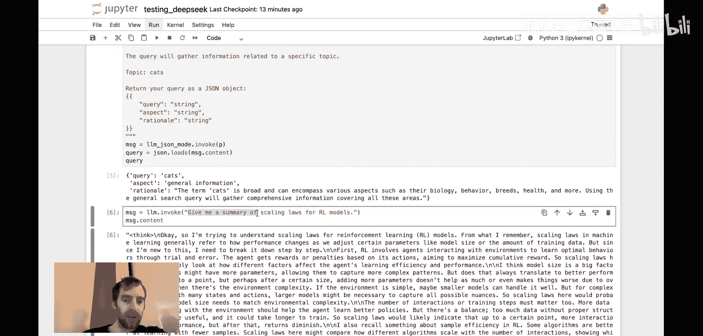
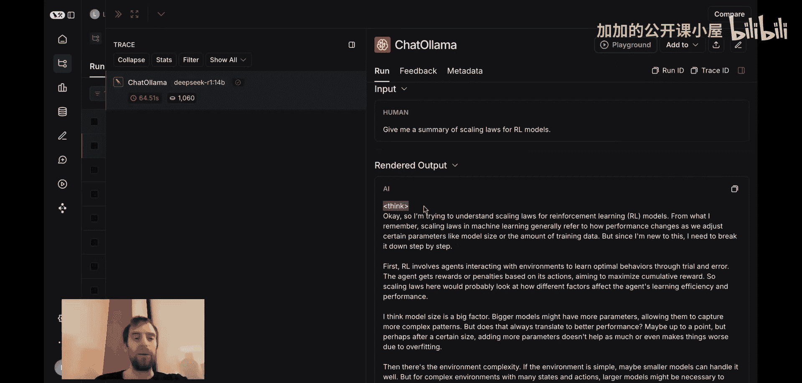
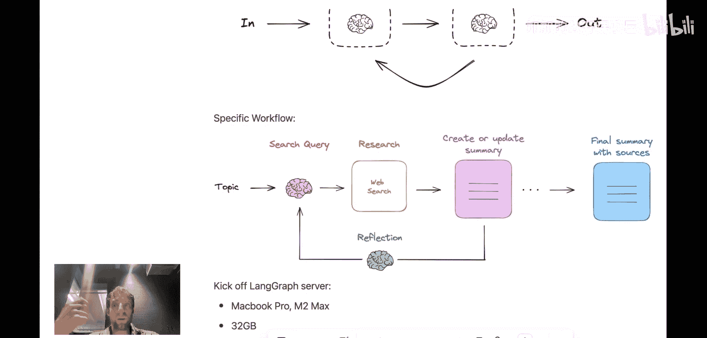

#  054：使用 DeepSeek-R1 构建完全本地的“深度研究员” 🔍

在本节课中，我们将学习如何利用 DeepSeek 实验室最新发布的开源推理模型 DeepSeek-R1，构建一个完全在本地运行的“深度研究员”应用。我们将探讨该模型的独特训练方法，并通过 LangChain 框架进行实践。

---

## 模型训练策略解析 🧠

上一节我们介绍了 DeepSeek-R1 的背景，本节中我们来看看其核心的训练策略。这是一种结合了微调和强化学习的新范式。

### 训练阶段概述

DeepSeek-R1 的训练分为几个关键阶段，旨在打造一个强大的推理模型。

以下是主要的训练步骤：

1.  **初始微调**：以 DeepSeek-V3 这个强大的基础聊天模型为起点，在数千个“思维链”推理示例上进行微调。这为后续的强化学习阶段奠定了良好基础。
2.  **强化学习（GRPO）**：这是核心阶段。对于每个训练样本（共14.1万个数学和编程领域的难题），模型会生成 **64** 个不同的解题尝试。每个尝试都会根据基于规则的奖励（例如答案正确与否）进行评分。
    *   核心机制：模型会比较每个样本与这64个样本批次的平均得分。对于得分显著高于或低于平均值的样本，模型会相应地增加或降低生成该序列中所有令牌的概率。
    *   公式化理解：这相当于对输出序列中的每个令牌施加正向或负向的梯度更新。其直觉是：**让导致正确或错误决策的所有选择变得更可能或更不可能**。
3.  **输出筛选与二次微调**：经过第一轮强化学习后，模型虽然推理能力很强，但可能损失了一些通用能力（如出现语言混合问题）。因此，团队对第一轮 RL 产生的输出进行筛选（拒绝采样），获得了 **60万** 个高质量的推理轨迹。然后，他们将这些轨迹与 **20万** 个非推理样本（如写作、事实问答）混合，进行第二轮微调。**目的是在保留强大推理能力的同时，恢复模型的通用能力**。
4.  **最终强化学习**：最后一轮强化学习使用了混合奖励函数，不仅包含针对推理的规则奖励，还加入了针对“有帮助性”和“无害性”的奖励，并在混合数据上进行优化，以兼顾推理与通用能力。
5.  **模型蒸馏**：一个非常实用的步骤是，他们利用第一阶段 RL 产生的 60 万样本数据集，对更小的开源模型进行微调，从而得到了一系列蒸馏后的、更小的 R1 模型。其中一些模型（如 14B 参数版本）甚至可以在个人笔记本电脑上运行。

---

## 模型性能与本地实践 💻

了解了训练原理后，我们来看看它的实际表现，并尝试在本地运行它。

### 性能结果

根据论文，DeepSeek-R1 在多项数学和编程挑战中，性能与 OpenAI 的 o1 模型相当。特别是在 **SWE-bench Verified**（一个流行的软件工程基准测试）上，表现甚至略优于 o1。其蒸馏后的 14B 参数模型性能接近 o1-mini，且能在许多人的笔记本电脑上运行。

### 本地运行与测试

现在，让我们动手在本地环境中使用这个模型。我们将通过 Ollama 拉取 DeepSeek-R1 14B 模型，并利用 LangChain 进行交互。

以下是初始化和简单测试的代码示例：

```python
# 初始化 LangChain 与本地模型
from langchain_community.llms import Ollama

# 通过 Ollama 初始化 DeepSeek-R1 14B 模型
llm = Ollama(model="deepseek-r1:14b")

# 尝试一个简单问题
response = llm.invoke("法国的首都是哪里？")
print(response)
```

运行后，你可能会注意到模型输出中包含“思考令牌”（think tokens）。这是其训练过程的特征，模型会在最终回答前输出其内部推理过程。虽然有时显得冗长，但这正是其“系统二”推理能力的体现。

一个有趣的发现是，当通过 Ollama 启用 **JSON 模式** 时，这些“思考令牌”会被自动剥离，直接返回结构化的 JSON 输出，这对于构建应用非常有用。

```python
# 尝试使用 JSON 模式获取结构化输出
structured_response = llm.invoke(
    "用JSON格式回答，包含‘city’和‘country’键。法国的首都是哪里？"
)
print(structured_response)
```

---

## 构建“深度研究员”应用 🔄

理论结合实践后，我们将利用这个本地模型构建一个更复杂的应用：一个自动化研究助手。

### 应用工作流程

这个应用名为“深度研究员”，其核心是一个循环研究流程，旨在优化报告撰写。

以下是该应用的主要步骤：

1.  **接收用户输入的主题**。
2.  **生成搜索查询**：模型根据主题生成用于网络搜索的查询。
3.  **执行网络搜索并获取结果**。
4.  **生成内容摘要**：模型对搜索结果进行总结。
5.  **反思与迭代**：模型对当前摘要进行反思，生成新的、更深层的问题。
6.  **循环**：基于新的问题，重复步骤 2-5。这个循环会进行可配置的若干轮。
7.  **生成最终报告**：在循环结束后，整合所有轮次的信息，生成一份带有引用来源的详细总结报告。

这个工作流可以完全由本地运行的开源大语言模型驱动，确保了隐私和可控性。



### 架构优势

这种设计的优势在于它模拟了人类研究员的思考过程：**不断提出新问题，深入挖掘信息，并整合多方资料**。DeepSeek-R1 强大的推理能力非常适合这种需要多步规划和反思的任务。

---

## 总结与展望 📝



本节课中我们一起学习了 DeepSeek-R1 推理模型的革命性训练方法，并实践了如何在本地利用它构建智能应用。

我们了解到：
*   **训练范式**：结合监督微调、基于群体排序的强化学习以及知识蒸馏，专注于培养“系统二”式慢思考能力。
*   **模型特点**：擅长复杂推理和规划任务，输出包含“思考令牌”，适合非即时交互的背景作业。
*   **本地实践**：通过 Ollama 和 LangChain，我们可以在个人电脑上运行强大的 14B 参数模型，并利用其构建如自动化研究助手之类的复杂应用。



尽管当前模型在输出前会有较长的“思考”时间，并且“思考令牌”可能需要额外处理，但其展现出的推理潜力为构建完全本地化、高性能的AI智能体打开了新的大门。随着开源生态的持续发展，这类工具将变得更加高效和易用。