#  057：使用 LangGraph 构建分层多智能体系统

## 概述
在本节课中，我们将学习如何使用 LangGraph 库构建一个分层多智能体系统。我们将重点介绍“监督者”模式，了解智能体之间如何通过“交接”机制进行协作，并最终完成需要多个专业领域知识才能解决的任务。

---

## 多智能体系统与监督者模式

智能体能够通过调用工具和接收工具反馈来自主执行任务，通常在一个循环中运行。用户经常提出的一个需求是：如何将多个智能体组合成一个多智能体系统？我们新发布的库 `LangGraph` 中的 `supervisor` 功能让这件事变得非常简单。

下面是一个包含一个监督者和两个独立智能体的简单多智能体系统示例。

*   我们有一个**数学专家**智能体，它拥有各种数学运算工具。
*   我们有一个**研究专家**智能体，它拥有一个模拟网络搜索工具。

我们提出一个需要两个智能体共同解决的问题：它需要使用搜索工具获取几家科技公司的员工人数，然后使用数学专家智能体将它们全部加起来。这显然是一个高度简化的例子，但它展示了整体的流程。

流程如下：
1.  监督者接收请求，并将其路由到其中一个智能体。最初，它被路由到研究专家以执行搜索。
2.  研究专家执行搜索，找到结果。然后，它将控制权交还给监督者。
3.  监督者收到研究专家的结果，然后调用数学专家来计算总和。
4.  数学专家计算完毕后，将控制权交还给监督者。
5.  监督者最终将合并后的总员工数作为整体输出直接回复给用户。

这个简单的例子展示了监督者与两个不同智能体之间的交接。每个智能体都将自己的结果返回给监督者，然后由监督者决定下一步做什么，以及何时将最终结果返回给用户。

---

## 核心概念：交接机制与信息流

如上所述，这个库使用了**监督者模式**。其核心思想是：一个监督者连接到多个智能体，你可以将这些智能体视为整个系统的子图。

具体流程如下：
1.  监督者从用户那里接收一些输入。
2.  监督者决定调用哪个智能体，并将信息“交接”给该智能体。
3.  智能体接收从监督者传递来的、执行工作所需的一切信息。
4.  智能体遵循经典的工具调用、行动和反馈循环，直到任务完成。
5.  智能体完成工作后，进行第二次“交接”，将控制权交还给监督者。
6.  监督者根据返回的信息决定下一步行动：可能是调用另一个智能体，也可能是直接退出。

在深入代码之前，理解“交接”机制至关重要。下图展示了整体流程：

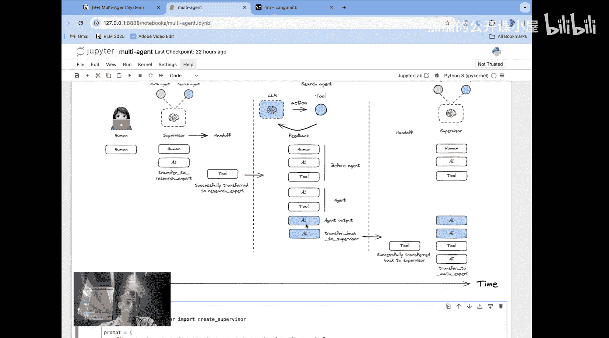

让我们仔细分析这个流程：

1.  **发起交接**：用户向监督者发出请求。监督者根据请求的性质，决定由哪个智能体来处理该请求，并启动向该智能体的“交接”。这是需要理解的第一点。
2.  **信息继承**：一旦交接启动，智能体本身会继承用户与监督者之间的**整个消息历史**。因为每个智能体都是一个子图，所以默认情况下它们会获得这段历史记录。这样，信息就自然地由监督者传递给了智能体。
3.  **返回交接**：当智能体完成任务（即不再调用任何工具）时，我们会将结果传递回监督者。这就是图中所示的“交接返回”。
4.  **返回内容配置**：一个很自然的问题是：具体有哪些信息从智能体传递回监督者？这是一个非常重要的点，并且是可以配置的。你可以使用一个特定的标志 `output_mode` 来决定：是只传递表示智能体最终输出的最后一条 AI 消息，还是传递回智能体内部的整个消息历史。这取决于你的需求。在上图的示例中，我们只展示了传递回最终消息（即智能体输出）的情况。
5.  **监督者决策**：此时，监督者拥有了智能体的输出，以及指示“交回监督者”的工具调用信息，并据此继续执行。

---

## 代码实践：构建一个简单的多智能体系统

现在我们已经了解了信息流的工作原理，让我们通过代码更详细地看看如何实现。

首先，我们定义一些工具，例如加法和网络搜索工具。

```python
# 示例：定义工具（伪代码）
math_tools = [AddTool(), MultiplyTool()]
research_tools = [WebSearchTool()]
```

接着，我们创建两个智能体。这里我们使用预构建的 `create_react_agent` 函数，并为每个智能体提供模型、工具、智能体名称和系统提示词。

```python
# 示例：创建智能体（伪代码）
math_agent = create_react_agent(model=llm, tools=math_tools, name="math_agent", system_prompt="You are a math expert...")
research_agent = create_react_agent(model=llm, tools=research_tools, name="research_agent", system_prompt="You are a research expert...")
```

每个智能体都是简单的 ReAct 风格工具调用智能体，它们会遵循“LLM 决定调用工具 -> 工具被调用 -> 工具结果反馈给 LLM”的循环，直到不再调用工具为止。此时产生的最终消息（即智能体输出）将被传递回监督者。

现在，我们创建监督者。在系统提示词中，我们解释连接了哪两个智能体以及何时使用它们。

```python
# 示例：创建监督者（伪代码）
supervisor_prompt = """
You are a supervisor. You have access to two agents:
- For current events and research, use the `research_agent`.
- For math problems, use the `math_agent`.
Decide which agent to use based on the user's request.
"""
supervisor = create_supervisor(
    model=llm,
    agents=[math_agent, research_agent], # 作为子图传入
    system_prompt=supervisor_prompt,
    output_mode="final" # 或 "full_history"
)
```

这里的关键参数是 `output_mode`，它决定了当从任何智能体传递信息回监督者时，是只传递最终消息（`"final"`）还是传递完整的智能体消息历史（`"full_history"`）。

最后，我们编译并运行这个图。

---

## 运行流程详解

让我们结合 LangSmith 的追踪记录，对照之前的流程图，清晰地理解每一步发生了什么。


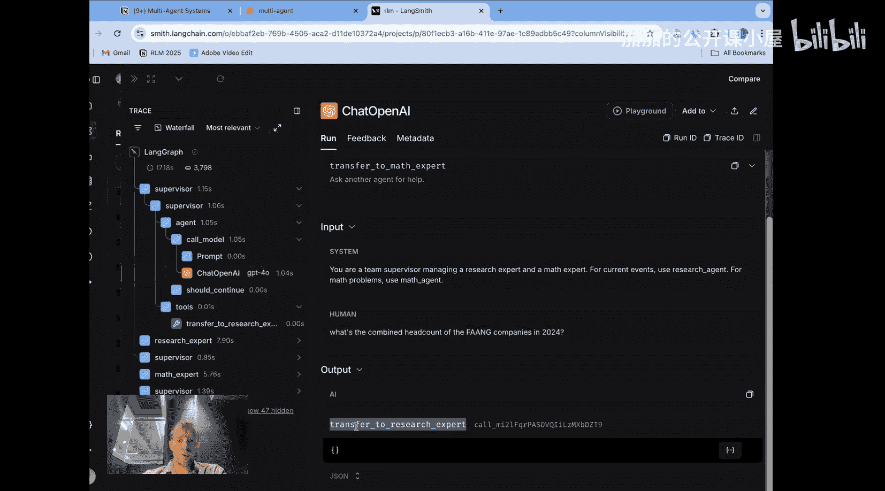

1.  **监督者启动**：我们从监督者开始。查看 OpenAI 模型调用，可以看到监督者基本上有两个交接工具：`transfer_to_research_expert` 和 `transfer_to_math_expert`。它收到了我们指定的系统提示词和用户输入，并决定调用 `transfer_to_research_expert` 工具。这对应了流程图中的第一步。

    

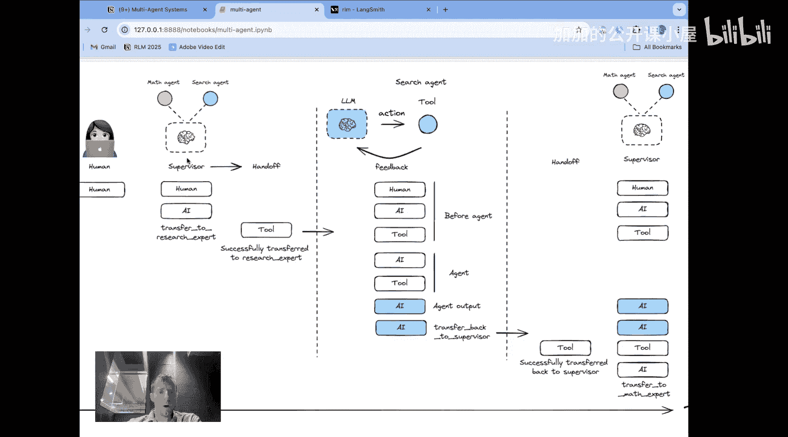

2.  **进入研究专家智能体**：工具被调用，输出一个“交接”指令，指示前往研究专家。现在我们进入了研究专家智能体内部。智能体模型接收到的输入包括：原始的用户输入、来自监督者的“前往研究专家”的工具调用信息、以及实际执行交接的工具消息。然后，研究专家决定调用其搜索工具，并启动了针对几家科技公司的查询。

    

3.  **智能体内部循环**：此时我们处于智能体内部循环中。智能体调用工具（搜索工具），接收工具调用的输出，并最终提供了一个答案。由于它已经回答了问题（找到了员工数），因此不再调用更多工具，产生了最终的智能体响应。

    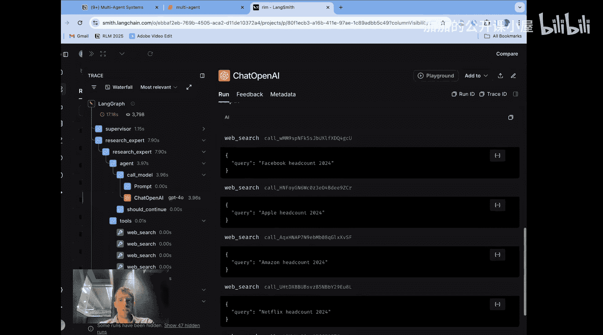

4.  **返回交接给监督者**：当智能体完成时，一个额外的工具调用 `transfer_back_to_supervisor` 被执行。这就是“交回监督者”的工具调用。执行后，该工具消息也会被附加到我们的消息历史中。这对应了流程图中的“交接返回”步骤。

    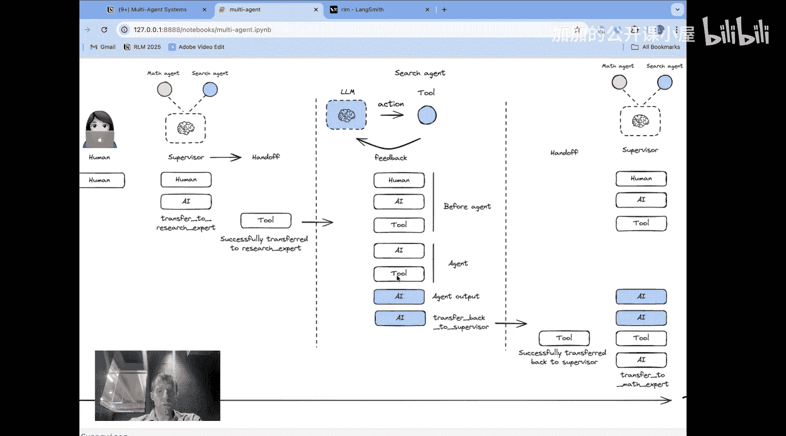


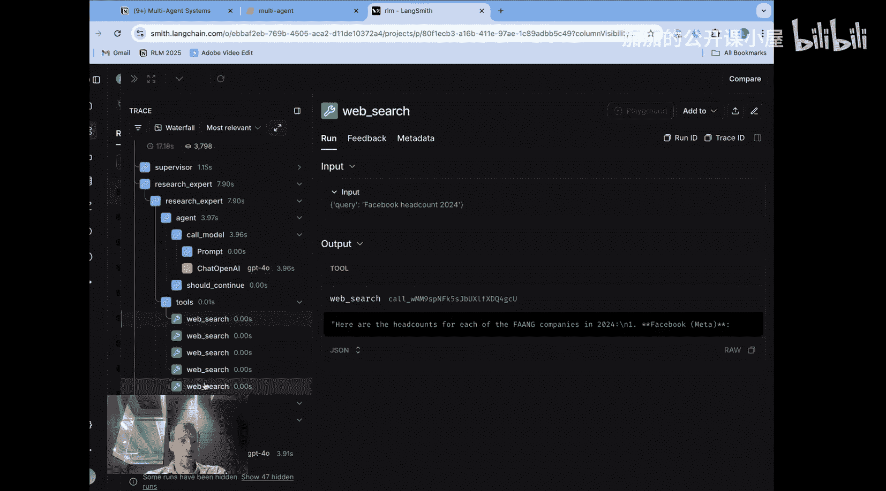

5.  **监督者进行下一步决策**：现在我们回到了监督者这里，并收到了确认返回成功的工具消息。监督者可以决定下一步做什么。查看 LLM 调用，它决定应该 `transfer_to_math_expert`。交接像之前一样完成。

6.  **进入数学专家智能体**：现在我们进入了数学专家智能体。它遵循与之前相同的流程：接收历史（包括研究专家的结果），执行必要的算术运算（求和）。

    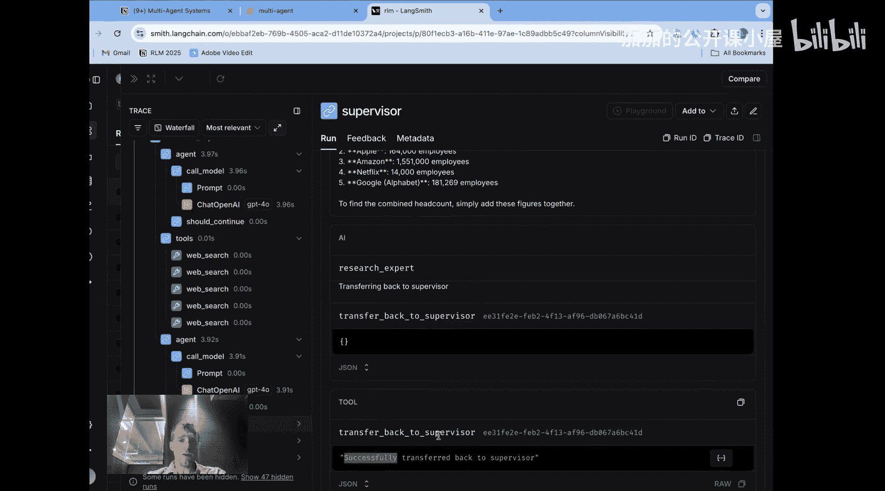

7.  **最终完成**：数学专家完成计算后，将结果交回给监督者。监督者随后结束流程，并向用户的问题提供最终答案。

    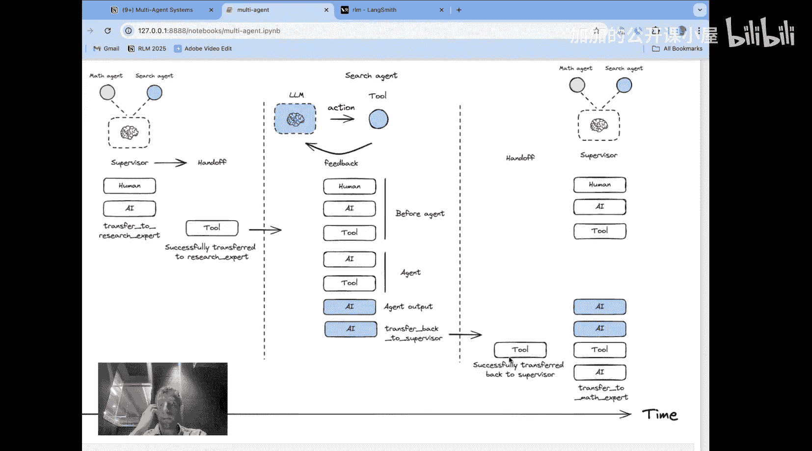


整个过程中，消息历史随着每次交接和智能体内部的操作而相应增长。


---

## 扩展：分层监督系统

最后需要强调的是，这个系统是**分层**的。你可以让监督者管理其他监督者，从而形成一个类似真实组织架构的“组织图”。例如，你可以有一个“CEO”监督者，其下又有多个监督者，每个监督者管理一个小型的智能体团队。

下面是一个简短的示例：

```python
# 示例：定义更多工具和团队（伪代码）
weather_tools = [PrecipitationTool(), TemperatureTool()]
math_team = [create_react_agent(...), create_react_agent(...)] # 两个数学智能体
weather_team = [create_react_agent(...), create_react_agent(...)] # 两个天气智能体


# 为每个团队创建监督者
math_supervisor = create_supervisor(model=llm, agents=math_team, name="math_team_lead")
weather_supervisor = create_supervisor(model=llm, agents=weather_team, name="weather_team_lead")

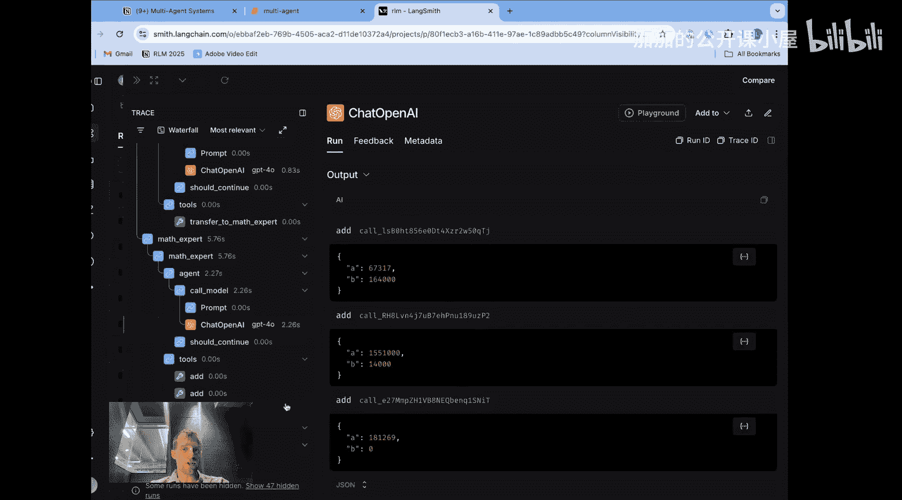

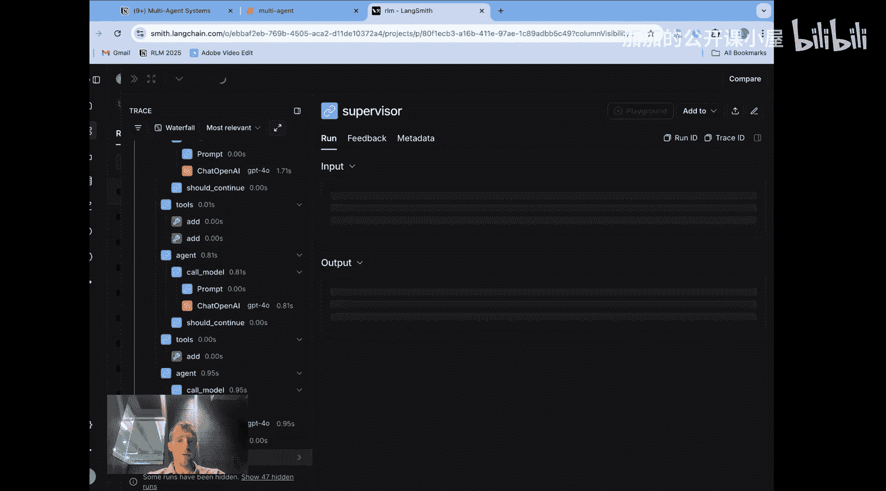

# 创建顶层的“CEO”监督者，管理两个团队监督者
ceo_supervisor = create_supervisor(model=llm, agents=[math_supervisor, weather_supervisor], name="ceo")
```

通过这种方式，你可以构建出复杂且结构清晰的多智能体协作系统。

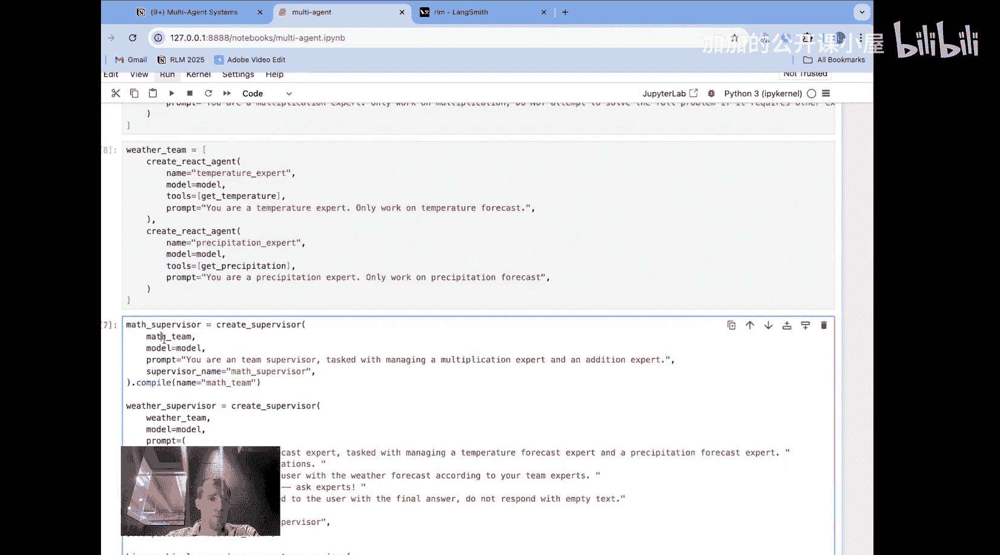

---


## 总结
本节课中，我们一起学习了如何使用 LangGraph 构建分层多智能体系统。我们深入探讨了**监督者模式**的核心，即通过**交接机制**在监督者与各个智能体（子图）之间传递控制权和信息。我们了解了如何配置 `output_mode` 来控制返回给监督者的信息内容，并通过代码示例和流程分析，清晰地看到了从用户提问到多个智能体协作最终给出答案的完整过程。最后，我们还了解到这种结构可以扩展为分层系统，以管理更复杂的智能体组织。