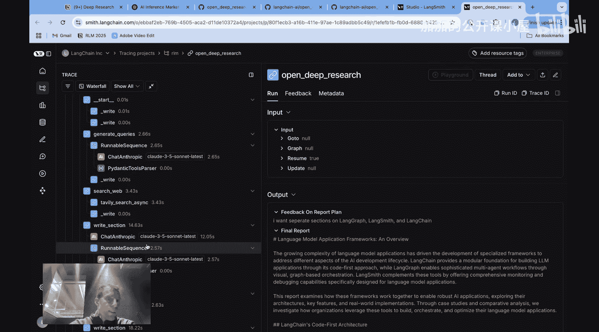
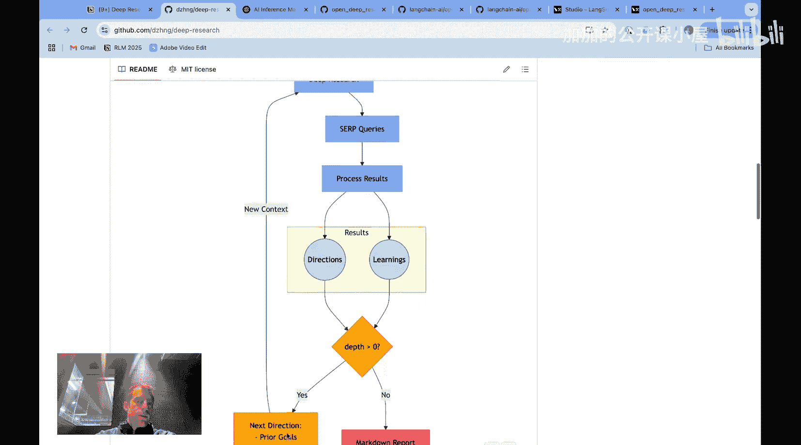
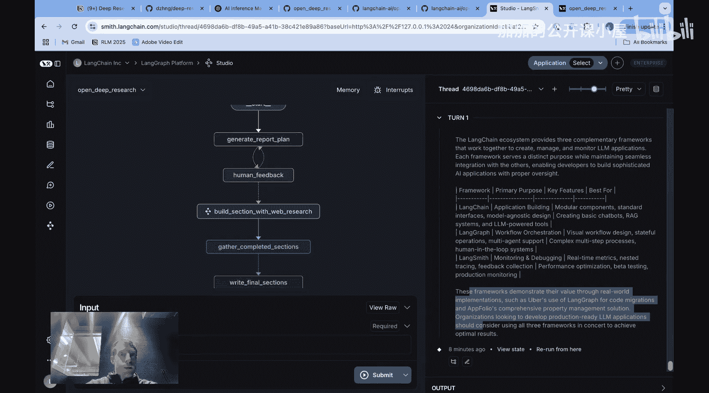
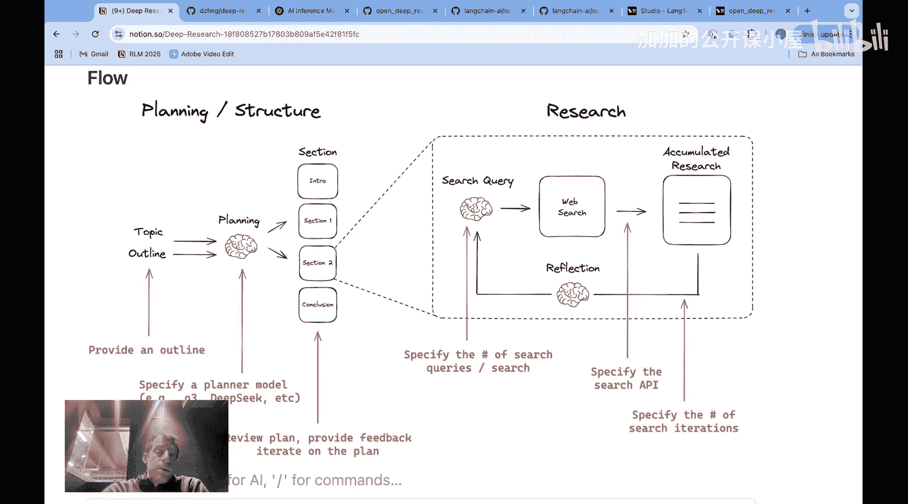
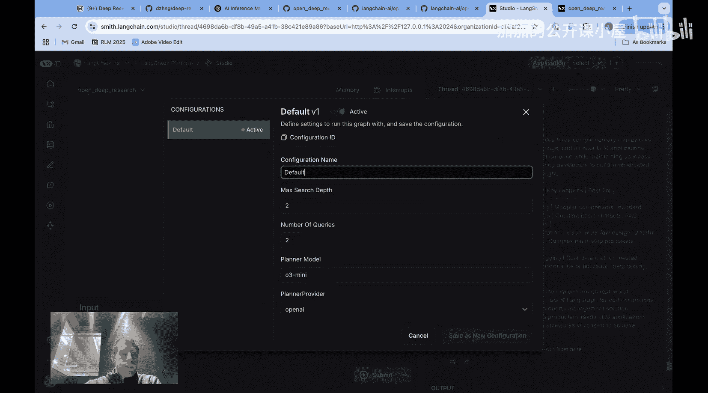

#  059：Open Deep Research 深度研究助手教程 🧠

在本节课中，我们将学习一个名为“Open Deep Research”的深度研究助手。这是一个流行的智能体应用场景，能够根据你给定的主题，自主地在网络上进行爬取和研究，最终生成一份深度研究报告。我们将详细介绍其工作原理、与其他实现方案的对比，并探讨其核心架构和可配置性。

## 概述

深度研究是一个热门的智能体用例，其核心是让一个智能体围绕特定主题自主进行网络研究并生成报告。目前已有多个开源实现，以及来自OpenAI和Gemini的版本。本节将重点介绍我们的开源实现“Open Deep Research”，并详细解析其工作流程，同时也会讨论其他实现方案及其各自的权衡。

## 报告规划阶段 📝

上一节我们介绍了深度研究的基本概念，本节中我们来看看报告是如何开始生成的。我们的助手首先会进入报告规划阶段。

用户提交一个感兴趣的研究主题后，助手会生成一个报告计划。它使用一些搜索查询来辅助生成这个计划，并向用户展示报告的各个章节。例如，报告可能包含引言、涵盖不同框架的章节以及比较分析等部分。

实际上，这个过程是助手接收一个主题，进行初步的轻量级网络研究以帮助构思计划，然后向用户展示该计划。接着，系统会询问用户这个计划是否符合需求。

如果用户选择继续，可以提出反馈。例如，如果用户希望为每个框架设置独立的章节，而初始计划将它们合并了，用户可以将此作为反馈提交。助手会根据反馈调整计划，生成包含独立章节的新计划。当用户对计划满意后，即可确认并进入下一阶段。

## 深度研究阶段 🔍

在报告计划确定后，便进入深度研究阶段。此阶段将对报告中的每个章节进行深入研究。

对于每个章节，系统会执行以下步骤：生成搜索查询、执行网络搜索、撰写章节内容。之后，系统会进行“反思”，评估已撰写的内容与该章节主题的契合度，检查是否有信息缺失。如果发现缺失，则会再次进行搜索。这是一个可高度配置的迭代搜索过程。

这就是深度研究阶段的核心：可以并行地对报告的所有章节进行迭代研究。在所有需要研究的主体章节撰写完毕后，系统会撰写任何最终的结论性或介绍性章节，从而生成完整的Markdown格式报告。报告结构清晰，包含资料来源，并在最后部分提供清晰的比较表格。

此外，所有过程都是开源的。用户可以点击按钮在LangSmith中查看完整的运行轨迹，审查每一个模型调用和搜索查询，从而完全了解其内部运作，同时也能查看时间和令牌使用情况。

## 深度研究领域的核心主题

让我们跳出具体实现，概括一下深度研究领域的主要主题。我们可以从两个角度来思考：报告规划或结构设计阶段，以及可称为深度研究的迭代研究循环。这是许多方法中常见的两大核心思想。

规划阶段通常涉及人工参与和反馈循环，具体方法各有不同。但总体而言，它包含一个通常有人工反馈参与的整体报告结构设计。随后，或在某些没有规划阶段的方法中，会进行迭代研究。

并非所有方法都包含规划和结构设计阶段，但所有方法都使用了某种形式的迭代研究，这是其核心组成部分。

我们可以进一步分解如下：
*   **规划阶段**：部分方法（如Gemini Deep Research和OpenAI Deep Research）在规划阶段包含人工循环；而其他一些方法则更自主地运行，无需用户参与初始范围界定。
*   **架构**：部分实现使用“工具调用智能体”架构；另一些则使用“工作流”架构。

## 不同实现的架构对比 ⚙️

上一节我们提到了两种主要架构，本节我们来详细看看它们的区别。

在规划阶段包含人工循环的实现中，Gemini Deep Research会生成一个可供用户审查、编辑和批准的计划。OpenAI Deep Research则采用问答形式，向用户提出一些后续澄清问题，而非明确列出计划，但同样包含了人工循环阶段。

我们的Open Deep Research会生成一个计划供用户提供反馈，这种方式更接近Gemini而非OpenAI。此外，还有许多其他方法在用户提供主题后直接进行迭代深度研究，不进行任何前期规划。

现在谈谈架构。Hugging Face发布了一个开源的深度研究助手，很好地展示了“工具调用智能体”架构。他们使用了分层智能体方法，包含一个管理智能体和一个工具调用智能体，并利用了来自微软一篇论文的多种工具，如网络搜索、页面导航、检查以及用于提取图像的多模态工具。这是一个非常简洁的实现。

当然，我们无法确切知道Gemini或OpenAI Deep Research的内部架构，但推测它们很可能也使用了某种工具调用智能体。这些案例中的架构都可以被视为经典的智能体：一个大型语言模型绑定了一系列工具，这些工具可以按任何顺序调用，非常灵活。

这与“工作流”架构形成对比。例如，一个流行的开源深度研究实现就展示了经典的工作流。虽然有些人称之为智能体工作流，因为它确实包含LLM推理和决定下一步的步骤，但它仍然遵循用户设定的、相当清晰的控制流：搜索、以某种方式处理结果、反思所学、迭代一定周期，最后生成报告。

我们的实现也遵循一个特定的控制流，我们预先设定了流程，其中包含人工反馈的机会以及每个章节内部的自主迭代。因此，这同样是一个工作流。我们允许LLM反思和完善其工作，但这不同于一个可以自由按任何顺序调用工具集的LLM智能体。我们设定了受约束的控制流。

使用开放式工具调用智能体与我们所说的“工作流”之间总是存在权衡。工作流的优势通常是提供了更多框架以保证可靠性，并且通常令牌使用量更低，但可能缺乏一些灵活性。这是在思考不同方法时一个有趣的架构权衡。

## 性能评估与开源优势 📊

一些深度研究方法已经过评估。例如，Meta和Hugging Face的Gaia评估显示，OpenAI Deep Research得分相当高，而Hugging Face的方法得分为55，在这个特定评估中取得了接近OpenAI的强劲结果。

OpenAI也分享了在Scale AI的“人类学最后考试”评估上的结果，该评估涵盖STEM和人文领域的3000个问题。结果显示，OpenAI Deep Research大幅优于单独的GPT-3.5，这是合理的，因为为GPT-3.5赋予搜索工具后，其处理此类挑战的能力会大大增强。

## 为何选择开源深度研究助手？

你可能会问，既然可以直接使用Gemini或OpenAI，为什么要使用开源深度研究助手？核心论点是**可配置性**。

开源研究助手的优势在于它们非常、非常可配置。以下是我们Open Deep Research的一些配置选项：

*   **报告结构**：你可以传递一个提纲来指定你想要的报告结构。
*   **规划模型**：你可以指定任何你想要的规划模型。默认使用GPT-3.5，但我喜欢使用推理模型来进行初始思考和计划生成。
*   **人工循环**：我可以自定义人工循环的工作方式。在我们的案例中，主要是对报告章节进行人工循环审查。
*   **研究参数**：在深度研究阶段本身，我可以配置多项内容，包括每次迭代的搜索次数和总迭代次数（即循环往复的次数）。
*   **搜索API**：非常有趣的是，我还可以指定搜索API。默认配置为Tavily，但我也可以设置Perplexity（这是一个非常有趣的选项），其他搜索服务如Serp API或Firecrawl也可以轻松集成。

因此，除了成本可能显著更低之外，可配置性是开源方案带来的主要好处。如果需要，你可以回到LangChain Studio查看这些配置的具体设置位置。

## 总结

本节课中，我们一起学习了“Open Deep Research”深度研究助手。我们了解了其从报告规划到深度迭代研究的完整工作流程，对比了其与Gemini、OpenAI及其他开源实现在规划和架构上的异同，并探讨了工作流与工具调用智能体架构的权衡。最后，我们重点分析了开源方案在高度可配置性方面的核心优势，包括自定义报告结构、模型、人工循环流程、研究参数和搜索API等。这为你理解和选择适合的深度研究工具提供了全面的视角。