#  062：使用 LangGraph 构建多智能体集群 🐝

## 概述
在本节课中，我们将学习一种流行的多智能体系统架构——**多智能体集群**。我们将通过一个客户支持系统的例子，了解如何让多个智能体（如航班助手和酒店助手）协同工作，根据用户需求相互“交接”任务，并共享对话状态。课程将介绍其核心概念、与监督者架构的区别，并通过代码演示如何使用 `LangGraph Swarm` 库来实现它。

---

## 多智能体集群架构介绍

目前，多智能体系统备受关注。本节将展示一种名为“多智能体集群”的流行架构。

理论上，集群架构可以包含任意数量的智能体。但为了简化说明，本示例仅展示包含两个智能体的案例。该系统代表一个客户支持系统，包含一个航班助手和一个酒店助手。一个智能体负责处理航班预订，另一个负责酒店预订。

集群架构的核心思想是：它提供了一种机制，让这些智能体能够将请求**交接**给彼此，并在交接时**共享状态**。

---

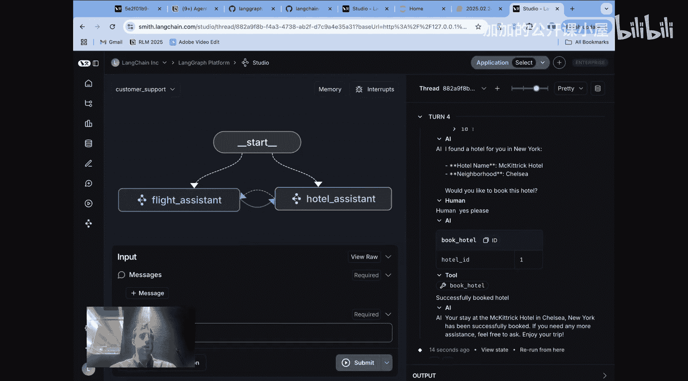

## 集群与监督者架构的区别

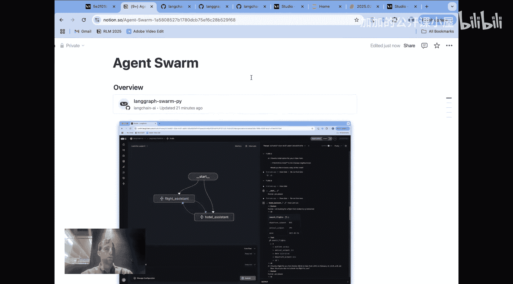

上一节我们介绍了集群的基本概念，本节中我们来看看它与另一种常见架构——监督者架构——有何不同。

我们之前讨论过监督者架构。在这种架构中，我们可以将一定数量的智能体绑定到一个监督者。关键点在于：**用户只与监督者交互**，而**每个智能体也只与监督者交互**。监督者可以将任务交接给特定的智能体，智能体完成工作后，将结果返回给监督者，再由监督者决定下一步做什么。

集群架构则有所不同。集群允许**任何单个智能体直接与用户交互**，也允许**任何智能体将任务交接给任何其他智能体**。在集群中，你实际上移除了监督者这个中间环节。

以下是两种架构的关键区别总结：

*   **起点**：监督者架构的起点总是监督者。集群架构则可以设置一个默认智能体作为起点，或者在多轮交互中，最后一个活跃的智能体将成为起点。
*   **智能体间流程**：在监督者架构中，智能体总是与监督者交互。在集群中，每个智能体可以决定将信息交接给任何其他智能体。
*   **用户交互**：在监督者架构中，用户总是与监督者交互。在集群中，用户可以与任何智能体交互。每个智能体都是自给自足的，可以直接与用户互动。

因此，集群非常适合需要多个不同智能体直接与用户交互的系统，客户支持就是一个典型例子，其中不同的子智能体负责独立的专业领域。而当您有一组智能体需要工作，但您不希望向用户暴露这些工作细节，只希望一个监督者在幕后协调子智能体的工作时，监督者架构则更合适。

---

## 集群工作流程示例

以下是多智能体集群的一个工作流程图示例：
1.  用户请求：“为我预订航班”。航班智能体被激活，并回复航班信息。
2.  在用户提出“预订酒店”之前，航班智能体直接与用户互动。
3.  当用户说“预订酒店”时，航班智能体会调用一个**交接工具**，将任务交接给酒店智能体。
4.  酒店智能体随后直接与用户互动。

这个**交接**过程是理解多智能体集群架构的核心概念。

---

## 代码实现演示

现在让我们通过代码来展示上述流程。以下是一个可以在代码仓库中找到的笔记本示例。

首先，定义一个模型并设置一些与搜索/预订航班和酒店相关的模拟数据工具。

接下来是关键的新内容：我们将定义两个**交接工具**。这些工具来自 `LangGraph Swarm` 库，它们本质上是能够将用户“转移”给酒店预订助手或航班预订助手的工具。

我们定义一个辅助函数来生成提示词，并创建两个不同的助手：航班助手和酒店助手。

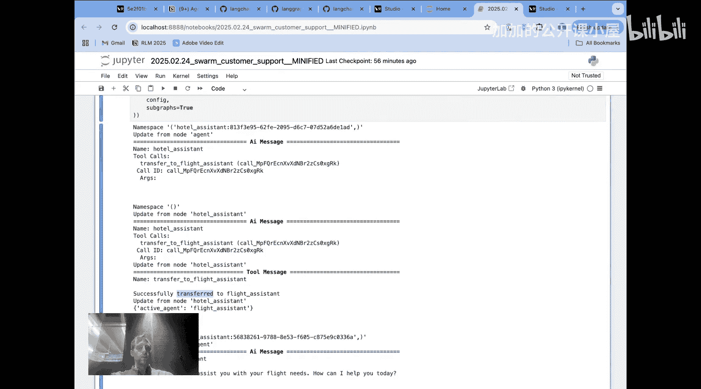

关键点在于：我们将这些交接工具绑定到每个智能体上。因此，航班智能体将拥有一个“转移到酒店”的工具，酒店智能体将拥有一个“转移到航班”的工具。

最后，我们将定义好的两个智能体添加到我们的集群中，并设置一个默认智能体（例如航班助手）。请注意，这个默认智能体并不特别重要，因为如果第一个问题与酒店相关，航班助手可以直接交接给酒店助手。

我们使用**检查点**机制进行编译。检查点是 LangGraph 中将会话保存到线程的一种机制（本例中保存在内存中），它可以在中断或**不同智能体之间的交接**过程中持久化保存。检查点允许你将消息历史保存到这个线程中，然后在交接过程中传递给每个智能体，我们稍后会看到这为什么很有趣。

运行代码后，我们可以看到与之前在工作室中完全相同的交互过程：
1.  用户寻找从波士顿到纽约的航班，航班助手（我们设置的默认助手）调用搜索航班工具并回复。
2.  用户确认后，航班助手调用预订航班工具。
3.  用户提出“也预订一个酒店”。此时，航班助手看到这个请求，并调用其绑定的工具交接给酒店助手。
4.  酒店助手无缝响应，搜索酒店并直接回复用户。
5.  用户与酒店助手继续互动完成酒店预订。
6.  用户说“我现在想和航班助手谈谈”，酒店助手看到该请求，调用工具交接回航班助手。

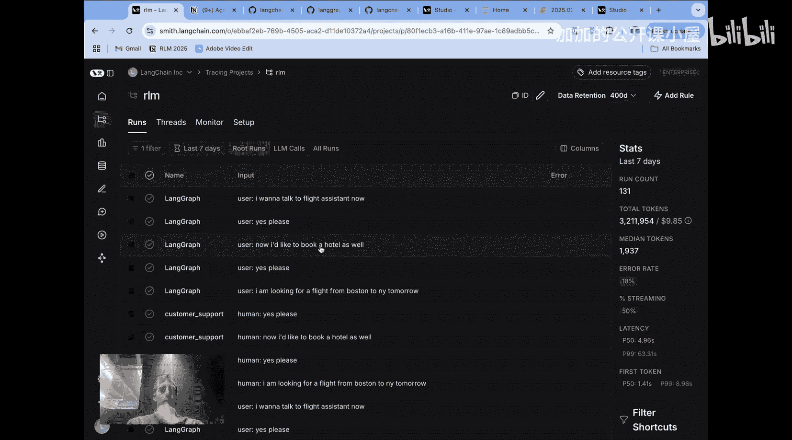

这个过程清晰地展示了航班和酒店智能体之间基于工具调用的交接。

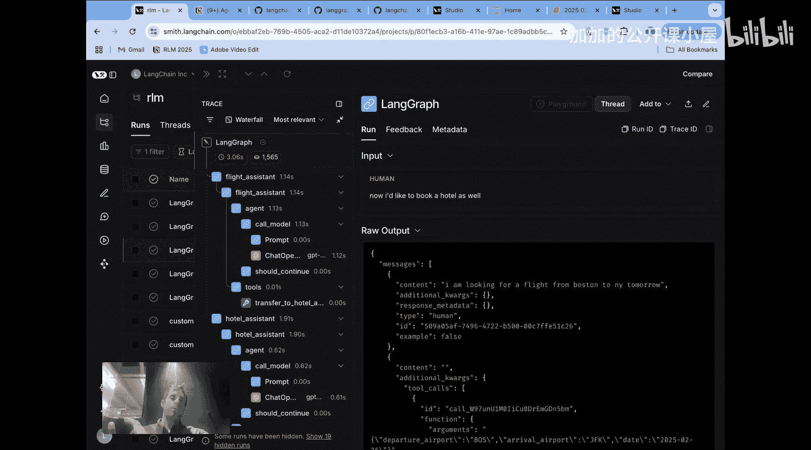

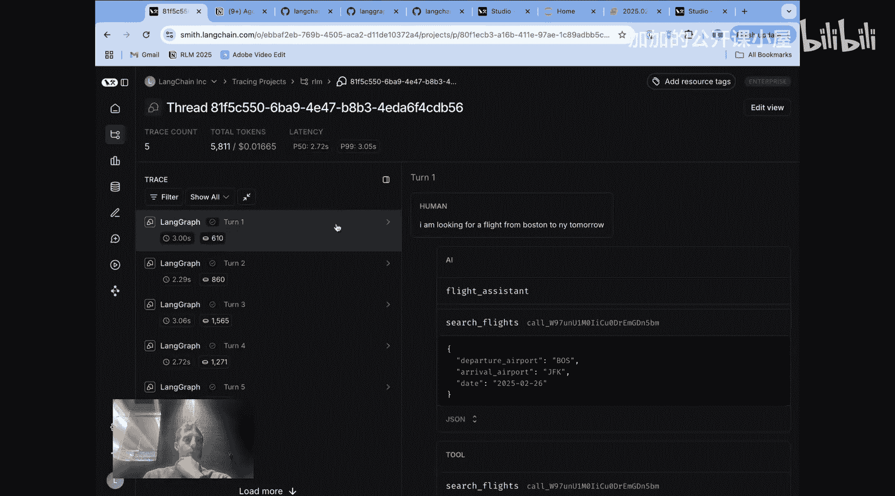

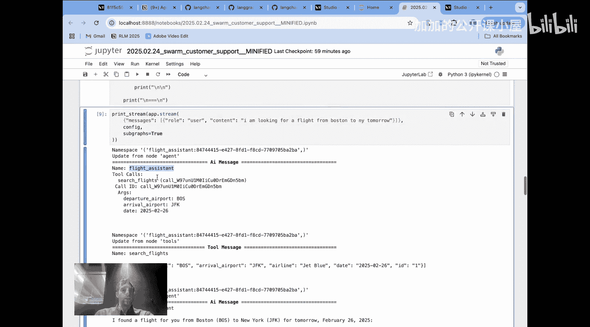

---

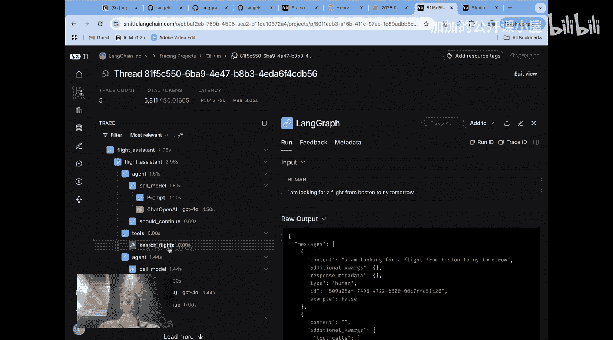

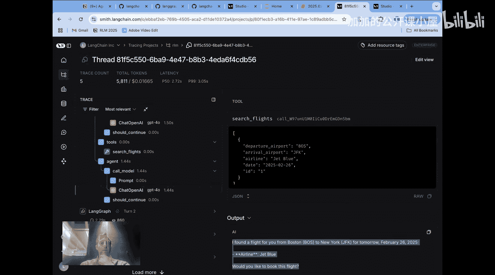

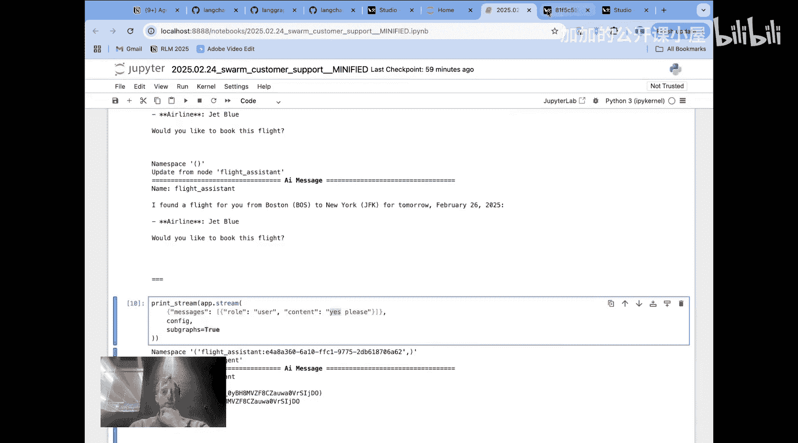

## 状态管理与上下文共享

上一节我们看到了交接如何发生，本节中我们来看看背后的状态管理机制。

如果你查看 LangSmith，可以看到所有的运行记录都被记录下来了。打开一个记录，点击“线程”。因为我们使用了检查点，所有与不同智能体的独立交互（包括交接）都保存到了**同一个线程**中。我们可以点击查看每一轮对话。

例如，当我们交接给酒店助手时，查看该模型调用本身。酒店助手在搜索酒店时，实际上能够访问**之前发生的全部消息历史**，包括与航班助手的整个交互过程。这是交接的一个关键特性：当你执行交接时，实际上传递了完整的消息历史（全部保存在我们的线程中）。因此，即使这个智能体严格负责搜索和预订酒店，它也能访问整个历史记录，完全了解用户之前发生了什么，这在某些情况下非常有用。

需要指出的是，智能体之间交接消息的实现方式可以有很多种。在我们的案例中，我们基本上传递了整个历史。但你可以想象许多不同的方式，例如传递最近的一些消息，或者传递所有先前消息的摘要。因此，交接机制或具体交接的信息是可以修改的。

---

## 总结

本节课中我们一起学习了多智能体集群架构以及用于构建它的轻量级库 `LangGraph Swarm`。

我们展示了两种构建多智能体系统的不同方式的权衡与区别：
*   **监督者架构**：将控制权集中在一个监督者手中，监督者可以调用子智能体工作，但始终通过监督者直接与用户交互。
*   **集群架构**：每个智能体都是自主和自给自足的。每个智能体都可以直接与用户交互，并根据用户的请求相应地相互交接。

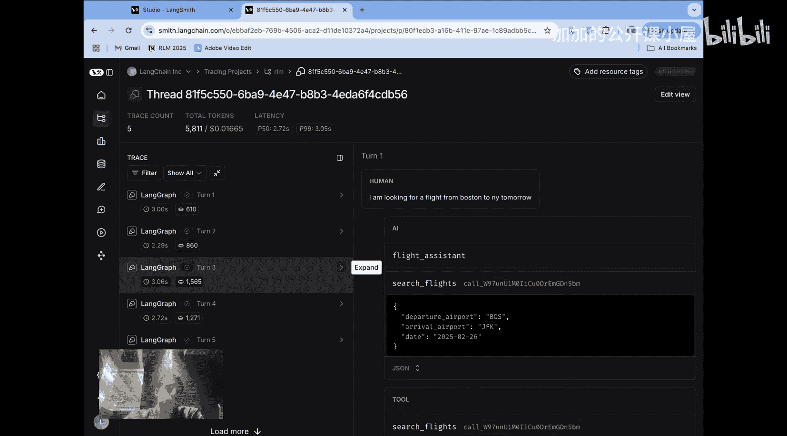

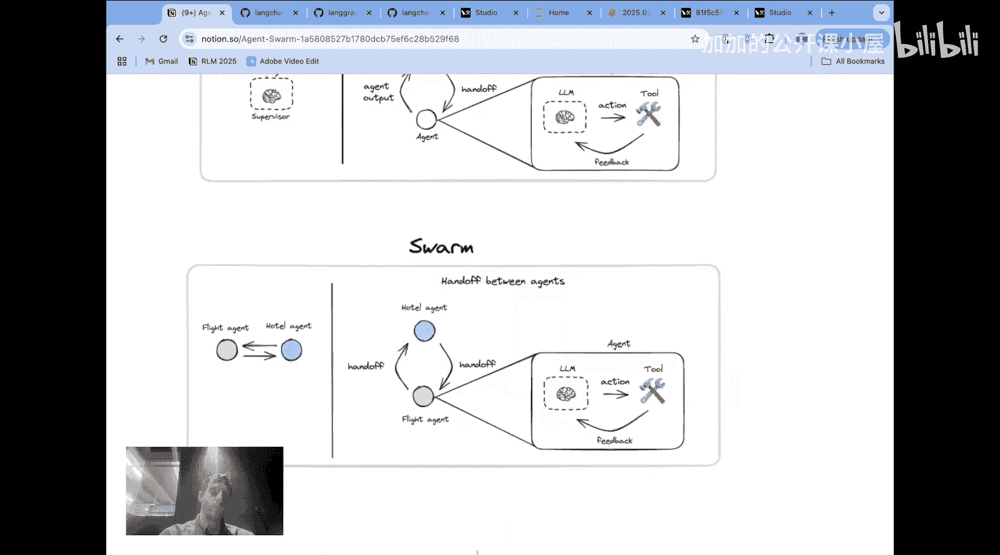

希望本教程能帮助你理解多智能体集群架构及其应用。