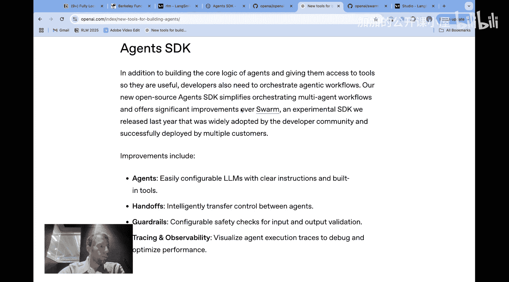
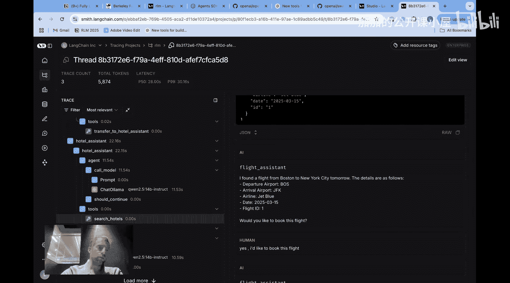
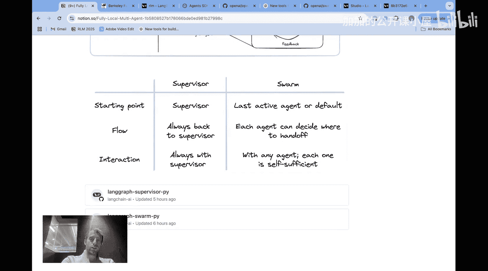
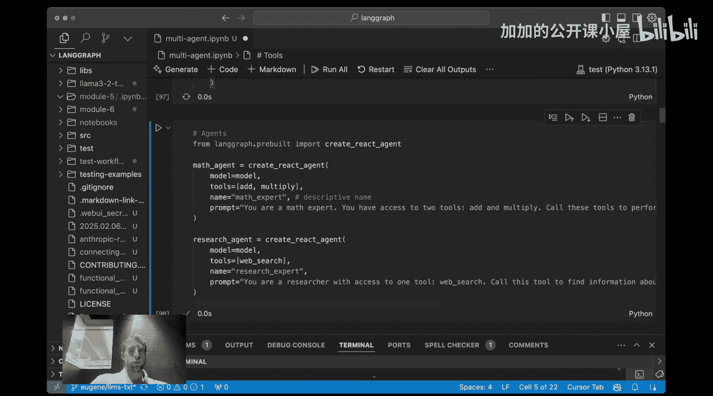
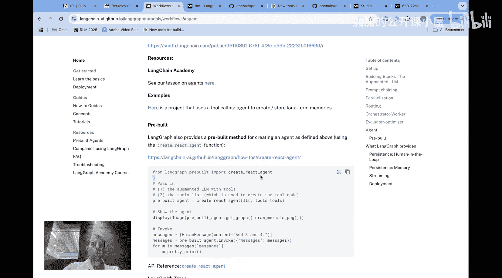

#  065：使用 LangGraph 构建完全本地的多智能体系统

在本节课中，我们将学习如何使用完全开源和本地的模型来构建多智能体系统。我们将介绍两种主要架构：群组（Swarm）方法和监督者（Supervisor）方法，并演示如何使用 LangGraph 的相关包来实现它们。

## 什么是智能体？🤖



上一节我们介绍了课程目标，本节中我们来看看智能体的基本概念。

智能体是一个能够根据环境反馈（通常来自其执行的动作或工具调用）来指导自身行动的大语言模型。简单来说，你可以将其视为一个在循环中进行工具调用的过程。

**核心公式**：`智能体 = LLM + 工具调用循环`

智能体与工作流不同。工作流是遵循预定义代码路径的定向控制流，其中可能包含LLM调用。而智能体的关键点在于，它可以在循环中自由地调用工具，直到不再进行任何工具调用，此时智能体通常完成任务。

## 本地运行智能体的关键：模型选择 💻

理解了智能体的定义后，我们来看看如何让智能体在本地运行。为此，我们需要能够有效执行工具调用的轻量级模型。

对于许多应用来说，不需要工具调用的工作流已经足够，并且效果很好。但根据经典定义，智能体需要在循环中调用工具。因此，如果我们想构建本地运行的智能体，就需要模型具备本地调用工具的能力。

以下是一个有用的资源，可以帮助我们选择合适的模型：

*   **伯克利函数调用排行榜**：这个排行榜根据模型在工具调用基准测试中的表现进行排名。虽然排名靠前的是像 GPT-4o、Gemini 这样的大型闭源模型，但开源模型 Qwen2.5 系列表现也很出色。
*   **Qwen2.5 系列**：特别是 **Qwen2.5-14B-Instruct** 模型，在排行榜上排名第30位。对于一个140亿参数的模型来说，这个成绩相当不错。这个规模的模型通常可以在本地机器上运行（例如配备 M2 Max 芯片和 32GB 内存的 MacBook），并且具有可接受的延迟。更小的 **Qwen2.5-7B** 模型也具备一定的工具调用能力。

因此，当需要构建本地智能体时，Qwen2.5 系列模型是一个强有力的选择。我们可以通过 Hugging Face 等平台轻松获取并初始化这些模型。

## 为什么需要多智能体系统？🤝

我们已经知道什么是智能体以及如何选择本地模型，现在来探讨构建多智能体系统的意义。



主要原因是，特别是在本地运行时，分离关注点非常有用。如果你让一个LLM绑定大量工具，可能会增加混淆的可能性，导致模型在给定请求时调用错误的工具。

然而，如果你拥有一组执行专门任务的智能体（例如，一个用于航班预订，一个用于酒店预订，各自拥有独立的工具集），通常能带来更好的性能，尤其是在使用较小模型时。这就是多智能体架构背后的核心直觉。

## 多智能体架构：监督者 vs. 群组 🏗️

理解了多智能体系统的优势后，我们来看看两种主要的实现架构。

### 监督者（Supervisor）方法

这种方法非常直观。其核心思想是：
1.  存在一个**监督者模型**，它直接与用户交互。
2.  监督者将任务分配给**子智能体**（可以看作是分包商）。
3.  子智能体执行任务，并将最终输出返回给监督者。
4.  **子智能体从不直接与用户交互**，所有交互都通过监督者进行。

**核心流程**：`用户 <-> 监督者 <-> 子智能体A/B/C...`

### 群组（Swarm）方法

这是我们之前在 LangGraph Studio 演示中看到的方法。其特点是：
1.  存在多个不同的智能体。
2.  它们**都可以直接与用户交互**。
3.  它们可以**自由地将对话“移交”给彼此**。

例如，在我们的演示中，当用户询问酒店预订时，航班助理智能体识别到该请求与其专业领域不符，便主动将对话移交给酒店助理智能体，由后者来执行任务。

**核心流程**：`用户 <-> 智能体A <-> 智能体B` （动态切换）

### 架构对比与选择

以下是两种架构的主要权衡点：

*   **交互中心**：监督者架构始终通过一个中心点（监督者）与用户交互；而群组架构中，每个智能体都有能力与用户交互。
*   **流程起点**：监督者总是流程的起点；而在群组中，通常是最后一个活跃的智能体或默认智能体作为起点。
*   **适用场景**：
    *   如果你的应用希望集中管理与用户的交互，并由一个总监督者来分配任务，那么**监督者架构**是合适的选择。
    *   如果你的问题受益于多个智能体都能与用户互动，并能根据需要在彼此之间自由移交，那么可以考虑**群组架构**。

LangGraph 社区提供了 `supervisor` 和 `langgraph-swarm` 两个开源包，分别实现了这两种架构。

## 实践：在 Notebook 中构建多智能体系统 🛠️

理论介绍完毕，现在让我们看看如何在代码中实际构建这些系统。我们将以监督者架构为例进行演示。

首先，我们需要进行环境设置，安装必要的包并导入模型。

```python
# 安装必要的包
# pip install langchain langgraph langchain-community ...

# 导入模型和架构包
from langchain_community.llms import LlamaCpp
from langgraph.prebuilt import create_react_agent
from langgraph_supervisor import create_supervisor

# 初始化本地模型 (例如 Qwen2.5-14B-Instruct)
llm = LlamaCpp(
    model_path="./path/to/your/qwen2.5-14b-instruct.gguf",
    n_ctx=4096,
    n_gpu_layers=-1, # 使用所有GPU层
    verbose=True,
)
```

接下来，我们需要为不同的子智能体定义工具集。以下是创建两个具备不同工具的智能体的示例。

```python
# 定义工具函数
def search_flights(query: str) -> str:
    """模拟搜索航班。"""
    return f"找到符合 '{query}' 的航班：CA123, 时间明天上午10点。"

def book_flight(flight_id: str) -> str:
    """模拟预订航班。"""
    return f"航班 {flight_id} 预订成功。"

def search_hotels(query: str) -> str:
    """模拟搜索酒店。"""
    return f"找到符合 '{query}' 的酒店：和平饭店，价格500元/晚。"

def book_hotel(hotel_name: str) -> str:
    """模拟预订酒店。"""
    return f"酒店 {hotel_name} 预订成功。"

# 创建工具列表
flight_tools = [search_flights, book_flight]
hotel_tools = [search_hotels, book_hotel]

# 使用预建的 create_react_agent 快速创建智能体
flight_agent = create_react_agent(llm, flight_tools)
hotel_agent = create_react_agent(llm, hotel_tools)
```

`create_react_agent` 是一个便捷函数，它封装了构建一个基础ReAct风格智能体的通用逻辑（包括LLM调用节点、工具执行节点和条件判断循环）。其底层实现与官方教程中展示的智能体构建流程一致。

最后，我们使用监督者包来协调这些子智能体。

```python
# 定义子智能体成员
members = ["flight_assistant", "hotel_assistant"]
system_prompt = (
    "你是一个监督者，负责将用户请求分配给最合适的专家。"
    "可用专家：{members}。"
    "每次只选择一个专家来回应。"
)

# 创建监督者
supervisor_graph = create_supervisor(
    llm,
    members=members,
    system_prompt=system_prompt,
)



# 将子智能体的执行函数绑定到对应的名称上
def flight_assistant_node(state):
    # 调用 flight_agent 处理状态中的消息
    result = flight_agent.invoke(state)
    return {"messages": [result["messages"][-1]]} # 返回最后一条消息

def hotel_assistant_node(state):
    result = hotel_agent.invoke(state)
    return {"messages": [result["messages"][-1]]}



# 配置监督者图，将成员名称映射到对应的处理节点
supervisor_graph.member_nodes = {
    "flight_assistant": flight_assistant_node,
    "hotel_assistant": hotel_assistant_node,
}

# 运行多智能体系统
initial_state = {"messages": [("user", "我想订一张明天去北京的机票，然后订一家附近的酒店。")]}
final_state = supervisor_graph.invoke(initial_state)
print(final_state["messages"][-1].content)
```

通过以上步骤，我们就构建了一个本地的、基于监督者模式的多智能体系统。用户与监督者对话，监督者根据请求内容决定调用航班助理或酒店助理，子智能体执行具体工具操作后，将结果返回给监督者，再由监督者回复用户。

## 总结 📚

本节课中我们一起学习了如何使用 LangGraph 构建完全运行在本地环境的多智能体系统。

1.  **智能体基础**：我们首先明确了智能体是能够进行循环工具调用的LLM。
2.  **模型选择**：我们了解到 Qwen2.5 等开源模型在工具调用上的良好表现，使其成为构建本地智能体的可行选择。
3.  **多智能体价值**：我们探讨了通过分离关注点，使用多个专门化智能体可以提升系统性能，尤其是在使用较小模型时。
4.  **两种架构**：我们深入分析了**监督者（Supervisor）** 和**群组（Swarm）** 两种多智能体架构的原理、流程和适用场景。
5.  **动手实践**：我们以监督者架构为例，演示了在 Notebook 中从工具定义、智能体创建到最终系统集成的完整步骤。



现在，你已经掌握了使用开源工具和本地模型构建复杂多智能体应用的基础知识。可以根据你的具体需求，选择监督者或群组架构，开始构建你自己的智能体系统了。