#  066：从零理解 MCP 🧠

在本节课中，我们将学习什么是模型上下文协议（MCP），并从头开始构建一个 MCP 服务器。我们将把这个服务器连接到 Claude、Cursor 和 Windsurf 等流行的 AI 工具中，实现一个能够查询 LangChain 文档的工具。

## 概述：什么是 MCP？🤔

MCP 是一个协议，它允许你将自定义工具连接到各种 AI 应用程序。这类似于 LangChain 的 `bind_tools` 方法，但 MCP 的适用范围更广，它能让你的工具在 Cursor、Claude Desktop、Windsurf 等不同的“宿主”应用中被调用。

上一节我们介绍了 MCP 的基本概念，本节中我们来看看如何实际构建一个 MCP 服务器。

## 第一步：构建核心工具 🛠️

在深入 MCP 之前，我们首先需要构建一个核心功能：一个能够检索 LangChain 文档的工具。这是许多 RAG（检索增强生成）应用的基础。

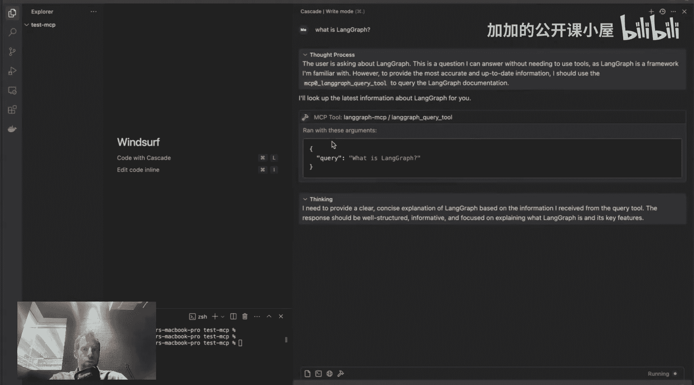

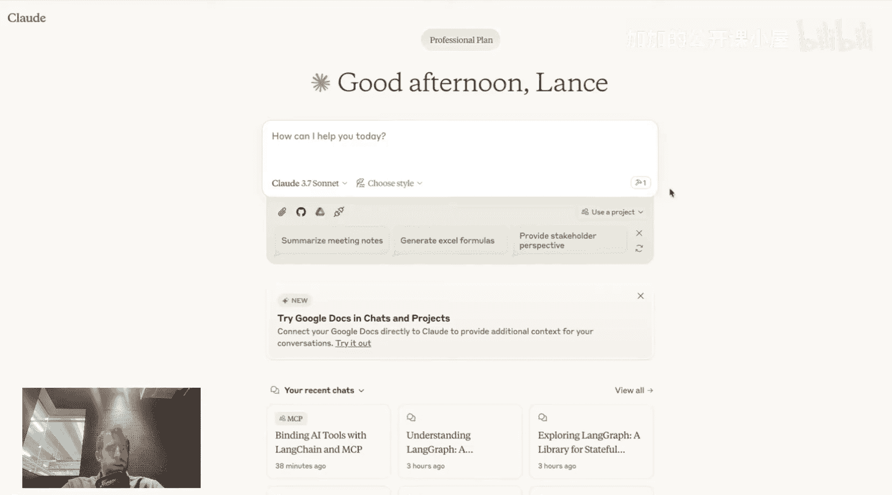

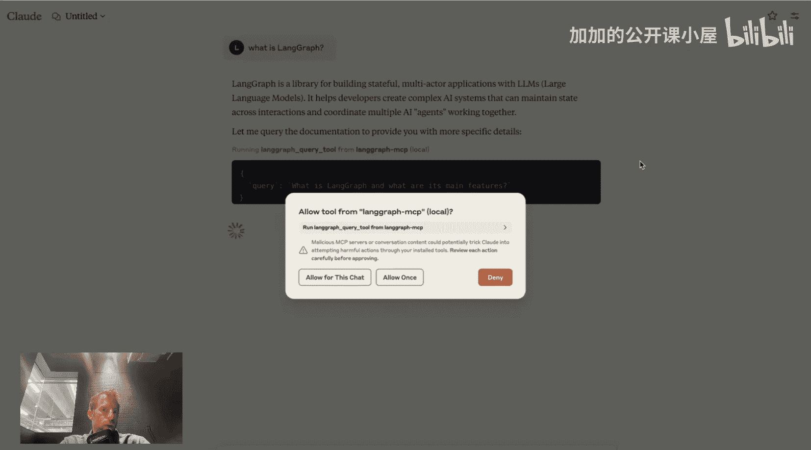

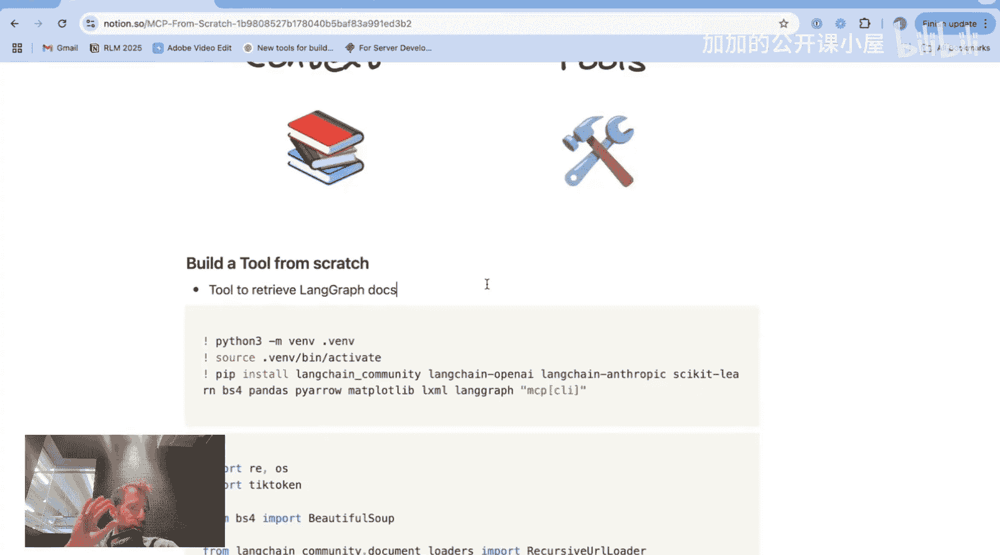

以下是构建该工具的核心步骤：

1.  **加载文档**：从指定的 LangChain 文档 URL 开始，抓取所有子链接（深度为5）。
2.  **清理与保存**：使用文本提取器清理网页内容，将所有内容保存到一个文件中（例如 `lm_docs_full.txt`）。
3.  **分割文档**：将文档按 8000 个令牌的大小进行分割，以匹配我们即将使用的嵌入模型的上下文窗口。
4.  **创建向量存储**：使用 OpenAI 的嵌入模型为所有分割后的文档生成嵌入向量，并创建一个本地的向量数据库。

核心的检索功能可以用以下代码表示：

```python
# 伪代码：核心检索函数
def query_langchain_docs(query: str):
    # 1. 将用户查询转换为向量
    query_embedding = embed(query)
    # 2. 在向量数据库中进行相似性搜索
    relevant_docs = vector_store.similarity_search(query_embedding)
    # 3. 返回检索到的文档文本
    return "\n".join([doc.page_content for doc in relevant_docs])
```

运行上述流程后，我们就拥有了一个本地的 LangChain 文档知识库，可以通过语义搜索来回答问题。

## 第二步：将工具封装为 LangChain Tool 🔗

有了核心的检索功能后，我们可以使用 LangChain 将其方便地封装成一个标准的“工具”。

在 LangChain 中，这非常简单：

```python
from langchain.tools import tool

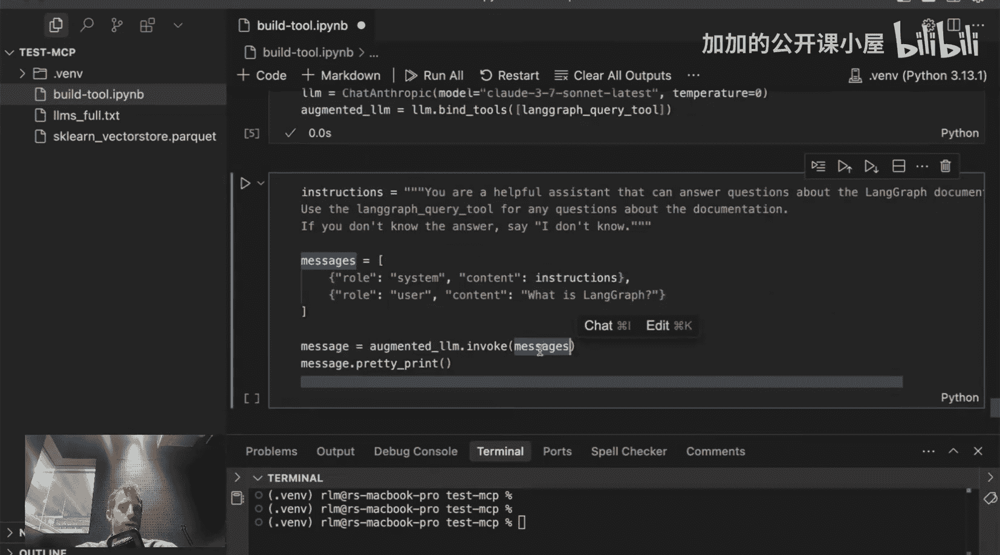

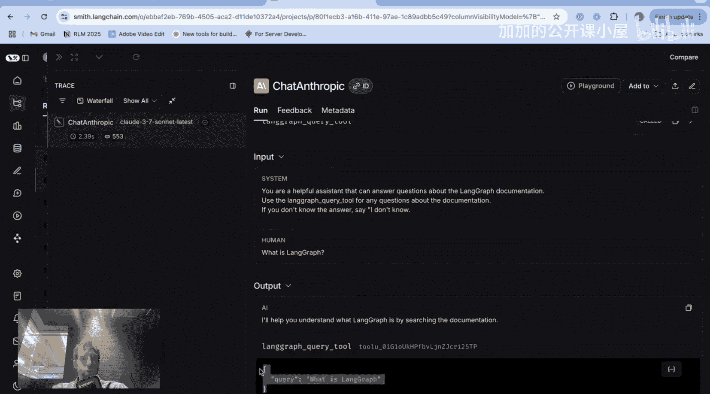

@tool
def langchain_query_tool(query: str) -> str:
    """一个用于查询 LangChain 文档的工具。"""
    # 调用我们上一步构建的检索函数
    docs = query_langchain_docs(query)
    return docs
```

现在，我们可以使用 LangChain 的 `bind_tools` 方法将这个工具绑定到任何支持工具调用的聊天模型上，从而创建一个“增强版”的 LLM。当用户提问时，模型可以决定调用这个工具来获取最新、最相关的文档信息。

## 第三步：理解 MCP 的桥梁作用 🌉

现在，我们面临一个新的问题：如何让这个 `langchain_query_tool` 不仅能在我们自己的 LangChain 应用中使用，还能在 Cursor、Claude Desktop 这些独立的 AI 应用中被调用？

这就是 MCP 发挥作用的地方。你可以这样理解：
*   **LangChain 的 `bind_tools`**：提供了一个接口，让你能将工具绑定到**多种不同的 LLM 模型**。
*   **MCP**：提供了一个协议，让你能将工具暴露给**多种不同的 AI 宿主应用程序**。

MCP 采用客户端-服务器架构。宿主应用（如 Cursor）是客户端，而我们编写的、暴露工具的程序就是服务器。这个服务器不仅可以暴露工具（Tools），还可以暴露资源（Resources，如文档文件）和提示词（Prompts）。

一个关键点是：MCP 服务器通常由宿主应用自动启动和管理。你只需要编写服务器代码，并在宿主应用的配置文件中进行声明即可。

## 第四步：构建 MCP 服务器 🖥️

让我们动手将之前的 `langchain_query_tool` 改造成一个 MCP 服务器。这需要使用 `model-context-protocol` Python SDK。

以下是服务器脚本 `langchain_mcp.py` 的核心内容：

```python
# 导入 MCP SDK
from mcp import Client, Server
import mcp.server.stdio
import mcp.server.fastmcp as fastmcp

# 1. 创建 FastMCP 服务器实例
app = fastmcp.FastMCP("LangChain Docs Server")

# 2. 使用装饰器注册工具，这和 LangChain 的 @tool 装饰器非常相似
@app.tool()
def langchain_query_tool(query: str) -> str:
    """一个用于查询 LangChain 文档的工具。"""
    # 这里复用我们第一步编写的核心检索逻辑
    docs = query_langchain_docs(query)
    return docs

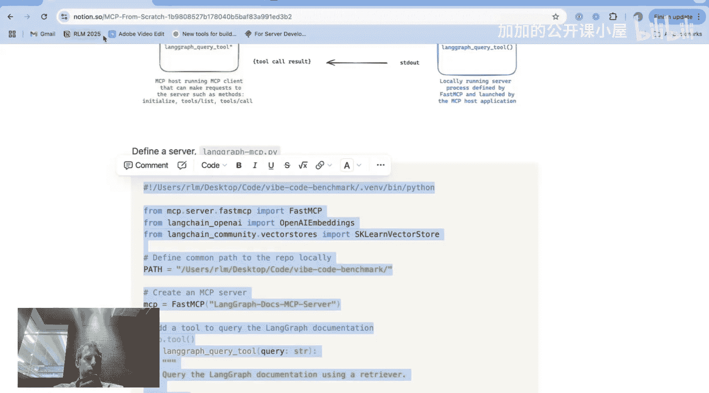

# 3. （可选）注册一个资源，例如直接提供完整的文档文本文件
@app.resource("langchain://docs")
def get_full_docs() -> str:
    with open("lm_docs_full.txt", "r") as f:
        return f.read()

# 4. 使用标准输入/输出运行服务器
if __name__ == "__main__":
    app.run(transport="stdio")
```

这个脚本定义了一个简单的服务器，它暴露了一个工具和一个资源。你可以使用 MCP 检查器（Inspector）来测试这个服务器是否正常工作。

## 第五步：连接到宿主应用 🔌

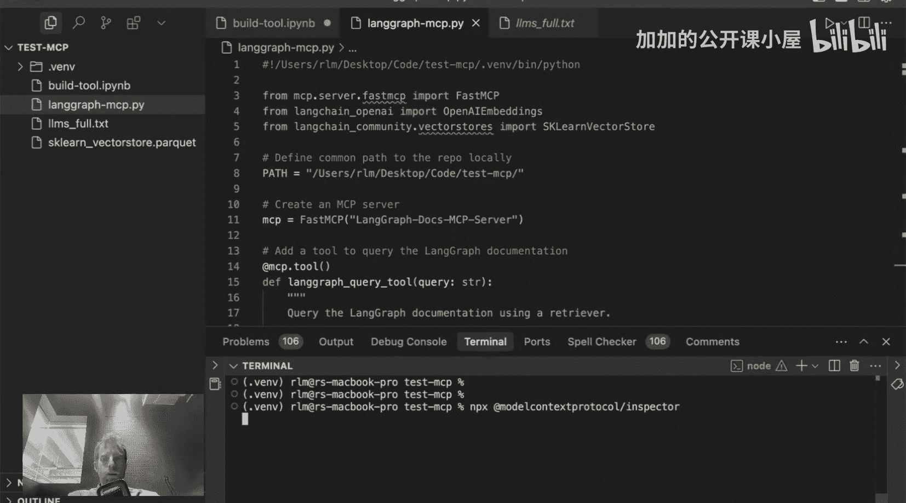

服务器构建完成后，需要告诉宿主应用它的存在。这通过在宿主应用的配置文件中添加一小段配置来实现。

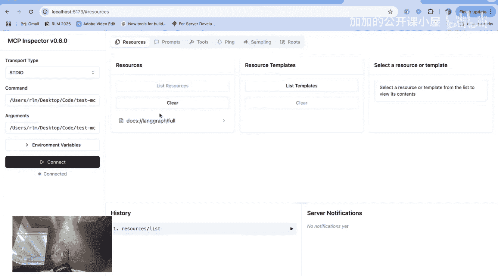

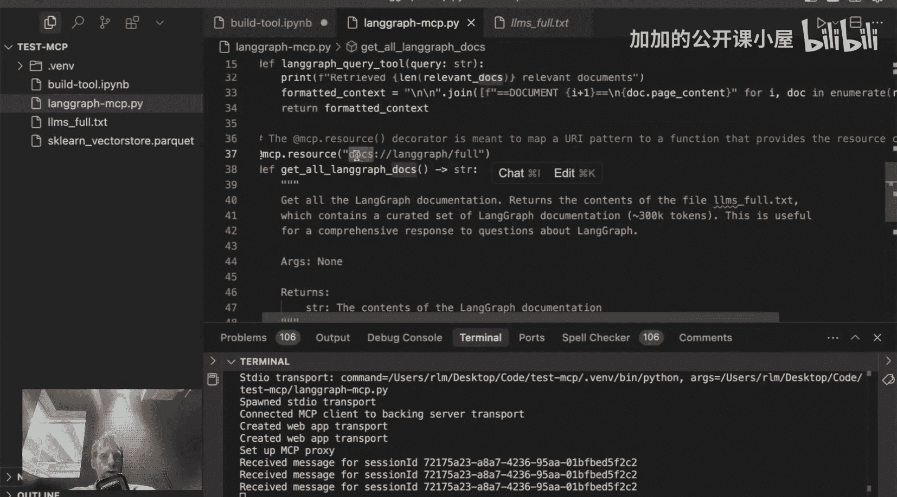

配置通常包括：
*   **命令**：用于启动服务器的命令（例如 `python`）。
*   **参数**：服务器脚本的路径。
*   **环境变量**：例如 `OPENAI_API_KEY`，因为我们的工具内部使用了 OpenAI 的嵌入模型。

以下是配置的通用格式：

```json
{
  "mcpServers": {
    "langchain-docs": {
      "command": "python",
      "args": ["/path/to/your/langchain_mcp.py"],
      "env": {
        "OPENAI_API_KEY": "your-key-here"
      }
    }
  }
}
```

你需要将类似这样的配置片段添加到不同宿主应用的特定配置文件中：
*   **Cursor**：`cursor.json`
*   **Claude Desktop**：`claude_desktop_config.json`
*   **Windsurf**：其设置界面中的 MCP 配置部分

配置完成后，当你重启这些应用时，它们会自动启动你的 MCP 服务器。你可以在 Cursor 的设置页、Windsurf 的聊天界面或 Claude Desktop 的开发者面板中看到已连接的 MCP 服务器和它提供的工具。

## 总结与回顾 🎯

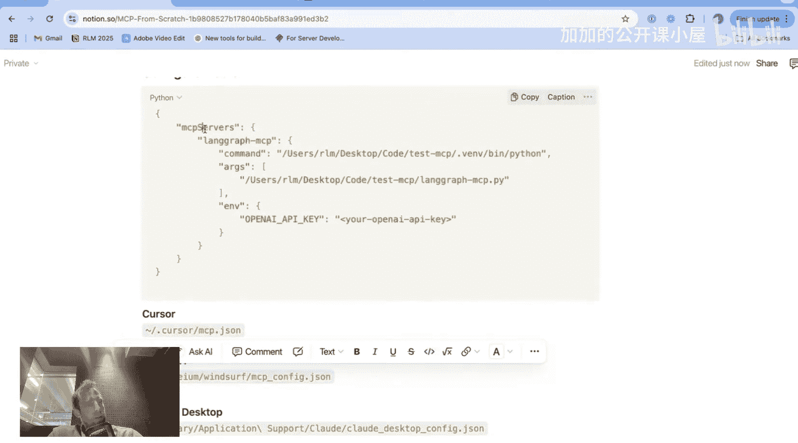

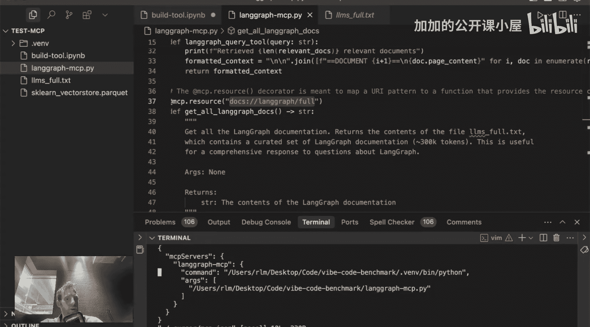

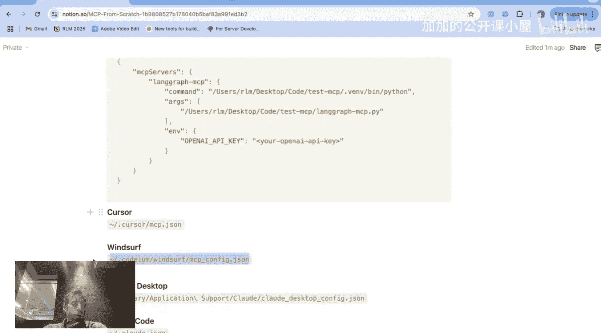

本节课中我们一起学习了模型上下文协议（MCP）的核心概念与实践：

1.  **MCP 是什么**：它是一个协议，允许你构建的工具被多种 AI 宿主应用程序（如 Cursor, Claude, Windsurf）发现和调用。
2.  **构建基础工具**：我们首先构建了一个基于 RAG 的 LangChain 文档查询工具，这是功能核心。
3.  **从 LangChain Tool 到 MCP Server**：我们了解了如何将 LangChain 工具改写成 MCP 服务器，两者在定义工具的逻辑上高度相似。
4.  **服务器架构**：MCP 采用客户端-服务器模型，服务器暴露工具/资源，宿主应用作为客户端调用它们。服务器通常由宿主应用管理。
5.  **连接与配置**：通过修改宿主应用的配置文件，我们可以将自定义的 MCP 服务器与之连接，实现工具的共享。

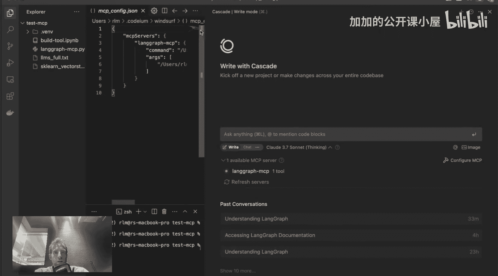

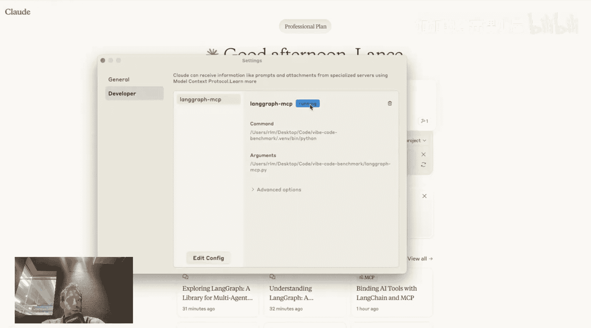

通过本教程，你掌握了创建跨平台 AI 工具的基本方法。利用 MCP，你可以一次编写工具，然后在多个你日常使用的 AI 助手和 IDE 中运行它，极大地提升了工作效率和工具的可复用性。