#  067：利用 LLM 与 MCP 构建 LangGraph 应用

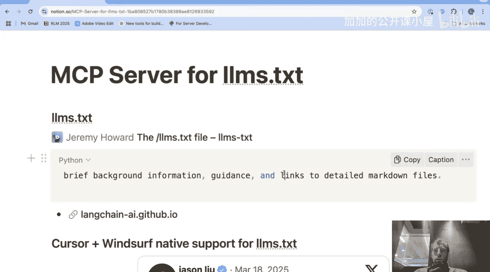

## 概述
在本节课中，我们将学习如何利用 `lm.text` 文件和模型上下文协议（MCP），为 Cursor、Windsurf 和 Claude Desktop 等应用提供结构化的文档指引，从而高效地构建 LangGraph 应用。我们将从实际演示开始，逐步剖析其背后的原理与实现方法。

---

## 什么是 `lm.text`？ 📄

`lm.text` 是一个新兴的标准文件，用于为与网站相关的 LLM 提供指引或链接。


打开 LangChain 文档的 `lm.text` 文件，可以看到它包含多个部分。它本质上是一个简单的 Markdown 文件，其作用是提供一系列指向我们文档的链接，并附有关于每个链接所涵盖内容的描述。

你可以看到它涵盖了我们的入门指南、概念文档和用例。现在的问题是，如何将这个文档用于像 Cursor、Windsurf 这样的应用程序？我们整理了一个非常简单的方法来实现这一点。

---

## 功能演示 🎬

首先，我将展示它在 Cursor、Claude Desktop 和 Windsurf 中的实际运行效果，然后我们将深入探讨其背后的工作原理。

### 在 Cursor 中演示

我现在在 Cursor 中。打开一个新的聊天，选择代理模式，我会输入一个关于 LangGraph 的问题和一些基本指令。我使用的是 Claude 3.5 Sonnet。你可以看到它要求我进行一些工具调用。

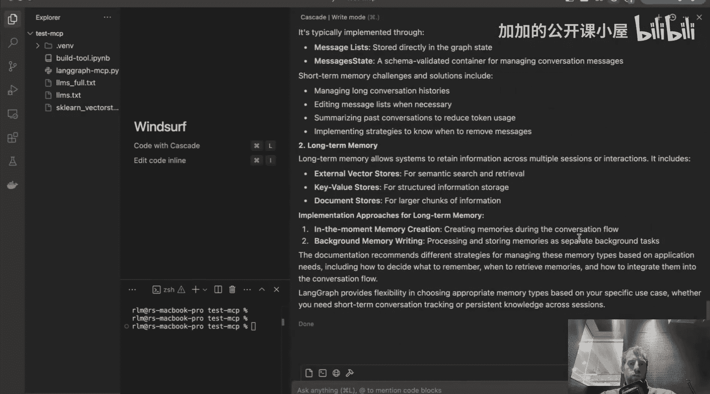

首先，它将运行 `list_doc_sources` 工具。这个工具将返回我希望应用程序使用的 `lm.text` 文件，并读取该文件。通过 MCP 将此设置为工具的好处是，我可以明确地看到传递给 LLM 上下文的内容。因此，整个 `lm.text` 文件的内容都被传递过去了。

现在，它分析了这份文档，并识别出“内存概念”页面有助于回答我的问题。接着，它希望获取这个特定页面。它完美地回答了问题，并且我可以通过这些 MCP 工具非常精确地看到它拉取了哪些内容到上下文中。

### 在 Windsurf 中演示

我在 Windsurf 中打开 Claude。可以看到我已连接了这个 MCP 服务器，这里是可用的工具。我继续提出我的问题，它成功识别了我提供的 `lm.text` 文件。它分析了 `lm.text` 的内容，然后去获取了其中提供的几个独立网页，特别是“内存概念”页面，并很好地回答了我的问题。

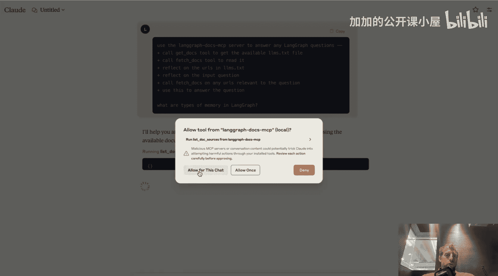


### 在 Claude Desktop 中演示

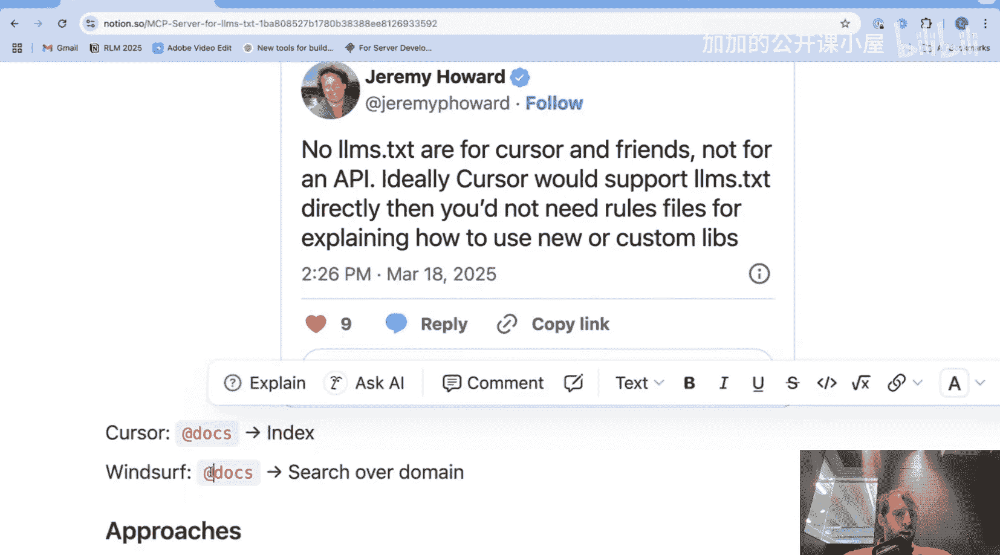

在 Claude Desktop 中，可以看到那两个来自 MCP 服务器的工具都存在。我提出同样的问题。同样，我允许 Claude 在此聊天中进行工具调用。它获取了 `lm.text` 文件，读取了它。这很酷。根据文档，它发现有一个专门关于内存的页面。它读取了那个页面，完美，这正是我想要的。看，它基于内存文档的内容很好地回答了问题。

---

## 原理剖析：为何选择 MCP？ 🔧

现在我已经展示了它的实际运行，让我退一步解释一下发生了什么以及我们为什么这样做。

我在网上经常看到的一个有趣且令人困惑的点是，像 Cursor 和 Windsurf 这样的 IDE 确实支持加载文档，但每种情况下的工作方式略有不同。

*   **Cursor**：当你使用 `@docs` 时，它会为你索引文档。
*   **Windsurf**：`@docs` 实际上会在指定的域名上进行搜索。

让我们快速在 Cursor 中看看这个。在 Cursor 设置中，可以看到有一个“文档”选项。我们添加一个新文档，我会传入我的 `lm.text` 文件的 URL。确认后，它已被添加，我们可以看到它已被索引。转到聊天，打开一个新的聊天，代理模式，`@docs`，选择我的文档。我继续添加一些指令：“分析此文档中直接提供的 URL，读取与问题相关的任何 URL 来回答问题。”然后我在这里提出我的问题。你可以看到它的思考过程，它识别出文档中的一堆 URL，这很好。我希望直接加载这些内容。

现在，我发现 Cursor 中一个有趣的现象：它会进行网络搜索，而我看到“未找到结果”。它再次搜索网络。在这个最终的网络搜索中，我见过这种情况，它拉取了一大堆不同的 URL。但我实际上可以看到从这些 URL 加载的上下文。所以，作为用户，这对我来说有点不透明。

如果我概括一下正在发生的事情：基本上，我将工具的定义和使用交给了 Cursor 代理，这在很多情况下其实没问题。我非常喜欢 Cursor，一直在使用它。但我对这个内置工具是什么、它返回的上下文以及它进行的工具调用没有太多可见性。这对我来说有点不透明，而这正是我们构建这个 MCP 服务器的动机所在。

---

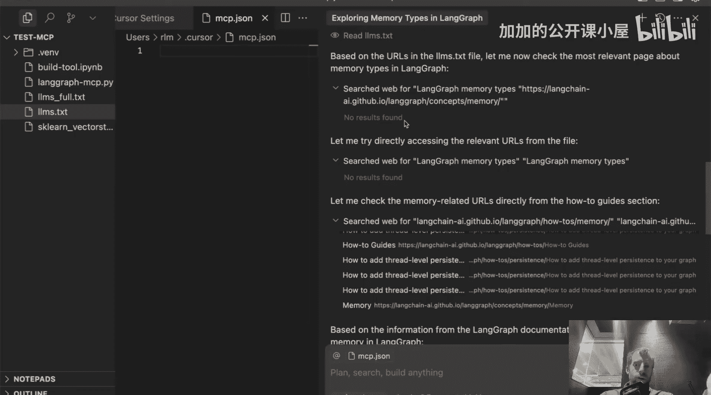

## 为 LLM 添加上下文的通用方法 📚

在具体讨论服务器之前，我想先提一下为 LLM 添加上下文的一般几种不同方法。

第一种也是最简单的方法是 **上下文填充**。


**上下文填充** 是指将文档直接塞进 LLM 的上下文窗口。它的优点是简单。缺点是成本可能较高且效率较低，特别是对于大型文档；并且可能存在检索问题，具体取决于文档上下文的位置。较新的 LLM 在这方面表现更好，某些模型比其他模型更擅长。对于较小的上下文，上下文填充是一个有吸引力的方法。

当我们谈论像所有 LangGraph 文档（约 30 万个标记）这样较大的上下文时，如果你加上 LangChain 文档，标记数会达到数百万，那么每次调用模型时都将所有内容塞进上下文就变得不太可行了。

另一种极端的方法是 **索引**，例如使用向量数据库。这种方法已经存在相当长一段时间了。你获取所有文档（假设我们获取的是 30 万个标记的 LangGraph 文档），对它们进行分割，嵌入每个分割块，并将它们存储在向量数据库中，然后使用某种搜索（如语义相似性）来检索与你的问题相关的文档。

这种方法的优点是成本低、可扩展性强且速度快。缺点（这在网上已经讨论了很多）是配置起来可能很棘手：分割块大小是多少？返回多少个文档？此外，设置和托管向量数据库也需要一些前期工作。

---

## 我们的方法：`lm.text` + 工具调用 🎯

我想在这里讨论的是使用 `lm.text` 作为参考，再加上简单的工具调用来基于任务检索 URL 的想法。

如果你思考一下，这非常简单直观。`lm.text` 只是为 LLM 提供了一个所有 URL 及其描述的参考，LLM 可以查看任务并决定读取哪些，就像人类一样。它就像一个目录，我真正需要做的就是将 `lm.text` 传递给 LLM，并给它一个可以直接读取 URL 的工具。仅此而已。

唯一的缺点是设置 `lm.text` 需要一些前期工作，但许多不同的库已经在为你构建它们了；并且延迟可能较高，因为你可能需要进行多次工具调用来检索不同的 URL 并进行分析。

所以我真正需要的是能够定义一个超级简单的 URL 加载器工具，并将其应用于我提供的任何 `lm.text` 中的 URL，并以某种方式将所有这些连接到我选择的应用程序（如 Cursor、Windsurf、Claude）。这就是这里的动机。

---

## 连接桥梁：模型上下文协议（MCP） 🌉

为了解决最后一个问题——连接部分，这就是 MCP 的用武之地。我们本周早些时候发布了一个关于 MCP 的单独视频，我会在描述中附上链接。它是一种非常简洁的方式，可以将工具连接到常见的应用程序，如 Cursor、Windsurf、Claude。

以下是正在发生的一切的示意图：应用程序将可以访问这个 `lm.text` 文件，并可以对其进行分析，通过工具调用来读取特定的 URL（由 `lm.text` 提供），然后该工具只是将 URL 内容返回给你的主机应用程序，并且它可以按需迭代，直到对解决方案满意为止。

因此，我们有一个代码仓库，一切都是开源的，可以帮助你进行设置，并且我们提供了在 Cursor、Windsurf 或 Claude 中设置的说明。

---

## 实战设置指南 ⚙️

让我们现在就进行设置。在一个新的终端中，我将运行以下命令来启动我的 MCP 服务器（这是可选的，只是为了测试服务器是否真的在工作）：

```bash
# 启动 MCP 服务器的示例命令
npx -y @modelcontextprotocol/server-adapter-langgraph-docs https://example.com/lm.text
```

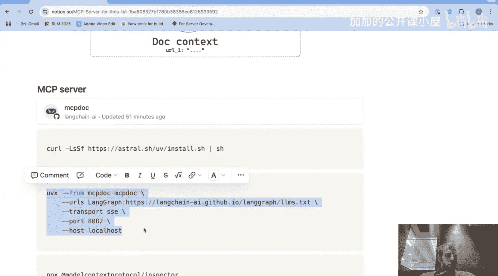

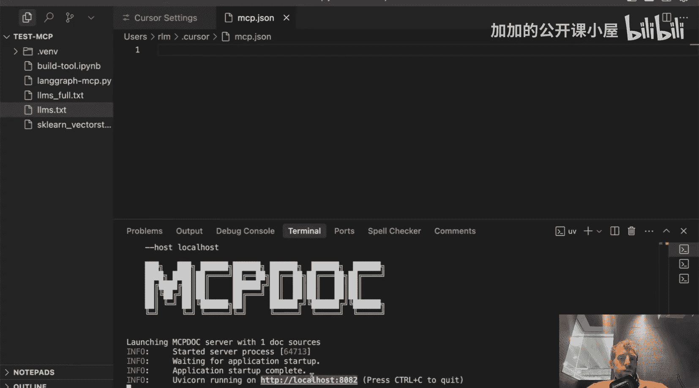

你会看到，我通过传入 LangGraph `lm.text` 的链接来启动它。现在我的 MCP 服务器正在一个单独的终端中运行。

在另一个终端中，我可以启动模型上下文协议检查器。打开它，点击提供的链接。我的 MCP 服务器运行在这里，粘贴进去。我使用传输类型 STDIO 并连接。

我连接到了服务器。我可以检查存在哪些工具。列出它们。它有一个 `list_doc_sources` 工具。运行它，它提供了我给出的链接，很好。我还可以运行 `fetch_docs` 工具，传入一个随机 URL 进行测试，运行它，看，我们很快得到了文档。所以现在我们知道我们的服务器工作了。

现在我需要将服务器连接到我的各个主机。

### 连接到 Cursor

以 Cursor 作为一个主机。转到设置，转到 MCP，添加新的 MCP 服务器，只需粘贴这个（这在 README 中有提供）。这只是运行我们刚刚运行的相同命令，但在这种特定情况下，主机应用程序 Cursor 将为我们运行它，启动它并连接到它。完成后，返回 MCP，你会看到它确实通过这个绿色图标连接了。转到聊天，选择代理。

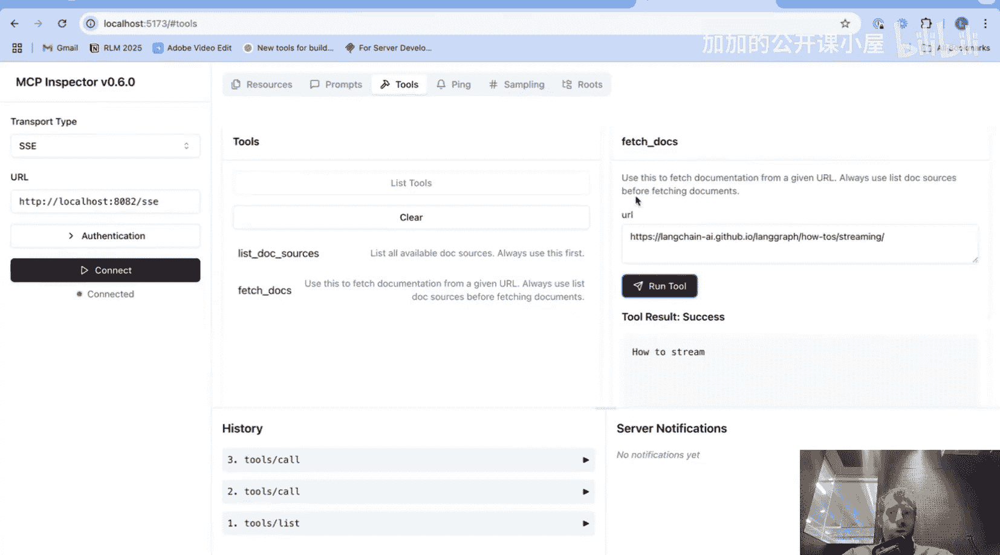

现在，我们这里的指令需要更有意义一些：“调用 `list_doc_sources` 工具以获取可用的 `lm.text` 文件。调用 `fetch_docs` 来读取它。调用 `fetch_docs` 来读取任何与回答问题相关的 URL。” 所有这些，你可以添加到 Cursor 规则中作为示例，这样你就不必实际将其添加到聊天中，但为了最大透明度，我把所有内容都放在这里。


提出一个问题，我们可以看到它正确地说：“好的，让我们继续调用 `list_docs` 工具来获取任何可用的 `lm.text` 文件。” 运行该工具。它继续获取“内存概念”文档，它认为这与我的问题最相关，这完全正确。我们可以看到这里返回的上下文。它还决定查找更多关于内存实现的内容，我们可以非常清楚地看到它检索了哪些文档、拉取了什么内容到上下文中。现在它用这些来非常详细地回答了问题。

### 连接到 Windsurf

在 Windsurf 中，只需点击“配置 MCP”，这会带你到配置文件。这和我们刚才做的完全一样。这只是 Windsurf 的配置，像我们之前看到的那样粘贴进去，然后像我们之前在 Claude 中那样进行提示。

### 连接到 Claude Desktop

在 Claude Desktop 中，转到设置，转到“开发者”，编辑配置以像之前一样添加服务器配置。这也适用于 Claude Code。实际上，你需要做的就是按照 README 中的说明，运行这个命令（在 README 中是作为节点命令）。在这种情况下，我已经添加了这个特定的 MCP 服务器。打开 Claude，它会通知发现了一个 MCP 服务器。我们可以看到“LangGraph 文档”已连接。我们可以批准它。

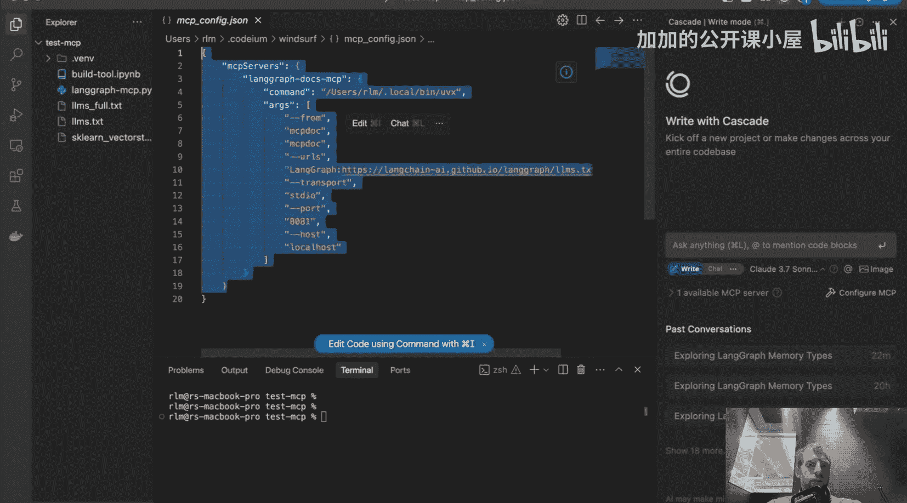

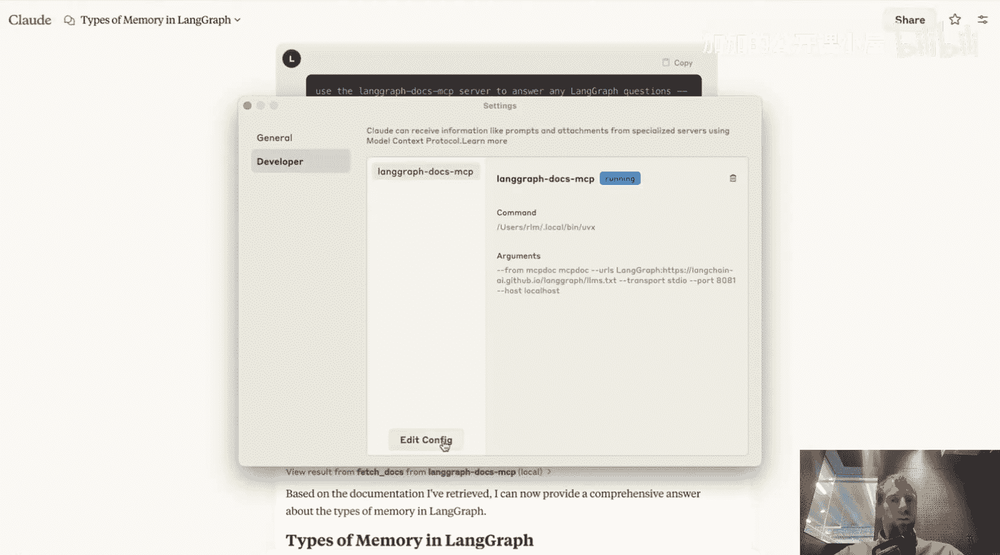
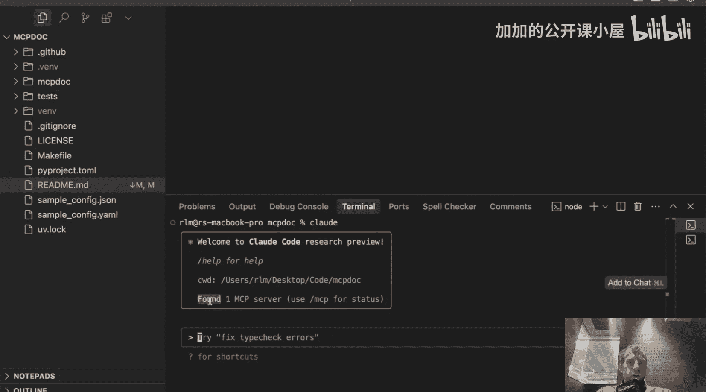

---

## 总结 📝


本节课中，我们一起学习了如何利用 `lm.text` 文件和 MCP 协议，为 AI 编程助手（如 Cursor、Windsurf、Claude）注入结构化的外部知识。我们探讨了其相较于传统文档索引或简单上下文填充方法的优势，即**在灵活性、可控性与效率之间取得了良好平衡**。通过实际演示和分步设置指南，你应该已经掌握了如何为自己的项目文档创建 `lm.text`，并通过 MCP 服务器将其能力赋予你日常使用的开发工具，从而更高效地进行基于 LLM 的代码开发与问答。