#  068：用于可视化和调试智能体的 IDE 🛠️

在本节课中，我们将学习 **LangGraph Studio**。这是一个专门用于开发和调试基于图（Graph）的智能体（Agent）的集成开发环境（IDE）。我们将了解它的核心功能、如何作为 **LangGraph 平台** 的一部分运行，以及如何利用它来可视化、交互和调试你的 LangGraph 应用。

---

## LangGraph Studio 是什么？🤔

在我们的代码仓库或社交媒体上，你可能见过这个界面。你可能会问，这是什么？这是一个名为 **LangGraph Studio** 的工具。它是一个专门用于处理和调试图智能体的 IDE。

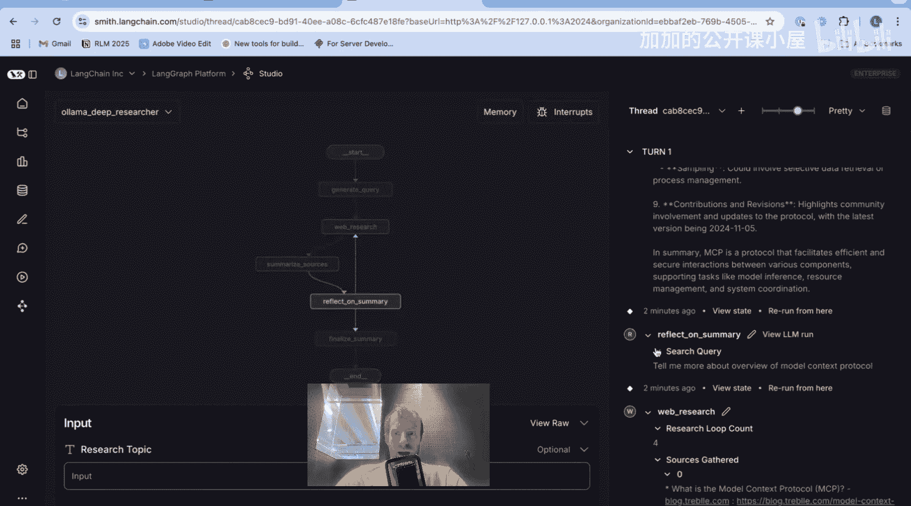

现在，我们通过一个名为 **Local Deep Researcher** 的流行项目来展示它的工作方式。你可以在这里看到一个**图**。稍后我们会详细讨论它。这里还有一个**输入面板**，我可以添加用户输入并点击提交。

当程序运行时，你可以看到图中发生的一切：我们生成了一个查询。在这个过程中，你可以在这里跟随，观察你的图状态是如何被填充的。例如，这里是查询生成，这里是网络搜索结果，这里是摘要，我们可以看到它的流式输出。这个特定的图会重复一个包含反思和序列化的过程，循环一定的次数。在 Studio 中，我们可以再次看到整个过程。

图运行结束后，你可以在这里滚动查看图执行过程中发生的一切。特别是，我们可以看到图中**每一个节点**的状态是如何更新的。

---

## 理解 LangGraph Studio 的核心组件 🧩

接下来，我们花点时间从核心组件入手，理解 Studio，并深入剖析其底层工作原理。

首先，**LangGraph Studio** 是更广泛的 **LangGraph 平台** 的一部分。LangGraph 平台由多个组件构成，它们协同工作，支持 LangGraph 应用的开发、部署、调试和监控。

你可以从几个方面来理解这个平台：
*   你的智能体或应用架构可能涉及几个不同部分。
*   它可能包含用于模型、向量数据库或其他集成的 LangChain。
*   它包含用于编排的 LangGraph。
*   它包含你构建的智能体可以调用的工具。

你可以在 Jupyter Notebook 中轻松实现和测试 LangGraph 应用。而 **LangGraph 平台** 则是一种实际部署它们并将其连接到几个有用功能的方式：
1.  **内存**：LangGraph 平台内置了短期和长期内存。短期内存是我们所说的**线程内存**，它在给定的用户交互过程中持续存在。长期内存则在许多不同的线程或用户交互中持续存在，例如关于用户的记忆。
2.  **服务器**：我们通过 **LangGraph 服务器** 来部署你的智能体或应用。
3.  **Studio**：它连接到我们将深入讨论的 Studio。
4.  **LangSmith**：它还连接到 LangSmith，为你提供许多有用的可观测性功能。

核心要点是：**LangGraph Studio 是这个更广泛的 LangGraph 平台的一部分**。这个平台为你提供了一种非常简便的方式来开发、部署和调试用 LangGraph 构建的应用。这个服务器可以在你的机器上本地运行，也可以托管。我们稍后会详细讨论。

---

## 应用结构与配置文件 📁

正如我们之前所见，Studio 是一个专门的 IDE。它可以连接到 LangGraph 服务器，并实现应用的可视化、交互和调试。

要使用 LangGraph 平台（以及 Studio），你需要以特定的方式构建你的应用。这相当简单直接。核心部分是 **`langgraph.json`** 配置文件。

以 Local Deep Researcher 仓库为例。关键点包括依赖项的定义、LangGraph 配置文件环境，以及你的图实现。

以下是 `langgraph.json` 文件的核心结构示例：
```json
{
  "graphs": {
    "lamma-researcher": {
      "graph": "app/graph",
      "entrypoint": "compile_graph"
    }
  },
  "dependencies": ["."],
  "env": ".env"
}
```

这个文件指向你的图。你可以看到 `compile_graph` 在这里被指定。这正是我们在 `langgraph.json` 中指向的内容：我们指向目录、文件名和编译后的图名。这就是配置文件如何指向你希望用 LangGraph 平台加载和运行的特定编译图。

此外，应用结构还包括依赖项（例如使用 `uv` 项目管理器）和图定义。在许多示例仓库中，图定义通常是分开的：
*   `graph.py`：通常包含最终的编译图。
*   状态、提示词等可以放在单独的文件中，然后在 `graph.py` 中引入。
*   最后是环境文件（`.env`），它将使用 `python-dotenv` 加载。如果你在本地运行，实际上不需要 `.env` 文件，它可以直接从你的 Python 解释器环境中读取环境变量，但包含它是一个好习惯。

---

## 在本地运行 LangGraph 平台 🚀

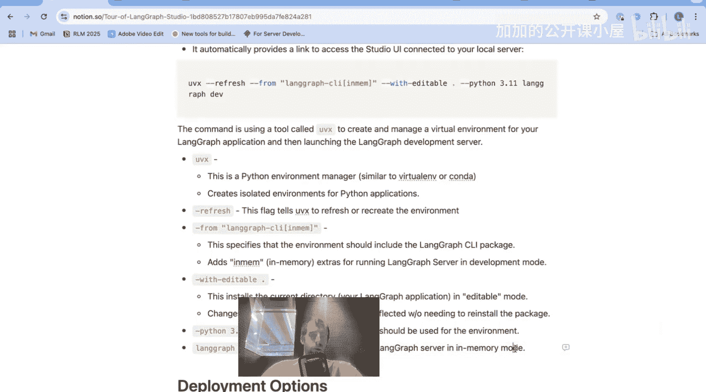

我想展示如何在你的机器上本地运行 LangGraph 平台以进行开发。你需要做的就是按照这些说明操作：安装 `langgraph-cli` 包，然后运行 `langgraph dev`。

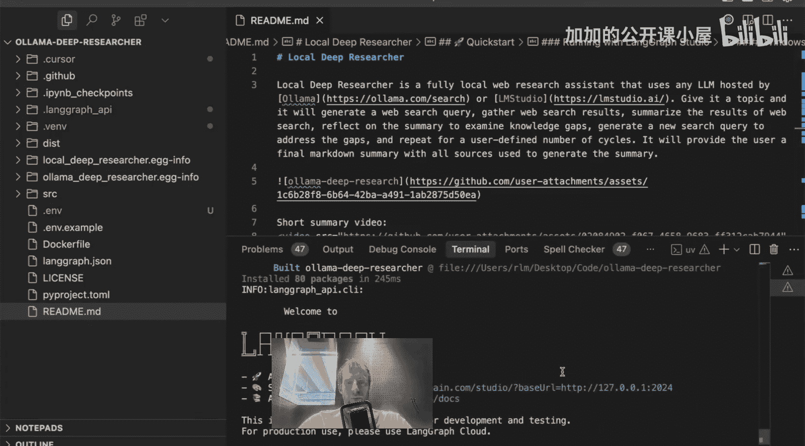

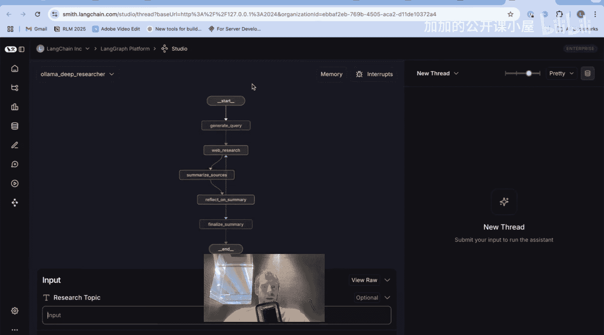

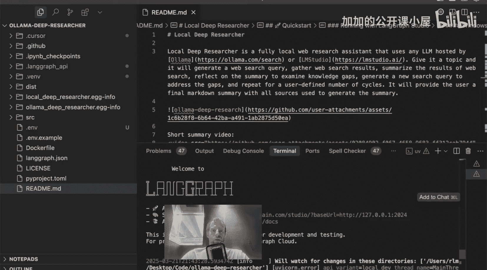

在许多仓库中，我提供了这个快捷命令。我来解释一下发生了什么：
```bash
uvx langgraph-cli[in-memory] --editable . --python 3.11 langgraph dev
```

这个命令使用了一个名为 `uvx` 的工具来为你的 LangGraph 应用创建和管理虚拟环境，并启动本地 LangGraph 开发服务器。`uv` 是一个环境管理器，为 Python 应用创建隔离的环境。当我们运行时，它会创建一个全新的环境。

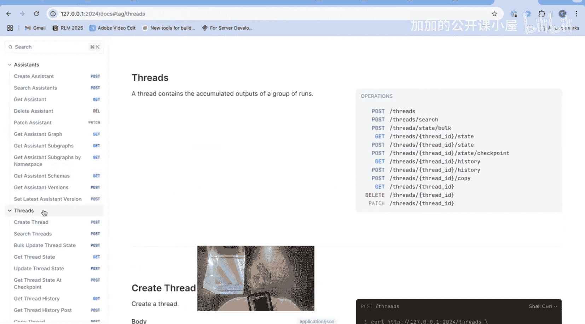

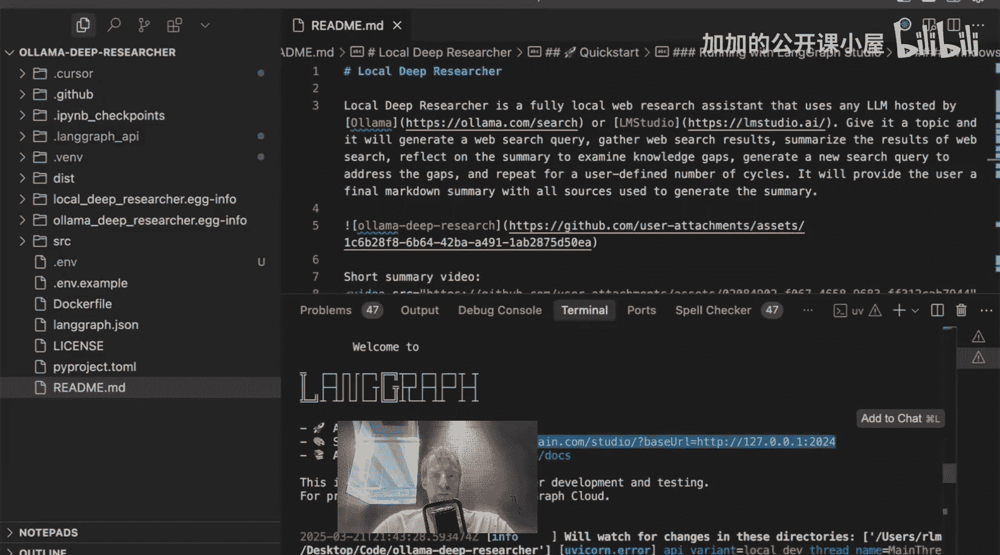

`langgraph-cli[in-memory]` 指定环境应包含我们刚刚讨论过的 LangGraph CLI 包，并带有 `in-memory` 扩展，用于在开发模式下本地运行。`--editable .` 以可编辑模式安装当前目录（你的应用），代码更改将立即反映，无需重新安装包。`--python 3.11` 指定 Python 版本。最后 `langgraph dev` 启动服务器。

这个命令将在你的机器上以内存模式启动 LangGraph 服务器。例如，在 Local Deep Researcher 项目中运行此命令后，你会看到“Welcome to LangGraph”的消息，并且服务器会自动在你的浏览器中启动。

你还会看到一些有用的链接：直接链接到 API、API 文档，以及 **Studio UI**。点击 Studio 链接即可打开它。


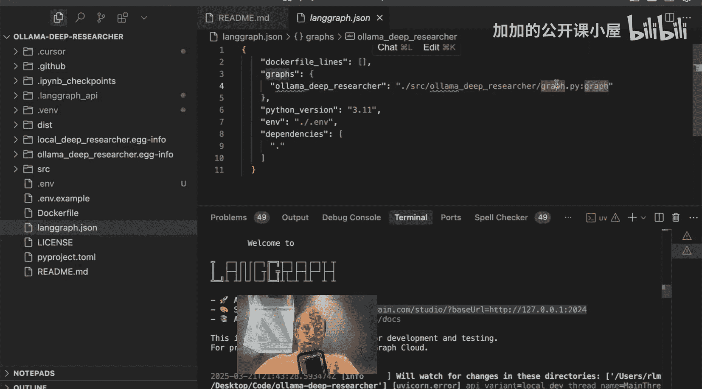

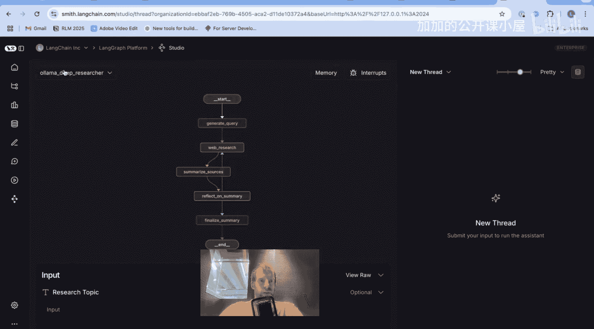

---

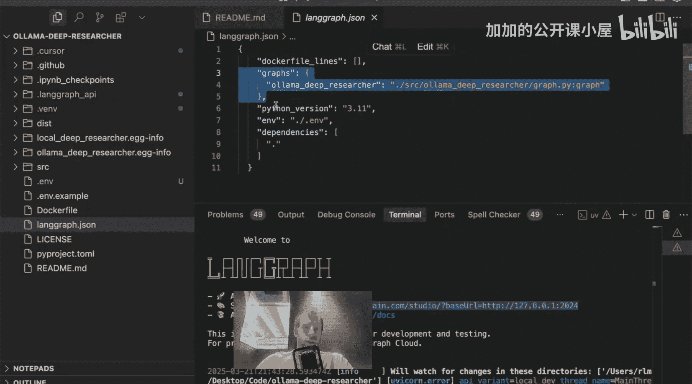

## 探索 Studio 界面 🔍

在 Studio 打开后，你会注意到几件事：
1.  **平台标识**：在顶部，你可以看到我们的平台 Studio 标识。
2.  **图名称**：顶部还有一个显示图名称的地方。这个名称来自你的 `langgraph.json` 文件。在配置文件中，你为图命名（例如“lamma-researcher”），并指向编译图。这个名称会反映在 Studio 中。你可以在一个 `langgraph.json` 文件中指定多个图，然后在 Studio 中轻松滚动选择它们。
3.  **图可视化**：你会看到你的图。图中的每个元素都对应你图中实际定义的**节点**。例如，在代码 `graph.py` 中，有 `generate_query` 节点、`web_research` 节点等。回到 Studio，这些节点被反映出来：`generate_query`、`web_research`。图中信息流，正如在 `graph.py` 中通过节点定义和边（edges）连接所指定的那样，都在这个图可视化中呈现出来。这个可视化与代码中的图定义是一一对应的。
4.  **输入面板**：那么输入面板是从哪里来的呢？回到我们的代码，查看 `graph.py` 中的图构建器部分。当我们设置图时，我们实际上向图提供了一个包含整体图状态以及**输入**和**输出**的状态。这意味着，**输入**只是我们希望用户看到的实际输入状态字段。同样，**输出**只是我们最终运行图时希望返回的输出状态。

如果你查看输入状态的定义（例如在 `state.py` 中），你可能看到它只包含一个字段 `research_topic`。这也在整体图状态中。输入状态代表了我们希望向用户暴露的部分。在 Studio 中，你只能看到 `research_topic` 暴露给用户。这通常很好，因为我们不希望向用户暴露图中存在的所有可能状态变量。


---

## 使用 Studio 进行调试和检查 🐛

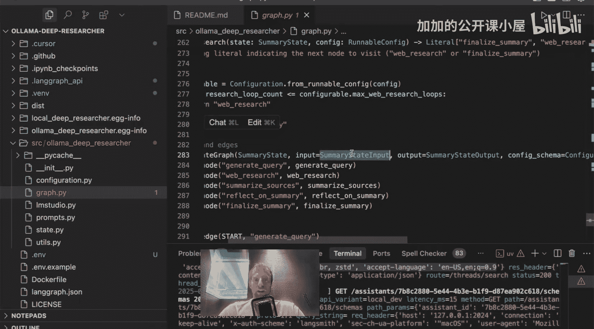

正如我们之前看到的，我们可以提供输入，然后观察图的运行。最初它运行 `generate_query`，我们可以看到它的流式输出。`web_research` 完成后，我们实际上可以去检查所有的网络搜索结果。我们之前看到状态在流式更新。

特别有趣的是，当每个节点完成时，你可以看到被更新的**状态键**以及该状态键的**值**。当它运行时，我们看到输出流。但当它完成时，你可以看到对相应状态键的赋值。

让我们简要看一下代码来理解这里发生了什么。例如，这个状态键是 `running_summary`。如果我们查看 `graph.py` 中的 `summarize_sources` 节点，我们可以看到里面做了很多事情。但最终，我们使用运行中的摘要更新了 `running_summary` 状态键。

在 Studio 中，当节点执行时和完成后，你都可以清晰地观察到这些状态的变化，这为调试提供了极大的便利。

---

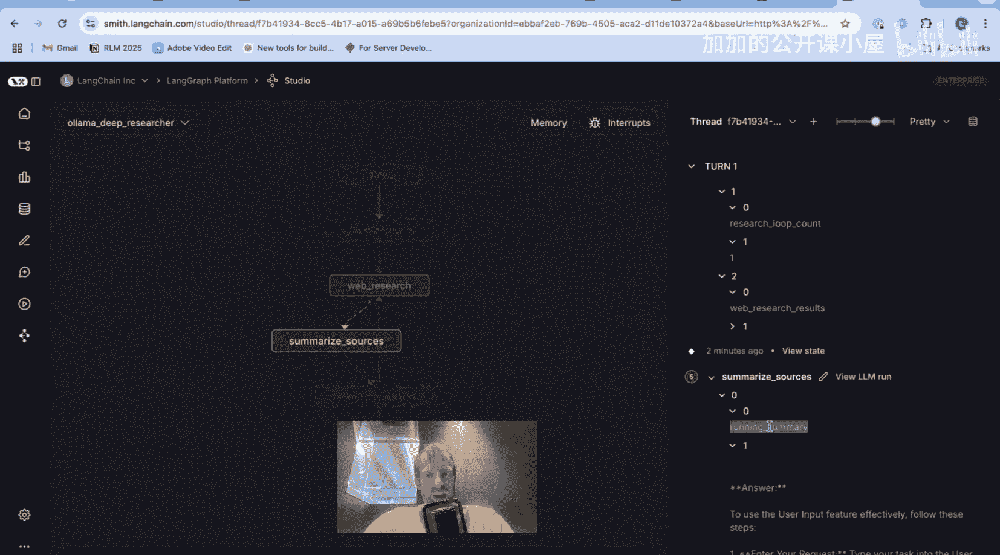

## 总结 📝

在本节课中，我们一起学习了 **LangGraph Studio**。我们了解到它是 **LangGraph 平台** 的一个关键组成部分，是一个用于可视化、交互和调试基于图的智能体的强大 IDE。我们探讨了如何通过 `langgraph.json` 配置文件来构建应用，如何在本地使用 `langgraph dev` 命令启动开发服务器和 Studio，以及如何利用 Studio 界面来观察图的执行流程、检查每个节点的状态更新，从而有效地开发和调试你的 LangGraph 应用。通过 Studio，开发者可以获得对智能体内部工作过程的清晰洞察，大大提升了开发效率。