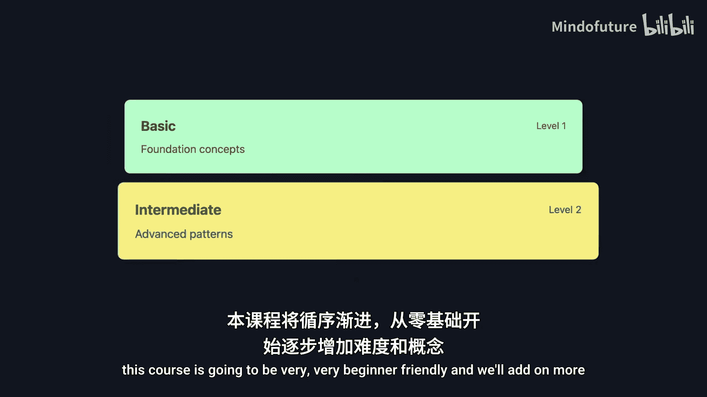
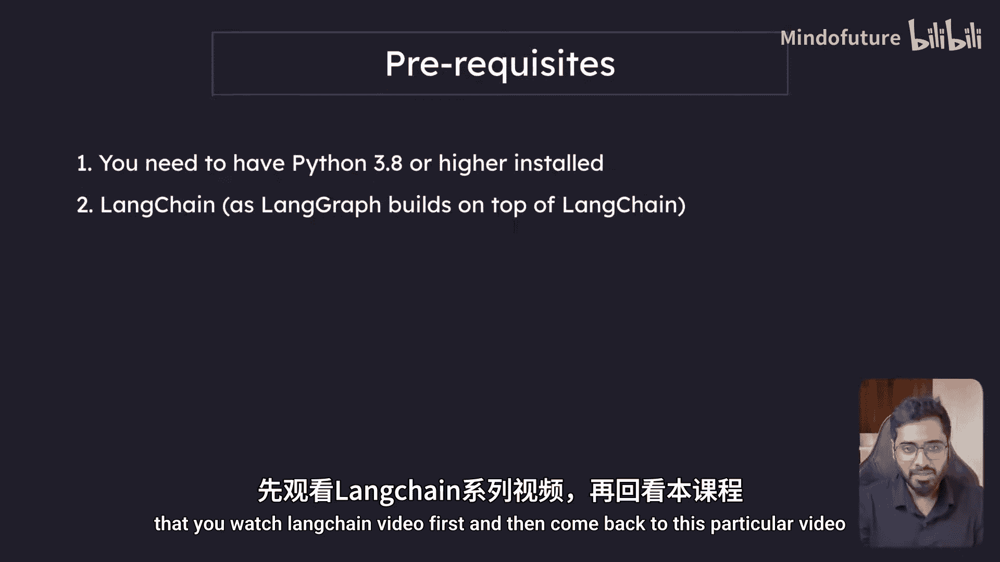

# 001：引言 🚀

在本节课中，我们将一起了解《LangGraph初学者入门2025》课程的完整概览。我们将明确课程目标、学习路径以及必要的预备知识，为你开启构建强大AI智能体的旅程奠定坚实基础。

## 课程概述

欢迎来到面向初学者的LangGraph端到端速成课程。如果你希望为你的产品或业务构建强大的AI智能体，或者你正计划进行重大的职业转换，那么本课程非常适合你。

在本课程结束时，你将学会如何构建能够自主思考、自行决策的AI智能体。当需要人工批准时，它能够将工作成果提交给你进行审批。这仅仅是冰山一角。

如果这听起来有些复杂，请不要担心。本课程将非常友好地面向初学者，我们会循序渐进地增加难度和引入更多概念。

接下来，让我们具体看看课程大纲。

## 课程大纲详解

以下是本课程将涵盖的核心内容模块。

1.  **LLM应用的自洽性层级**
    首先，我们将探讨LLM应用中不同层级的自洽性。自洽性意味着自由度。从代码开始，它几乎没有自主思考的自由，完全按照我们的指令执行。最终，我们将到达智能体，它具有很高的自洽性，能够自主思考。这正是LangGraph将要发挥作用的地方。但要理解这一点，我们需要了解我们是如何一步步发展到这里的。

2.  **理解智能体与工具**
    本节我们将深入探讨，不仅了解智能体是什么，更会剖析智能体在底层是如何构建的。这将为我们后续的课程打下坚实的基础。我们将学习如何从零开始构建智能体，同时也会学习如何使用LangChain提供的开箱即用的预定义类来构建智能体。接着，我们将理解图数据结构，以及有向无环图和循环图之间的区别。

3.  **LangGraph核心概念**
    在理解了预备知识后，我们将进入正题：什么是LangGraph？为什么需要它？为什么不继续只用LangChain？LangChain有哪些局限性？使用LangGraph，我们将构建不同的智能体架构模式，例如反思智能体、多智能体工作流等。我们将学习与LangGraph相关的所有关键术语，例如什么是图、什么是状态、什么是节点、什么是可视化、什么是断点等等。

4.  **构建LangGraph聊天机器人**
    届时，我们将掌握足够的知识来开始构建我们自己的LangGraph聊天机器人。我们构建的聊天机器人将能够通过搜索网络来回答问题，能够将复杂查询路由给人类进行审核，并且可以在链中回溯以探索替代路径。这正是人机协同、ReAct等智能体模式发挥作用的地方。

5.  **构建多智能体系统**
    我们还将构建多智能体系统，其理念与CrewAI非常相似。但我相信LangGraph更加强大，因为它更底层，这为我们实际构建工作流提供了更大的灵活性。多智能体系统意味着我们创建多个智能体，这些智能体可以相互通信以完成特定任务。

6.  **将RAG集成到LangGraph中**
    接着，我们将探索如何在LangGraph中集成RAG。我们将了解什么是Corrective RAG，什么是Adaptive RAG，以及什么是Self-RAG。

7.  **LangGraph高级特性与生产部署**
    最重要的是，我们还将研究LangGraph中的持久化是如何工作的。同时学习LangGraph提供的其他一些工具，以帮助构建生产级的智能体，例如LangGraph Studio、LangGraph Cloud API等。最后，我们将关注生产环境中的智能体，通过探索足够的真实用例，让你对未来的技术趋势有一个完整而清晰的认识。

## 预备知识

现在，让我们来看看学习本课程所需的预备知识。

以下是开始学习前需要掌握的两项核心技能。

*   **Python**：因为我们将使用Python进行开发。
*   **LangChain基础**：了解LangChain至关重要。本课程将要学习的LangGraph，在底层使用了LangChain的类，例如聊天模型、提示模板等。这些都是LangChain提供的，学习这些对于继续本课程非常重要。

如果你还不了解LangChain，我已经制作了一个长达2.5小时的深度教程，详细讲解了聊天模型、提示模板、RAG、智能体和工具等核心概念。这些是重要的预备知识。如果你不熟悉这些概念，我强烈建议你先观看LangChain的视频教程，然后再回到本课程。

## 总结

本节课中，我们一起学习了《LangGraph初学者入门2025》课程的完整路线图。我们明确了从理解基础概念到构建复杂多智能体系统的学习路径，并指出了掌握Python和LangChain基础是开始这段旅程的关键。如果课程内容让你感到兴奋，请确保订阅频道并点击铃铛图标，以便在我发布新视频时获得通知。

现在，让我们正式开始学习之旅。