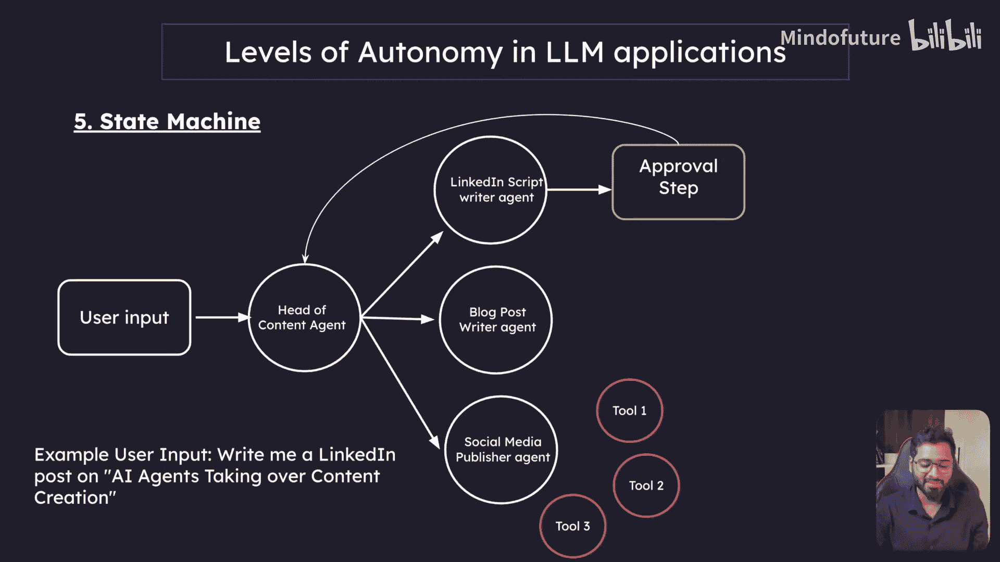
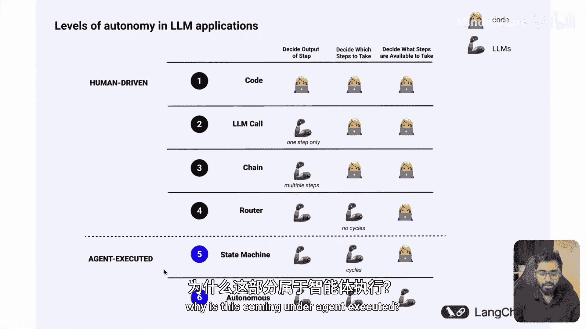

# 002：LLM 应用中的自治级别

在本节中，我们将探讨大型语言模型（LLM）应用中的自治级别。我们将从一个完全没有自治的级别开始，逐步介绍到具有高度自治能力的级别。

## 概述：从零自治到完全自治

理解LLM应用的自治级别，有助于我们选择合适的架构来构建智能系统。自治级别从完全由代码控制的确定性系统，到能够自主决策和学习的智能体系统。接下来，我们将逐一解析这些级别。

### 1. 代码：零自治

代码具有零自治性，是100%确定性的。这意味着所有规则和逻辑都是预先编写好的，系统不具备任何认知或决策能力。

**核心概念**：`output = predefined_rules(input)`

以下是代码级别的主要特点：
*   **确定性**：对于相同的输入，总是产生完全相同的输出。
*   **无认知架构**：系统只是机械地执行指令，不理解内容。

然而，这种方法存在明显缺点。开发者需要为每一个可能的场景编写规则，这使得系统无法处理现实世界中的复杂性和不确定性。

### 2. LLM 调用：基础智能

上一节我们介绍了完全由代码控制的系统，本节中我们来看看引入了基础智能的级别。单个LLM调用意味着你的应用主要执行一项核心任务：接收输入、处理并返回输出。

**核心概念**：`output = llm(input)`

这种模式的应用非常普遍，例如简单的聊天机器人或文本翻译工具。它相比硬编码规则是一个巨大的飞跃，尽管仍处于自治的第二阶段。

以下是一个简单的示意图：
```
用户输入 -> LLM -> 输出
```
例如，用户输入可能是：“你是一位专业的LinkedIn帖子写手，请为我写一篇关于AI智能体接管内容创作的帖子。” LLM擅长处理这种单一、明确的任务。

但是，这种方法也有一个缺点。试图在一次调用中完成所有事情，通常会导致混乱或混杂的响应。就像一个普通人无法成为所有领域的专家一样，如果要求LLM在一个提示中同时撰写Twitter帖子、LinkedIn帖子和博客文章，它很难出色地完成所有任务。

### 3. 链式结构：多专家协作

单一LLM调用的局限性引出了下一个自治级别：链式结构。你可以将链式结构理解为拥有多个专家，而非一个通才。

**核心概念**：`output = step_n(...step_2(step_1(input)))`

链式结构将复杂任务分解为多个步骤，每个步骤由一个专门化的LLM调用（或模块）处理。想象一个客户服务聊天机器人：第一个AI解读你的投诉并确定产品；第二个AI从帮助文档中找到解决方案；第三个AI将方案转化为友好的回复。每个步骤都很简单，但组合起来就形成了一个比单一LLM调用更智能的系统。

这是AI应用开始能够处理更复杂任务的起点，其方法不是让单个模型变得更聪明，而是将大问题分解为可管理的小块。

然而，链式结构也有其缺点。这些固定的序列就像一条僵化的流水线，总是遵循人类定义的相同步骤，缺乏灵活性。

让我们看一个链式结构的例子。用户输入一个帖子标题，例如：“AI智能体接管内容创作”。用户希望应用基于此主题生成一篇LinkedIn帖子、一篇Twitter帖子和一篇博客文章。

以下是其工作流程：
*   **并行链**：系统会并行启动三个独立的处理链，分别对应LinkedIn、Twitter和博客文章。
*   **专家协作**：这相当于有三个不同的专家在同时工作，各自负责其擅长的平台。

使用链式结构的优势在于，我们用三个专家替代了一个通才。但缺点正如我们所见：这些固定的序列缺乏自主决策能力，自治水平仍然较低。

### 4. 路由器：智能决策点

现在，让我们看看LLM应用的下一个自治级别：路由器。这开始变得真正有趣，路由器就像你AI系统中的智能交通警察。

**核心概念**：`next_step = router_llm(input)`

与链式结构的固定路径不同，路由器中的AI可以自行决定下一步该采取什么步骤。想象一个个人助理机器人：当你提出请求时，它首先判断你是需要日程安排、研究帮助还是计算支持，然后将你的请求路由到相应的工具或处理链。

以下是一个路由器的工作示例。用户输入：“为我写一篇关于AI智能体接管内容创作的LinkedIn帖子”。用户明确指定了LinkedIn平台。
1.  **路由决策**：一个专门的“路由器LLM”会分析输入，判断目标平台是LinkedIn、Twitter还是博客等。
2.  **分类导向**：路由器返回一个关键词（如“LinkedIn”），一个简单的分类器函数（可以是Python函数）根据这个关键词，将控制流导向对应的处理链（如LinkedIn链）。

路由器与链式结构的关键区别在于引入了决策智能。在链式结构中，流程是预定义的；而在路由器中，一个LLM会根据用户输入实时做出路由决策。

但路由器也存在不足。虽然它能选择不同的路径，但仍然无法记住之前的对话或从错误中学习。正是为了弥补这一缺陷，我们迎来了下一个级别：状态机，也就是智能体。这正是LangGraph将要大显身手的地方。

### 5. 状态机（智能体）：循环与演进

状态机结合了路由器的决策能力，并引入了循环。当控制流由LLM主导时，我们便称之为“智能体”。

**核心概念**：`while not task_complete(state): state = llm(state)`

状态机（智能体）具备以下高级特性：
*   **人在回路**：在继续之前可以请求人工批准。
*   **多智能体系统**：多个智能体协同工作。
*   **高级记忆管理**：能够记住历史信息。
*   **回溯与探索**：可以回到历史步骤，探索更好的替代路径。
*   **自适应学习**：从错误中学习，避免重复犯错。



这正是LangGraph的核心应用场景。让我们看一个状态机如何工作的例子。用户与一个“内容主管智能体”对话，可以提出复杂请求，例如：“为这个主题写LinkedIn和Twitter帖子”。

工作流程如下：
1.  **任务分解**：“内容主管智能体”分析请求，决定需要与“LinkedIn脚本撰写智能体”、“博客文章撰写智能体”或“社交媒体发布智能体”进行交互。
2.  **迭代优化**：它指示“LinkedIn脚本撰写智能体”撰写初稿。完成后，可以加入“人工审批”环节：将草稿发回给用户征求反馈。
3.  **循环改进**：如果用户提出修改意见（如“写得更简短有力”），反馈会连同历史上下文一起发送回撰写智能体，进行迭代修改。这个过程可以循环多次，直至满意。
4.  **任务执行**：一旦稿件获批，“内容主管智能体”可以指示“社交媒体发布智能体”调用相应的工具（如LinkedIn发布API）来执行发布任务。

在这种层级结构中，用户只需与一个主智能体对话，它便能协调下属智能体完成复杂任务，并能通过循环进行迭代优化。这正是状态机的强大之处。

### 总结：自治级别全景图



本节课中，我们一起学习了LLM应用中从低到高的六个自治级别。下图清晰地概括了各级别的核心区别：


我们可以将其归纳为两大类：
*   **人驱流程**：包括**代码**、**LLM调用**、**链式结构**和**路由器**。在这些级别中，流程主要是单向的，由人类预先定义步骤和路径，即使有LLM参与，也缺乏真正的循环和基于状态的决策智能，因此不被视为智能体。
*   **智能体驱动**：包括**状态机**和**完全自治智能体**。在这里，AI不仅决定每个步骤的输出，还能决定采取哪些步骤，并且流程中包含循环和状态管理，能够进行迭代和优化，这才构成了真正的智能体。

简而言之，**链或路由器是单向的，因此不是智能体；而状态机可以包含循环，且流程由LLM控制，因此被称为智能体**。目前，完全自治的智能体（AI决定所有可用步骤）仍是前沿探索方向，而状态机级别的智能体已在LangGraph等框架的帮助下成为现实，能够构建出非常强大和灵活的应用。


在下一节中，我们将深入探讨什么是AI智能体。