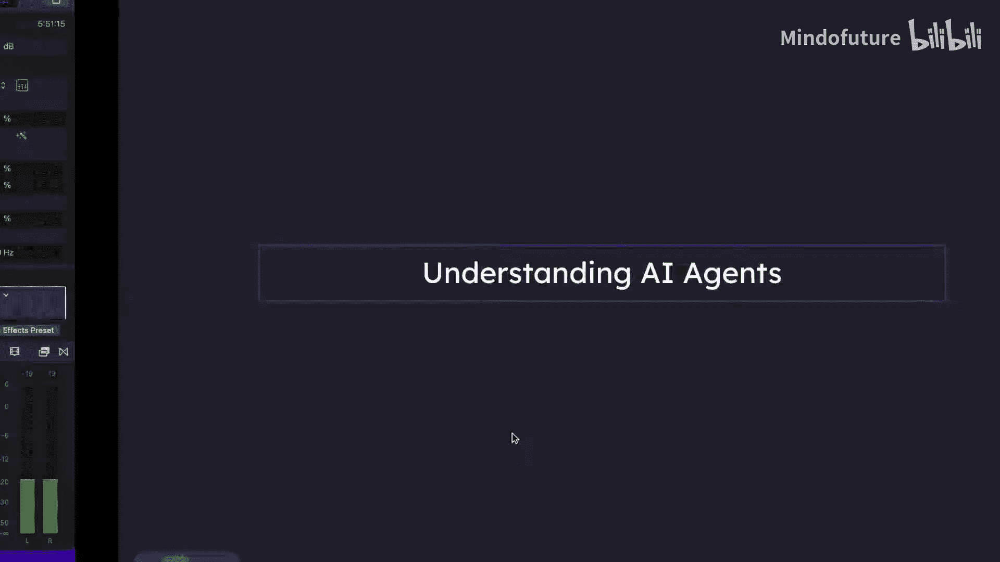
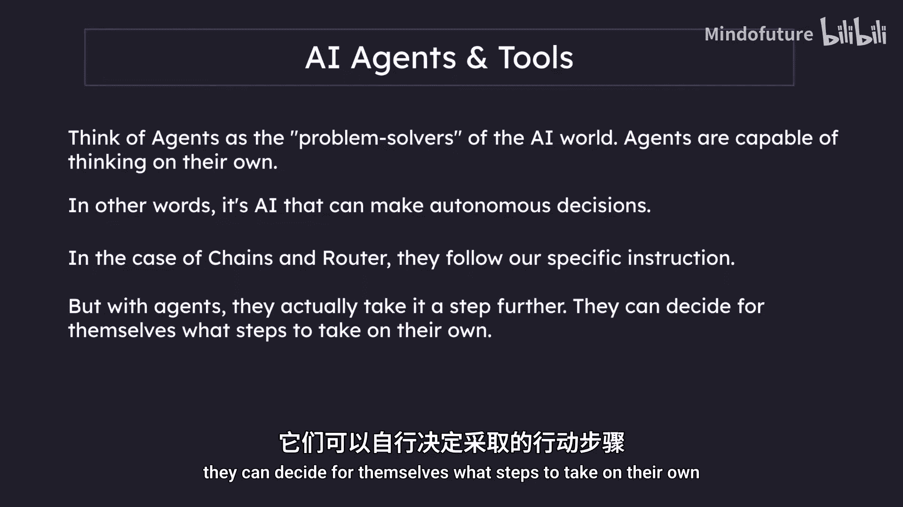
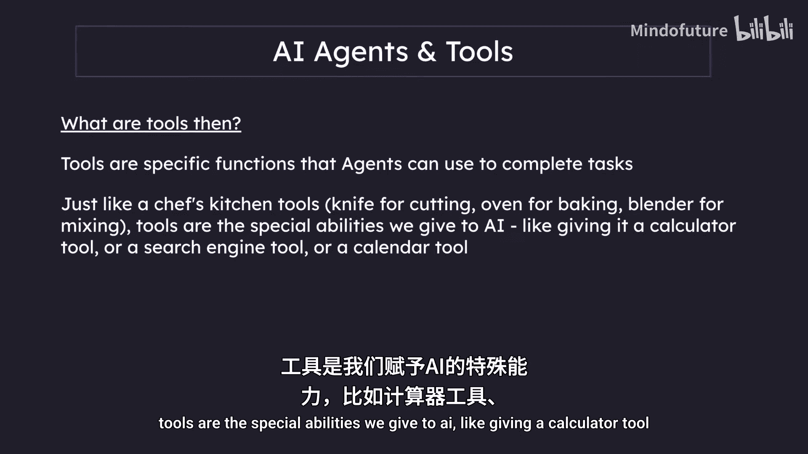
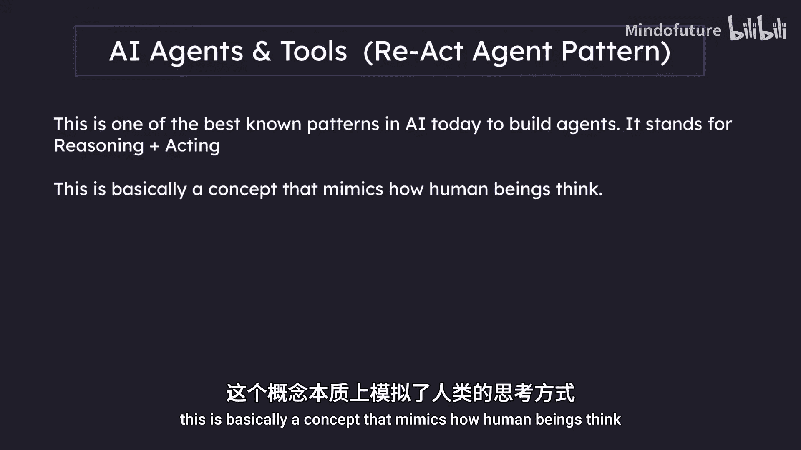
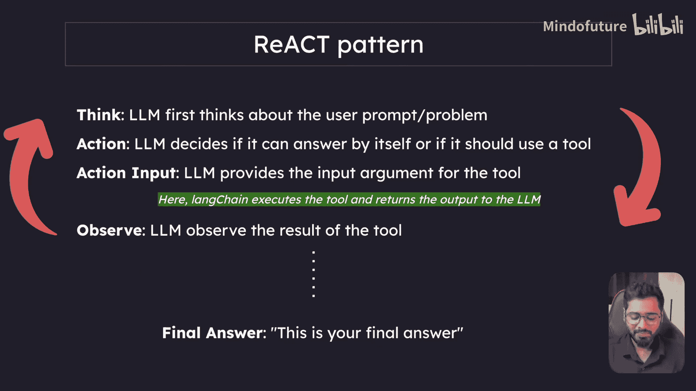
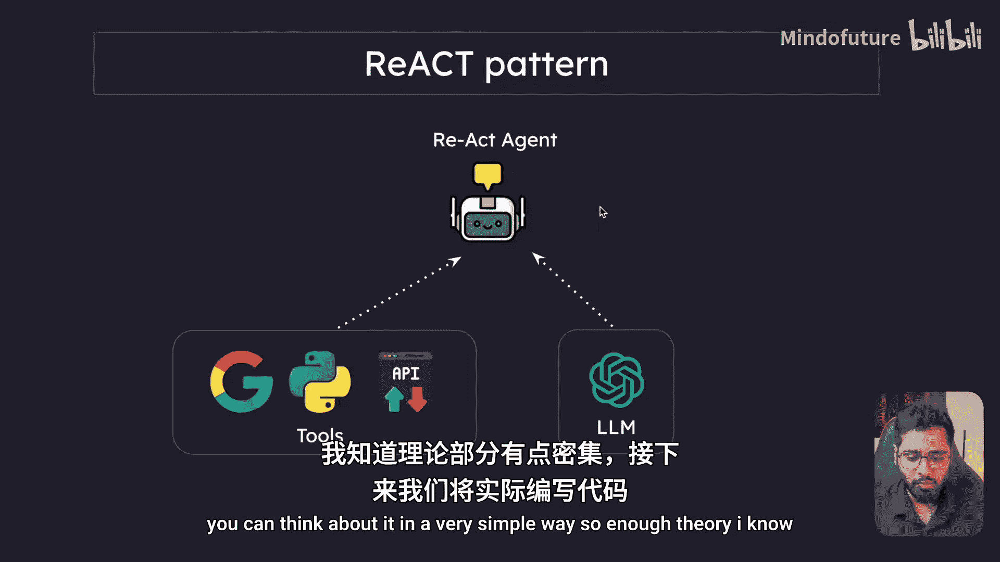
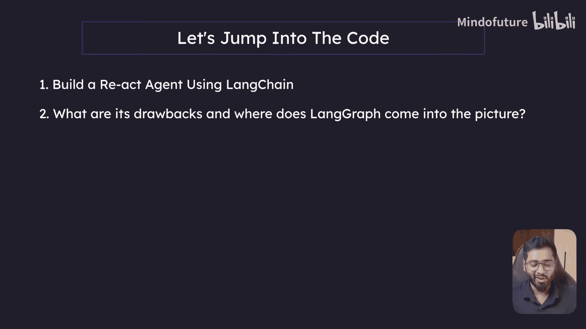

# 003：代理与工具介绍

在本节课中，我们将要学习 AI 领域中的核心概念：代理与工具。我们将了解什么是代理，什么是工具，以及它们如何协同工作来解决问题。课程的核心是深入探讨一个名为 ReAct 的流行代理构建模式，理解其工作原理。

## 什么是 AI 代理？🤖

上一节我们介绍了链和路由器的概念，本节中我们来看看更高级的 AI 代理。

你可以将代理视为 AI 世界中的问题解决者。代理能够独立思考。换句话说，它是可以自主做出决策的 AI。链和路由器遵循我们设定的特定指令，但代理更进一步，它们可以自行决定采取哪些步骤。

## 什么是工具？🔧

那么工具是什么呢？工具是代理可以用来完成任务的具体函数。

就像厨师的厨房工具一样，刀用于切割，烤箱用于烘烤，搅拌机用于混合。工具是我们赋予 AI 的特殊能力，例如给它一个计算器工具、搜索引擎工具或日历工具。

## ReAct 代理模式详解 🔄

现在，我们来看看如何实际创建一个代理。让我们了解一个用于创建 AI 代理的非常流行的模式，这个模式叫做 ReAct 代理模式。

这是当今构建代理最著名的模式之一。它代表“推理”加“行动”。这个概念基本上模仿了人类的思考方式。

让我们具体看看这个模式是关于什么的。

这个模式基本上是在模仿人类的思考方式。例如，当我们面对一个特定问题时，首先会思考这个问题。我们思考如何解决它，问题到底是什么。我们识别出问题，然后确定必须采取什么行动来解决那个特定问题。所以，首先是思考发生，这就是为什么这里有“思考”步骤。然后我们必须采取行动来解决那个特定问题，这就是为什么有“行动”步骤。接下来会发生什么？我们采取一些行动，然后观察那个特定行动的结果。它是否解决了问题？是否给出了其他答案？我们实际上就是在做观察。这就是为什么这里有“观察”步骤。我们人类观察其结果，然后根据需要进行调整。如果我们得到了答案，循环就结束了。但如果我们没有得到答案，我们会再次思考发生了什么。这就是为什么我们有“思考 -> 行动 -> 观察 -> 思考 -> 行动 -> 观察”的循环，直到得到最终答案。

让我们一步步来看：

1.  **思考**：LLM 首先思考用户的提示或问题。
2.  **行动**：LLM 决定是自己回答，还是应该使用特定的工具。
3.  **行动输入**：如果有一个特定的工具可供该代理用来解决那个特定问题，你可以把它想象成一个 Python 函数。任何函数都需要一些参数，一些输入。这就是行动输入。LLM 为该特定工具提供输入参数。
4.  **工具执行**：现在控制流回到我们的系统。在这里，系统执行该工具，然后将输出返回给 LLM。这基本上就像是 LLM 在思考并建议执行工具，但实际上它只是建议输入。控制流回到我们的系统，我们的系统函数用 LLM 建议的参数执行那个特定工具，然后该函数执行的输出再次发送回 LLM。
5.  **观察**：LLM 拥有之前发生的所有事情的完整上下文。所有的思考、行动、观察，所有上下文都对 LLM 可用。它实际上是在查看这个工具的输出。这就是观察：LLM 观察工具的输出。
6.  **循环判断**：如果输出表明已经足够，它已经找到了特定问题的答案，那么它就在这里结束。如果还有一些其他附加信息，或者这是一个复杂、多步骤的问题，那么将会发生另一个循环。这个循环将不断重复。

简而言之，这就是 ReAct 模式的全部内容。

## 代理的构成 🧠 + 🛠️

这里准备了另一个图表，以非常简单的方式帮助你可视化什么构成了一个代理。

基本上，LLM 的推理能力是其大脑。每当你为这个大脑配备一些工具时，比如让它能够进行 API 调用、进行谷歌搜索或运行 Python 函数，将两者结合起来就产生了一个代理。你可以用这种非常简单的方式来思考它。

理论部分已经足够，我知道内容有点密集。在接下来的几节中，我们将实际进行编码，这样你将能更好地理解事物是如何工作的。

## 课程安排与预告 📅

首先，我们将使用 LangChain 构建一个非常基础的 ReAct 代理。然后，我们将看看以这种方式做的缺点是什么。接着，我们将过渡到 LangGraph 是做什么的，以及它如何介入，它解决了什么问题。

本节课中我们一起学习了 AI 代理和工具的基本概念，深入剖析了 ReAct 代理模式的工作流程，并了解了代理如何通过结合 LLM 的推理能力和外部工具来解决问题。下一节，我们将开始动手实践。