# 004：代理与工具实现 🛠️

在本节课中，我们将学习如何使用 LangChain 从零开始构建一个 ReAct 智能体。这非常重要，因为它将构成后续课程的基础。之后，我们将使用 LangGraph 构建相同的功能，你将能轻松地看出两者的区别。

## 开发环境设置

首先，我们需要设置开发环境。我将创建一个名为 `langgraph` 的文件夹，并在 Visual Studio Code 中打开它。

接下来，创建一个虚拟环境来隔离项目依赖。我将使用 Python 内置的 `venv` 模块。

```bash
python3 -m venv venv
```

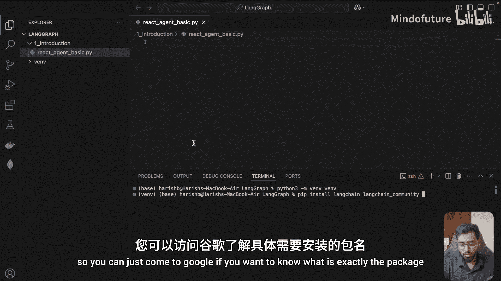

创建完成后，需要激活这个虚拟环境。

```bash
source venv/bin/activate
```

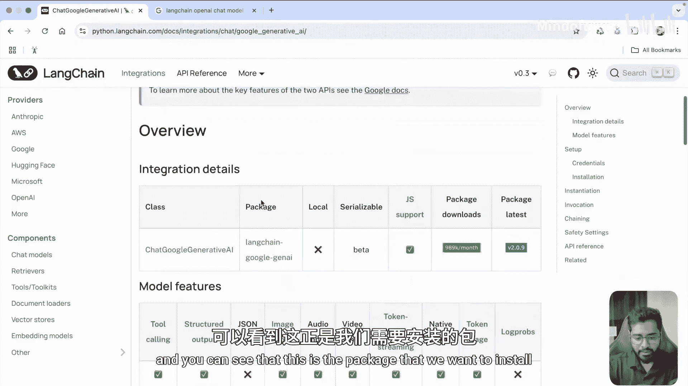

激活后，终端提示符前会出现 `(venv)` 标识。接着，创建一个名为 `1_introduction` 的文件夹，并在其中创建一个 Python 文件 `basic_react_agent.py`。

## 安装依赖

构建 ReAct 智能体需要安装一些必要的包。以下是所需的依赖项列表：

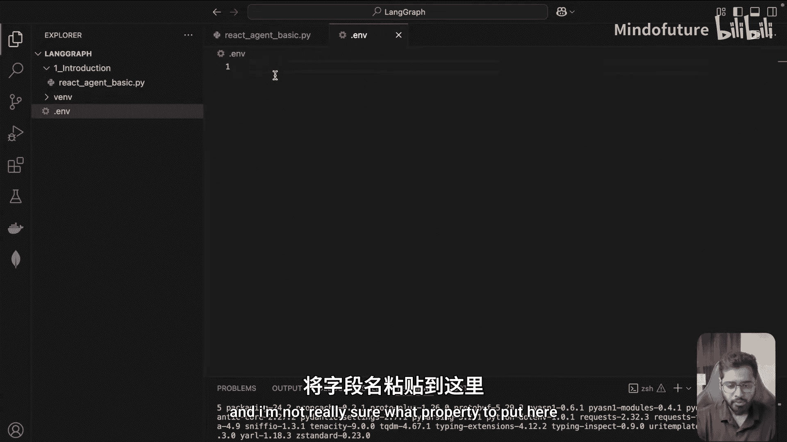

*   **langchain**: LangChain 核心库。
*   **langchain-community**: 包含许多预构建的工具。
*   **langchain-google-genai**: 用于调用 Google 的 Gemini 模型。
*   **python-dotenv**: 用于管理环境变量。

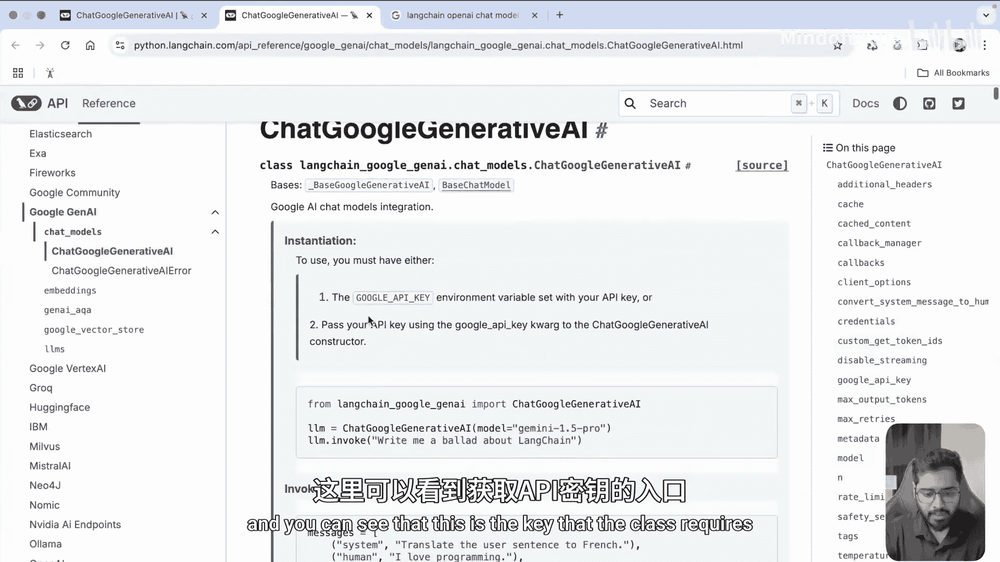

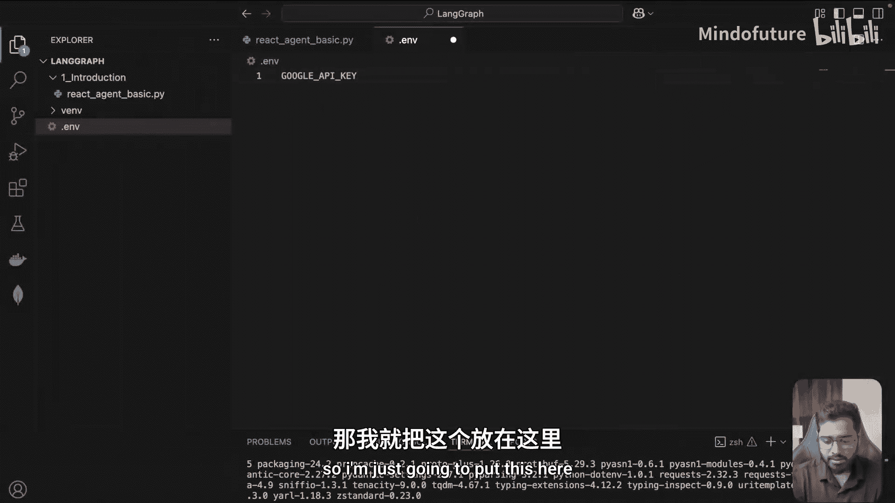

我们可以使用 pip 一次性安装它们。

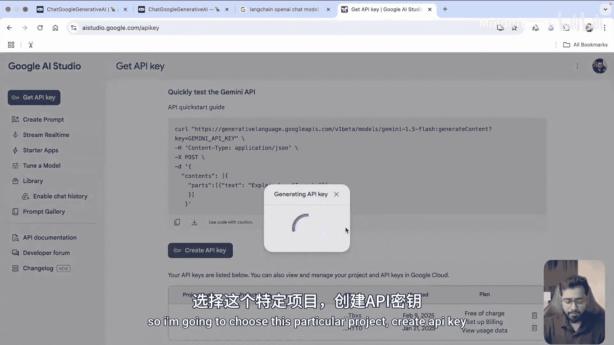

```bash
pip install langchain langchain-community langchain-google-genai python-dotenv
```

安装完成后，我们就可以开始编写代码了。

## 初始化聊天模型

首先，导入必要的模块并初始化一个聊天模型。我们将使用 Google 的 Gemini 模型，因为它是免费的，可以让更多人参与学习。

```python
from langchain_google_genai import ChatGoogleGenerativeAI
from dotenv import load_dotenv
import os

# 加载环境变量
load_dotenv()

# 初始化聊天模型
llm = ChatGoogleGenerativeAI(model="gemini-1.5-pro")
```

为了能让模型正常工作，我们需要一个 API 密钥。在项目根目录创建 `.env` 文件，并添加从 [Google AI Studio](https://aistudio.google.com/) 获取的密钥。

```env
GOOGLE_API_KEY=你的_API_密钥
```

现在，我们可以测试模型是否能正常工作。

```python
# 测试模型调用
result = llm.invoke("Give me a fact about cats.")
print(result.content)
```

运行文件，如果看到关于猫的事实输出，说明环境配置成功。

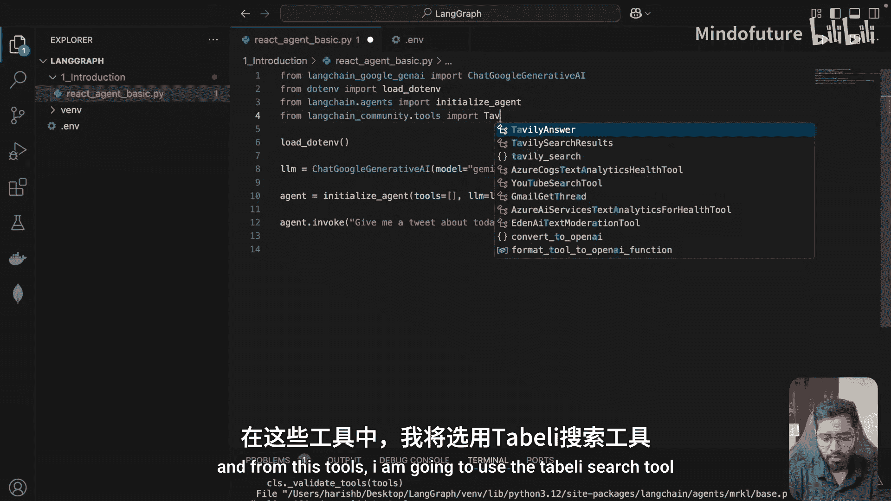

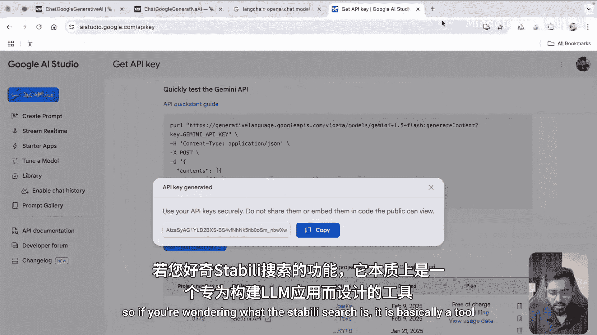

## 理解智能体的必要性

大型语言模型（LLM）本身是“大脑”，但它无法直接访问实时信息（如天气）或执行特定功能（如计算）。为了演示这一点，我们让模型回答一个它无法独立完成的问题。

```python
result = llm.invoke("Give me a tweet about today's weather in Bangalore.")
print(result.content)
```

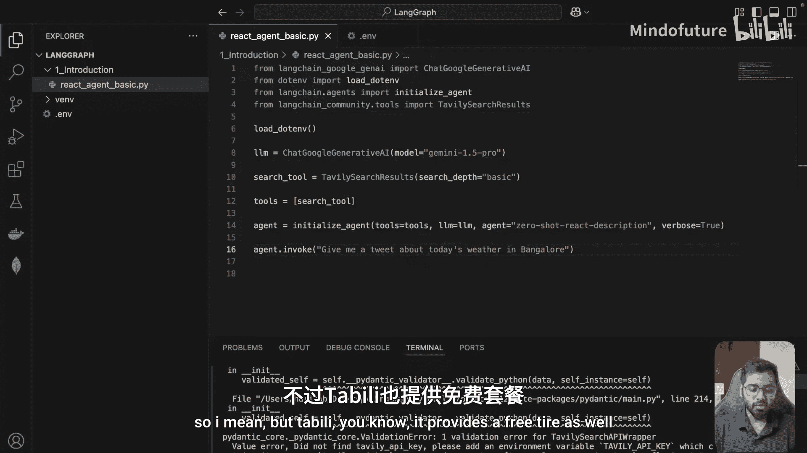

运行后，你会发现模型的回答是模糊的、带有占位符的，甚至是“幻觉”出来的，因为它没有真实数据。这正是我们需要为 LLM 配备“工具”（Tools）的原因，让它能够调用外部函数获取准确信息。

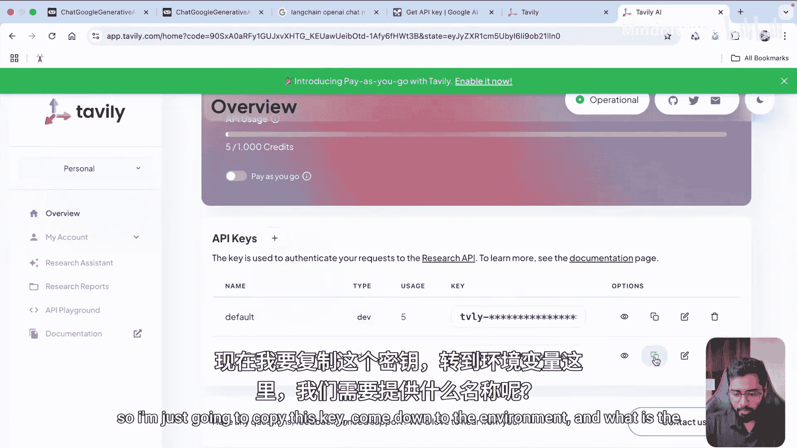

## 构建第一个 ReAct 智能体

接下来，我们将使用 LangChain 提供的便捷方法 `initialize_agent` 来创建一个智能体。智能体结合了 LLM 的推理能力和工具的执行能力。

首先，我们需要一个工具。我们将使用 `langchain-community` 中预构建的 `TavilySearchResults` 工具来进行网络搜索。

```python
from langchain.agents import initialize_agent
from langchain_community.tools.tavily_search import TavilySearchResults

# 初始化搜索工具
search_tool = TavilySearchResults(search_depth="basic")

# 定义工具列表
tools = [search_tool]

# 创建智能体
agent = initialize_agent(
    tools=tools,
    llm=llm,
    agent_type="zero-shot-react-description", # 使用 ReAct 范式
    verbose=True # 打印详细执行过程
)
```

`TavilySearchResults` 工具需要一个 API 密钥。请前往 [Tavily 网站](https://tavily.com/) 注册并获取免费密钥，然后将其添加到 `.env` 文件中。

```env
TAVILY_API_KEY=你的_Tavily_API_密钥
```

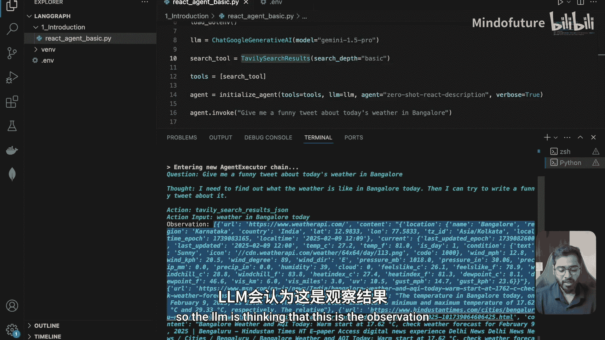

现在，我们可以用同样的问题来运行智能体。

```python
# 运行智能体
agent.invoke("Give me a funny tweet about today's weather in Bangalore.")
```

运行代码，你将在终端看到详细的执行步骤。这正是 **ReAct（思考-行动-观察）** 范式的体现：

1.  **思考**: LLM 分析问题，决定第一步需要做什么（查询天气）。
2.  **行动**: LLM 选择要使用的工具（`TavilySearchResults`）并生成输入参数（“weather in Bangalore today”）。
3.  **观察**: LangChain 框架接管，执行工具，并将工具返回的真实天气结果返回给 LLM。
4.  **循环**: LLM 根据观察结果进行下一轮思考，最终生成基于真实数据的、有趣的推文。

这个过程的关键在于：当 LLM 输出特定的“行动”指令时，控制权会从 LLM **交还给 LangChain 框架**，由框架来执行具体的工具函数，然后将结果作为“观察”反馈给 LLM，从而形成闭环。

## 探索 ReAct 提示词

你可能好奇“思考-行动-观察”这个结构是如何实现的。这本质上是一种精心设计的提示词（Prompt）技术。`initialize_agent` 方法内部使用了一个标准的 ReAct 提示词模板。你可以在 [LangChain Hub](https://smith.langchain.com/hub/hwchase17/react) 上查看这个模板。该模板明确规定了 LLM 输出的格式，并提供了一个“思维便笺”来记录历史交互，确保上下文连贯。

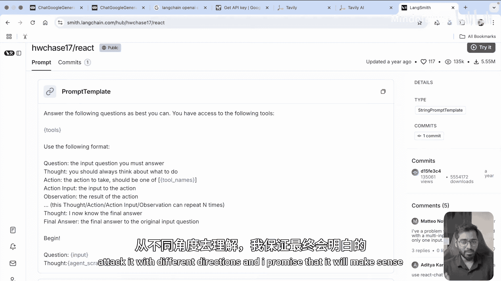

## 为智能体添加自定义工具

单一的工具有时不足以解决复杂问题。让我们挑战一下智能体，问一个需要结合多种信息的问题。

```python
agent.invoke("When was SpaceX's last launch and how many days ago was that from now?")
```

运行后，你会发现智能体虽然能搜索到发射日期，但无法计算距离今天的天数，因为它缺少获取当前时间的工具。它可能会“幻觉”出一个不存在的工具，导致陷入无效循环。

为了解决这个问题，我们需要为智能体添加一个获取当前系统时间的**自定义工具**。

以下是创建自定义工具的方法：

```python
from langchain.tools import tool
from datetime import datetime

@tool
def get_system_time(format: str = "%Y-%m-%d %H:%M:%S") -> str:
    """Returns the current system date and time in the specified format."""
    current_time = datetime.now().strftime(format)
    return current_time

# 更新工具列表，包含搜索工具和自定义时间工具
tools = [search_tool, get_system_time]

# 重新初始化智能体
agent = initialize_agent(
    tools=tools,
    llm=llm,
    agent_type="zero-shot-react-description",
    verbose=True
)
```

使用 `@tool` 装饰器可以将一个普通 Python 函数转换为 LangChain 智能体能识别的工具。LLM 会根据工具的函数描述和参数定义，智能地决定如何调用它。

现在再次运行关于 SpaceX 发射日期的问题。

```python
agent.invoke("When was SpaceX's last launch and how many days ago was that from now?")
```

这次，智能体会先使用搜索工具找到发射日期，然后智能地调用 `get_system_time` 工具获取当前日期（它甚至能判断只需要年月日），最后在“大脑”中计算出天数差，给出一个准确且基于现实的答案。

## 总结

本节课中，我们一起学习了 ReAct 智能体的核心概念与实现：

1.  **环境搭建**：我们建立了虚拟环境并安装了必要的 LangChain 依赖。
2.  **模型测试**：我们初始化了 Gemini 聊天模型，并理解了 LLM 在获取实时信息方面的局限性。
3.  **智能体构建**：我们使用 `initialize_agent` 快速创建了一个 ReAct 智能体，并为其添加了预构建的网络搜索工具。
4.  **核心机制**：我们深入观察了 **“思考-行动-观察”** 的执行循环，理解了控制权如何在 LLM 和 LangChain 框架之间切换。
5.  **工具扩展**：我们动手编写了一个自定义工具（获取系统时间），并看到智能体如何协同使用多个工具来解决复杂问题。

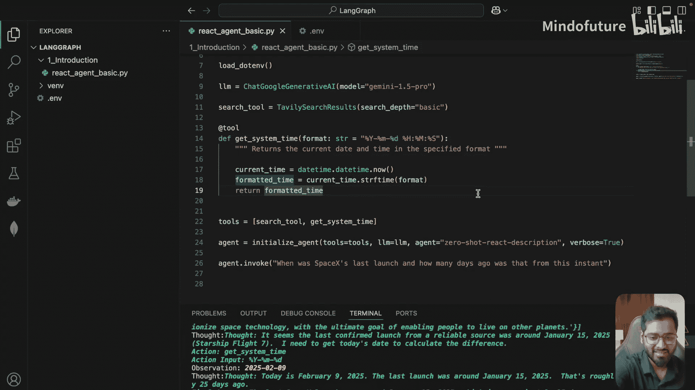

通过本节，你已经掌握了使用 LangChain 构建基础智能体的能力。然而，传统的 ReAct 智能体也存在一些缺点，例如在工具缺失时容易陷入循环、状态管理复杂等。在下一节中，我们将探讨这些缺点，并看看 LangGraph 是如何以一种更优雅、更强大的方式来解决这些问题的。