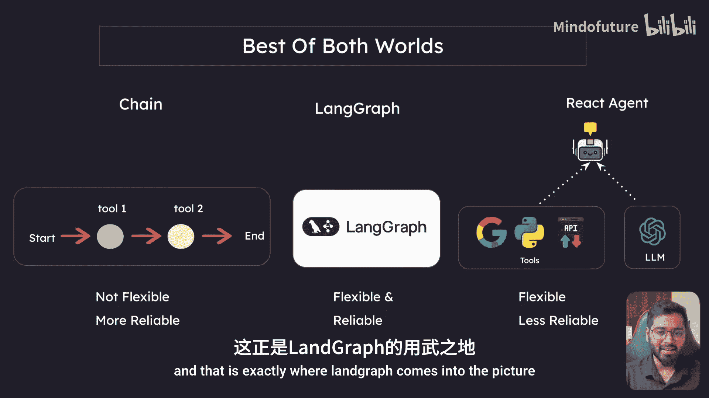
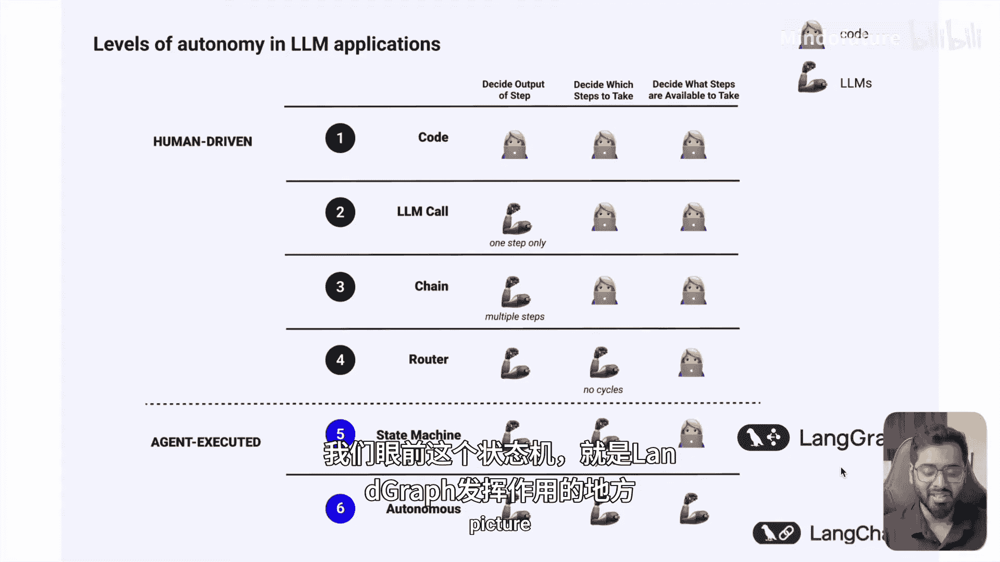
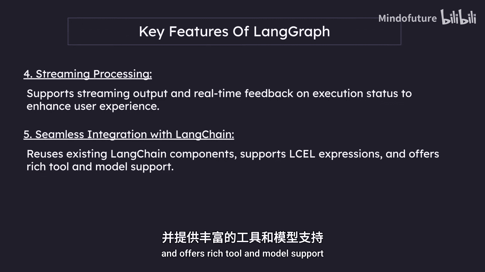
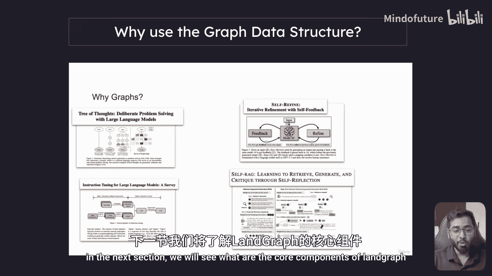
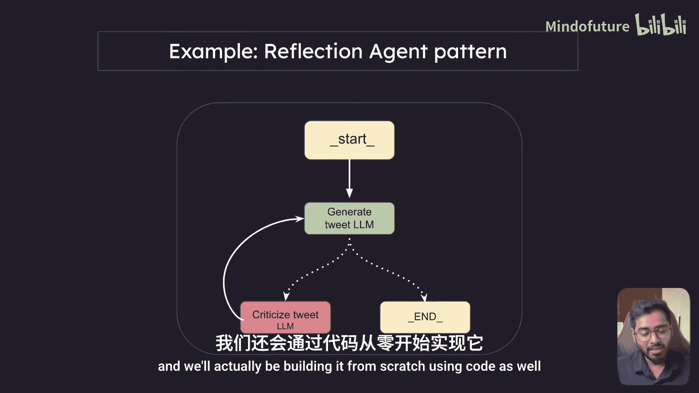

# 005：ReAct 代理的缺点与 LangGraph 的引入 🧠

在本节课中，我们将学习 ReAct 代理的局限性，并了解 LangGraph 框架如何解决这些问题，为构建更可靠的智能体工作流奠定基础。

## 概述

上一节我们使用 LangChain 构建了一个 ReAct 代理。本节中，我们将探讨使用 ReAct 代理的缺点，并了解 LangGraph 框架在何处发挥作用。

## ReAct 代理的优势与缺点

### 优势：灵活性

ReAct 代理非常灵活，可以处理任何可能的状态。这意味着执行流程不是固定的。

以下是执行流程的几种可能性：
*   从开始执行，如果第一个工具能解决问题，则直接结束。
*   执行特定工具来解决问题，然后结束。
*   工具一先执行，工具二后执行。
*   工具二先执行，工具一后执行。

在上一节的例子中，代理先使用了网络搜索工具，然后查询了当前时间。它也可能先查询当前时间，再进行网络搜索。这体现了 ReAct 代理的高度灵活性。

### 缺点：可靠性问题

然而，高灵活性也可能意味着低可靠性。我们之前也看到了一个例子：工具被反复调用，陷入无限循环。幸运的是，Google Gemini 模型最终停止了它。但无限循环确实是 ReAct 代理的一个大问题。





这种情况可能由几个原因导致：
*   工具定义不正确。
*   大语言模型能力不足。
*   提示词没有定义清晰的结束条件。

## 两种范式的权衡

现在，我们一方面有链式结构，另一方面有 ReAct 代理。

*   **链式结构**：像一个固定的流水线，不够灵活，但更可靠。
*   **ReAct 代理**：非常灵活，但可靠性较低，因为它不完全在我们的控制之中。

因此，我们需要一个兼具两者优点的方案：既灵活又可靠。这正是 **LangGraph** 登场的地方。

## 什么是 LangGraph？



LangGraph 是一个用于构建可控、持久化智能体工作流的框架，内置了对人机交互、流式处理和状态管理的支持。它使用**图数据结构**来实现这一目标。

这是一个图数据结构的简单预览，展示了我们如何构建智能体：

```
开始节点 -> 代理节点 -> 行动 -> [循环/分支] -> 结束节点
```



我们有一个开始节点和一个代理节点。代理采取行动后，流程可以继续循环或分支，一旦到达终点则结束。目前你无需深入思考其细节，只需了解其基本结构即可。

## LangGraph 的关键特性

以下是 LangGraph 的一些核心特性：

**循环与分支能力**
它支持条件语句和循环结构，允许基于状态动态执行路径。

**状态持久化**
自动保存和管理状态，支持长时间运行对话的暂停与恢复。

**人机交互支持**
允许在执行过程中插入人工审核，支持状态编辑和修改，具有灵活的交互控制机制。

**流式处理**
支持流式输出和实时反馈执行状态，以提升用户体验。

**与 LangChain 无缝集成**
复用现有的 LangChain 组件，支持 LCEL 表达式语言，并提供丰富的工具和模型支持。

## 为什么使用图数据结构？

你可能会问，为什么使用图数据结构来构建 LangGraph？为什么不使用其他更简单的数据结构？

答案是，许多为解决复杂问题而发表的研究论文都使用了图数据结构。因为它既灵活又可控。它提供了很大的灵活性，但同时不会让智能体拥有过多的自主决策权，这种自主性被内置于数据结构本身之中。

## 核心组件简介

在下一节中，我们将深入探讨 LangGraph 的核心组件。为了帮助你理解，这里先给出一个简单的例子：**反思代理模式**。

这个模式包含一个生成组件和一个批评组件。一个代理负责生成推文，另一个代理负责批评该推文并提出改进建议。整个过程是迭代的：生成 -> 批评 -> 改进 -> 再生成，直到达到满意的效果。

通过这个例子，我们可以初步认识 LangGraph 的四个核心组件：
1.  **节点**：如图中的“开始”、“生成推文LLM”、“结束”等块。
2.  **边**：连接节点的线。
3.  **条件边**：基于条件决定下一步走向的边（在图中常用虚线表示）。
4.  **状态**：在整个图执行过程中需要维护的上下文信息。

## 总结



本节课我们一起学习了 ReAct 代理灵活但可能不可靠的缺点，并引出了旨在结合灵活性与可靠性的 LangGraph 框架。我们了解了 LangGraph 的定义、关键特性、使用图结构的原因，并通过一个“反思代理”的例子初步认识了其核心组件：节点、边、条件边和状态。在接下来的课程中，我们将深入探讨如何实际构建这样的智能体工作流。