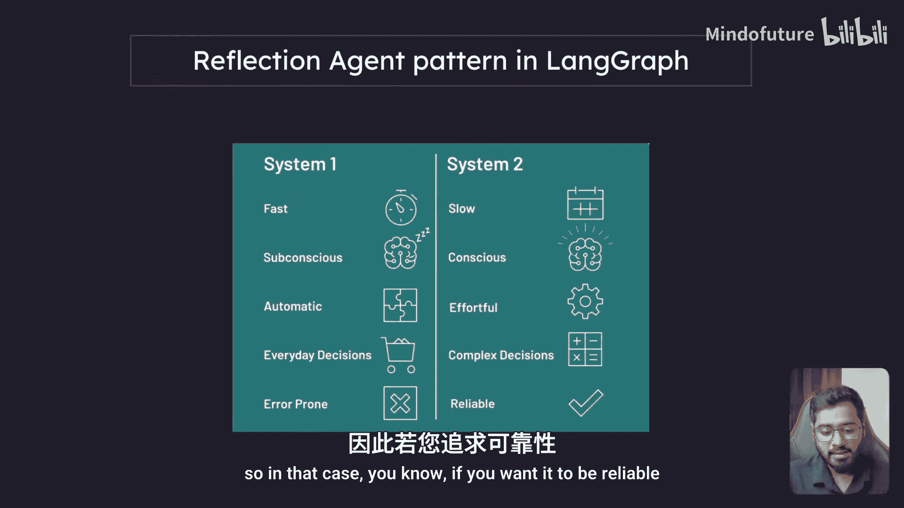
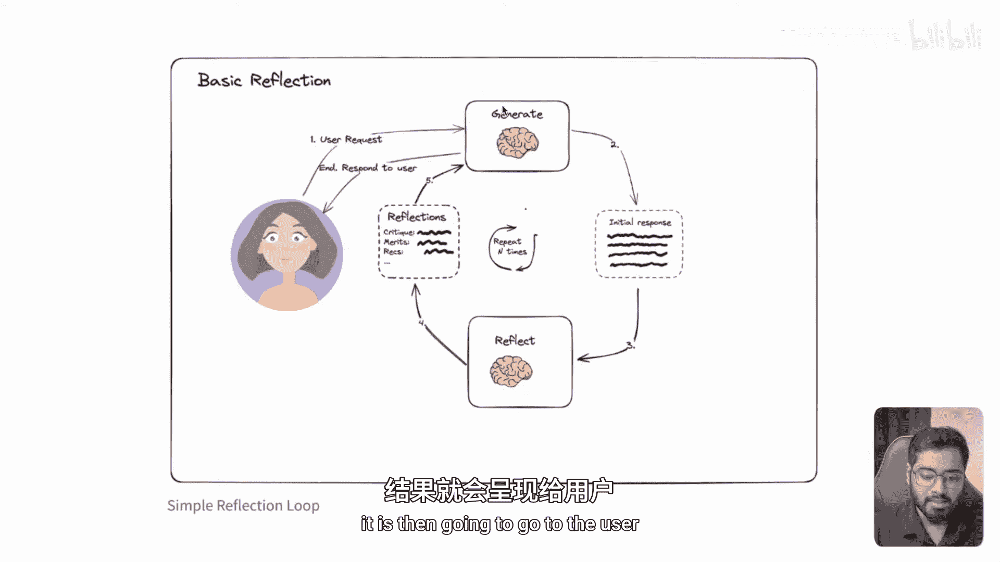
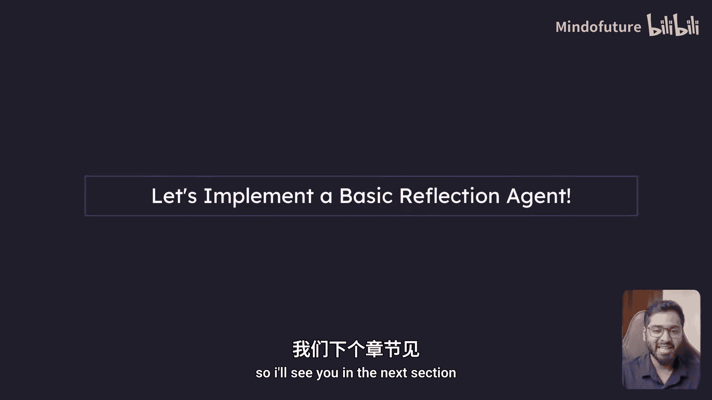

# 006：反思代理介绍 🧠

在本节课中，我们将深入学习 LangGraph 中的反思代理。这是学习 LangGraph 的重要起点，能帮助你理解某些代理的强大能力。本节我们将探讨什么是反思代理系统、三种反思代理类型，并进行必要的环境设置。最后，我们将通过代码实现一个基础的反思代理系统。通过本节及后续课程的学习，你将深刻理解反思代理的强大之处及其在实际工作流中的应用场景。

## 理解“反思”的概念

在深入代码实现之前，让我们先理解“反思”这个英文单词的含义。反思就像照镜子审视自己或自己的行为，即自我反思。例如，做完一场演示后思考其效果、写完邮件后重新阅读以确保清晰、做出决定后考虑其是否正确。简而言之，反思就是站在一面镜子前，思考过去的行为，并考虑如何能做得更好。

## 什么是反思代理模式？

现在我们已经理解了反思，接下来让我们深入了解什么是反思代理模式。

**反思代理模式**是一种人工智能系统模式，它能够审视自身的输出，进行思考并加以改进。这就像我们照镜子进行自我反思，从而让自己变得更好。

一个基础的反思代理系统通常由两部分组成：一个**生成器代理**和一个**反思器代理**。

## 基础反思代理系统示例

以下是一个我们将要构建的简单应用示意图，它是基础反思代理模式的一个绝佳例子。

如上图所示，每个反思代理模式都将包含一个生成代理和一个反思代理。我们将利用这种动态关系，来帮助我生成尽可能最佳的病毒式推文。

这是一个非常简单的图结构。我们从起始节点开始，首先经过**推文生成代理**。这是第一个代理，即生成代理。当推文生成代理根据我提供的主题生成一条推文后，会通过一个条件边进入**推文批评代理**。

推文批评代理的职责是审视特定的推文。其提示词大致如下：“你是一名推文批评家，你的任务是通过批评使推文更具病毒传播潜力。” 本质上，这个代理会查看推文并提供改进建议，例如：“这条推文太长，需要缩短”、“需要添加行动号召”、“需要增加吸引人的开头或钩子”、“需要添加这些话题标签”。就像评论家一样，它会对推文提出批评。

生成完成后，批评代理会进行批评，然后将批评意见反馈给生成代理。接着，推文生成代理根据批评意见改进推文，并再次发送给批评代理。这个循环会持续进行我们设定的次数（例如四、五或六次）。可以想象，随着每一次迭代，推文会变得越来越好，越来越接近一条极具传播力的病毒式推文。你甚至可以设想一个应用或产品，将此功能作为一项特性添加进去，你的客户一定会喜欢它。

## 系统一 vs. 系统二（反思模式）

LangGraph 官方文档提供了另一个例子来解释反思代理模式。

上图中，第一个系统（系统一）**并非**反思模式。系统二才是反思模式。让我们看看两者之间的区别。

**系统一**基本上是你通常使用 ChatGPT 或 Claude 的方式：你输入一个提示，例如“嘿，代理，你的职责是制作病毒式推文，请为我写一条关于[主题]的推文”。这是一个非常简单的提示，它会一次性完成。系统一的特点是：
*   **快速**
*   **潜意识**：并非主动深入思考，而是被动地运用其自身的推理能力来生成内容。
*   **自动**：适用于日常决策。
*   **容易出错**：由于没有深入思考，它可能有些容易出错。

而**系统二**，即我们感兴趣的反思代理模式，则有所不同：
*   **较慢**：考虑到我们有两个代理（一个生成，一个反思）在一个循环中协同工作以使推文更好，可以想象这个过程会比一次性提示慢一些。
*   **更有意识**：两个代理集体协作，思考更具主动性。
*   **更费力**：适用于复杂决策。在某些需要决策非常精确、不能仅凭潜意识而需要主动深入思考的情况下，如果你希望结果更可靠，就可以选择这种反思代理模式。

## LangGraph 中的反思代理类型

在 LangGraph 中，反思代理主要有三种类型：

1.  **基础反思代理**：我们在前面幻灯片中看到的那种，包含反思器代理和生成器代理协同工作。
2.  **反思代理**：在基础反思代理之上构建的类型。
3.  **语言代理树搜索（LATS）**。

我们首先需要熟练掌握第一种**基础反思代理**，这样学习其他类型就会变得非常简单。

## 下一步：代码实现

接下来，让我们开始使用 LangGraph 实现一个基础反思代理。我们下一节再见。

## 总结

本节课我们一起学习了反思代理的核心概念。我们首先理解了“反思”的含义，然后探讨了**反思代理模式**——一种能够自我审视并改进输出的人工智能系统。我们分析了一个由生成器和反思器代理组成的**基础反思代理系统**示例，并对比了快速但可能出错的“系统一”与较慢但更可靠、适用于复杂任务的“系统二”（反思模式）。最后，我们简要介绍了 LangGraph 中三种反思代理的类型，并明确了接下来将通过代码实现基础反思代理的目标。