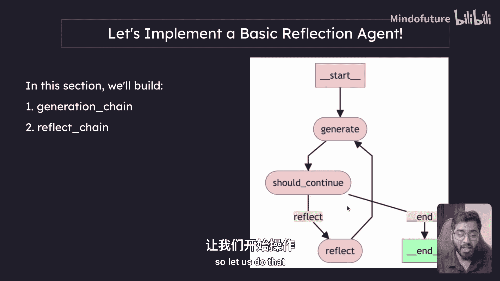
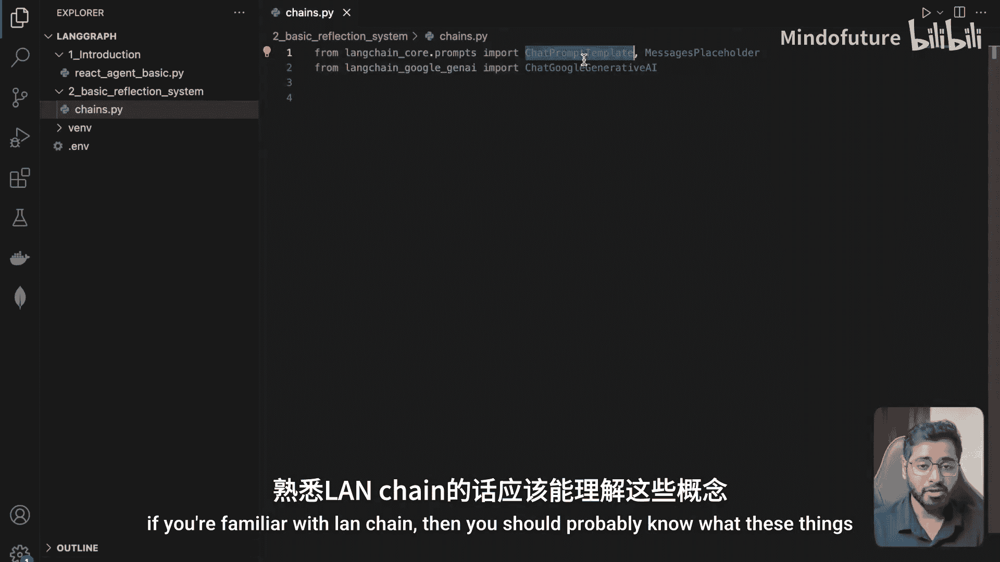
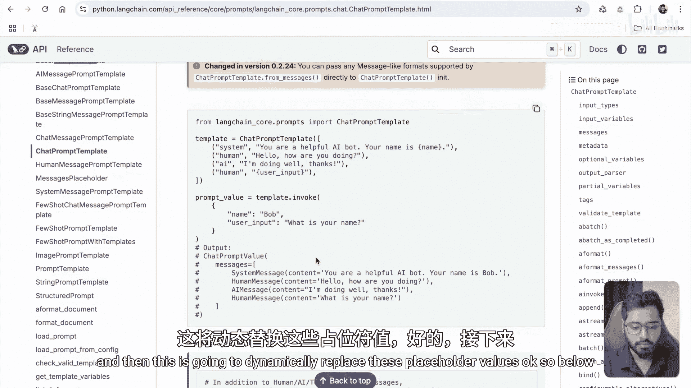
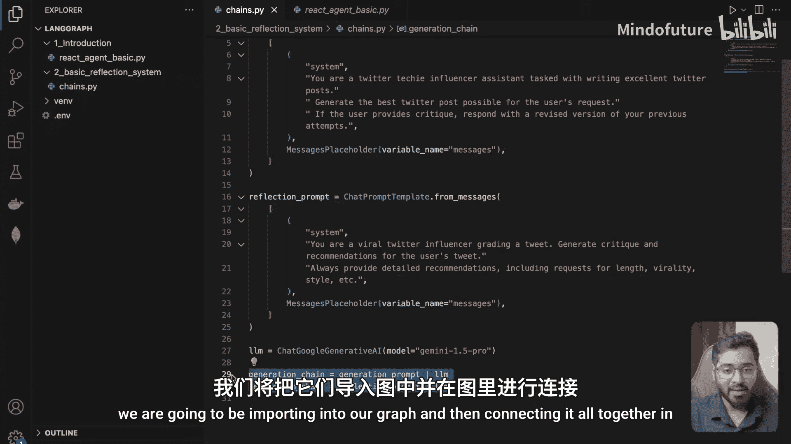

# 007：创建反思代理链

在本节课中，我们将学习如何使用LangGraph构建一个基础的反思代理。这是本系列课程中首次实际接触LangGraph的部分。我们将创建一个包含生成节点和反思节点的系统，并通过条件判断来控制流程的迭代。

## 概述

我们将构建一个能够生成推特帖子的代理。该代理包含一个生成链和一个反思链。生成链负责根据用户请求创建初始推文，而反思链则负责对生成的推文进行批判并提供改进建议。系统将允许进行最多四次迭代，每次反思后，生成链会根据反馈修订其输出。



## 构建生成链与反思链

上一节我们介绍了项目的整体结构，本节中我们来看看如何具体构建生成链和反思链。我们将在一个独立的文件中创建这两个链，以便后续导入到LangGraph图中使用。

首先，我们导入了必要的组件：`ChatPromptTemplate` 和 `MessagesPlaceholder`。`ChatPromptTemplate` 用于创建可动态填充内容的提示模板。

以下是生成链的提示模板。它的系统消息定义了代理的角色和任务。



```python
generation_prompt = ChatPromptTemplate.from_messages([
    ("system", "你是一位推特科技网红助手，负责撰写优秀的推特帖子。根据用户的请求生成最佳的推特帖子。如果用户提供了批评意见，请根据你之前的尝试给出修订版本。"),
    MessagesPlaceholder(variable_name="messages")
])
```



这个生成系统的主要任务是生成一条推文。如果另一个代理（即反思链）提供了批评，它则需要根据之前的尝试给出修订版本。`MessagesPlaceholder` 用于在运行时动态插入对话历史消息。

接下来，我们创建反思链的提示模板。反思代理的工作是审视生成的推文并提出改进建议。

```python
reflection_prompt = ChatPromptTemplate.from_messages([
    ("system", "你是一位病毒式传播的推特网红，正在创作一条推文。为用户生成的推文提供批评和建议。始终提供详细的建议，包括对长度、传播性、风格等方面的要求。"),
    MessagesPlaceholder(variable_name="messages")
])
```

反思提示的任务是通过批评来优化推文，例如指出不足之处并提供具体的改进方向。

现在，让我们基于这些提示模板创建可执行的链。我们将使用相同的语言模型，并通过LangChain表达式语言（LCEL）来构建链。

以下是创建生成链和反思链的代码：

```python
# 假设已初始化语言模型 llm
generation_chain = generation_prompt | llm
reflection_chain = reflection_prompt | llm
```

我们创建了两个独立的链：`generation_chain` 和 `reflection_chain`。它们现在已准备就绪，可以导出并在我们的LangGraph图中使用。

## 总结

本节课中我们一起学习了如何为反思代理构建核心组件。我们创建了两个链：
1.  **生成链**：负责根据用户请求或反馈生成或修订推特帖子。
2.  **反思链**：负责对生成的帖子进行批判性分析并提供详细的改进建议。



在下一节中，我们将把这些链集成到LangGraph图中，并构建完整的、带有条件判断和迭代循环的反思代理工作流。