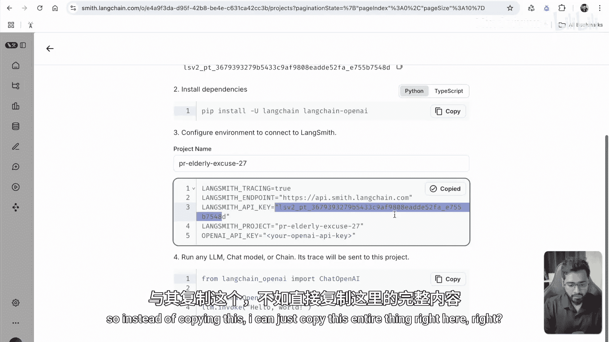
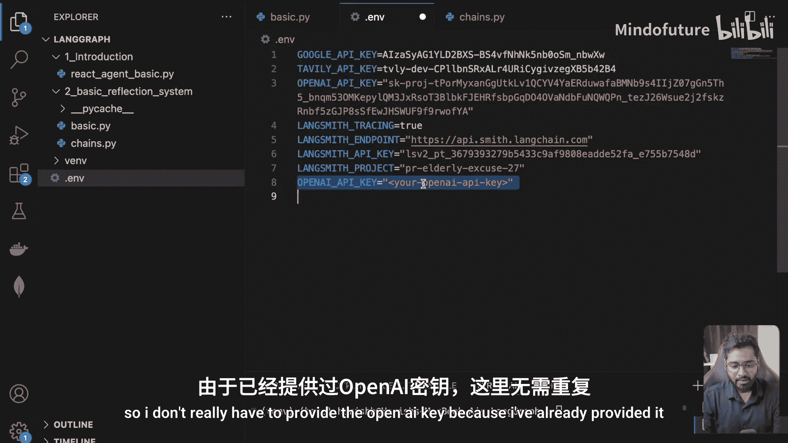
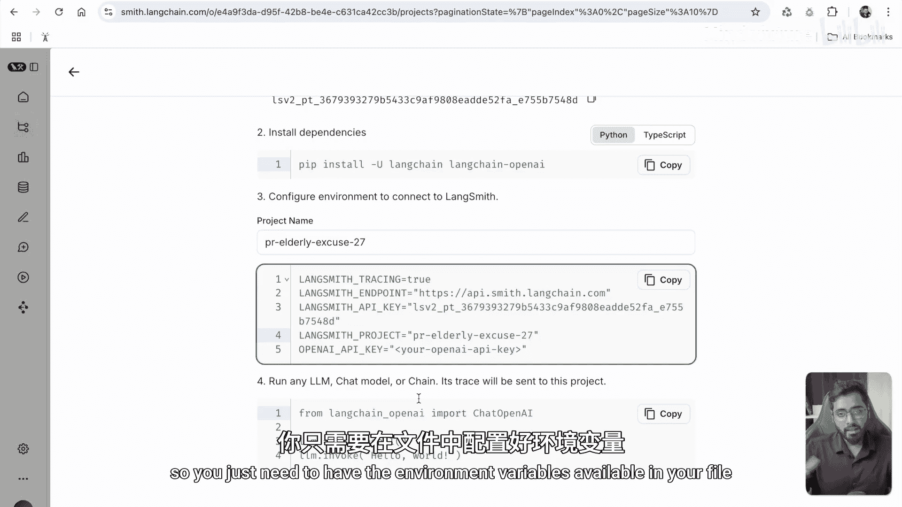
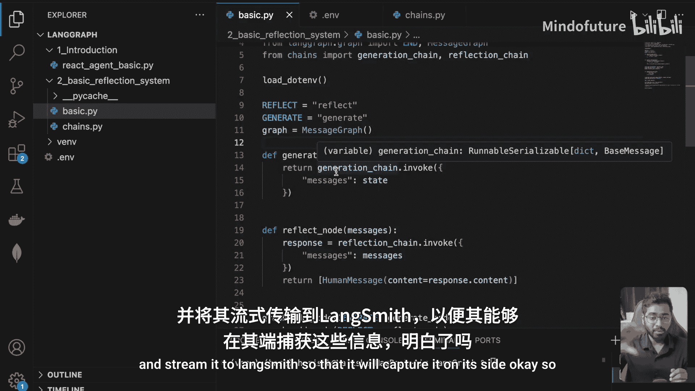
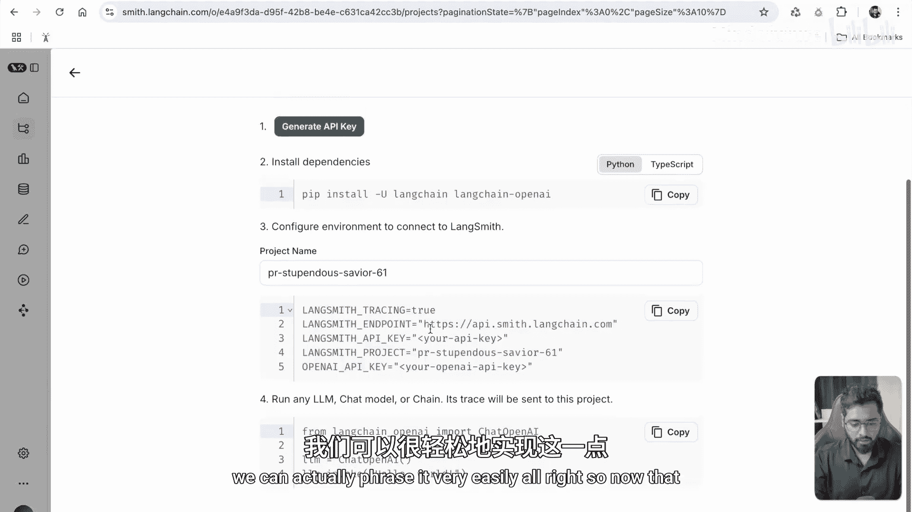
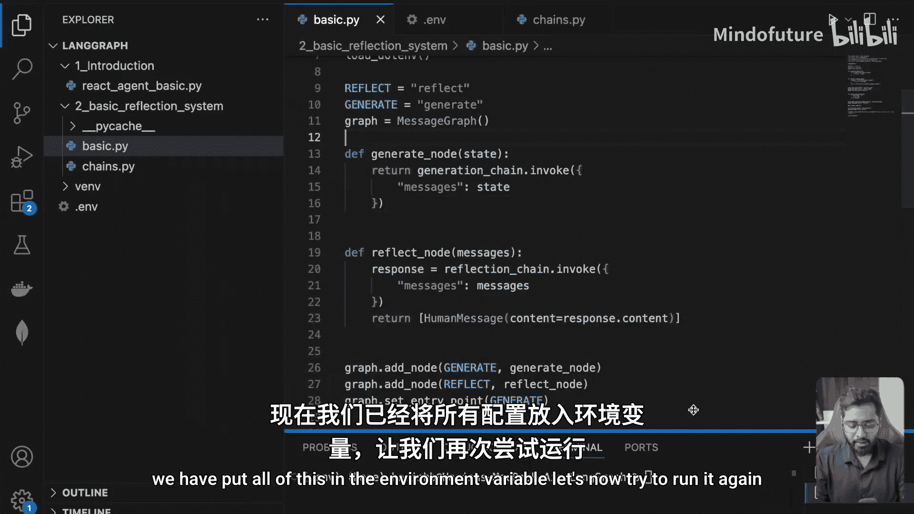
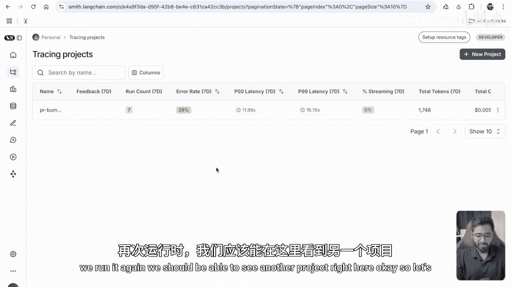
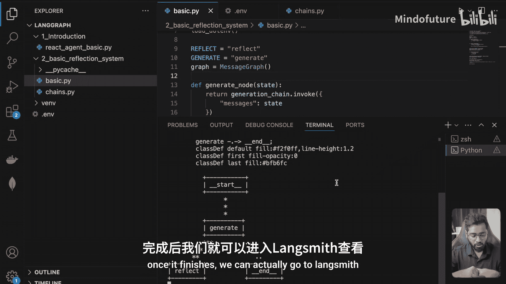
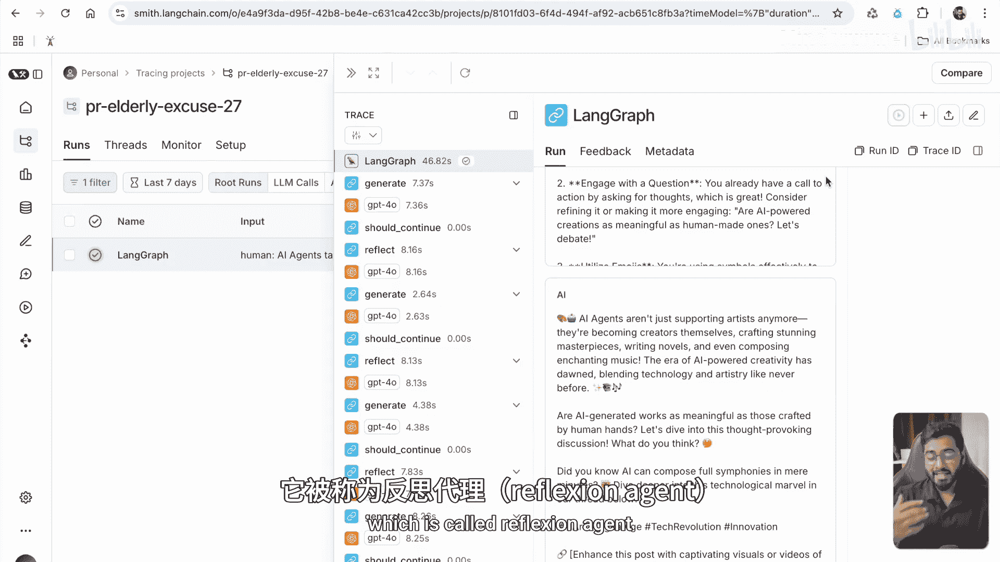

# 009：使用LangSmith追踪反思代理系统 🕵️

在本节课中，我们将学习如何为之前构建的反思代理系统配置并启用LangSmith追踪。通过追踪，我们可以清晰地看到生成代理和反思代理是如何协同工作，一步步迭代并最终产出一个精炼的病毒式推文的。

## 概述与准备工作

上一节我们构建了一个反思代理系统。本节中，我们来看看如何利用LangSmith来追踪这个系统的运行过程，以便深入理解其内部工作机制。

首先，我们需要访问LangSmith网站并获取API密钥。

以下是配置步骤：

1.  访问 `smith.langchain.com` 网站。
2.  如果尚未拥有账户，请先创建一个。
3.  登录后，进入“Tracing”下的“Projects”页面。
4.  点击创建新项目，并选择与你的环境（例如“Local”）关联。
5.  在项目设置中，生成一个API密钥。

获取API密钥后，需要将其设置到你的环境变量文件中。

你可以复制整个环境变量设置字符串。

然后，回到你的项目环境文件（如 `.env` 文件），将复制的字符串粘贴进去。由于OpenAI密钥已提前配置，此处无需重复提供。确保其他必要的环境变量也已正确设置。

LangChain对LangSmith有原生支持，因为它们同属一个技术生态。一旦在你的文件中正确配置了LangSmith的环境变量，系统在运行过程中就会自动将每一步操作记录并流式传输到LangSmith平台。

## 运行系统并查看追踪

完成配置后，现在让我们重新运行反思代理系统。

系统运行时，会经历多次迭代。每次操作（无论是生成还是反思）都会向LangSmith发送调用记录。稍等片刻，待运行完成。

运行结束后，返回LangSmith网站并刷新项目页面。你应该能看到一个当天新生成的追踪项目。

在项目中，我们主要关注“Runs”。“Runs”代表从开始到结束运行一次的完整应用流程。点击一个具体的“Run”，可以查看其详细的“Traces”（追踪轨迹）。“Traces”提供了系统中每个独立组件的更描述性信息。

在追踪概览顶部，可以看到整个流程的总耗时。我们可以展开查看其中不同的步骤。

## 分析追踪结果

追踪结果清晰地展示了生成代理和反思代理的协作过程。

首先，用户提供了初始指令（Human Message）。接着，生成代理（AI）根据指令产生了第一版推文。

随后，反思代理（另一个AI）开始工作。它并非人类，其任务是批判性地审视第一版推文。它会给出诸如“你的推文涉及了一个有趣且高度相关的话题，但为了最大化其影响力和传播性，请考虑：扩展背景、用提问引发互动、使用表情符号、优化话题标签、创建推文线程、添加媒体内容”等反馈。其核心目标是让推文更具启发性和信息量。

收到反馈后，控制权交回生成链。生成代理会基于收到的所有反馈，生成一个全新的修订版推文。

然后，反思代理会再次审视这个新版本，并提出更多优化建议。生成代理据此进行进一步改进。

这个“生成 -> 反思 -> 再生成”的循环会进行多次（例如6次交换），直到最终产出一个高度精炼的结果。

最终，我们得到了一条包含表情符号、话题标签、经过深思熟虑的病毒式推文。这模拟了现实世界中通过多次迭代优化内容的过程。

## 系统工作流程总结

整个系统的工作流程可以概括为一个循环：

1.  **生成节点**：根据当前上下文（初始指令或上一轮反馈）生成内容。
2.  **反思节点**：对生成的内容进行批判性评估并提出改进建议。
3.  流程回到第1步，生成节点结合所有历史上下文（包括多次反馈）再次生成。

这个循环反复进行，直到满足终止条件，输出最终结果。

## 课程总结

本节课中，我们一起学习了如何为LangGraph反思代理系统配置LangSmith追踪。通过分析追踪结果，我们清晰地看到了生成代理与反思代理之间多轮迭代、协同工作的完整过程。这种“反思-生成”的机制非常强大，它使得AI能够对任务进行深度思考并持续优化输出。我们以生成推文为例，但你可以想象，这种方法可以应用于几乎任何复杂任务中。

希望你现在能理解反思代理的工作原理及其强大之处。如有任何疑问，欢迎在评论区提出。

在下一节，我们将探讨另一种类型的反思代理，称为“Reflexon Agent”，相信它会更加有趣。我们下节再见。