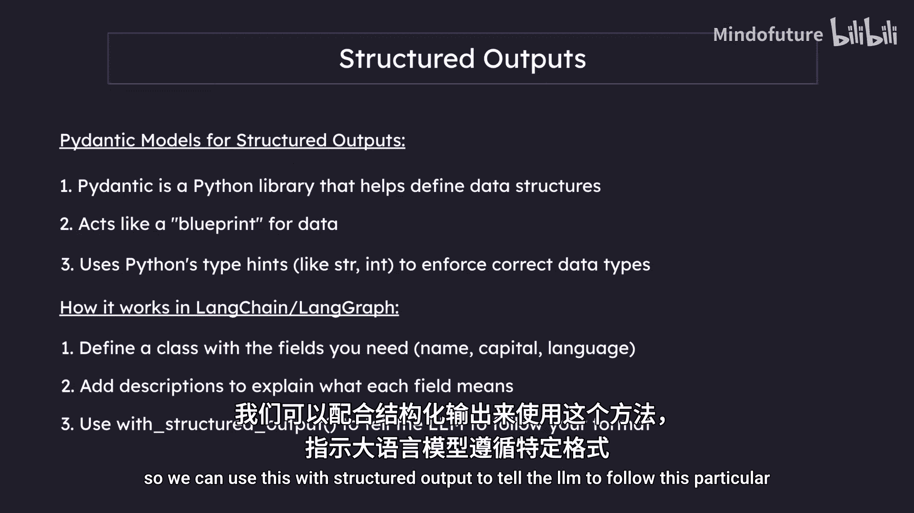
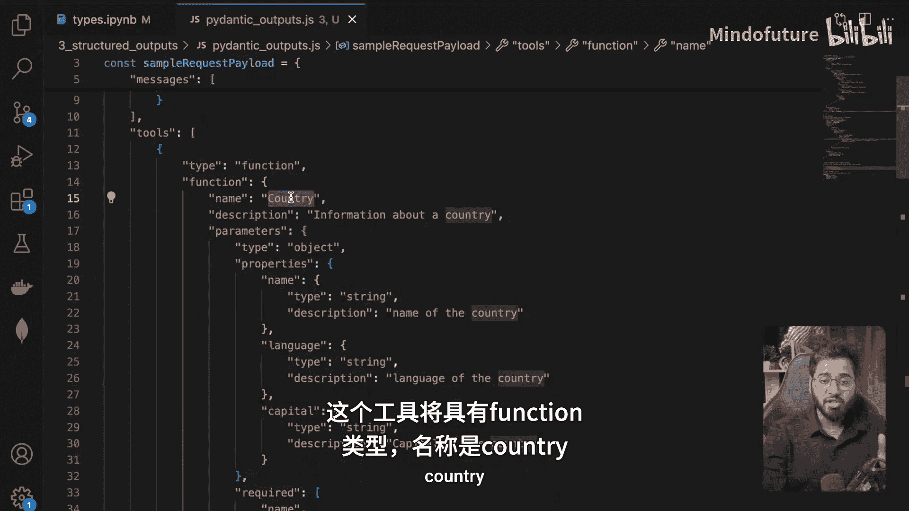
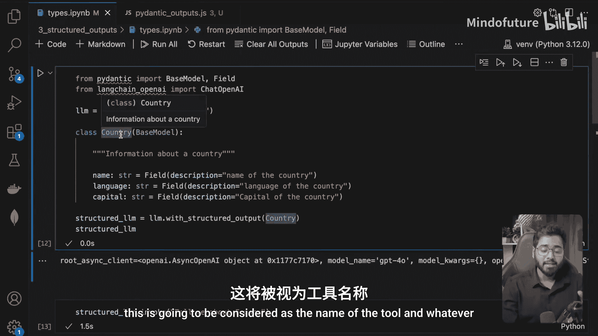
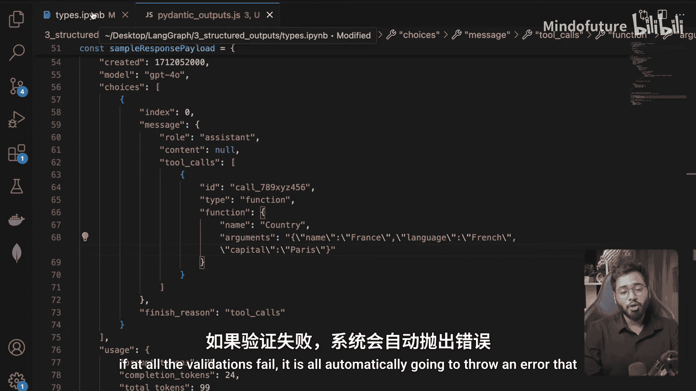
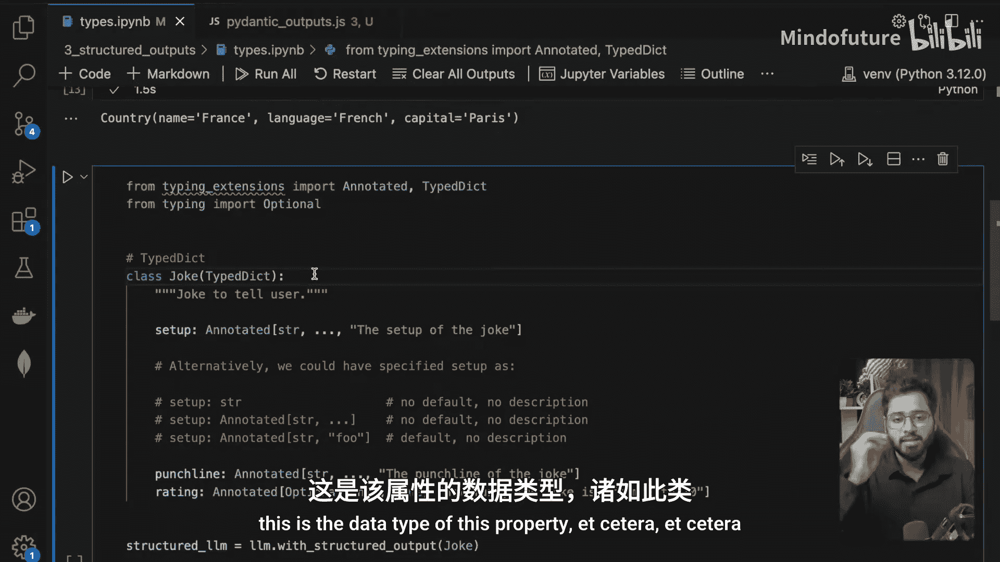
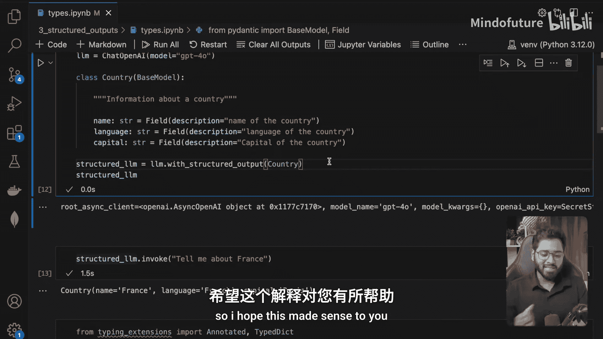

# 010：结构化 LLM 输出 🧱

在本节课中，我们将要学习如何从大型语言模型获取结构化的输出。这是构建复杂代理系统（如反思代理）前必须掌握的关键技能，因为它能确保我们得到格式统一、易于程序处理的数据。

---

## 概述：为何需要结构化输出？

在软件开发中，我们始终在与结构化数据打交道。无论是对象、JSON格式，还是数据库记录，数据都需要有明确的格式。然而，到目前为止，我们接触的LLM通常只返回随机的文本字符串，这不利于程序化处理。我们可以改变这一点，即要求LLM按照我们定义的特定格式（如JSON）来返回数据。

例如，如果我们要求LLM“讲一个关于猫的笑话”，它通常只会返回一段文本。但如果我们同时要求它“以JSON格式返回，包含`setup`、`punchline`和`rating`字段”，那么我们就可以直接得到一个结构化的对象，便于存入数据库或进行其他处理。

LLM可以支持多种输出格式，如JSON、字典、字符串、YAML、HTML等。本节我们将学习如何实现这一点。

---

## 方法一：使用 Pydantic 模型 📝



Pydantic 是一个Python库，用于定义和验证数据结构。它就像是数据的蓝图，利用Python的类型提示来确保数据类型的正确性。

在LangChain/LangGraph的上下文中，我们可以定义一个Pydantic模型，然后利用`with_structured_output`方法，强制LLM按照这个模型的格式输出。

以下是具体步骤：

1.  **导入必要的库并初始化模型**：首先，我们需要导入Pydantic的`BaseModel`和`Field`，并初始化一个聊天模型。
    ```python
    from pydantic import BaseModel, Field
    from langchain_openai import ChatOpenAI

    model = ChatOpenAI(model="gpt-3.5-turbo")
    ```

2.  **定义Pydantic模型**：创建一个类，继承自`BaseModel`，并定义我们需要的字段及其类型和描述。
    ```python
    class CountryInfo(BaseModel):
        """关于一个国家的信息"""
        name: str = Field(description="国家的名称")
        language: str = Field(description="国家的语言")
        capital: str = Field(description="国家的首都")
    ```
    这里的描述信息会作为提示的一部分传递给LLM，帮助它理解每个字段的含义。

3.  **创建结构化输出的LLM**：使用聊天模型的`with_structured_output`方法，并传入我们定义的Pydantic模型。
    ```python
    structured_llm = model.with_structured_output(CountryInfo)
    ```

4.  **调用并获取结果**：现在，当我们向这个`structured_llm`提问时，它会返回一个符合`CountryInfo`模型格式的对象。
    ```python
    result = structured_llm.invoke("告诉我关于法国的信息")
    print(result)
    # 输出类似：CountryInfo(name='法国', language='法语', capital='巴黎')
    ```

**底层原理**：当调用`with_structured_output`时，LangChain会将这个Pydantic模型转换为一个“工具”提供给LLM，并强制LLM必须使用这个工具。在API请求中，这会体现为一个包含特定函数签名的`tools`参数，以及强制性的`tool_choice`设置。返回的JSON会被自动解析并验证为Pydantic模型实例。

---



## 方法二：使用 TypedDict 类 🗂️

如果你不需要Pydantic提供的运行时数据验证，而只是想要一个类型提示清晰的字典结构，可以使用Python的`TypedDict`。



以下是具体步骤：

1.  **导入并定义TypedDict**：从`typing`模块导入`TypedDict`和`Annotated`，然后定义结构。
    ```python
    from typing import TypedDict, Annotated

    class Joke(TypedDict):
        """要告诉用户的笑话"""
        setup: Annotated[str, None, "笑话的铺垫部分"]
        punchline: Annotated[str, None, "笑话的包袱部分"]
        rating: Annotated[int | None, None, "笑话的有趣程度，1到10分"]
    ```
    使用`Annotated`可以为字段提供额外信息：第一个位置是数据类型，第二个是默认值（这里设为`None`），第三个是描述。

2.  **创建结构化输出的LLM**：与方法一类似，将定义好的`TypedDict`类传给`with_structured_output`。
    ```python
    structured_llm = model.with_structured_output(Joke)
    ```

3.  **调用并获取结果**：
    ```python
    result = structured_llm.invoke("讲一个关于猫的笑话")
    print(result)
    # 输出类似：{'setup': '为什么猫坐在电脑上？', 'punchline': '因为它想盯着鼠标。', 'rating': 7}
    ```

---



## 方法三：直接提供 JSON Schema 📄

最后一种方法是直接提供一个符合JSON Schema规范的字典。这种方式最为灵活，无需定义任何Python类。

以下是具体步骤：

1.  **定义JSON Schema**：创建一个字典，详细描述所需的结构。
    ```python
    json_schema = {
        "title": "joke",
        "description": "要告诉用户的笑话",
        "type": "object",
        "properties": {
            "setup": {
                "type": "string",
                "description": "笑话的铺垫部分"
            },
            "punchline": {
                "type": "string",
                "description": "笑话的包袱部分"
            },
            "rating": {
                "type": "integer",
                "description": "笑话的有趣程度，1到10分"
            }
        },
        "required": ["setup", "punchline"]  # rating 是可选的
    }
    ```



2.  **创建结构化输出的LLM**：将JSON Schema字典传给`with_structured_output`。
    ```python
    structured_llm = model.with_structured_output(json_schema)
    ```

3.  **调用并获取结果**：
    ```python
    result = structured_llm.invoke("讲一个关于猫的笑话")
    print(result)
    # 输出类似：{'setup': '为什么猫坐在电脑上？', 'punchline': '因为它想盯着鼠标。', 'rating': 8}
    ```

---

## 总结与展望 🎯

本节课我们一起学习了三种从LLM获取结构化输出的方法：
1.  **使用 Pydantic 模型**：功能最强大，提供数据验证和类型安全，是构建稳健应用的首选。
2.  **使用 TypedDict 类**：提供清晰的类型提示，适合不需要复杂验证的场景。
3.  **直接提供 JSON Schema**：最为灵活，可以直接使用预定义的JSON模式。

这三种方法的底层机制是相同的，都是通过将输出格式定义为“工具”并强制LLM调用来实现的。理解这一点对于后续学习更复杂的代理模式至关重要。



在接下来构建反思代理系统的章节中，我们将主要运用第一种方法（Pydantic模型），有时也会显式地将模型作为工具提供给LLM。掌握了结构化输出的技巧，我们就能确保代理之间、代理与外部系统之间传递的信息是清晰、一致且可处理的，这是构建高效AI工作流的基础。