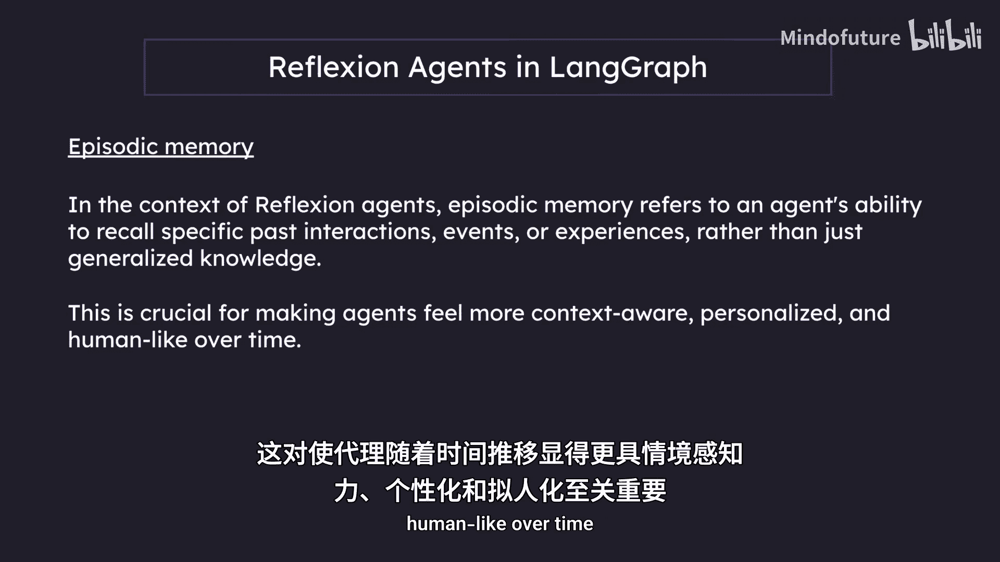
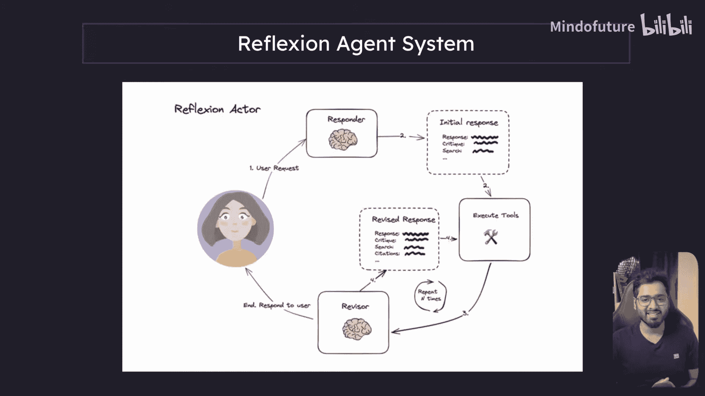

# 011：Reflexion 代理介绍 🧠

在本节课中，我们将学习一个名为 Reflexion 代理系统的新架构。该系统旨在解决我们在上一节中看到的 Reflection 代理系统的一些局限性。

上一节我们介绍了基础的 Reflection 代理系统，它通过生成器和反思器组件迭代改进输出。虽然这比单次提示效果更好，但其生成的内容仍然可能基于模型过时的训练数据，导致出现幻觉或信息陈旧的问题，且我们无法验证。

例如，如果让一个基础的 Reflection 系统撰写一篇关于“AI如何帮助小企业发展”的博客，它只能依赖训练截止日期前的知识，无法获取最新资讯或研究来丰富内容，也无法提供引用来源。

这正是 Reflexion 代理系统要解决的问题。它不仅会批判自己的回答，还能通过调用外部工具（如网络搜索）来获取实时数据进行事实核查，从而生成内容更丰富、更具时效性且可验证的响应。

## Reflexion 代理的核心组件

Reflexion 代理系统的核心是 **Actor**。它是驱动整个流程的主代理，负责反思自身响应并进行修订。其改进可以基于自我批判，也可以结合外部数据。

以下是构成该系统的几个主要子组件：

*   **工具执行**：为了用实时数据支撑响应，系统需要工具，例如网络搜索工具，它能调用 API 获取最新信息。
*   **响应者代理**：该代理负责生成初始响应，并同时进行自我反思。
*   **修订者代理**：该代理根据之前的反思和工具获取的新数据，对响应进行修订和再次反思。

此外，Reflexion 代理系统通常具备**情景记忆**能力。在代理的语境中，情景记忆指的是代理回忆特定过往交互或经历的能力，而不仅仅是泛化的知识。这对于让代理随着时间的推移显得更具上下文感知能力、更个性化和更人性化至关重要。

## 系统工作流程详解

下图展示了 Reflexion 代理系统的基本工作流程：

让我们逐步理解每个环节：

**第一步：响应者代理生成初始内容**
当用户提出请求（例如“撰写一篇250字的关于小企业如何利用AI促进增长的博客”）后，请求首先到达**响应者代理**。该代理会一次性完成多项任务，输出一个结构化的结果，通常包含三个属性：
1.  **`response`**：LLM 生成的初始博客文章。
2.  **`critique`**：LLM 对刚生成的博客进行的自我批评，指出可以改进的地方。
3.  **`search_terms`**：LLM 认为为了完善文章，需要查询最新信息的搜索关键词列表。

**第二步：工具执行获取实时数据**
接下来，控制流到达**工具执行**组件。该组件会使用上一步得到的 `search_terms` 列表，调用网络搜索等工具，获取最新的网络搜索结果。

**第三步：修订者代理整合与优化**
此时，我们拥有了初始响应（含自我批评）和工具获取的新数据。这两部分信息被一同送入**修订者代理**。

修订者代理的工作是整合所有信息，生成一个修订后的响应。其输出也是一个结构化对象，通常包含以下属性：
1.  **`revised_response`**：基于新信息优化后的博客内容。
2.  **`revised_critique`**：对修订后内容的新一轮自我批评。
3.  **`revised_search_terms`**：根据当前内容，认为还需要进一步查询的新关键词列表。
4.  **`citations`**：**新增属性**。包含引用来源，标明文中哪些事实或数据源自于哪个具体的网络搜索结果（通常是URL），这使得内容可验证、更可信。

**第四步：迭代循环**
修订后产生的新 `revised_search_terms` 会再次触发工具执行，获取更多数据，然后返回修订者代理进行下一轮优化。这个循环会进行若干次，每一次迭代都用最新的网络信息来丰富和夯实内容。

同时，我们可以通过指令（如“保持250字”）来控制内容的长度，确保其在迭代中质量提升而非单纯膨胀。经过几轮迭代后，最终生成的内容将是一篇基于实时数据、信息丰富且带有引用的高质量博客。

## 总结与展望

本节课我们一起学习了 Reflexion 代理系统。我们了解到，它通过引入**工具执行**和**迭代修订**机制，克服了基础 Reflection 系统无法获取实时信息的缺点。其核心流程是：生成初始响应并自我反思 -> 根据反思建议搜索新数据 -> 整合新旧信息进行修订并添加引用 -> 多次迭代直至满意。

如果上述流程听起来有些复杂，请不要担心。在接下来的章节中，我们将通过代码一步步实现这个系统：首先构建响应者代理，然后添加工具执行功能，最后使用 LangGraph 将所有组件连接起来。通过实践，你会对 Reflexion 代理有更清晰的理解。