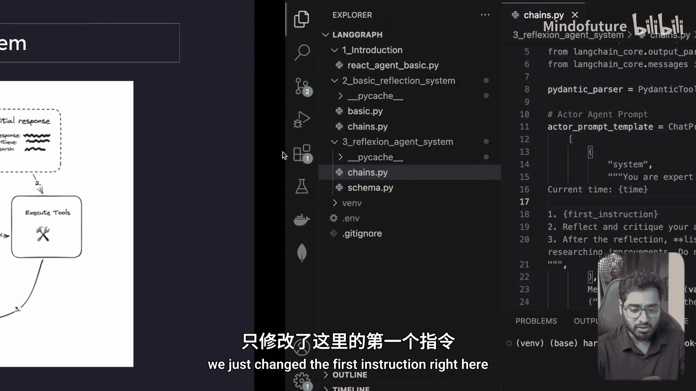
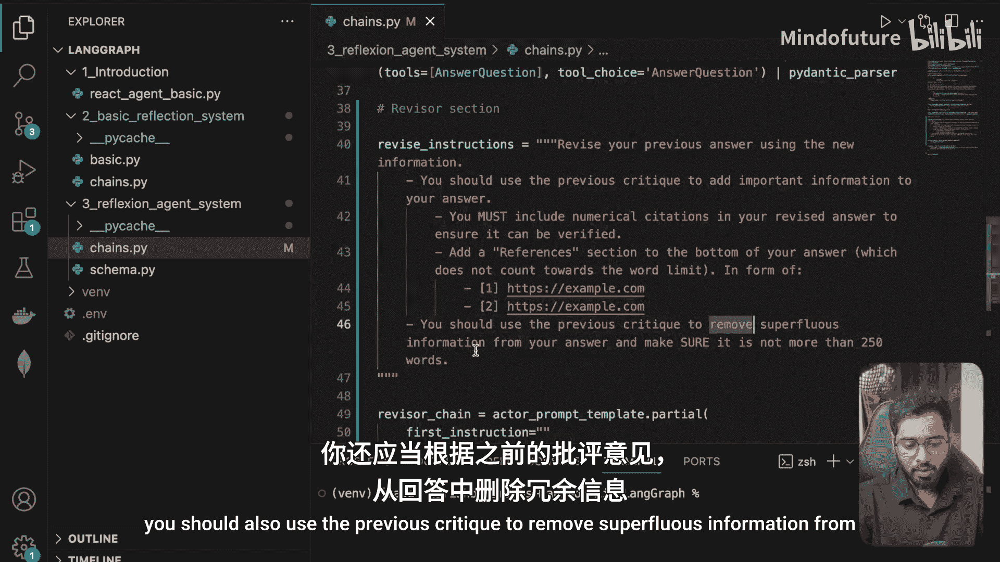
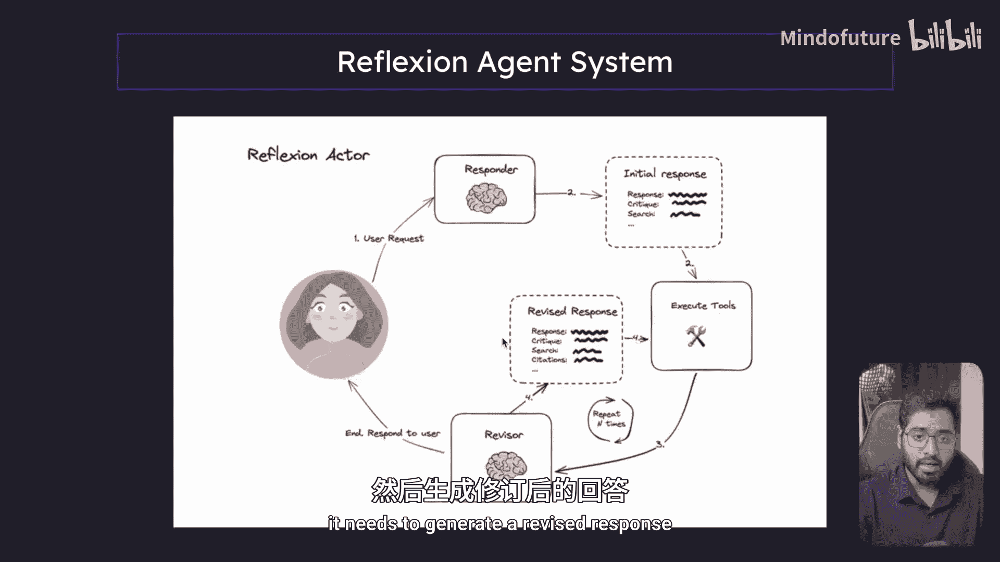
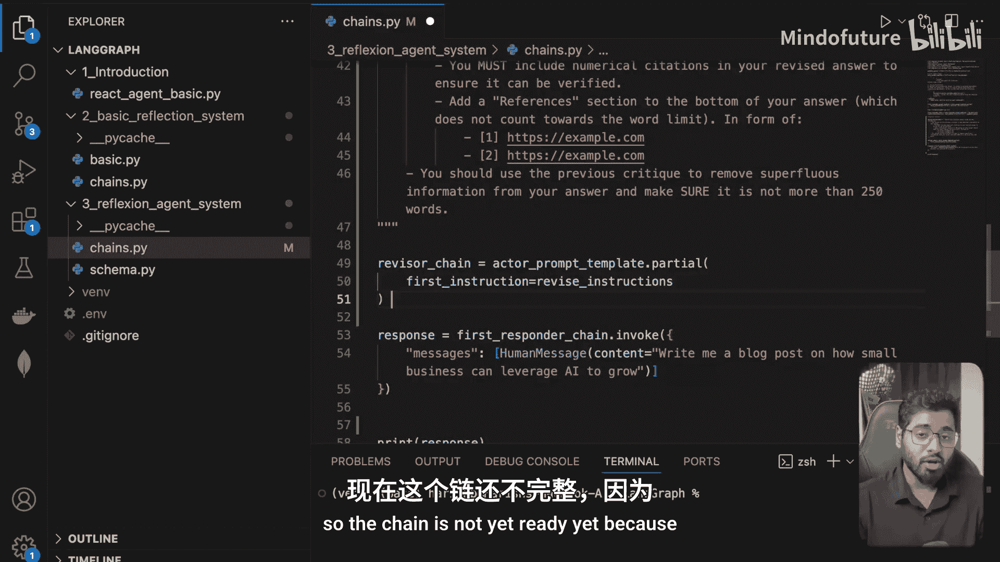
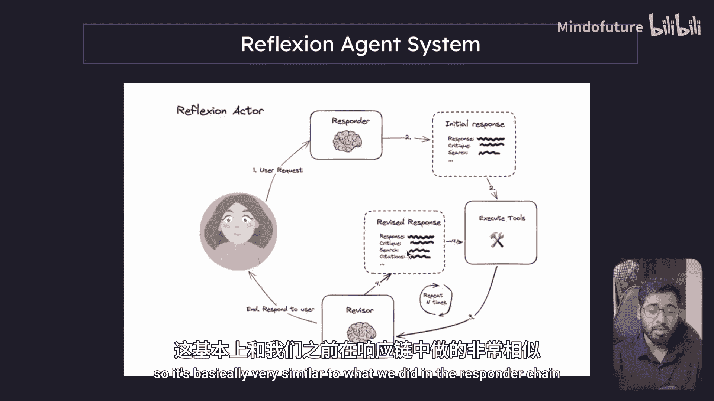
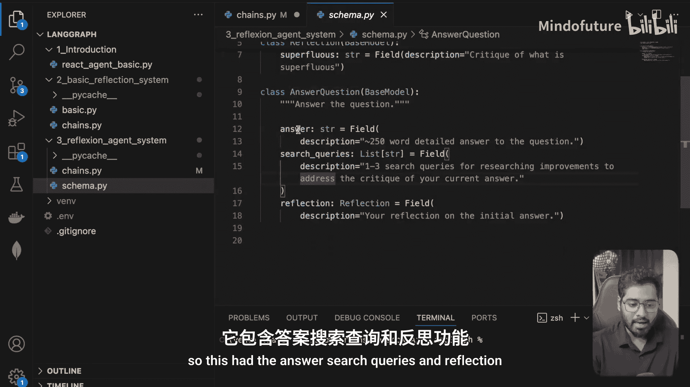
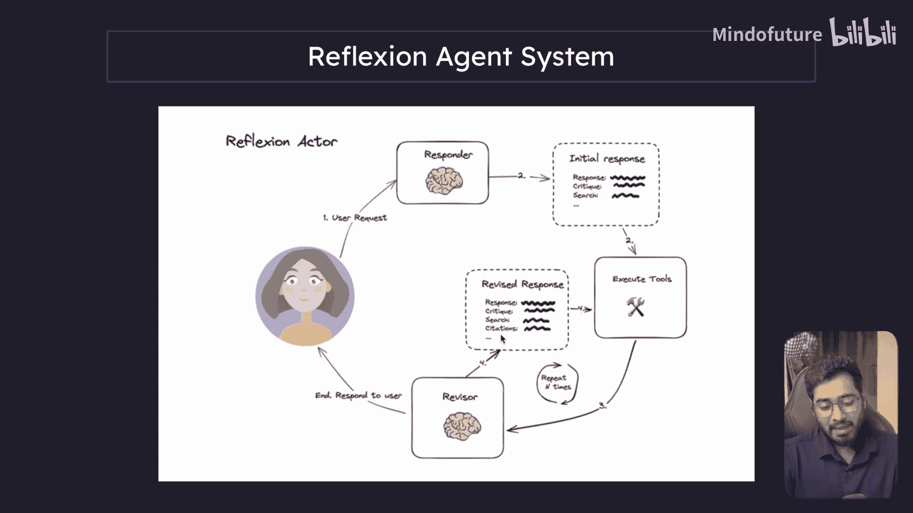
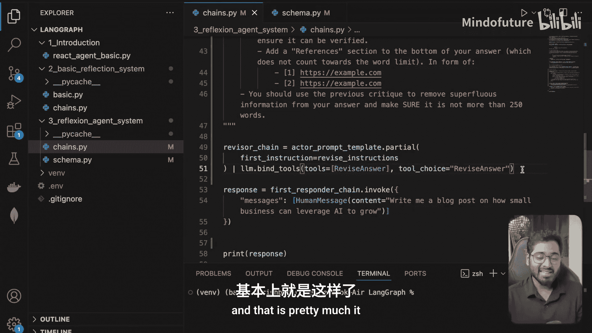
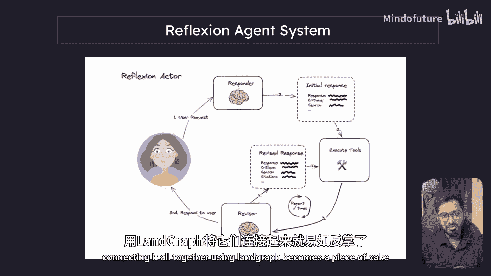

# 013：构建修订器链 🔧

在本节课中，我们将学习如何构建 Reflexion 代理中的“修订器链”。这个链负责根据新的信息和之前的批评，对初始回答进行修订和改进。

上一节我们介绍了响应器链和演员聊天提示模板。本节中，我们来看看如何构建功能相似的修订器链。

## 概述修订器链




修订器链的构建过程与响应器链非常相似。我们将复用之前创建的演员提示模板，仅修改其首条指令，然后创建一个能够输出结构化修订结果的链。

## 复用提示模板

首先，我们创建一个名为 `revise_chain` 的链。我们将使用之前编写的同一个演员提示模板，并通过 `partial` 方法预填充其第一条指令。

```python
revise_chain = actor_prompt_template.partial(
    first_instruction="修订你的先前答案，使用新的信息。你应该利用之前的批评来为你的答案添加重要信息。你必须在修订后的答案中包含数字引用以确保其可验证性。我们要求你在答案底部添加一个‘参考文献’部分，这不计入字数限制。在底部，建议添加这些链接。你还应利用之前的批评从你的答案中删除多余信息，并确保答案不超过250字。"
)
```

这条指令明确了修订器的任务：它需要审视响应器提供的答案、批评以及搜索得到的新信息，并生成一个修订后的版本。

## 定义修订答案的数据结构







与响应器链类似，我们需要一个数据结构来约束大语言模型的输出格式。修订答案的结构与之前的“答案-问题”模型有很多重叠之处，但额外包含了引用列表。

以下是 `RevisedAnswer` 类的定义：

```python
from pydantic import BaseModel, Field
from typing import List

class RevisedAnswer(BaseModel):
    """修订你对原始问题的答案。"""
    answer: str = Field(description="对原始问题的修订后答案。")
    search_queries: List[str] = Field(description="为验证答案而提出的搜索查询列表。")
    reflection: str = Field(description="对你修订后答案的自我批评和反思。")
    references: List[str] = Field(description="支持你更新后答案的引用列表。")
```







这个类继承了基础字段，并新增了 `references` 字段，用于存放激励答案更新的引用来源。

## 组装修订器链

现在，我们可以像组装响应器链一样，将各个部分组合起来。

以下是组装步骤：
1.  将预填充好的提示模板与大语言模型连接。
2.  使用 `bind_tools` 方法，将我们定义的 `RevisedAnswer` 数据结构作为工具绑定给模型，以约束其输出格式。
3.  使用 `with_structured_output` 方法，强制模型仅使用 `RevisedAnswer` 这个工具来生成输出。

```python
# 假设 llm 是你的大语言模型实例
revise_chain = revise_chain | llm.bind_tools([RevisedAnswer]).with_structured_output(RevisedAnswer)
```

至此，修订器链就构建完成了。它的作用是接收对话历史、批评和搜索信息，并输出一个结构化的修订答案。

## 总结与展望

本节课中我们一起学习了如何构建 Reflexion 代理的修订器链。我们复用了演员提示模板，定义了修订答案的数据结构，并将它们组装成一个能够输出结构化结果的链。





到目前为止，我们已经完成了响应器链和修订器链这两个核心组件。在下一节中，我们将构建第三个关键组件——执行工具的方法。一旦所有构建块准备就绪，使用 LangGraph 将它们连接起来就会变得非常简单。