# 014：Reflexion 代理 - 工具执行组件 🛠️

在本节课中，我们将学习如何构建 Reflexion 代理系统中的“工具执行”组件。这个组件负责处理 AI 模型生成的工具调用请求，执行实际的搜索操作，并将结果整理成一条工具消息，以便后续处理。

---

## 组件概述

上一节我们介绍了响应链组件，它负责生成包含搜索查询的 AI 消息。本节中，我们来看看如何实现 `execute_tools` 组件。该组件的核心任务是：从状态中获取最新的 AI 消息，提取其中的搜索查询，循环调用搜索工具，并将所有结果汇总成一条工具消息，添加到状态中。

## 状态流转

在当前的系统状态中，我们拥有两条消息：
1.  初始的 **HumanMessage**（用户输入）。
2.  由响应链生成的 **AIMessage**，其中包含了工具调用信息（特别是 `search_queries`）。

`execute_tools` 组件执行后，状态中将新增第三条消息：
3.  **ToolMessage**，其内容包含了所有搜索查询的结果。

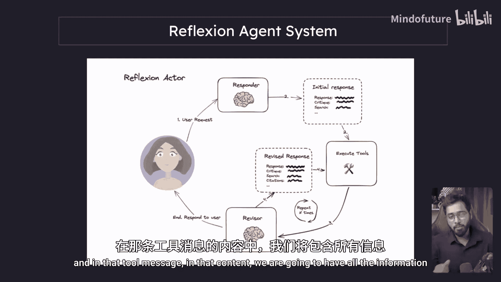

## 实现步骤

以下是 `execute_tools` 组件的实现逻辑。

首先，我们需要从传入的状态中提取出最后一条消息，即 AI 消息。

```python
def execute_tools_node(state):
    messages = state['messages']
    last_message = messages[-1]  # 获取最新的 AI 消息
```

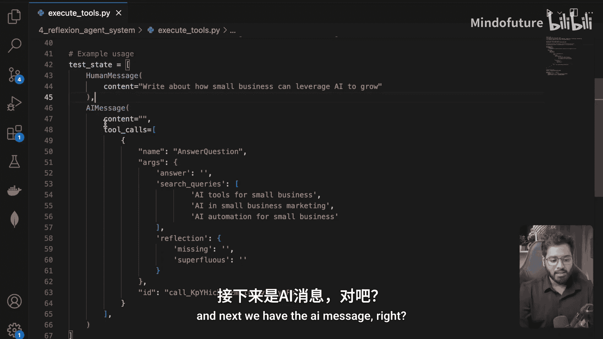

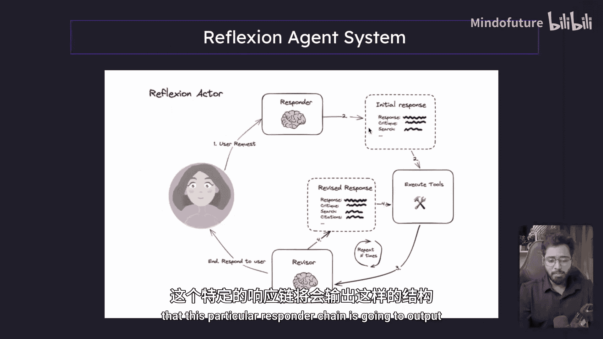

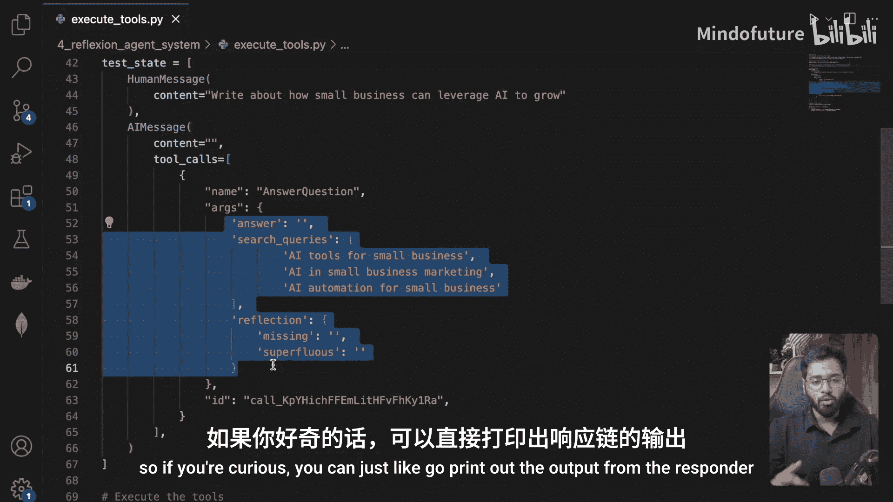

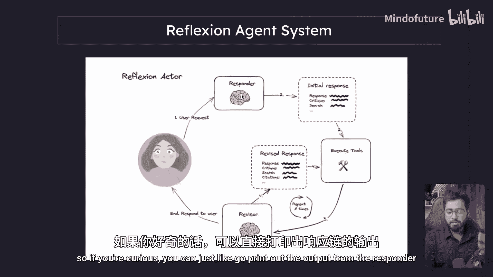

接着，检查这条 AI 消息中是否包含工具调用。如果没有，则无需执行任何操作。

```python
    if not last_message.tool_calls:
        return {"messages": []}  # 没有工具调用，返回空列表
```

如果存在工具调用，则进入核心处理流程。我们假设目前只有一个工具调用（`answer_question`）。

```python
    tool_results = []
    for tool_call in last_message.tool_calls:
        tool_call_id = tool_call['id']
        search_queries = tool_call['args']['search_queries']
```

现在，我们需要遍历每一个搜索查询，调用 `tavily_search` 工具来获取结果。

```python
        query_results = {}
        for query in search_queries:
            # 调用搜索工具，每个查询获取5条结果
            search_result = tavily_search(query, max_results=5)
            query_results[query] = search_result
```

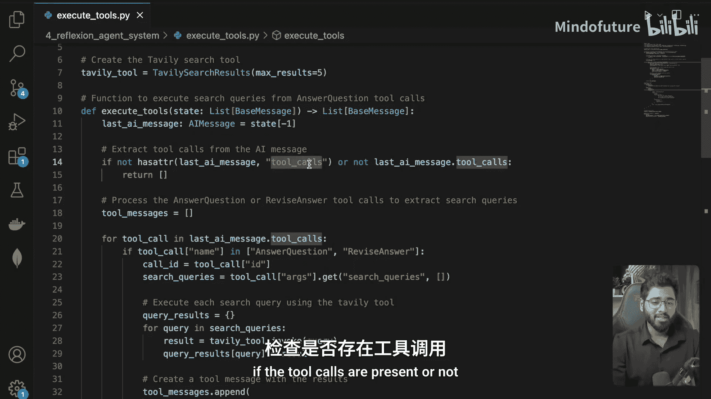

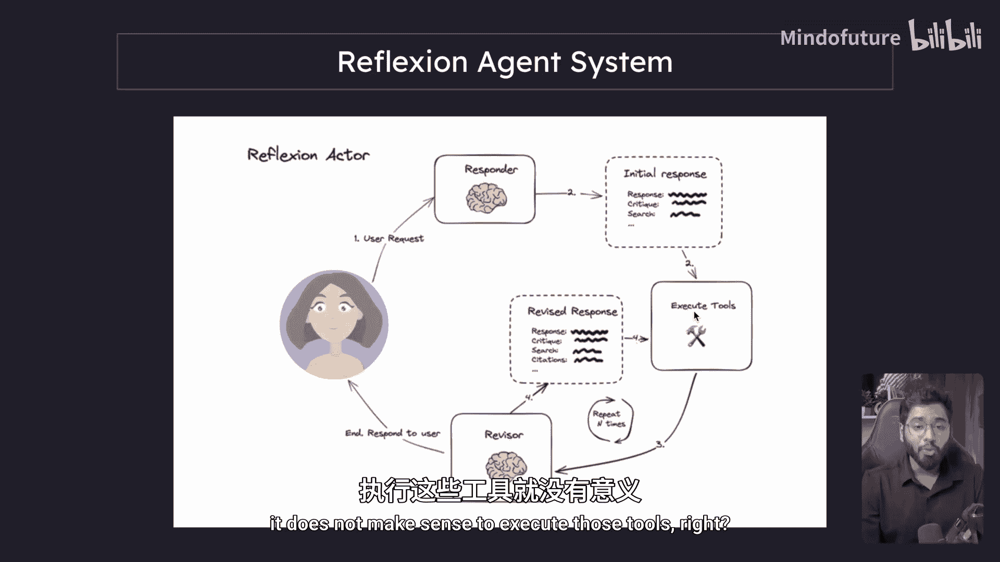

搜索完成后，我们将所有结果整合起来，创建一条 ToolMessage。这条消息必须包含对应的 `tool_call_id`，以便系统能将执行结果与最初的工具调用关联起来。

```python
        # 将结果转换为 JSON 字符串作为消息内容
        content = json.dumps(query_results)
        # 创建工具消息
        tool_message = ToolMessage(
            content=content,
            tool_call_id=tool_call_id
        )
```

最后，将生成的 ToolMessage 返回。注意，返回值需要是列表形式，以便与状态中的消息列表合并。

```python
    return {"messages": [tool_message]}
```

## 代码结构示例

为了更清晰地理解，以下是一个简化的代码结构，展示了 `execute_tools` 函数的核心部分：

```python
import json

def execute_tools_node(state):
    messages = state['messages']
    last_message = messages[-1]

    if not last_message.tool_calls:
        return {"messages": []}

    tool_messages = []
    for tool_call in last_message.tool_calls:
        tool_call_id = tool_call['id']
        search_queries = tool_call['args']['search_queries']

        all_results = {}
        for query in search_queries:
            # 假设 tavily_search 返回一个结果列表
            results = tavily_search(query, max_results=5)
            all_results[query] = results

        # 创建工具消息
        tool_message = ToolMessage(
            content=json.dumps(all_results),
            tool_call_id=tool_call_id
        )
        tool_messages.append(tool_message)

    return {"messages": tool_messages}
```

## 测试与验证

在开发过程中，可以使用一个模拟的“状态”字典来测试该函数，确保它能正确解析 AI 消息、执行搜索并生成格式正确的 ToolMessage。

## 总结

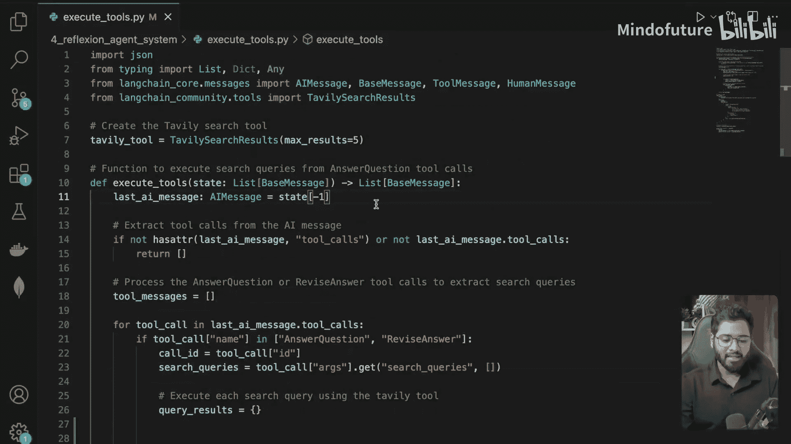

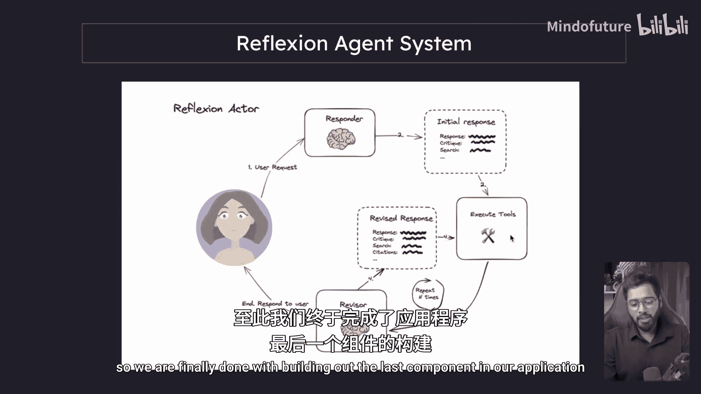

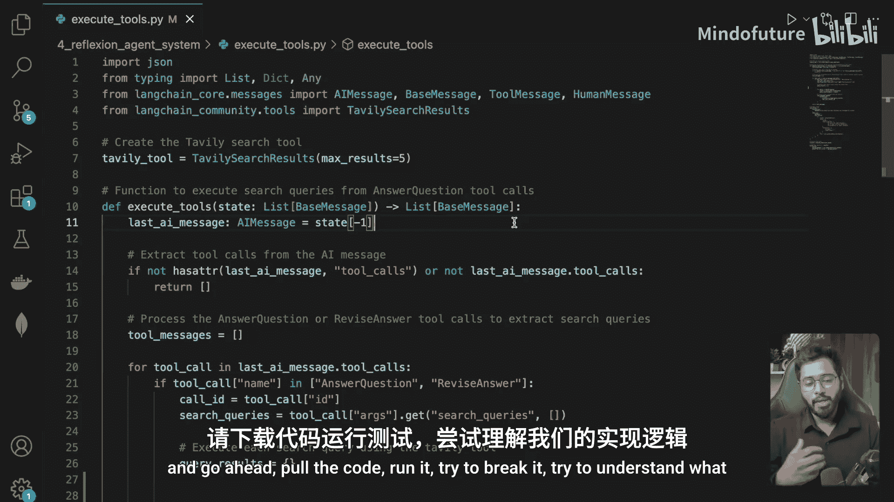

本节课中我们一起学习了 `execute_tools` 组件的构建。该组件是 Reflexion 代理工作流的关键一环，它负责：
*   **提取信息**：从 AI 消息中获取工具调用指令和搜索词。
*   **执行工具**：循环调用外部搜索 API。
*   **封装结果**：将搜索结果整合并封装成一条带有正确 `tool_call_id` 的 ToolMessage。

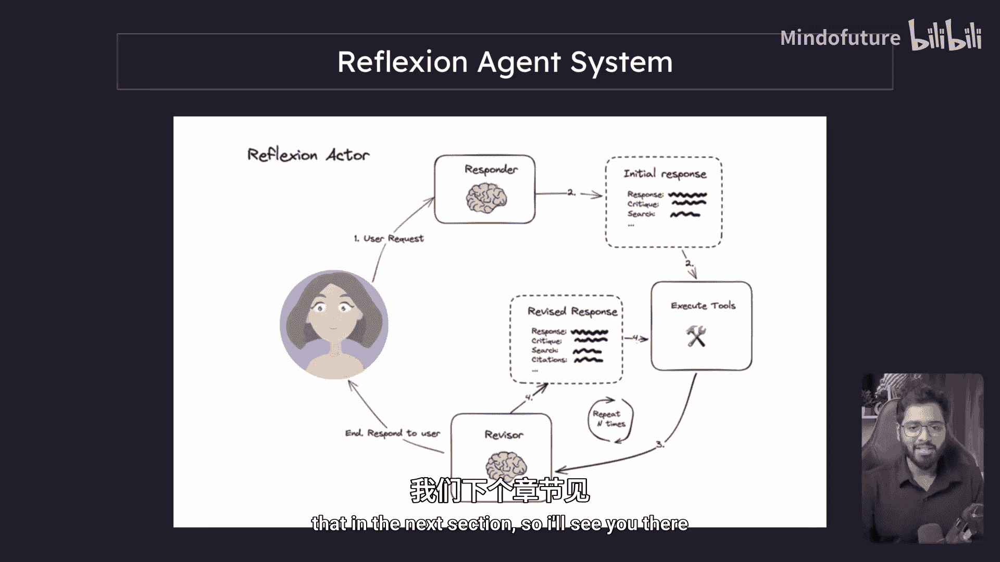

至此，我们已经完成了系统中所有核心组件的构建。下一节，我们将把这些组件连接起来，构建完整的 LangGraph 并运行整个系统。