# 015：构建 Reflexion 代理图 🧩

在本节课中，我们将学习如何将之前构建的所有组件——响应链、修订链和工具执行方法——整合到一个 LangGraph 工作流中，从而创建一个完整的 Reflexion 代理系统。我们将看到这个系统如何通过迭代搜索和修订来生成高质量的、基于实时数据的博客文章。

## 系统流程概述

上一节我们介绍了各个独立的组件，本节中我们来看看如何将它们连接成一个完整的图。整个系统的控制流程如下：

1.  用户输入（Human Message）作为对话历史的起始。
2.  该输入被发送给 **响应链**，生成初始草稿（AI Message）。
3.  草稿被传递给 **工具执行方法**，该方法解析出搜索词并进行网络搜索，返回一个包含搜索结果的工具消息（Tool Message）。
4.  包含新工具消息的完整对话历史被发送给 **修订链**。修订链会分析现有内容，结合新的搜索结果，生成一个修订后的、带有引用标注的版本（新的 AI Message）。
5.  系统会判断是否需要进行下一轮迭代。我们设定一个最大迭代次数（例如 2 次），如果未达到上限，流程将回到步骤 3，使用修订后的内容再次执行搜索；如果已达到上限，则结束流程，输出最终结果。

## 构建图结构


以下是构建 Reflexion 代理图的具体步骤。

首先，我们需要导入必要的模块并初始化图。

```python
from typing import List
from langchain_core.messages import BaseMessage, ToolMessage
from langgraph.graph import MessageGraph
from chains import first_responder_chain, revise_chain
from tools import execute_tools

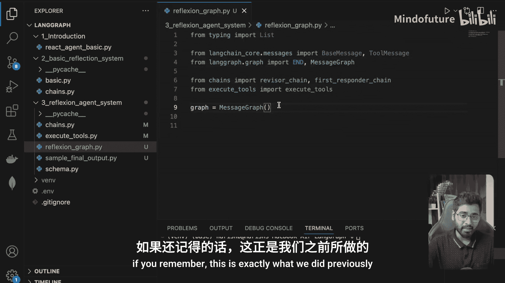

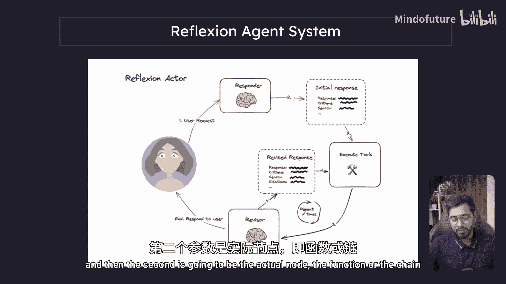

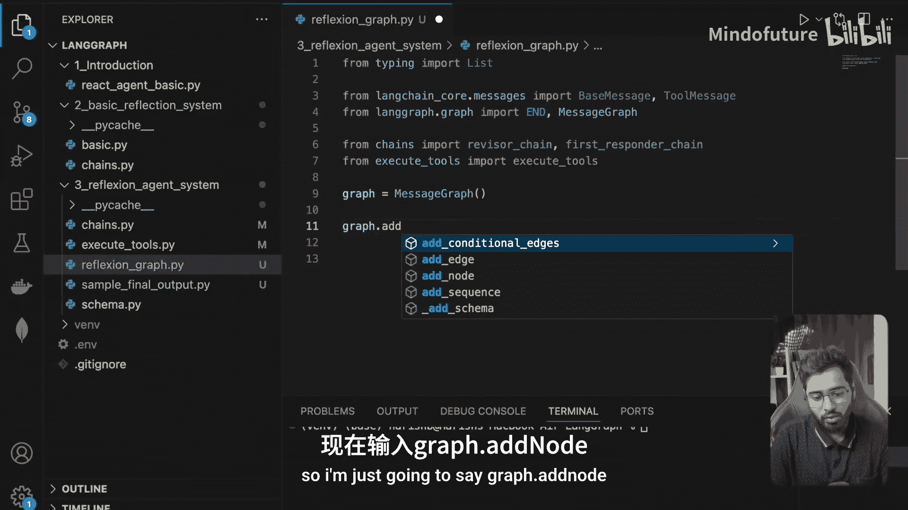

# 初始化图
graph = MessageGraph()
```


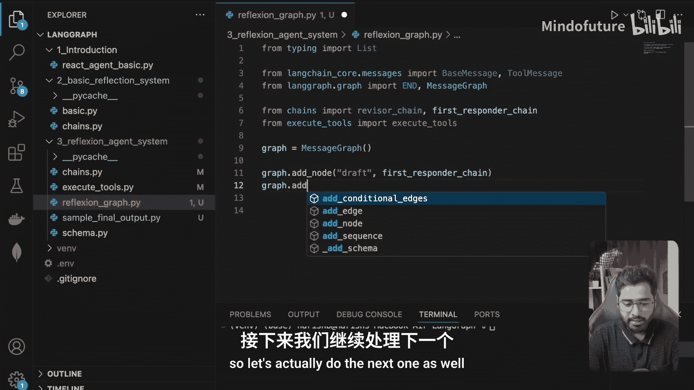

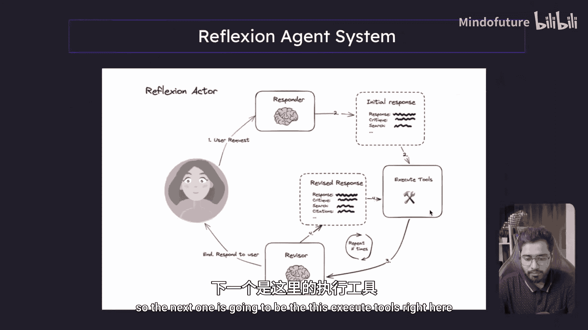

接下来，我们将三个核心组件添加为图的节点。

```python
# 添加节点
graph.add_node("draft", first_responder_chain)  # 响应链，生成初稿
graph.add_node("execute_tools", execute_tools)  # 工具执行节点
graph.add_node("revise", revise_chain)          # 修订链节点
```

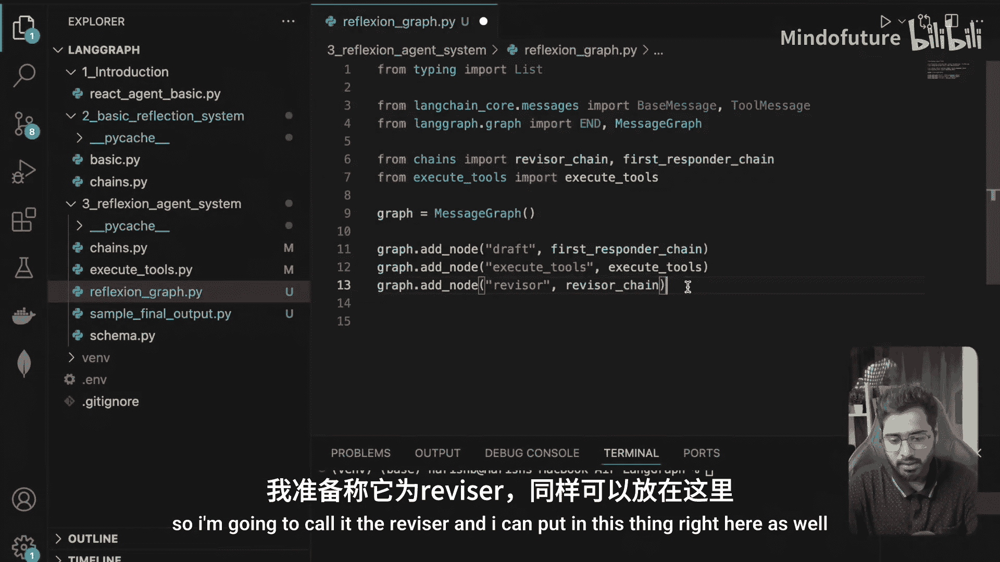

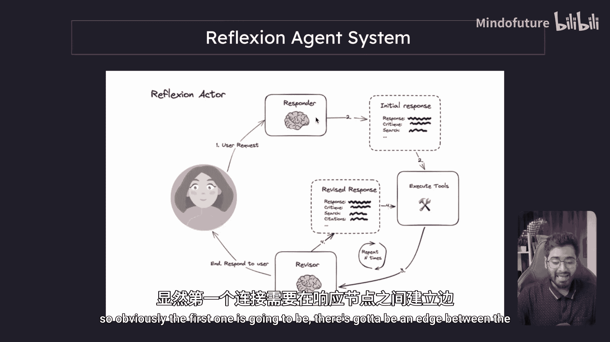

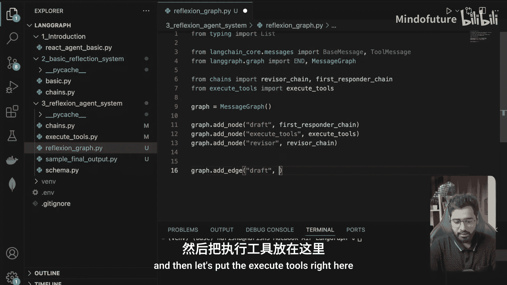


现在，我们需要按照流程连接这些节点。首先，连接“初稿”节点到“工具执行”节点。

```python
# 添加边：从 draft 到 execute_tools
graph.add_edge("draft", "execute_tools")
```

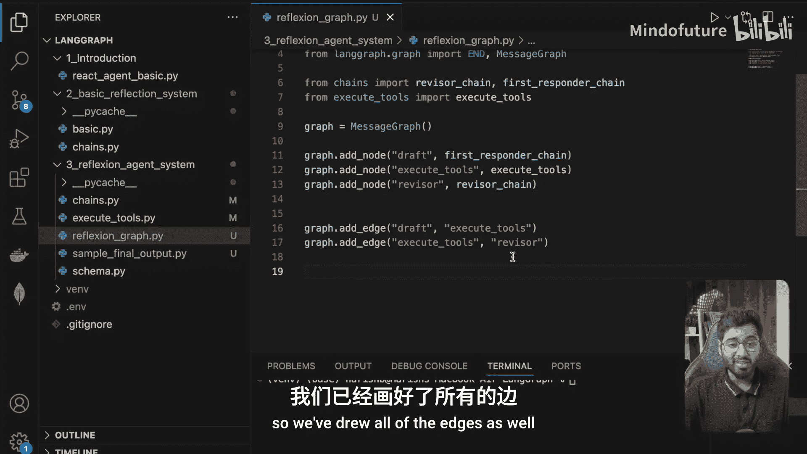

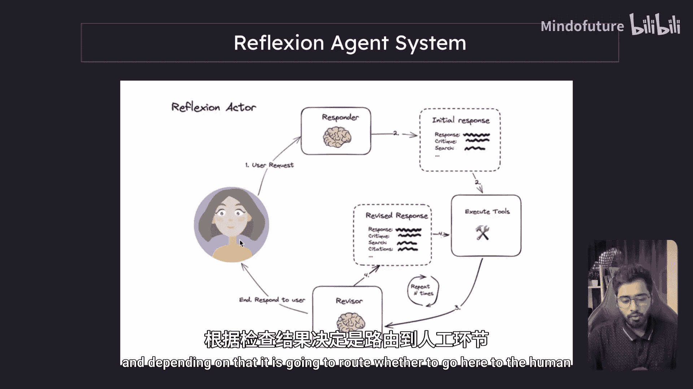

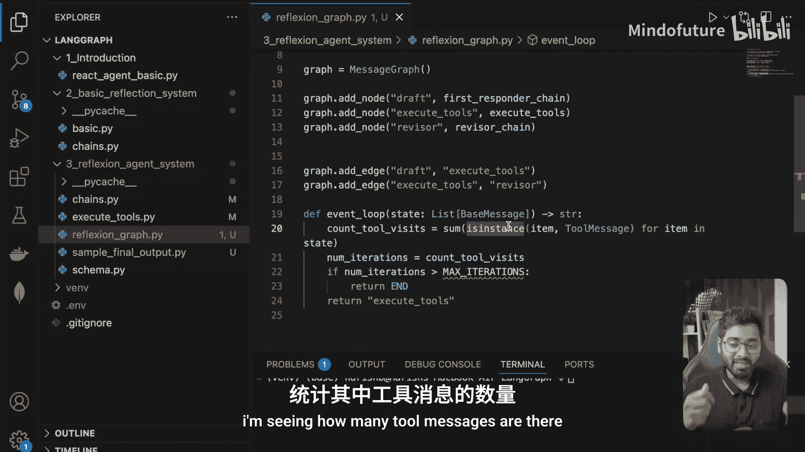

然后，连接“工具执行”节点到“修订”节点。

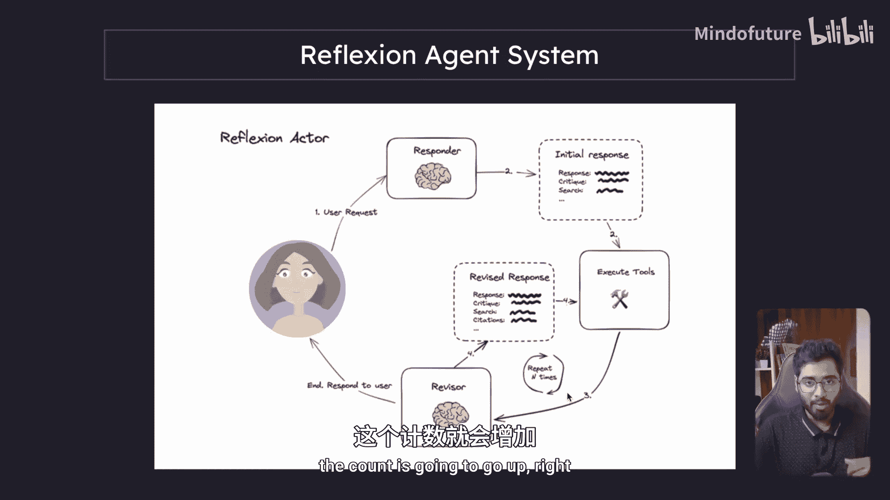

```python
# 添加边：从 execute_tools 到 revise
graph.add_edge("execute_tools", "revise")
```

在修订之后，我们需要一个条件判断来决定下一步是继续迭代还是结束。这通过一个条件函数来实现。

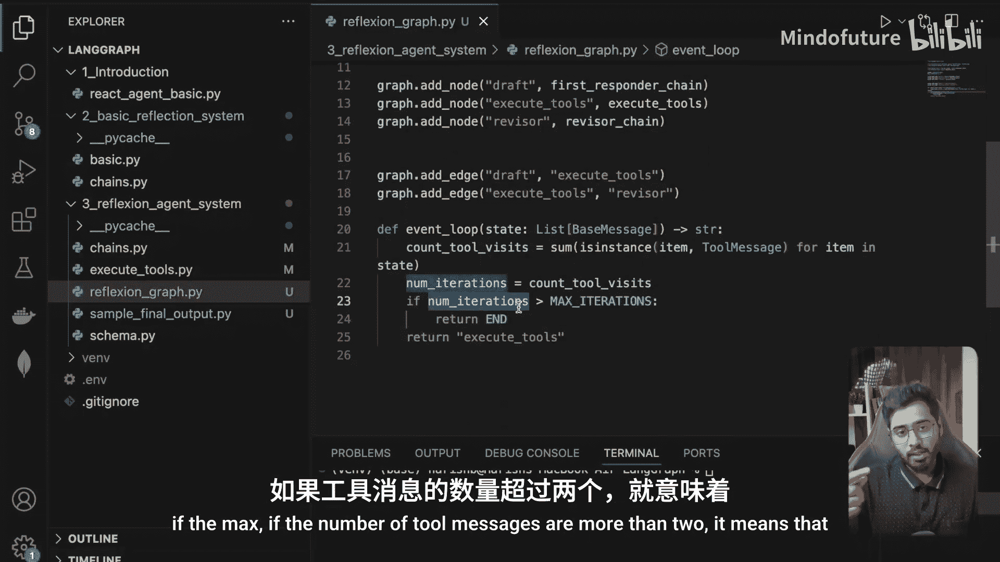

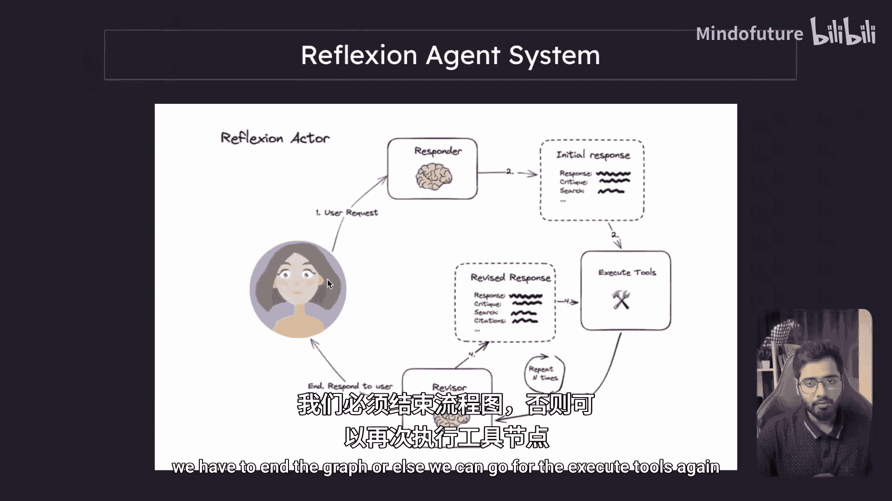

```python
MAX_ITERATIONS = 2  # 设置最大迭代次数

def event_loop(messages: List[BaseMessage]):
    """条件路由函数，决定继续迭代还是结束。"""
    # 计算当前消息历史中工具消息的数量
    tool_visit_count = sum(1 for msg in messages if isinstance(msg, ToolMessage))
    
    # 如果工具消息数量达到上限，则结束；否则，继续执行工具
    if tool_visit_count >= MAX_ITERATIONS:
        return "end"
    else:
        return "execute_tools"
```

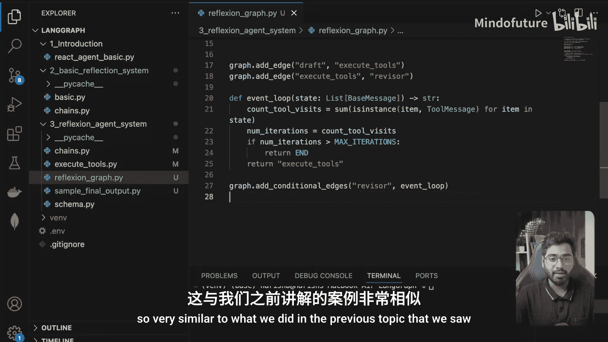

将这个条件路由添加到图中，它将在“修订”节点之后被调用。


```python
# 添加条件边：从 revise 出发，根据 event_loop 的结果路由
graph.add_conditional_edges("revise", event_loop)
```

最后，我们需要设置图的入口点，即流程开始的地方。

```python
# 设置入口点
graph.set_entry_point("draft")
```

至此，图的结构已经定义完成。我们可以编译它以便运行。

```python
# 编译图
app = graph.compile()
```

## 运行与测试

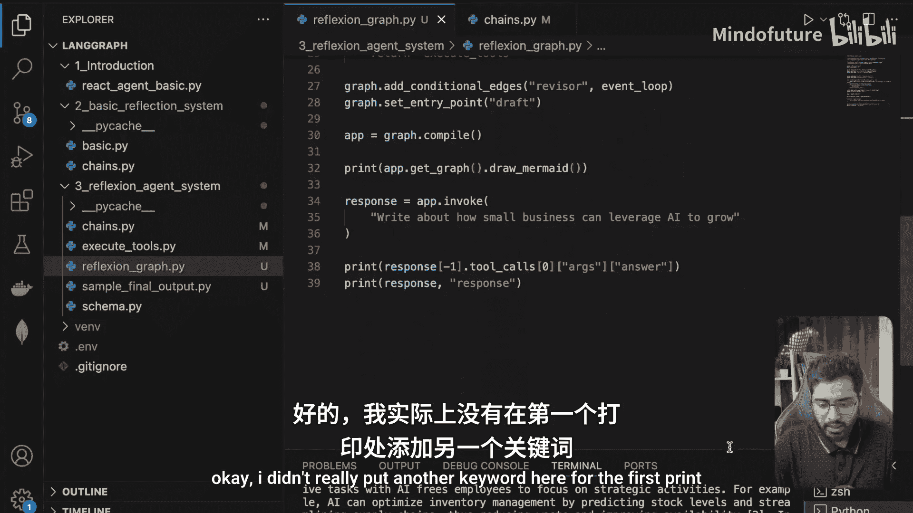

图构建完成后，我们可以传入一个查询来测试整个系统。

```python
# 调用图
input_message = "写一篇关于小型企业如何利用AI实现增长的博客文章。"
final_state = app.invoke(input_message)

# 从最终状态中提取输出
# 最终输出是对话历史中最后一个AI消息的‘answer’字段
final_output = final_state["messages"][-1].additional_kwargs["tool_calls"][0]["function"]["arguments"]["answer"]
print(final_output)
```

运行这个流程可能需要一些时间，因为它涉及多次LLM调用和网络搜索。您可以使用LangSmith等工具来跟踪详细的执行过程和中间结果。

## 系统优势与注意事项

本节课中我们一起学习了如何构建一个功能完整的Reflexion代理图。我们来总结一下这种系统的特点：

**优势：**
*   **数据实时性**：通过迭代搜索，能够获取并整合最新的网络信息。
*   **输出质量高**：经过多轮修订和事实核查，生成的内容更准确、信息更丰富，且带有引用来源。

**注意事项：**
*   **响应延迟**：由于涉及多次API调用和网络请求，整个流程的耗时较长。
*   **计算成本**：每次迭代都会消耗额外的Token和计算资源。

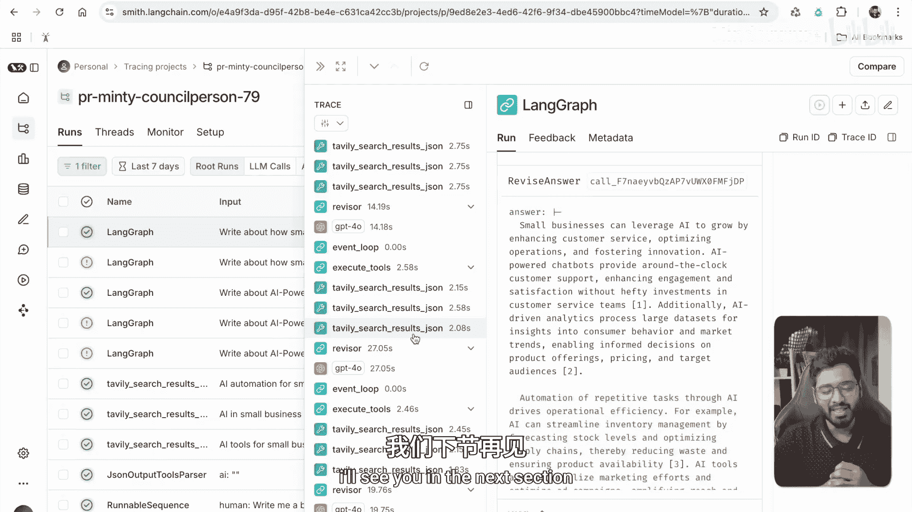

因此，在决定是否采用此类系统时，需要权衡**输出质量**与**响应速度**。如果您的应用场景更看重信息的准确性和深度，而对实时交互速度要求不高，那么Reflexion代理是一个强大的选择。理解这个基础架构后，您就可以根据自己特定的需求（如调整迭代逻辑、更换工具或修改提示词）来定制专属的智能体系统了。