# 016：什么是StateGraph 🧠

在本节课中，我们将深入学习LangGraph中的状态（State）概念。之前我们使用的MessageGraph仅限于处理消息列表，但在构建复杂应用时，我们通常需要跟踪更多自定义属性。StateGraph正是为此而生，它允许我们定义和维护一个全局状态对象，作为AI系统在处理数据过程中的“记忆”。

上一节我们介绍了基于消息的图，本节中我们来看看如何构建和管理自定义状态。

## 理解状态（State）📝

在LangGraph中，状态是一种在AI系统处理数据时维护和跟踪信息的方式。你可以将其视为系统的记忆，允许它在工作流或图的不同阶段记住和更新信息。

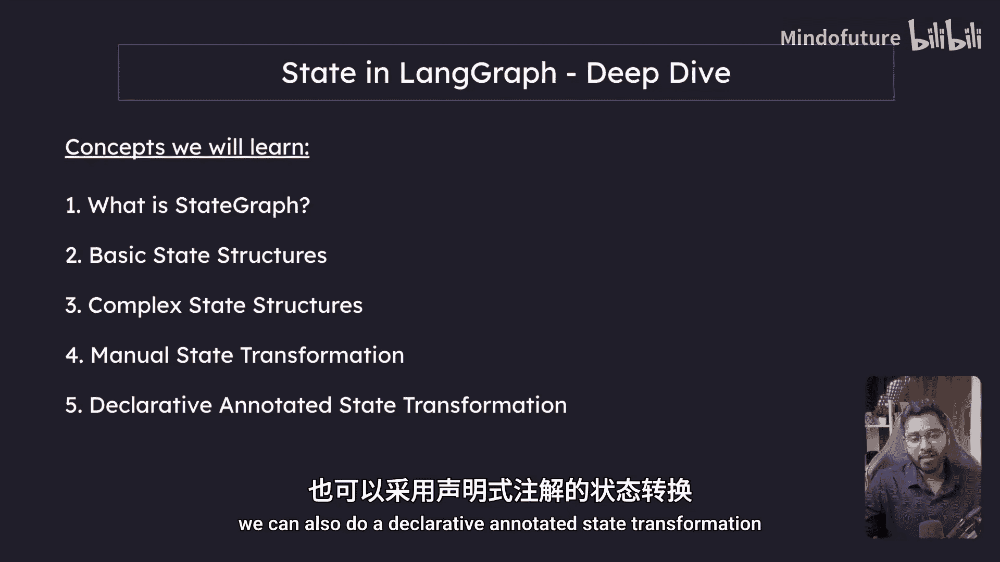

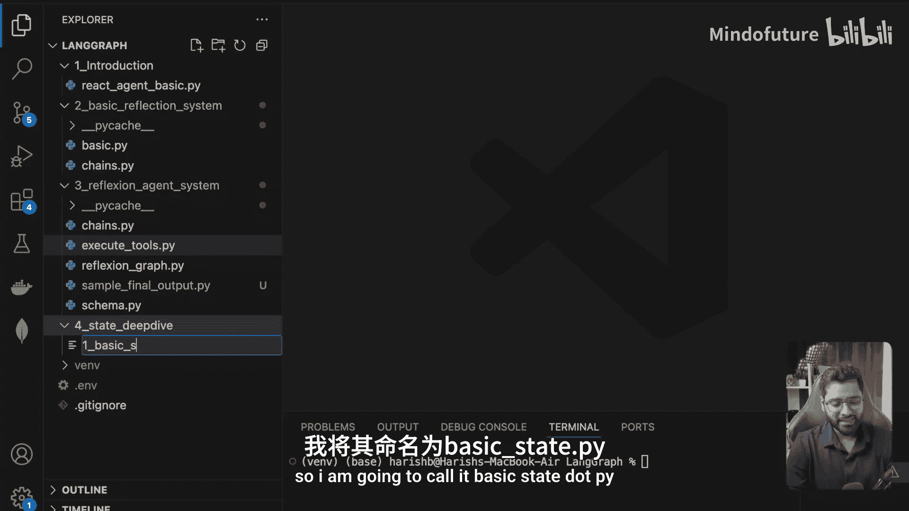

我们将涵盖以下核心概念：
*   什么是StateGraph
*   基本状态结构
*   状态更新的不同方式（手动与声明式）

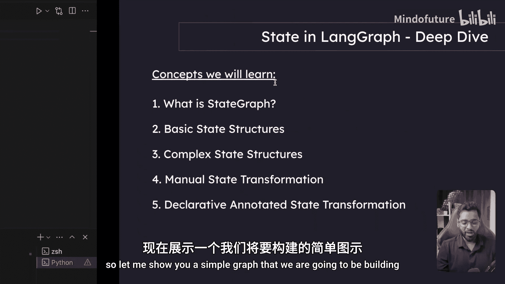

首先，我们将通过一个简单的计数器示例来演示StateGraph的基本用法。

## 构建一个基础StateGraph：计数器示例 🔢

我们将构建一个简单的图，它包含一个名为`count`的状态属性，初始值为0。图包含一个“递增”节点和一个“条件判断”节点，`count`会不断递增，直到达到5为止。

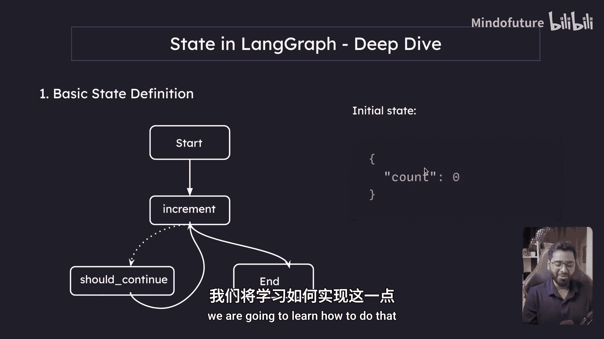

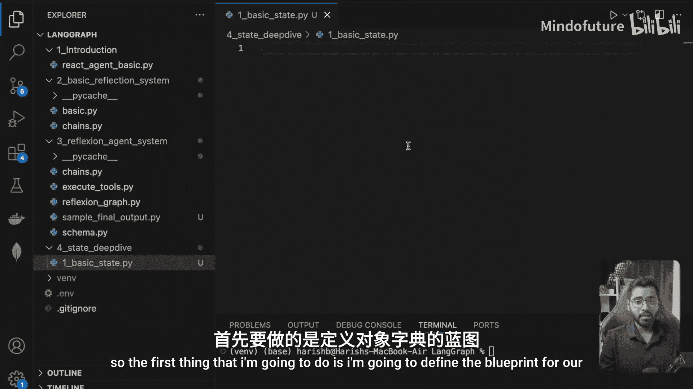

以下是实现此图所需的步骤。

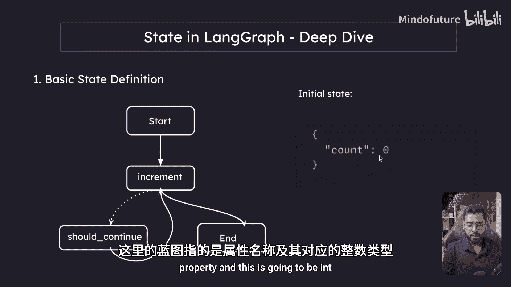

### 步骤1：定义状态蓝图（Schema）

首先，我们需要定义状态的“蓝图”，即规定状态对象应包含哪些属性及其数据类型。我们使用`TypedDict`来实现。

```python
from typing import TypedDict

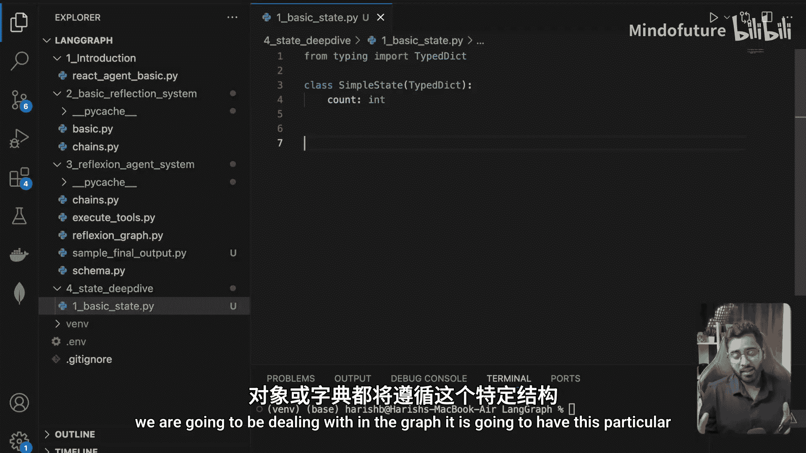

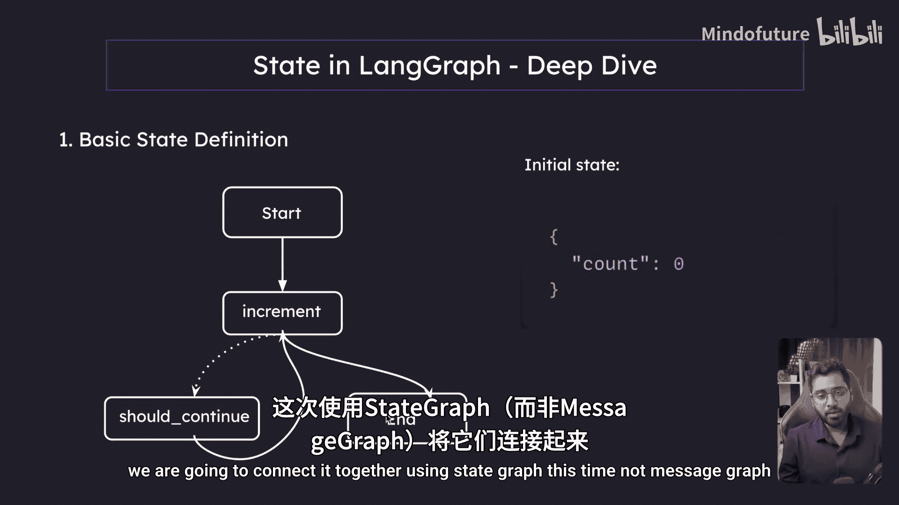

class SimpleState(TypedDict):
    count: int
```
`TypedDict`创建了一个字典类型，它强制要求所有实例都拥有指定的键（如`count`）并符合其声明的类型（如`int`）。这确保了状态结构的一致性。

### 步骤2：创建节点（Nodes）

接下来，我们创建图所需的各个功能节点。在StateGraph中，每个节点都会接收到整个状态字典。

**递增节点（Increment Node）**
这个节点的功能是将状态中的`count`值加1。
```python
def increment(state: SimpleState) -> SimpleState:
    # 返回一个新的状态对象，更新count值
    return {"count": state["count"] + 1}
```
每个节点接收当前状态，并返回一个包含更新值的新状态对象。这个新对象将替换现有的全局状态。这体现了**不可变性（Immutability）**原则——我们不直接修改原对象，而是创建并返回一个新对象。

**条件判断节点（Should Continue Node）**
这个节点根据`count`的值决定图的下一步走向。
```python
from langgraph.graph import END

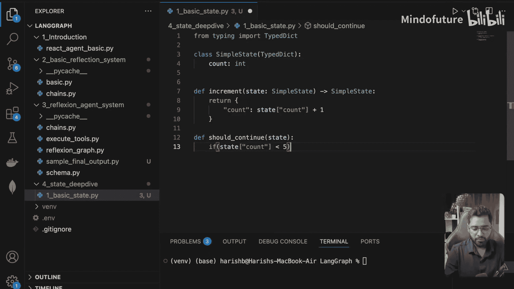

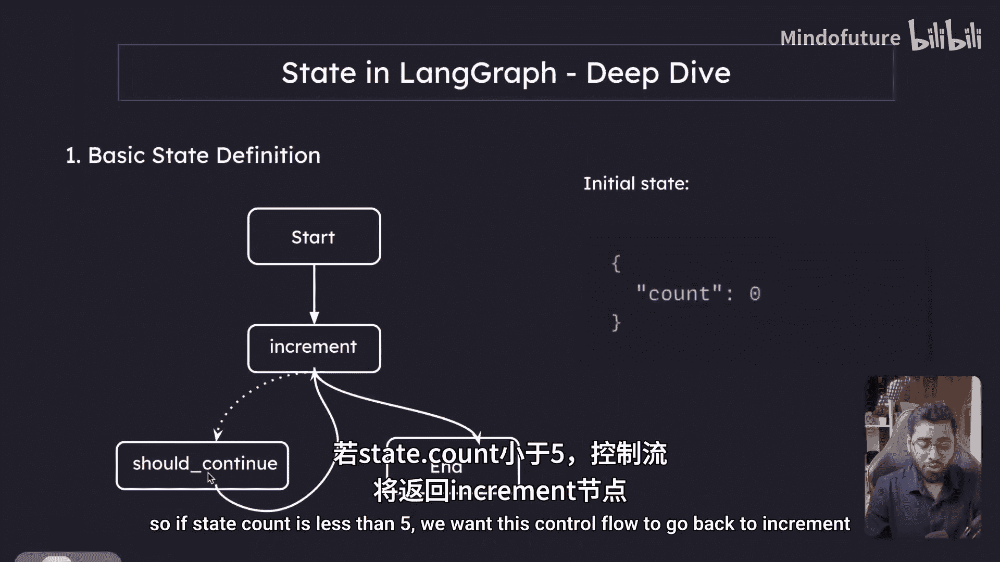

def should_continue(state: SimpleState) -> str:
    # 如果count小于5，则继续循环；否则结束
    if state["count"] < 5:
        return "continue"
    else:
        return "stop"
```

### 步骤3：组装StateGraph

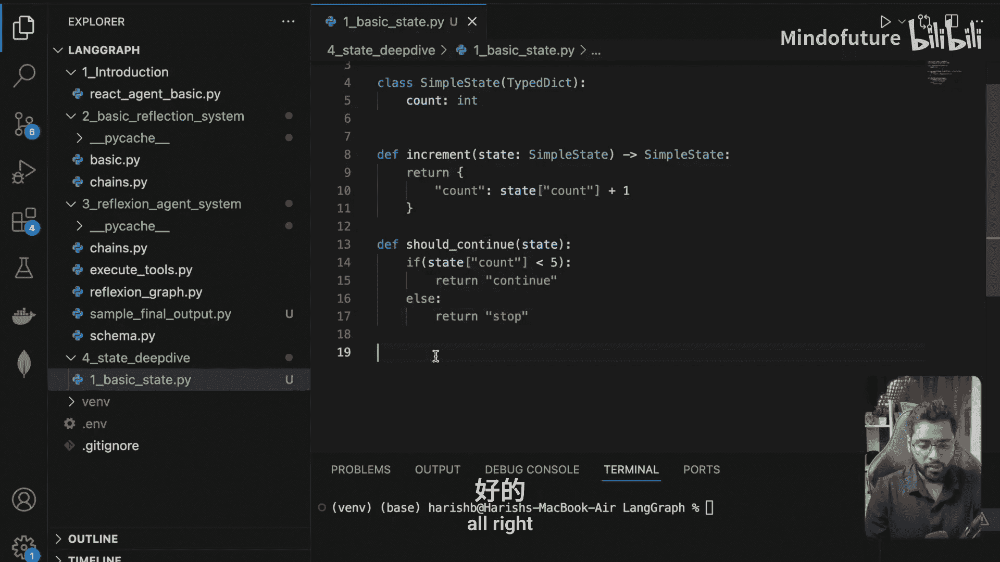


定义了节点后，我们将它们组装成一个完整的图。

```python
from langgraph.graph import StateGraph

# 1. 初始化StateGraph，并传入我们定义的状态蓝图
graph = StateGraph(SimpleState)

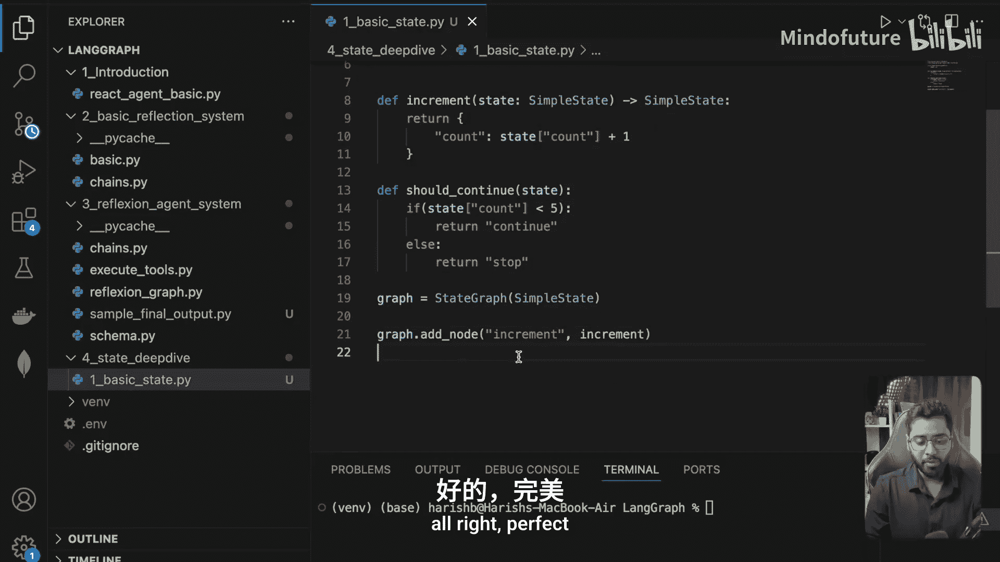

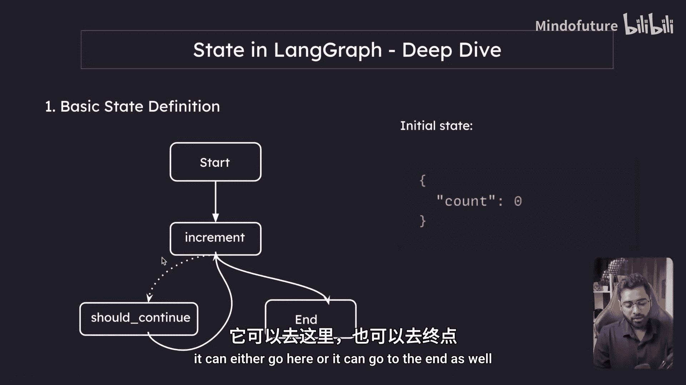

# 2. 添加节点
graph.add_node("increment", increment)
graph.add_node("should_continue", should_continue)

# 3. 添加条件边（Conditional Edge）
# 设置从“increment”节点执行后，下一步进入“should_continue”节点进行判断
graph.add_conditional_edges(
    "increment",
    should_continue,
    # 根据`should_continue`函数的返回值，决定下一个目标节点
    {
        "continue": "increment", # 返回"continue"则跳回"increment"节点
        "stop": END # 返回"stop"则跳转到结束节点
    }
)

# 4. 设置入口点
graph.set_entry_point("increment")

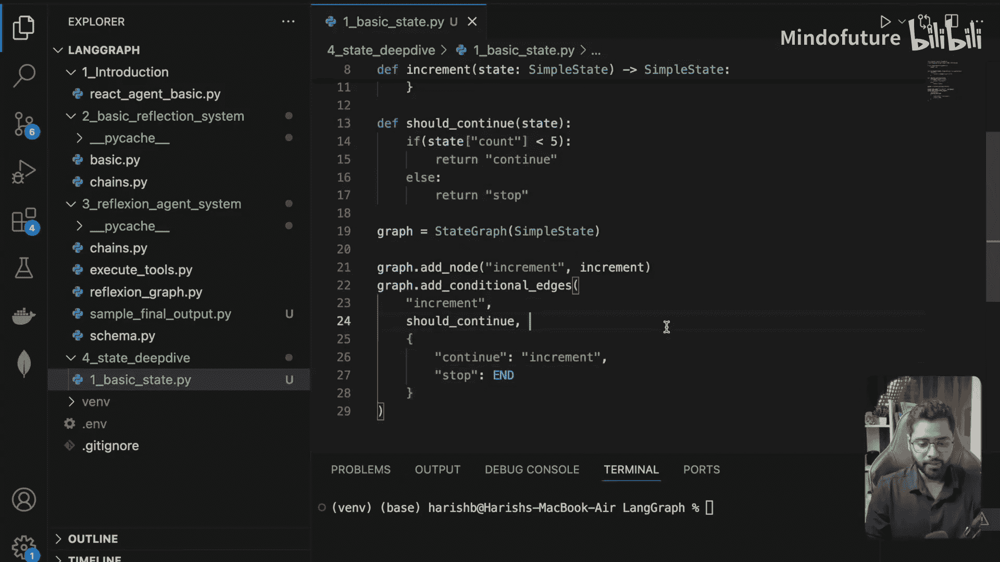

# 5. 编译图
app = graph.compile()
```

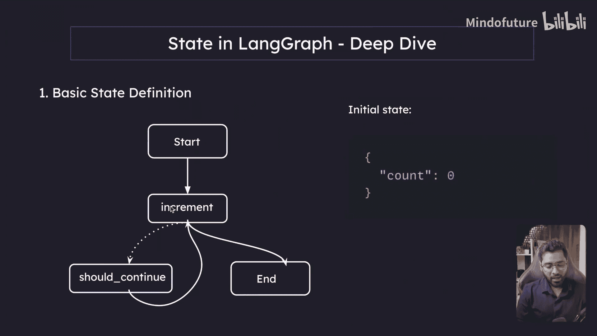

### 步骤4：运行图

最后，我们使用初始状态来运行这个图。

```python
# 定义初始状态
initial_state = SimpleState(count=0)

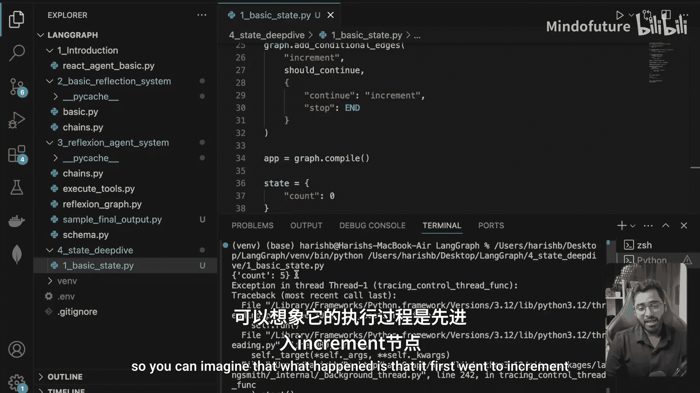

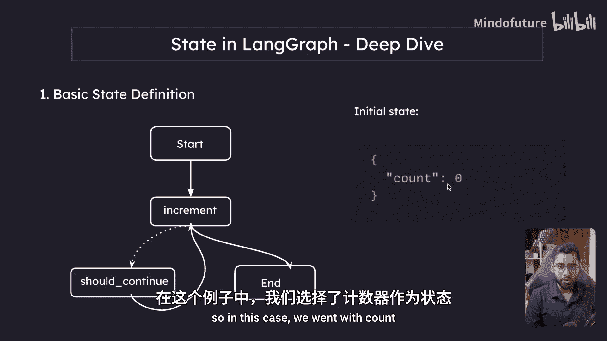

# 调用图
result = app.invoke(initial_state)
print(result) # 输出：{'count': 5}
```
运行后，你会看到`count`从0开始递增，最终在达到5时停止。这个过程模拟了：`increment` -> `should_continue` -> (若`count`<5) -> `increment` ... 的循环，直到条件不满足，走向`END`。

## 核心要点总结 🎯

本节课中我们一起学习了StateGraph的核心机制：

1.  **状态即全局记忆**：StateGraph维护一个全局状态对象（字典），所有节点都可以读取和更新它，这类似于前端Redux中的Store概念。
2.  **蓝图定义结构**：使用`TypedDict`定义状态的“蓝图”，确保数据结构的类型安全。
3.  **不可变更新**：节点通过返回一个**新的状态对象**来更新状态，而不是直接修改原对象，这符合函数式编程的最佳实践。
4.  **工作流程**：我们掌握了构建StateGraph的标准流程：定义状态 -> 创建节点 -> 组装图（添加节点、边、入口点）-> 编译 -> 运行。

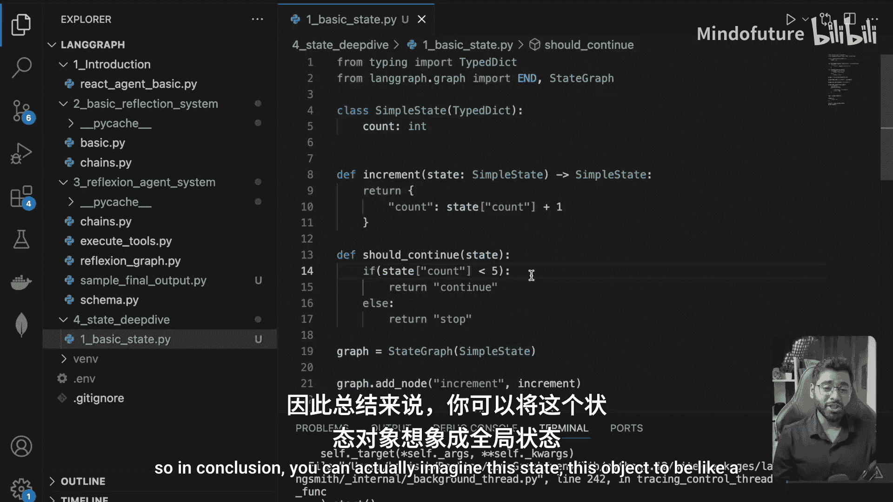

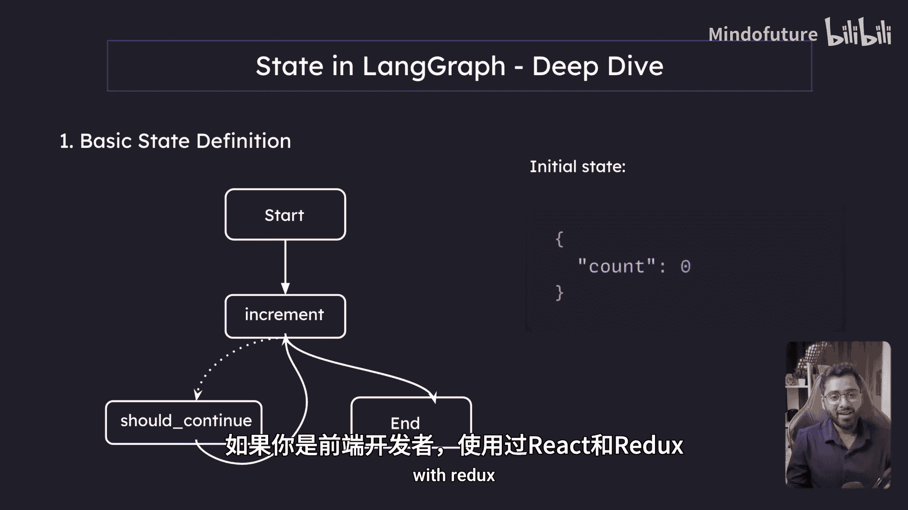

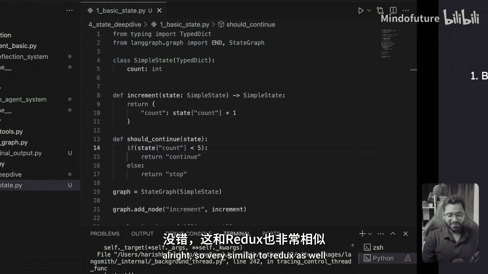

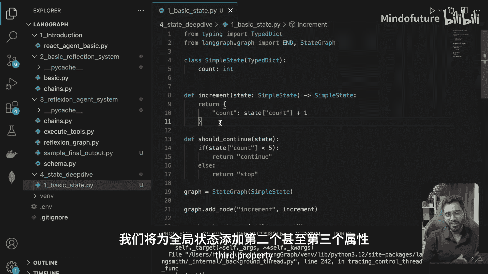

通过简单的计数器示例，我们理解了StateGraph如何突破MessageGraph仅能处理消息列表的限制，为构建更复杂的AI应用（例如下一节将要实现的ReAct智能体系统）奠定了坚实基础。在下一节，我们将增加状态复杂度，引入更多属性，进一步探索StateGraph的强大功能。