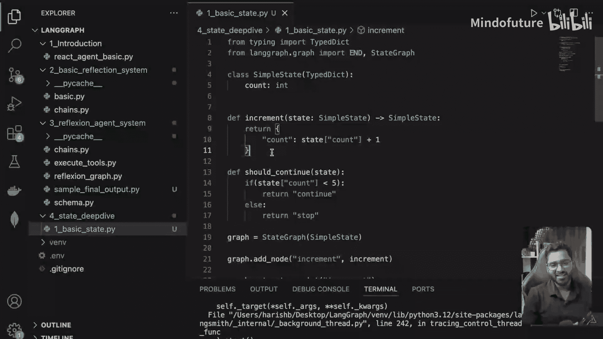
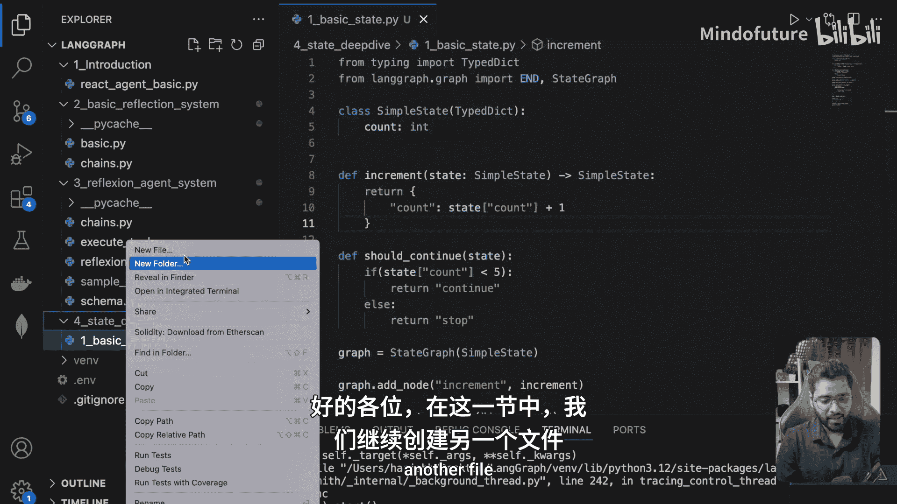
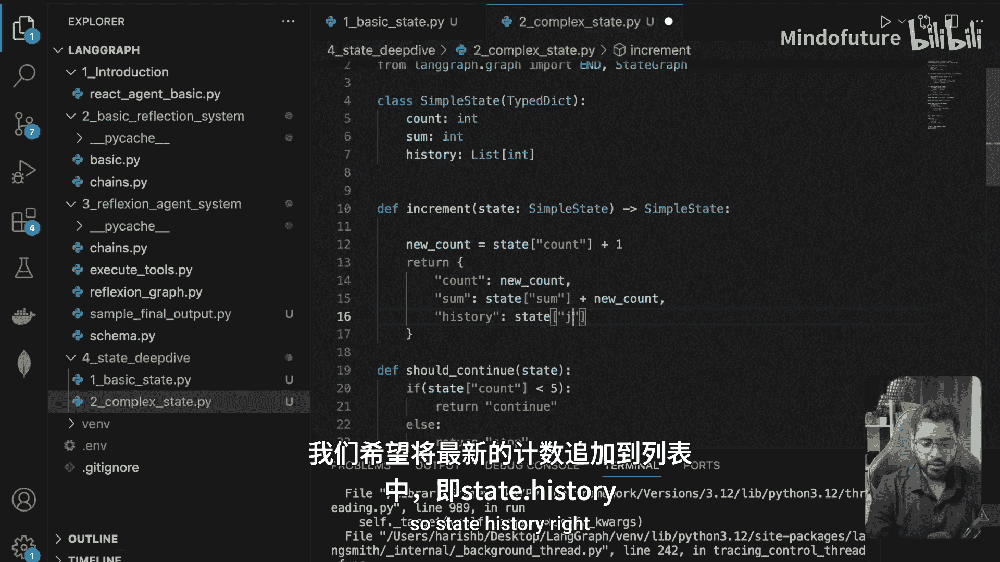
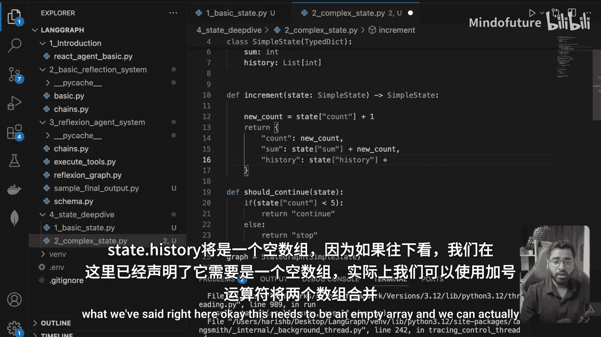
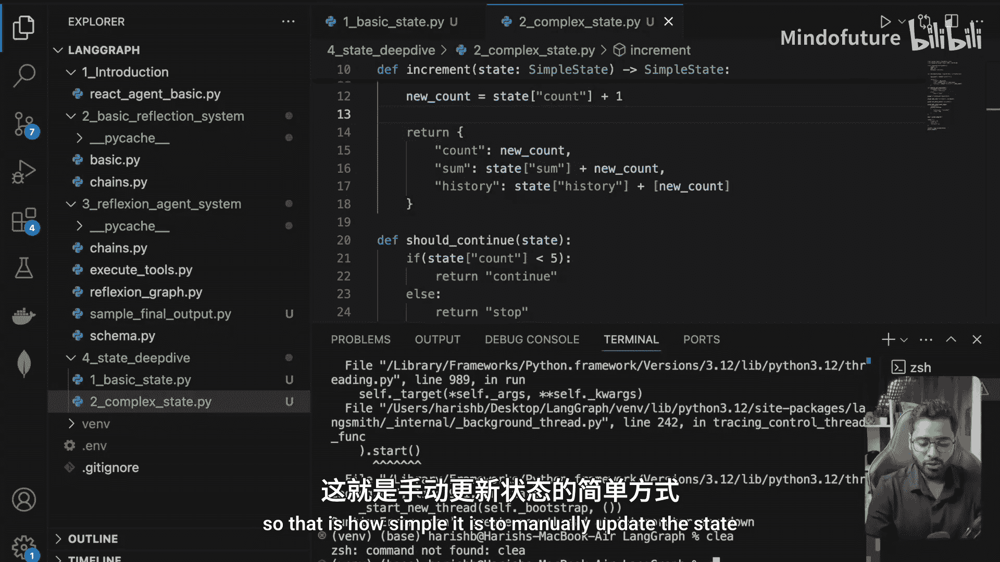
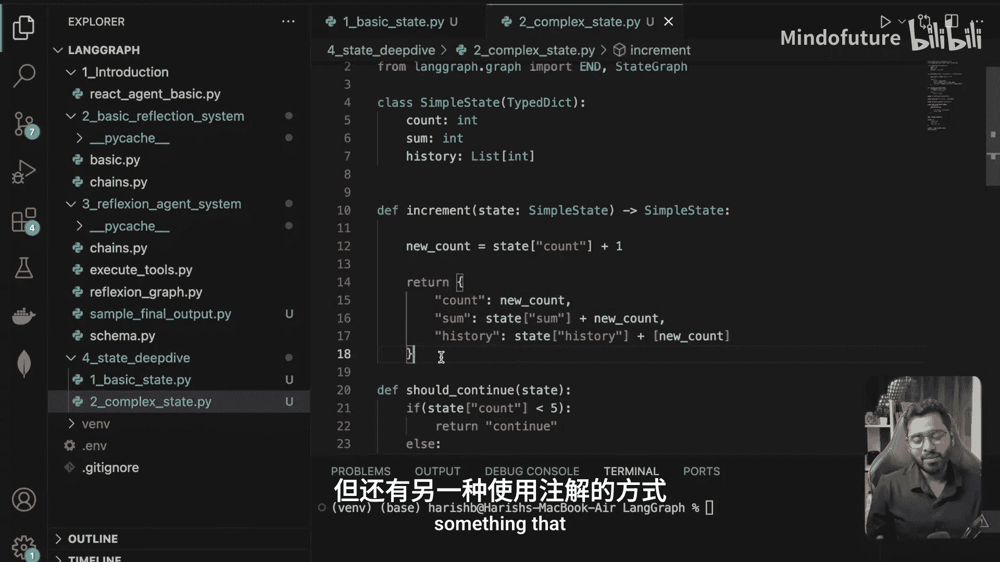

# 017：手动状态转换 🛠️





在本节课中，我们将学习如何在LangGraph中手动更新和管理自定义状态。我们将通过一个示例，逐步向状态对象中添加多个属性，并演示如何手动计算和更新这些属性的值。

---

## 概述

上一节我们介绍了如何定义和使用自定义状态。本节中，我们将深入探讨如何手动操作状态，即通过编写明确的逻辑来计算并更新状态中的各个属性。我们将创建一个包含`count`（计数）、`sum`（总和）和`history`（历史记录）的复杂状态对象。

## 创建复杂状态文件

首先，我们创建一个名为`complex_state.py`的新文件。为了快速开始，我们可以将上一节中的代码复制过来作为基础。

```python
# 此处将粘贴上一节的代码作为起点
```

## 扩展状态属性：添加总和（Sum）

我们的初始状态蓝图目前只包含一个`count`属性。现在，我们想添加一个`sum`属性，用于追踪`count`在系统运行过程中所有值的累加和。

1.  **定义初始状态**：在初始状态中，将`sum`设置为0。
2.  **更新逻辑**：在每次更新`count`的节点中，我们不仅要增加`count`，还要将新的`count`值加到当前的`sum`上。

以下是实现步骤：

```python
# 假设这是更新状态的节点函数
def update_state(state):
    # 获取当前状态中的count和sum
    current_count = state["count"]
    current_sum = state["sum"]
    
    # 计算新的count值（例如，每次加1）
    new_count = current_count + 1
    
    # 计算新的sum值：旧总和 + 新count值
    new_sum = current_sum + new_count
    
    # 返回更新后的状态
    return {"count": new_count, "sum": new_sum}

# 初始状态
initial_state = {"count": 0, "sum": 0}
```
运行此代码后，经过若干次迭代，如果`count`增加到5，那么`sum`将是0+1+2+3+4+5=15。

## 进一步扩展：添加历史记录（History）

接下来，我们添加第三个属性`history`，它是一个列表，用于记录`count`每次变化时所达到的值。

1.  **定义初始状态**：将`history`初始化为一个空列表`[]`。
2.  **更新逻辑**：在每次状态更新时，将新的`count`值追加到`history`列表的末尾。

以下是更新后的代码：

```python
def update_state(state):
    current_count = state["count"]
    current_sum = state["sum"]
    current_history = state["history"] # 获取当前历史记录
    
    new_count = current_count + 1
    new_sum = current_sum + new_count
    
    # 更新历史记录：将旧列表与新值（包装成列表）合并
    new_history = current_history + [new_count]
    
    return {
        "count": new_count,
        "sum": new_sum,
        "history": new_history
    }

# 初始状态
initial_state = {"count": 0, "sum": 0, "history": []}
```
运行程序后，最终状态可能如下所示：
*   `count`: 5
*   `sum`: 15
*   `history`: [1, 2, 3, 4, 5]

这清晰地展示了`count`的增长过程。

## 手动状态更新的核心





在本节中，我们采用的方法是**手动状态更新**。这意味着：
*   我们亲自编写所有计算逻辑（如`new_sum = current_sum + new_count`）。
*   我们明确地构造并返回包含所有新值的状态字典。

这种方法将状态更新的控制权完全交给了开发者，非常灵活，可以根据需要添加任意数量的属性并定义它们之间的任何关系。

---

## 总结

本节课我们一起学习了如何在LangGraph中手动管理复杂状态。我们通过示例演示了如何：
1.  向状态对象中添加新的属性（`sum`和`history`）。
2.  在节点函数中编写逻辑，手动计算这些属性的新值。
3.  通过返回完整的字典来更新整个状态。





手动更新提供了最大的灵活性。然而，LangGraph还提供了另一种更简洁的方法——使用**注解（Annotation）**来自动化部分状态管理任务。这将是我们在下一节要探讨的内容。