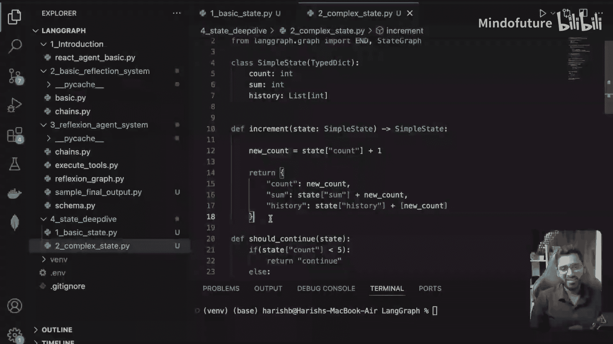
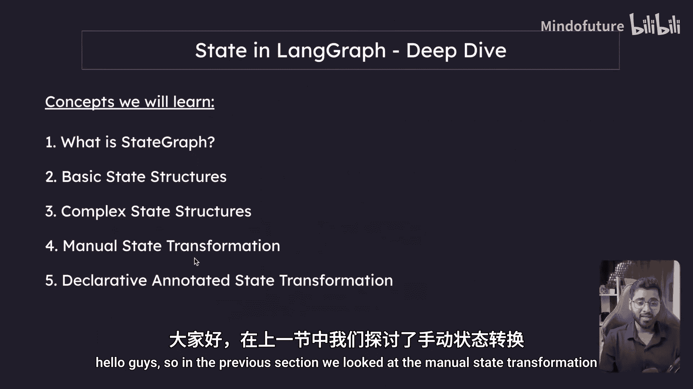
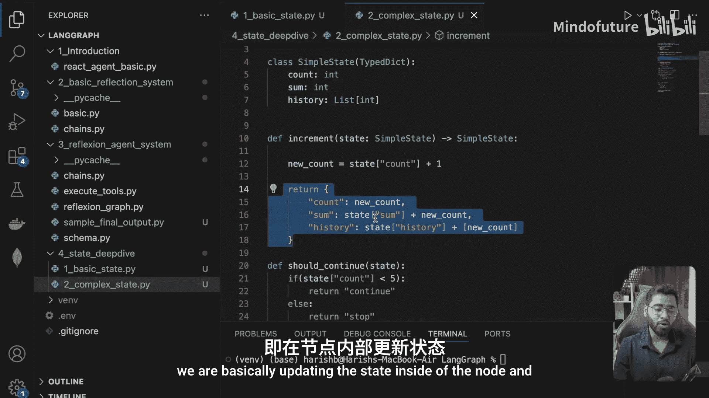
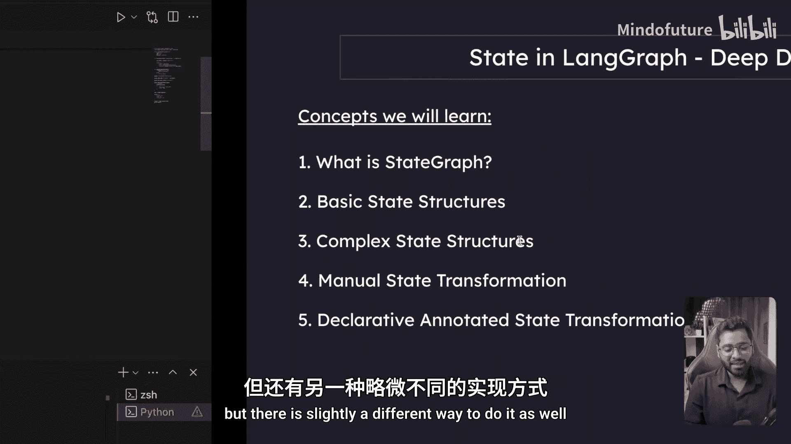
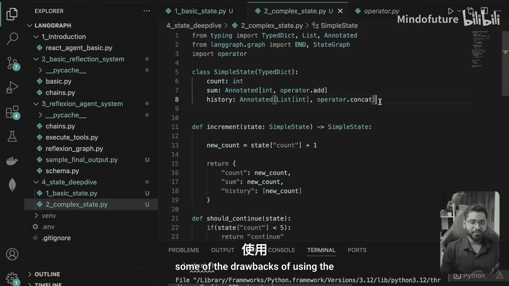

# 018：声明式注释状态转换 🧩



在本节课中，我们将要学习LangGraph中的“声明式注释状态转换”。这是一种更简洁、更声明式的方法，用于定义状态如何随着节点执行而更新，可以避免在多个节点中重复编写相同的状态更新逻辑。

## 概述

上一节我们介绍了手动状态转换，即在节点内部直接计算并更新状态。虽然可行，但当多个节点需要进行相同的状态更新操作（例如求和或列表合并）时，代码会变得重复。本节我们将学习一种更优的方法——声明式注释状态转换，它通过注解来定义状态更新规则，使代码更清晰、更易于维护。

## 声明式状态转换详解





以下是声明式注释状态转换的核心步骤：




首先，我们需要从`langgraph.graph`导入`StateGraph`和`ANNOTATIONS`模块中的`add_messages`（或其他操作符），但根据原文示例，我们将直接使用一个通用的`operator`概念。在实际的LangGraph中，你可能需要从`langgraph.graph`导入特定的操作符，如`add_messages`用于消息列表。为了演示，我们假设有一个`operator`对象提供了各种方法。

**核心概念**：我们使用`annotated`函数来声明一个状态字段。该函数接受两个参数：第一个是字段的类型提示（如`int`, `list`），第二个是定义如何将该字段的新值与现有值合并的操作符。

例如，假设我们有一个状态字段`total`用于累加和，另一个字段`history`用于合并列表。在手动方式中，我们会在每个节点里写`state[“total”] += new_value`。在声明式方式中，我们可以在定义状态结构时，直接声明其更新规则。

```python
# 伪代码示例，展示概念
from typing import Annotated
from langgraph.graph import StateGraph, START, END
# 假设从某处导入操作符，如 `add`, `concat`
# from langgraph.graph import add, concat

# 定义状态结构
class State(TypedDict):
    total: Annotated[int, operator.add]  # 新值将与旧值相加
    history: Annotated[list, operator.concat] # 新列表将与旧列表连接
```

在上面的代码中：
*   `Annotated[int, operator.add]` 表示`total`字段是一个整数，每当有节点返回一个用于更新`total`的新值时，系统会自动执行 **`旧值 + 新值`** 的操作。
*   `Annotated[list, operator.concat]` 表示`history`字段是一个列表，更新时会自动执行 **`旧列表 + 新列表`** 的连接操作。

这意味着，在节点函数中，你只需要返回想要“添加”到`total`的数值，或想要“追加”到`history`的列表，而无需手动进行加法或合并操作。LangGraph会根据注解自动完成状态更新。

## 操作符方法

`operator`对象提供了多种用于合并状态的方法，以适应不同的数据类型和场景。以下是一些常见的方法：

*   `operator.add`: 用于数值相加。
*   `operator.concat`: 用于序列（如列表、字符串）的连接。
*   `operator.update`: 用于字典的更新。
*   其他可能的方法包括处理集合等。

你可以根据状态字段的数据类型和想要的合并行为，选择相应的操作符。如果内置操作符不能满足你的需求，你仍然可以回退到在节点内进行手动状态转换。

## 代码简化对比

使用声明式注释后，节点内部的代码会变得非常简洁。节点只需要关注其核心业务逻辑并返回需要“贡献”给状态的值，而不需要关心如何与现有状态合并。

例如，一个计算节点可能只需要这样写：
```python
def compute_node(state):
    new_value = 5 # 执行某些计算
    return {"total": new_value} # 返回想加到total上的值
```
当这个节点执行后，LangGraph会自动调用`operator.add`，将`new_value`加到状态的`total`字段上。

## 总结

本节课我们一起学习了LangGraph中的声明式注释状态转换。我们了解了它如何通过`Annotated`类型提示和操作符（如`add`, `concat`）来定义状态的更新规则，从而将更新逻辑从各个节点中抽离出来，显著减少代码重复，并提升代码的清晰度和可维护性。



这种方法为我们提供了强大的状态管理能力。在接下来的章节中，我们将运用目前所学的知识（包括多智能体工作流、条件边、状态转换等），从头开始构建我们自己的ReAct智能体。这将帮助我们更深入地理解LangGraph的工作原理，并获得比使用LangChain高级类更大的灵活性和控制力，例如更好地处理潜在的死循环问题。