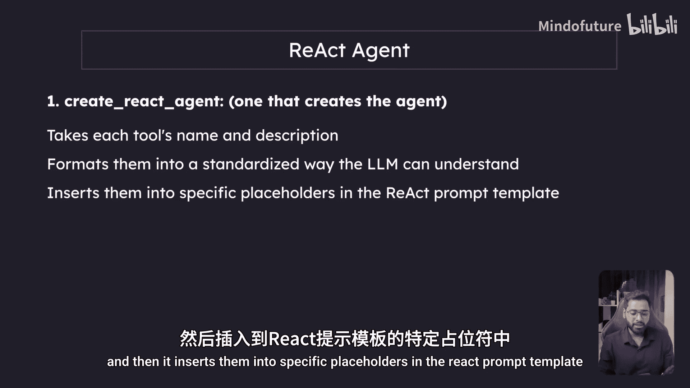
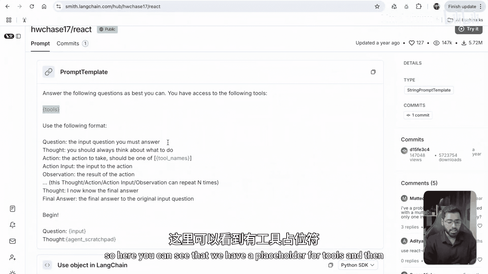
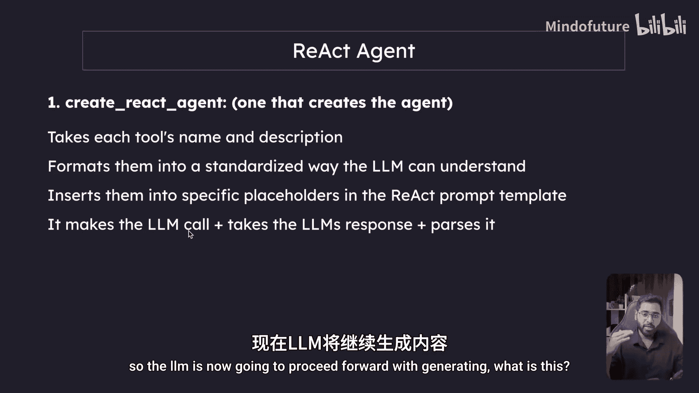
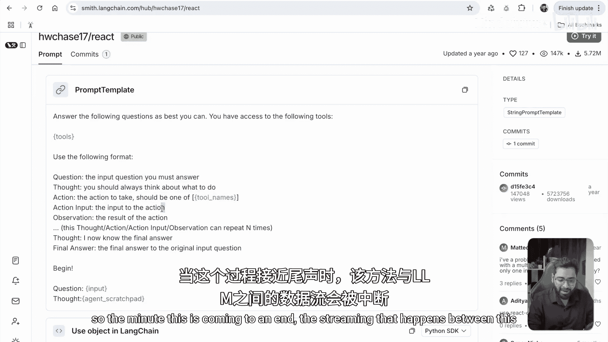
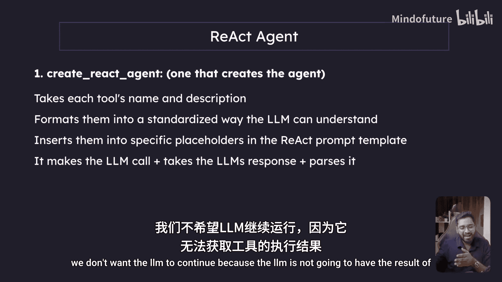
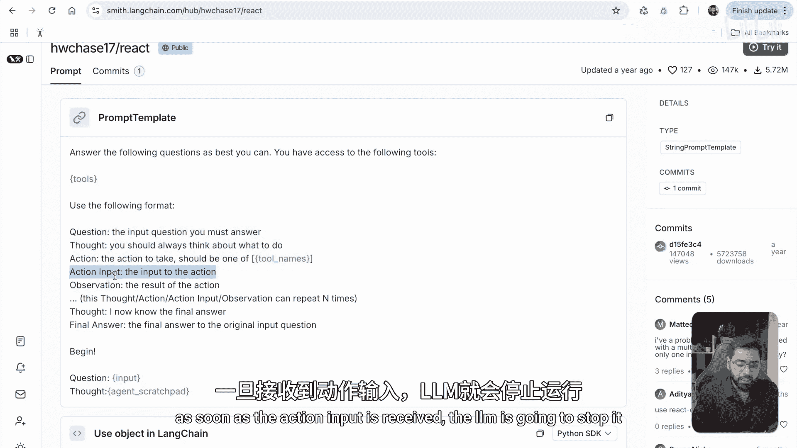
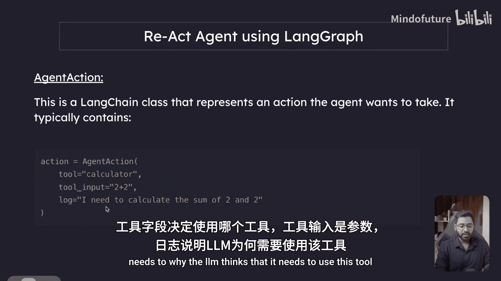
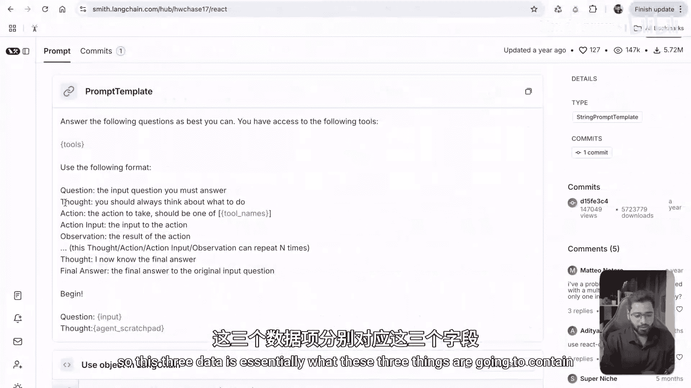
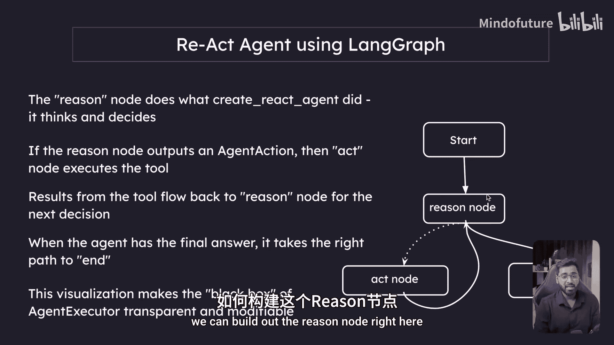

# 019：使用 LangGraph 构建 ReAct 智能体概述 🧠

在本节课中，我们将学习如何使用 LangGraph 从头开始构建一个 ReAct 智能体。我们将摆脱 LangChain 中现成的 `AgentExecutor` 类，从而获得对智能体推理与执行循环的完全控制。

## 回顾：ReAct 模式与 LangChain 实现

上一节我们深入学习了 LangGraph 中的状态管理。本节中，我们将运用这些知识来构建 ReAct 智能体。我们之前曾使用 LangChain 的 `initialize_agent` 方法和 `AgentExecutor` 类实现过 ReAct 智能体。但这次，我们将消除 `AgentExecutor`，通过 LangGraph 的图数据结构来完全掌控 LLM 与工具之间的循环交互。

首先，让我们快速回顾一下 ReAct 智能体的工作模式。

ReAct 模式遵循“思考-行动-观察”的循环：
1.  **思考**：LLM 首先分析用户的问题。
2.  **行动**：LLM 决定是自行回答，还是调用工具。
3.  **观察**：如果调用工具，LLM 提供工具所需的输入参数，执行工具并获得结果。

这个循环会持续进行，直到 LLM 认为问题已解决，并给出最终答案。

我们之前面临的问题是，无法完全控制 LangChain 提供的默认 `AgentExecutor` 类，这有时会导致无限循环等问题。使用 LangGraph 正是为了解决这个问题。

## 剖析 LangChain 的 ReAct 实现

在开始用 LangGraph 实现之前，让我们先快速了解一下 LangChain 中 `initialize_agent` 方法的工作原理。

在 LangChain 中，`initialize_agent` 是一个一站式解决方案。它内部结合了两个关键组件：
1.  `create_react_agent` 方法
2.  `AgentExecutor` 类



我们将用 LangGraph 来替代的正是 `AgentExecutor`。



### 组件一：`create_react_agent` 方法

这个方法主要负责创建智能体的“推理”部分。以下是它的核心功能：

以下是 `create_react_agent` 方法的主要工作流程：







*   **整合工具信息**：它接收所有可用工具的**名称**和**描述**，将其格式化为 LLM 能理解的标准化字符串。
*   **填充提示词模板**：它将格式化后的工具信息插入到 ReAct 提示词模板的特定占位符中。这样，LLM 在推理时就能清楚知道可以使用哪些工具。
*   **调用 LLM 并解析**：它调用 LLM。LLM 开始生成包含 `Thought`、`Action`、`Action Input` 的文本流。一旦 `Action Input` 生成完毕，该方法会中断 LLM 的流式输出（因为此时需要执行工具，LLM 还没有工具执行结果）。
*   **返回决策**：最后，该方法将 LLM 的响应解析为以下两个类之一：
    *   `AgentAction`：表示智能体决定采取一个行动（调用工具）。它包含 `tool`（工具名）、`tool_input`（工具输入）和 `log`（思考过程）。
    *   `AgentFinish`：表示智能体认为任务已完成，包含 `output`（最终答案）和 `log`。



简单来说，`create_react_agent` 完成了 50% 的工作：它让 LLM 进行思考并做出决策（行动或结束）。

### 组件二：`AgentExecutor` 类

这个类负责管理智能体的**执行循环**。以下是它的作用：

以下是 `AgentExecutor` 的核心职责：



*   **接管智能体**：它接收来自 `create_react_agent` 的智能体。
*   **管理循环**：它接收用户问题，并将其喂给智能体（即 `create_react_agent` 方法）。
*   **判断与执行**：它根据智能体的输出（`AgentAction` 或 `AgentFinish`）来判断下一步。
    *   如果是 `AgentAction`，则执行指定的工具，并捕获结果。
    *   如果是 `AgentFinish`，则循环结束，向用户返回最终答案。
*   **反馈结果**：将工具执行的结果与历史对话一起，再次反馈给智能体，以进行下一轮决策。



正是这个 `AgentExecutor` 内部的“黑盒”循环让我们失去了控制权。使用 LangGraph，我们将用可视化的图工作流来取代它，从而获得完全的掌控。

## LangGraph 方案的优势与设计

LangGraph 的核心优势在于，它将隐藏的“黑盒”循环转变为一个**可见、可编辑的工作流**。你可以添加自定义节点、修改流程、插入额外逻辑。

对于 ReAct 智能体，我们可以设计一个简单的图：

```
[开始]
  |
  v
[Reason Node] (推理节点)
  |          \
  | (AgentAction) \ (AgentFinish)
  v                \
[Act Node]   (结束，返回答案)
  | (工具结果)
  v
[回到 Reason Node]
```

*   **推理节点**：其功能相当于 `create_react_agent` 方法。它进行思考并做出决策。
*   **行动节点**：如果推理节点输出 `AgentAction`，则行动节点负责执行对应的工具。
*   **循环**：工具执行的结果会流回推理节点，以进行下一次决策。
*   **结束**：当推理节点输出 `AgentFinish` 时，流程走向结束路径，返回最终答案。

这种可视化使得智能体执行器的内部过程变得透明且可修改。

## 总结

本节课我们一起回顾了 ReAct 智能体的模式，并剖析了 LangChain 中 `initialize_agent` 如何通过 `create_react_agent` 和 `AgentExecutor` 两个组件来实现它。我们指出了 `AgentExecutor` 作为“黑盒”的局限性。最后，我们介绍了使用 LangGraph 的解决方案——通过构建一个由“推理节点”和“行动节点”组成的清晰图工作流，来获得对智能体循环的完全控制。



在下一节中，我们将开始动手，详细学习如何构建这个图中的“推理节点”。