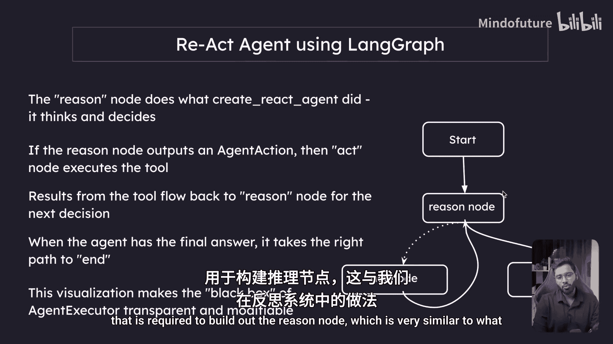
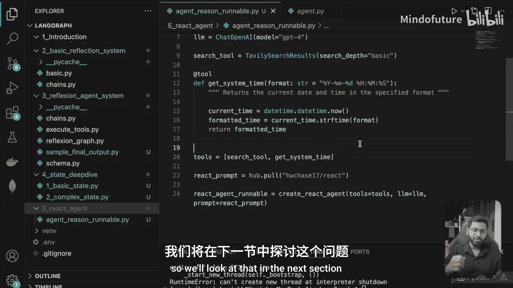

# 020：使用LangGraph的ReAct推理Runnable

在本节中，我们将构建用于创建“推理节点”所需的链或可运行对象。这与我们在反思系统中构建的内容非常相似。



## 概述

我们将创建一个名为 `react_agent` 的文件夹，并在其中构建一个名为 `agent_reason_runnable.py` 的文件。这个可运行对象将整合所有必要的组件，以构成一个基于ReAct（推理-行动）范式的智能体核心推理部分。

## 构建推理可运行对象

首先，我们需要导入必要的模块并设置基础组件。

```python
# 导入所需的库和模块
from langchain_openai import ChatOpenAI
from langchain.agents import create_react_agent
from langchain import hub
```

接下来，我们定义智能体将使用的工具。为了保持示例的连贯性，我们将复用之前课程中介绍过的工具。

以下是智能体将使用的工具列表：

*   **`get_system_time_tool`**：一个用于获取当前系统时间的工具。
*   **`search_tool`**：一个用于执行网络搜索的工具。

现在，我们需要获取ReAct智能体专用的提示词模板。我们将从LangChain Hub获取一个预定义的模板。

```python
# 从LangChain Hub拉取ReAct提示词模板
react_prompt = hub.pull("hwchase17/react")
```

有了模型、工具和提示词模板，我们现在可以使用 `create_react_agent` 方法来组装我们的推理可运行对象。

```python
# 创建ReAct智能体可运行对象
llm = ChatOpenAI(model="gpt-4", temperature=0)
tools = [get_system_time_tool, search_tool]

react_agent_runnable = create_react_agent(
    llm=llm,
    tools=tools,
    prompt=react_prompt
)
```

这个方法将返回一个可运行对象。这个 `react_agent_runnable` 封装了我们在之前幻灯片中看到的ReAct推理循环逻辑：观察、思考、行动。

## 过渡到状态设计

至此，我们已经成功创建了核心的推理可运行对象。在下一节中，我们将探讨如何为这个ReAct系统设计自定义状态。

正如我们在之前关于自定义状态的章节中所学，我们可以定义任何需要的属性来构建系统。对于ReAct智能体，我们需要仔细考虑并定义其运行过程中需要跟踪哪些状态信息。

## 总结



在本节中，我们一起完成了ReAct推理可运行对象的构建。我们整合了语言模型、工具集以及专门的提示词模板，使用 `create_react_agent` 方法创建了一个封装了推理逻辑的可执行单元。这为构建功能完整的LangGraph智能体奠定了核心基础。下一节，我们将把注意力转向智能体状态的设计。