# 021：使用LangGraph的ReAct状态

在本节中，我们将学习构建ReAct智能体系统所需的状态属性。我们将详细解释状态的结构、每个属性的作用，以及它们在整个智能体推理循环中是如何变化的。

## 概述

ReAct智能体通过“思考-行动”循环来解决问题。为了管理这个循环，我们需要一个清晰的状态结构来跟踪当前问题、智能体的决策以及历史步骤。本节将介绍构成这个状态核心的三个属性。

## 状态属性详解

我们首先创建一个名为 `AgentState` 的状态类。它需要三个核心属性来支撑整个系统运行。

以下是定义状态的关键代码：

```python
from typing import Union, List
from langgraph.graph import StateGraph, END
from langchain_core.agents import AgentAction, AgentFinish

class AgentState(TypedDict):
    human_message: str
    agent_outcome: Union[AgentAction, AgentFinish, None]
    intermediate_steps: List[tuple]
```

接下来，我们逐一解析这三个属性的含义和作用。

### 1. 初始问题（human_message）

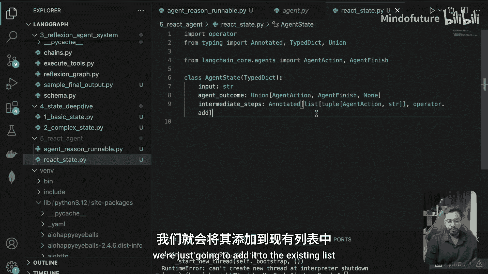

这个属性存储用户最初提出的问题或指令。它是整个智能体任务的起点，并且在后续所有步骤中保持不变，为每次推理提供原始上下文。

*   **初始值**：用户的完整提示词。
*   **作用**：作为任务的锚点，确保智能体在整个过程中不偏离原始目标。

### 2. 智能体输出（agent_outcome）

这个属性记录由“推理节点”（Reason Node）的LLM调用所产生的输出。它决定了智能体下一步是采取行动还是结束任务。

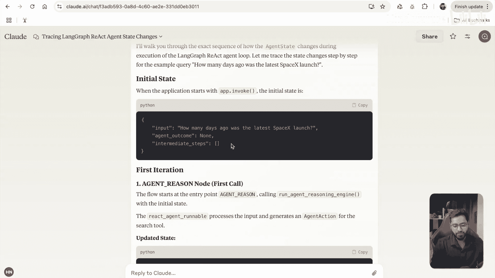

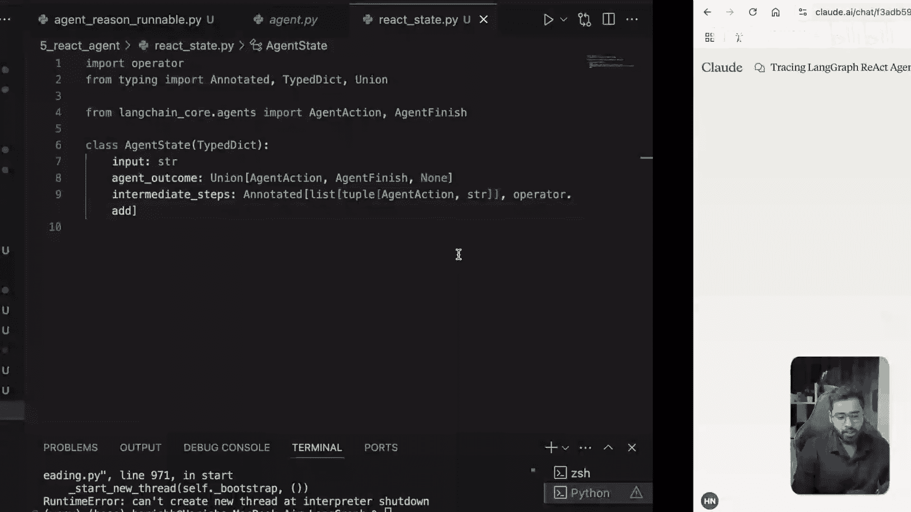

*   **数据类型**：可以是 `AgentAction` 或 `AgentFinish`。
*   **`AgentAction`**：表示智能体决定使用一个工具。它包含 `tool`（工具名称）、`tool_input`（工具输入）和 `log`（思考日志）。
*   **`AgentFinish`**：表示智能体认为任务已完成，并准备返回最终答案给用户。
*   **初始值**：`None`。
*   **作用**：作为控制流的路由依据。根据它的类型，系统决定下一步是进入“行动节点”还是“结束节点”。

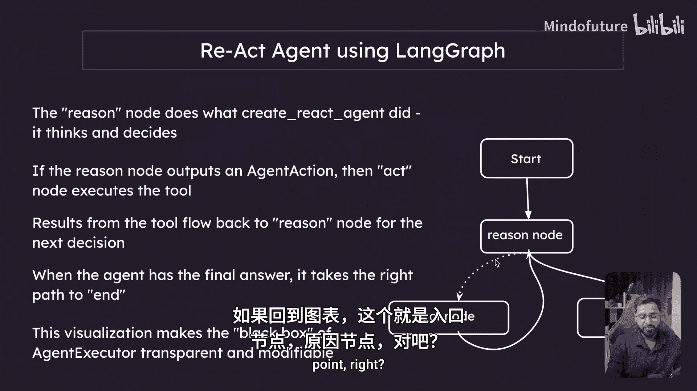

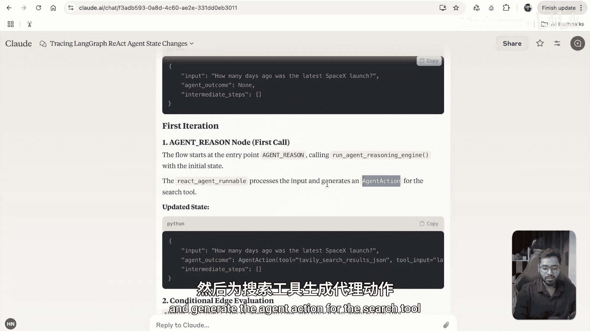

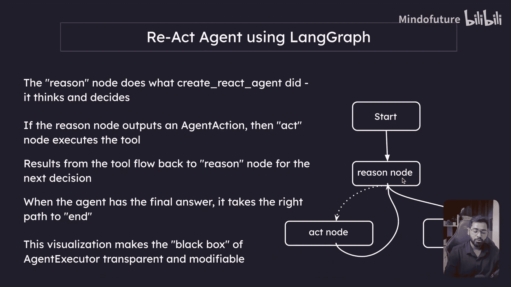

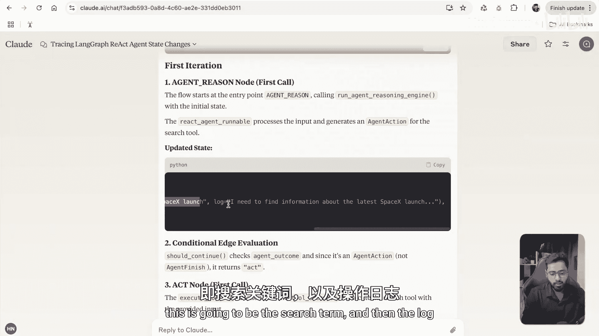

### 3. 中间步骤（intermediate_steps）

这个属性是一个列表，用于保存所有已执行过的工具调用及其结果的历史记录。它的存在是为了防止智能体重复解决已完成的子问题，并为后续推理提供上下文。

*   **数据类型**：`List[tuple]`，其中每个元组为 `(AgentAction, observation)`。
*   **`AgentAction`**：是之前触发工具调用的那个动作。
*   **`observation`**：是该工具执行后返回的结果。
*   **初始值**：空列表 `[]`。
*   **作用**：在每次循环中，这些历史记录都会被格式化后放入LLM的提示词（即Agent Scratchpad），帮助智能体了解已经做了什么以及得到了什么信息，从而规划下一步。

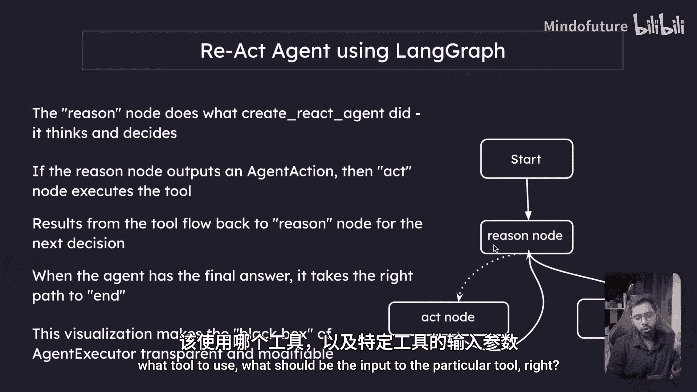

## 状态流转示例

为了更直观地理解，让我们通过一个示例来跟踪状态在整个ReAct循环中是如何变化的。假设用户的问题是：“先搜索LangGraph的最新版本，然后告诉我现在的系统时间。”

**初始状态**
*   `human_message`: “先搜索LangGraph的最新版本，然后告诉我现在的系统时间。”
*   `agent_outcome`: `None`
*   `intermediate_steps`: `[]`

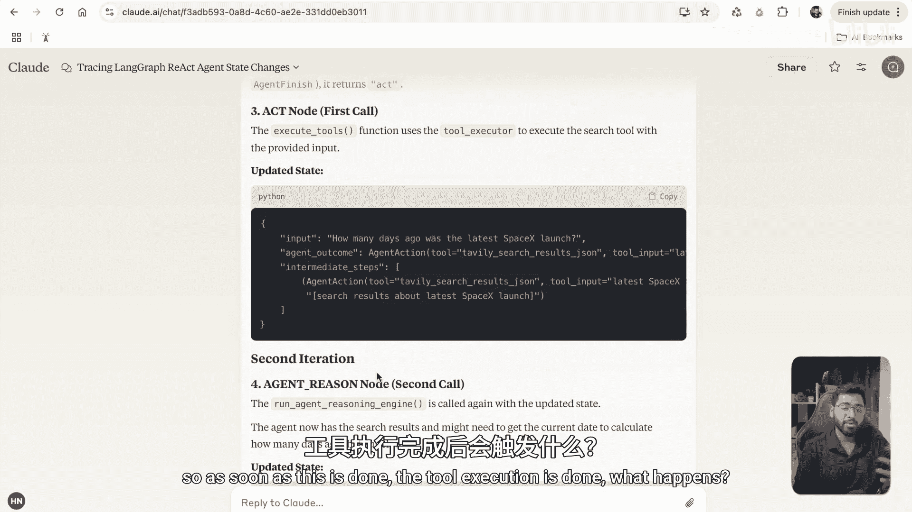

**第一轮循环**
1.  **推理节点**：LLM分析初始问题，决定首先调用“搜索工具”。它输出一个 `AgentAction(tool=‘search’， tool_input=‘LangGraph latest version’， log=‘...’)`。
    *   **状态更新**：`agent_outcome` 被更新为这个 `AgentAction`。
2.  **行动节点**：系统根据 `agent_outcome` 的类型判断应进入“行动节点”。该节点执行指定的搜索工具，并获得结果 `observation`（例如，“最新版本是2.0”）。
    *   **状态更新**：将 `(AgentAction, observation)` 这个元组追加到 `intermediate_steps` 列表中。同时，`agent_outcome` 被清空或准备接收下一轮输出。

**第二轮循环**
1.  **推理节点**：LLM再次被调用。此时，它的输入包含了原始的 `human_message` 和更新后的 `intermediate_steps`（即第一次搜索的历史）。LLM据此判断下一步需要调用“获取系统时间工具”，并输出新的 `AgentAction(tool=‘get_system_time’， ...)`。
    *   **状态更新**：`agent_outcome` 再次被更新。
2.  **行动节点**：执行获取系统时间的工具，得到当前时间，并再次更新 `intermediate_steps`。

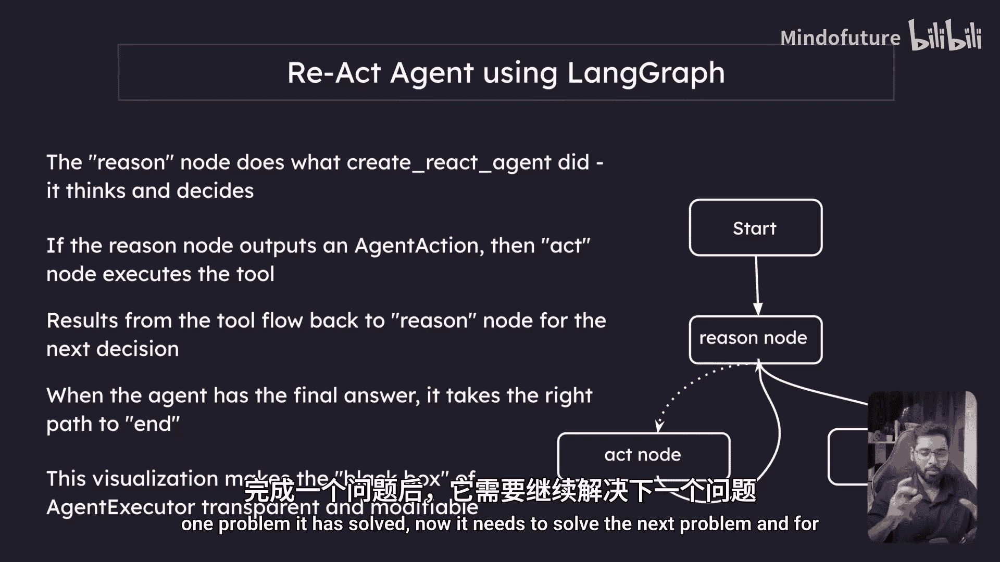

**最终轮循环**
1.  **推理节点**：LLM看到所有必要信息（搜索结果和系统时间）都已齐备，判断任务完成。它输出一个 `AgentFinish` 对象，其中包含给用户的最终答案。
    *   **状态更新**：`agent_outcome` 被更新为 `AgentFinish`。
2.  **结束**：系统根据 `agent_outcome` 的类型是 `AgentFinish`，将控制流转到“结束节点”，流程终止，向用户返回答案。

## 总结

本节课我们一起学习了构建LangGraph ReAct智能体所需的核心状态设计。我们定义了三个关键属性：
1.  **`human_message`**：保存不变的原始任务。
2.  **`agent_outcome`**：存储LLM的决策，指导下一步行动（继续或停止）。
3.  **`intermediate_steps`**：积累工具调用历史，为后续推理提供上下文。

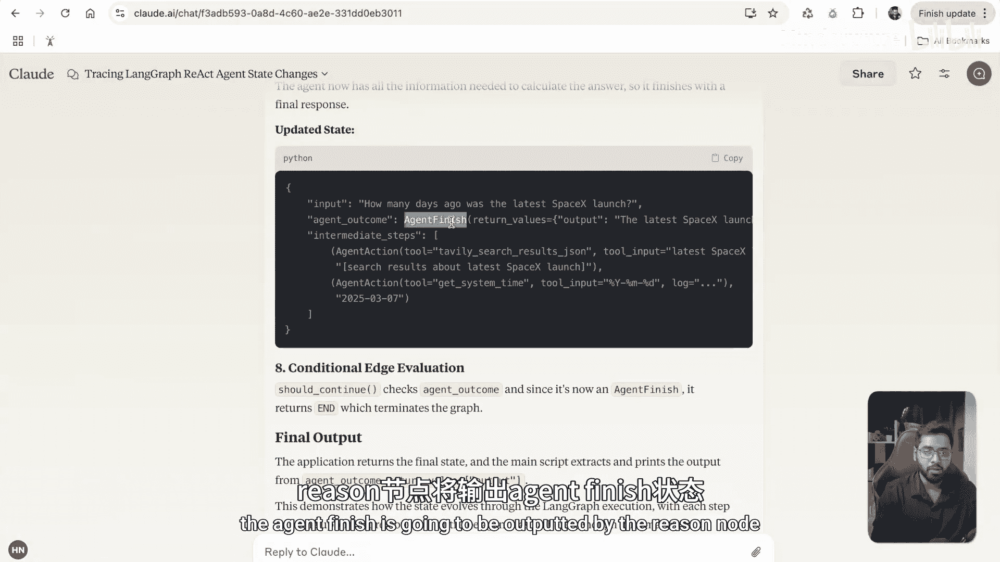

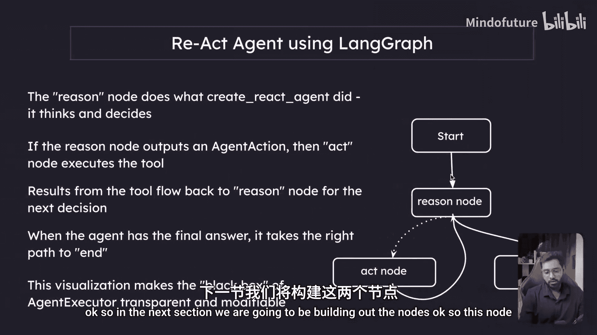

理解这个状态流转机制是构建功能正确的ReAct智能体的基础。在下一节中，我们将基于这个状态设计，开始动手构建具体的“推理节点”和“行动节点”。