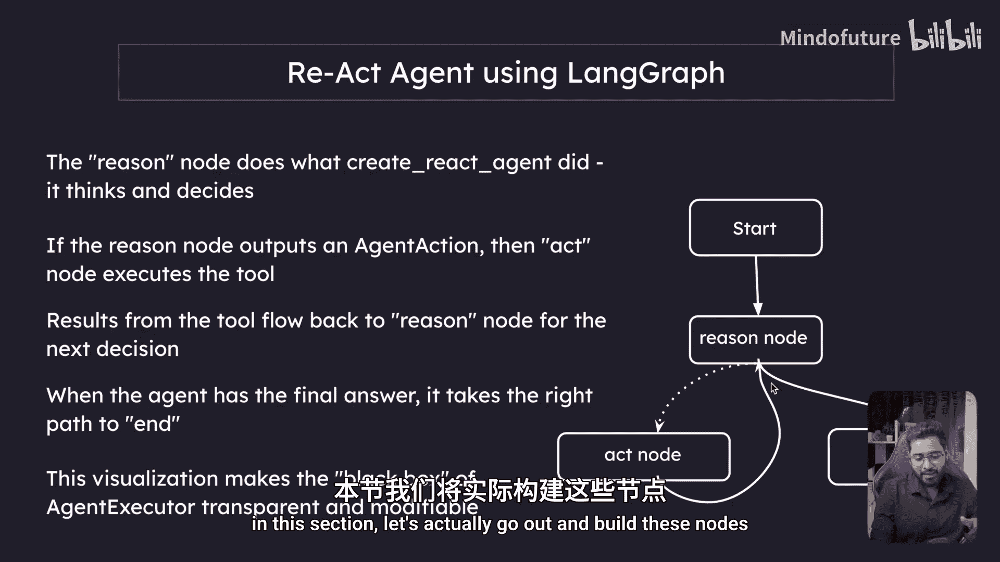
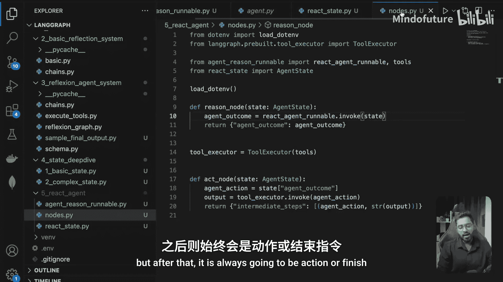
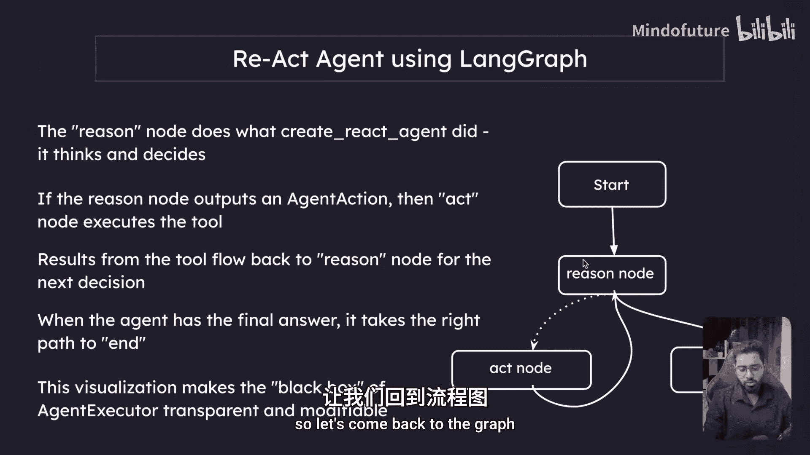
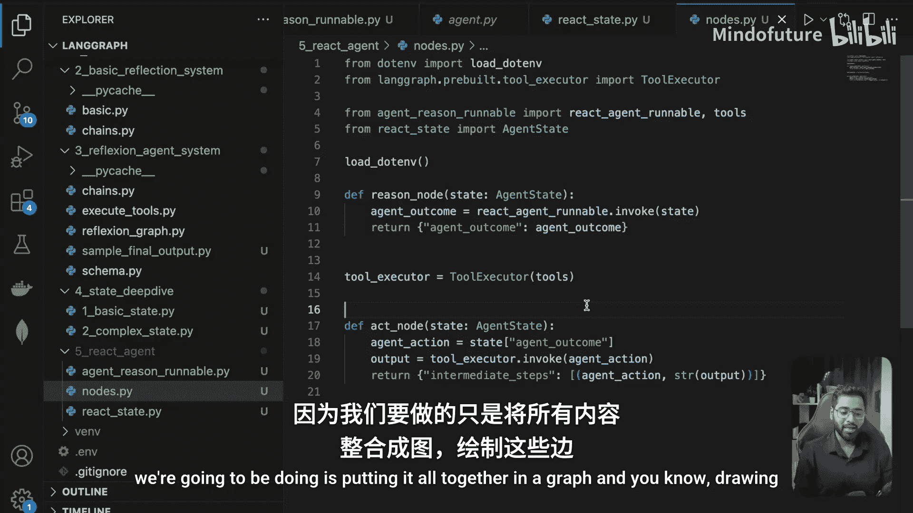
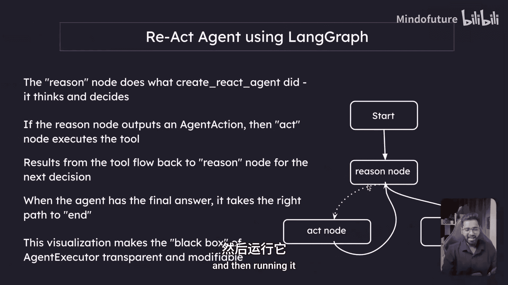

LangGraph初学者入门2025：P22：构建ReAct节点

在本节课中，我们将学习如何构建LangGraph中ReAct代理的两个核心节点：推理节点和执行节点。我们将基于上一节创建的Runnable，具体实现这两个节点的功能。



---

### 概述

上一节我们介绍了ReAct代理的Runnable构建。本节中，我们来看看如何将这个Runnable封装成LangGraph中可以使用的“推理”节点和“执行”节点。

### 构建推理节点

推理节点的核心作用是调用我们之前构建的ReAct代理Runnable，并根据当前状态决定下一步是执行工具调用还是结束任务。

以下是推理节点的实现步骤：

1.  **导入依赖**：使用上一节创建的ReAct代理Runnable。
2.  **调用Runnable**：使用当前的`agent_state`来调用这个Runnable。
3.  **处理输出**：Runnable的输出将是`AgentAction`或`AgentFinish`类的实例，我们需要将其更新到状态中。

在代码中，这体现为调用Runnable并传入特定的状态键。这些键名（如`input`， `agent_outcome`， `intermediate_steps`）是保留关键字，必须严格匹配，Runnable才知道如何处理它们。

```python
# 伪代码示意
reason_node_output = react_agent_runnable.invoke({
    “input”: state[“input”],
    “agent_outcome”: state[“agent_outcome”],
    “intermediate_steps”: state[“intermediate_steps”]
})
new_state = {“agent_outcome”: reason_node_output}
```

执行此节点后，`agent_outcome`将不再是`None`，而是变为一个`AgentAction`或`AgentFinish`对象。

### 构建执行节点

当推理节点的结果是`AgentAction`时，流程会进入执行节点。该节点的职责是执行指定的工具调用，并将结果记录下来。



以下是执行节点的实现步骤：



1.  **提取动作**：从`agent_outcome`中获取需要执行的`AgentAction`。
2.  **执行工具**：使用`ToolExecutor`来调用该动作对应的工具。
3.  **记录步骤**：将本次“动作-结果”对添加到中间步骤列表中。

```python
# 伪代码示意
agent_action = state[“agent_outcome”]
tool_output = tool_executor.invoke(agent_action)
new_intermediate_step = (agent_action, str(tool_output))
```

这里返回的`new_intermediate_step`是一个元组，其第一个元素是`AgentAction`（或`AgentFinish`），第二个元素是工具执行结果的字符串。由于我们在状态定义中为`intermediate_steps`配置了`operator.add`操作符，这个新步骤会自动追加到现有的步骤列表末尾。

### 节点协作流程

现在，我们已经有了`reason_node`和`act_node`。它们将按以下方式协作：
1.  `reason_node`分析当前状态，决定下一步行动（`AgentAction`或`AgentFinish`）。
2.  如果结果是`AgentAction`，则`act_node`执行该动作，并将结果存入历史。
3.  带有新历史记录的状态会再次送入`reason_node`，进行下一轮推理，直到`reason_node`输出`AgentFinish`为止。

### 总结





本节课中，我们一起学习了如何构建LangGraph ReAct代理的核心节点。
*   **推理节点**负责思考，调用LLM并决定下一步。
*   **执行节点**负责行动，运行工具并记录结果。
这两个节点通过共享和更新`agent_state`进行协作，形成了ReAct（推理-执行）循环的基础。在下一节中，我们将把这些节点组合到一个完整的图中，并设置它们之间的边，最终让我们的代理运行起来。