# 023：手动执行工具（替代已弃用的 ToolExecutor）

在本节课中，我们将学习如何在不使用 LangGraph 最新版本中已弃用的 `ToolExecutor` 类的情况下，手动执行语言模型选择的工具。我们将通过解析代理动作、匹配工具并直接调用它们来实现一个更简单、更可控的执行流程。

## 概述

上一节我们介绍了代理执行的基本流程。本节中，我们来看看如何手动处理工具调用，以替代已弃用的 `ToolExecutor`。核心在于从代理动作中提取信息，并直接调用对应的工具函数。

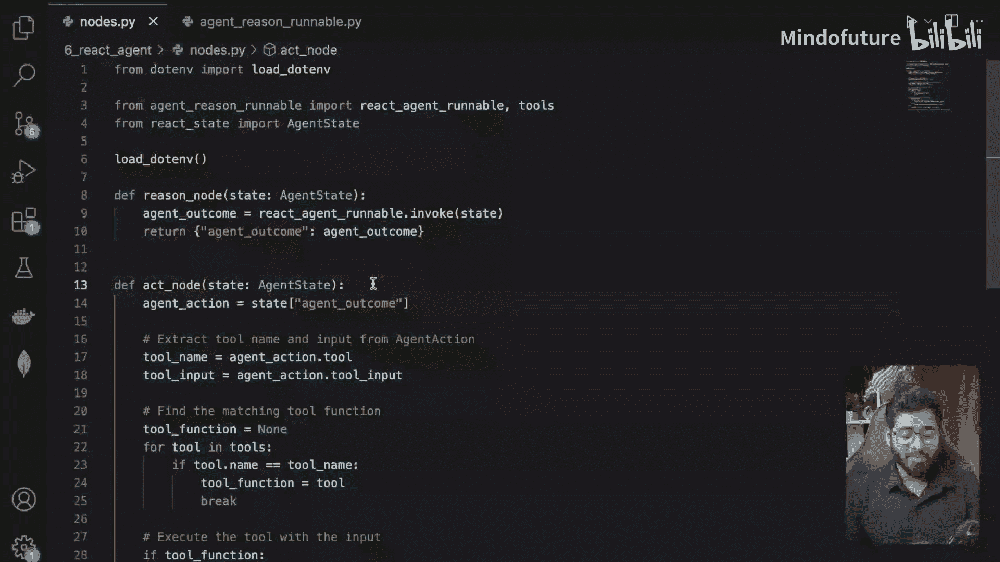

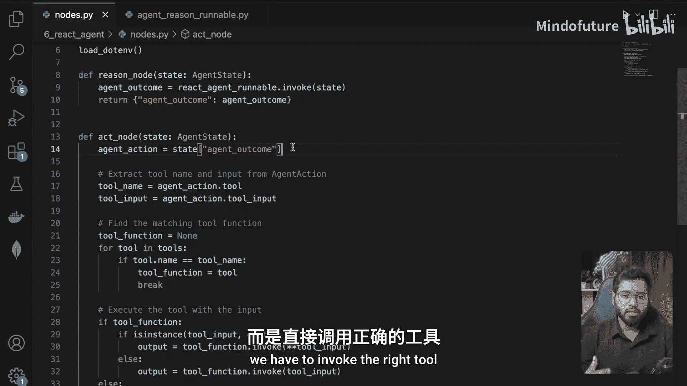

## 从代理动作中提取信息

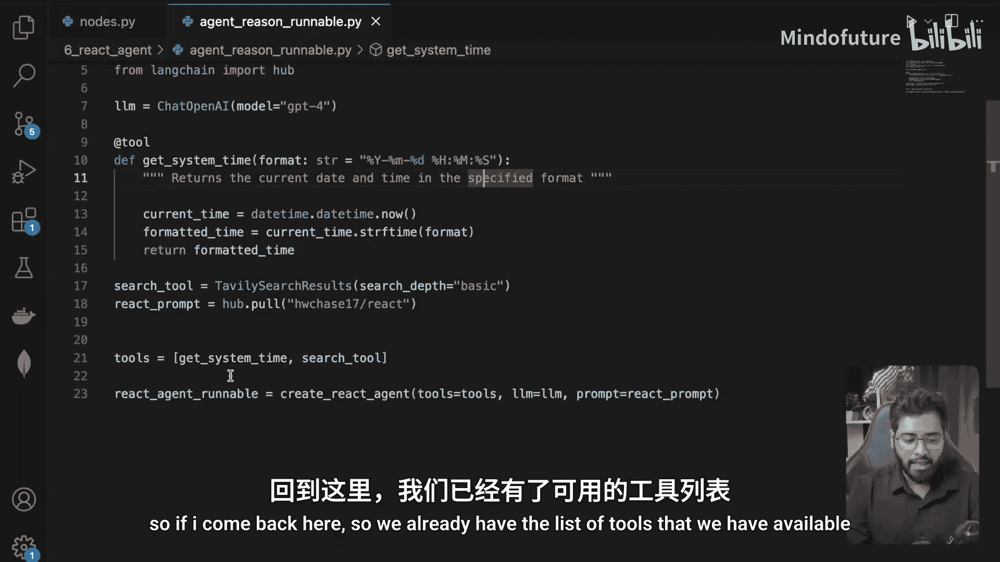

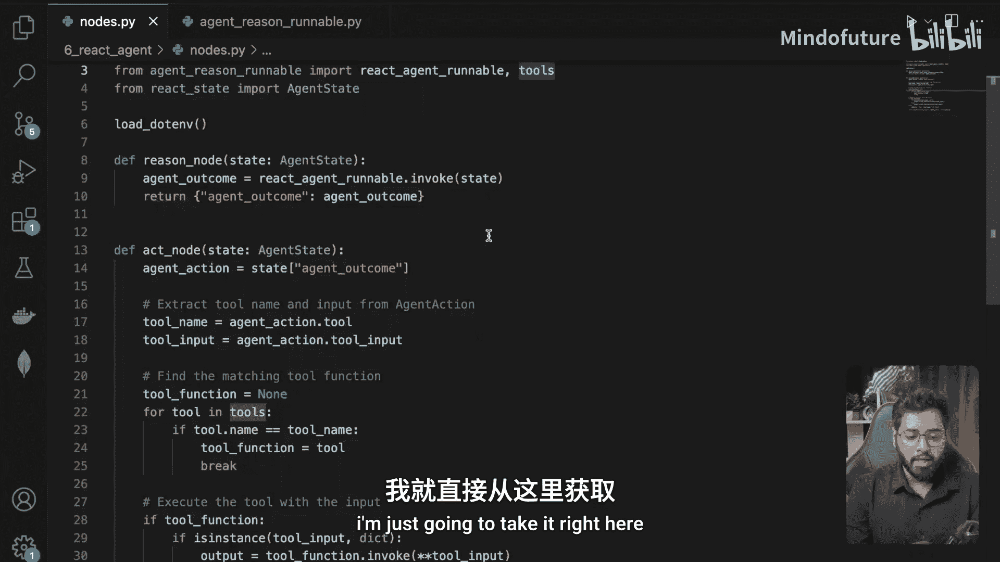

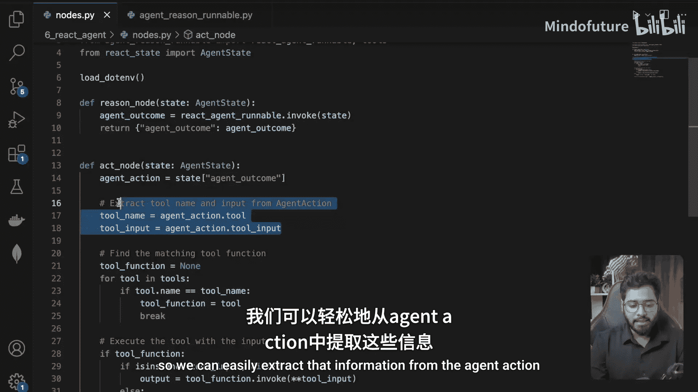

第一步是从语言模型返回的代理动作中，获取它想要调用的具体工具名称和输入参数。

以下是关键步骤的代码描述：
```python
# 假设 agent_action 是语言模型返回的动作对象
tool_name = agent_action.tool  # 获取工具名称
tool_input = agent_action.tool_input  # 获取工具输入参数
```
通过这两行代码，我们可以明确知道模型希望调用哪个工具（例如 `get_time` 或 `search_tool`）以及需要传入什么参数。

## 匹配并获取工具函数

获取工具名称和输入后，下一步是在我们已有的工具列表中，找到与之匹配的具体工具函数。

以下是匹配过程的逻辑：
1.  我们有一个可用的工具列表，例如 `[get_time_tool, search_tool]`。
2.  遍历这个列表，将每个工具的名称与从 `agent_action` 中提取出的 `tool_name` 进行比较。
3.  当找到名称匹配的工具时，获取对该工具函数本身的引用。

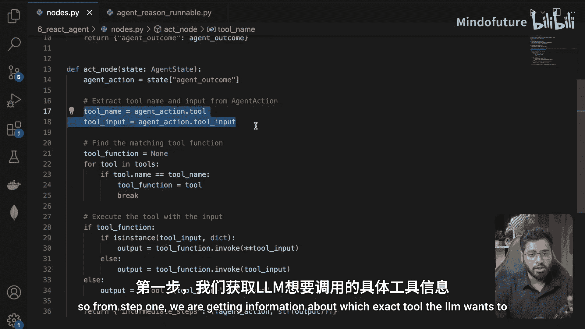

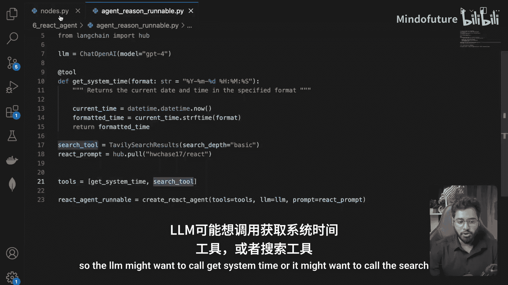

这个过程的核心代码如下：
```python
def find_tool(tool_name, available_tools):
    for tool in available_tools:
        if tool.name == tool_name:  # 假设工具对象有 .name 属性
            return tool
    return None  # 如果没有找到匹配的工具

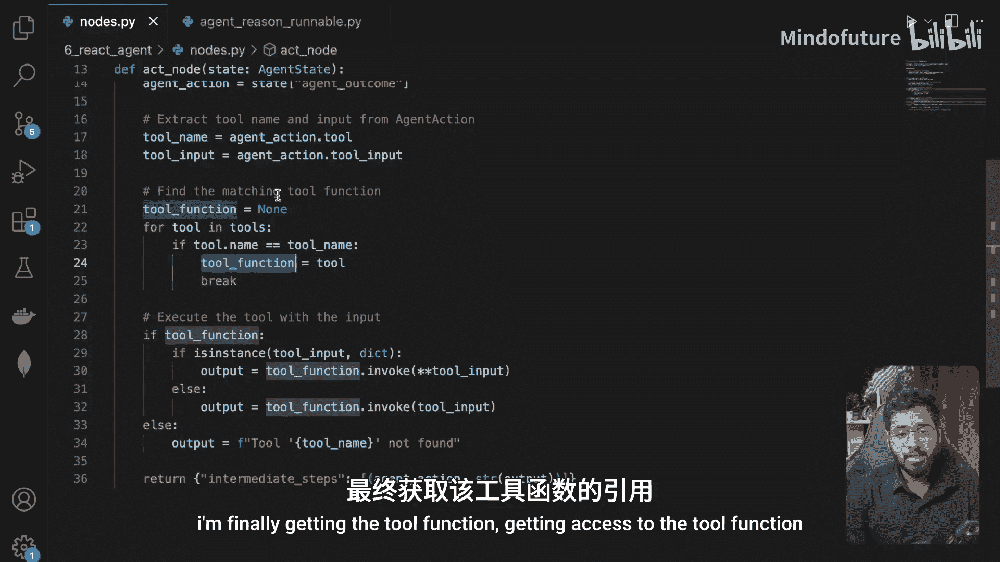

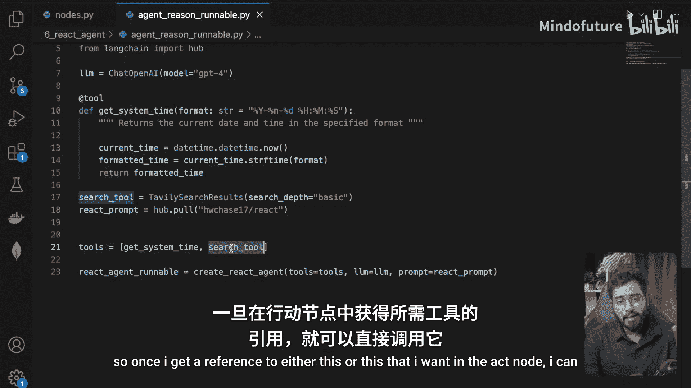

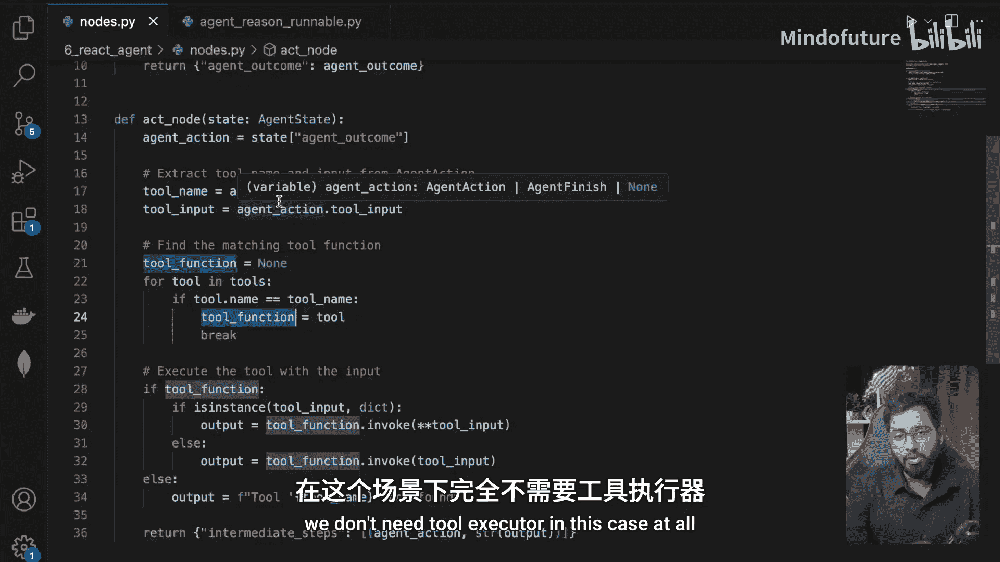

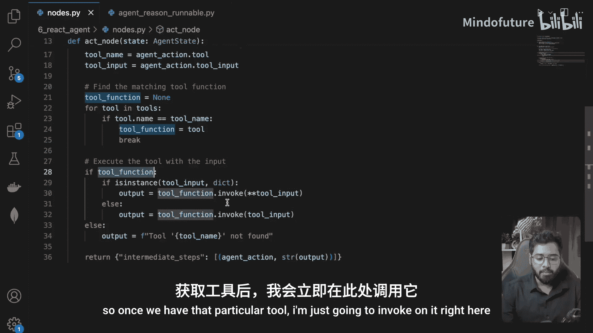

target_tool = find_tool(tool_name, available_tools)
```
这样，`target_tool` 变量就指向了我们真正需要调用的那个函数（例如 `get_time` 或 `search`）。

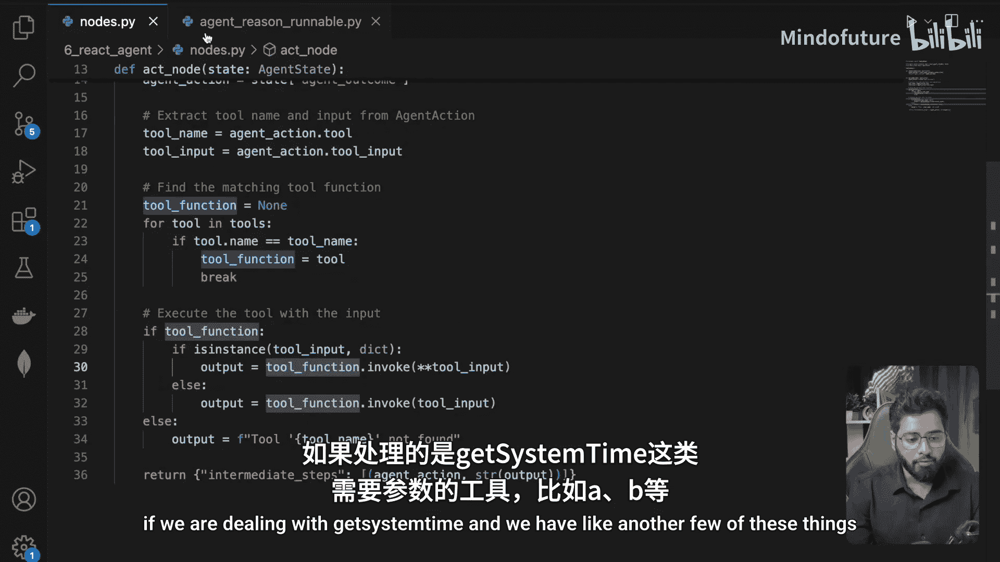

## 执行工具并处理结果

一旦获得了目标工具的引用，就可以直接使用提取的输入参数来调用它。

执行工具的代码非常简单：
```python
# 直接调用工具函数
tool_output = target_tool.invoke(tool_input)  # 或者使用 target_tool(**tool_input)，取决于工具定义
```
调用完成后，`tool_output` 变量就包含了工具执行的结果。这个结果将被传递回图的下一个节点（通常是 `check_conditions` 节点）以决定后续流程。

采用这种手动执行的方式有两个主要优点：一是代码更简单直观，不依赖可能发生变更的框架内部类；二是能更好地理解底层机制，当框架更新引入破坏性变更时，我们的核心逻辑受影响更小，更适合生产环境。

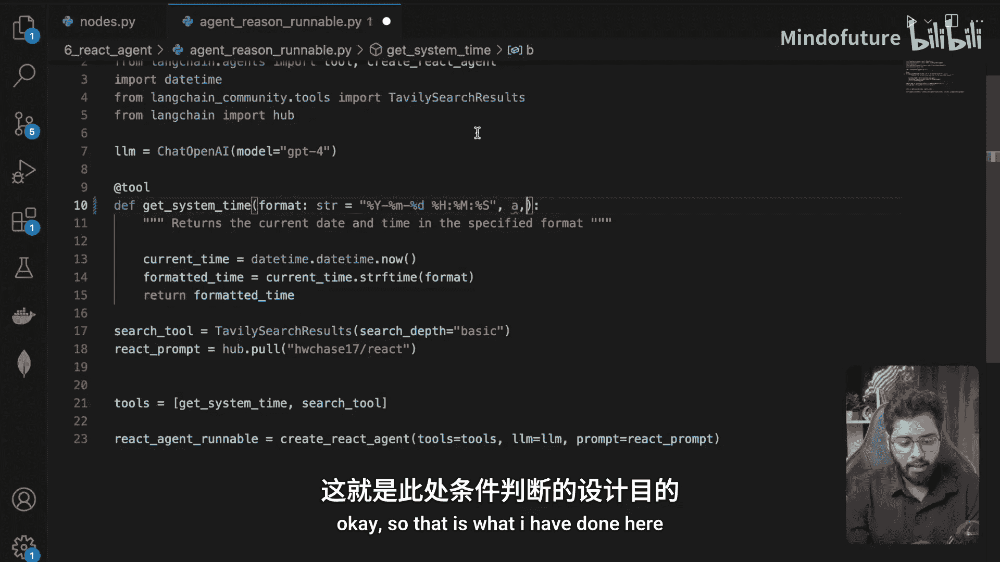

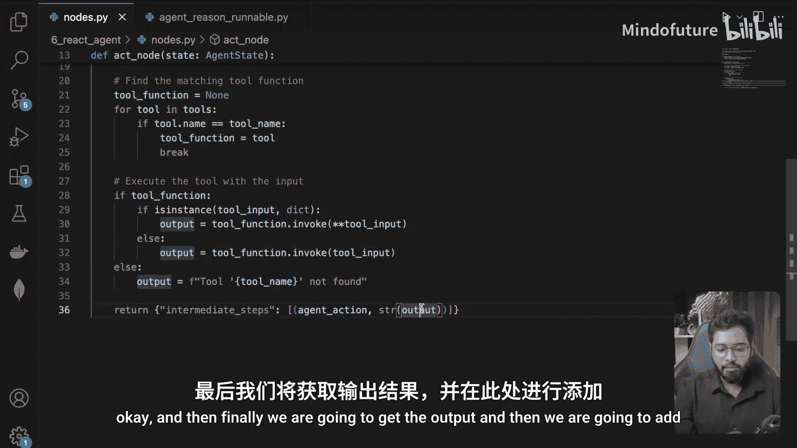

## 总结

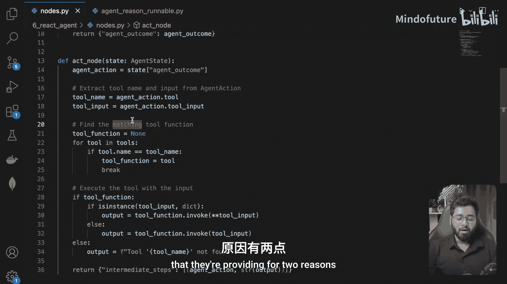

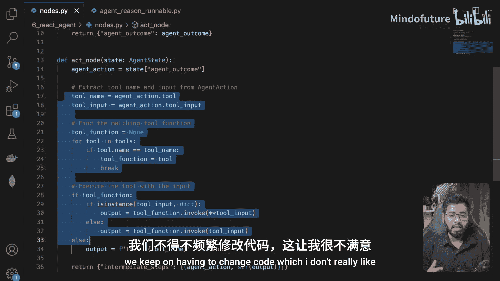

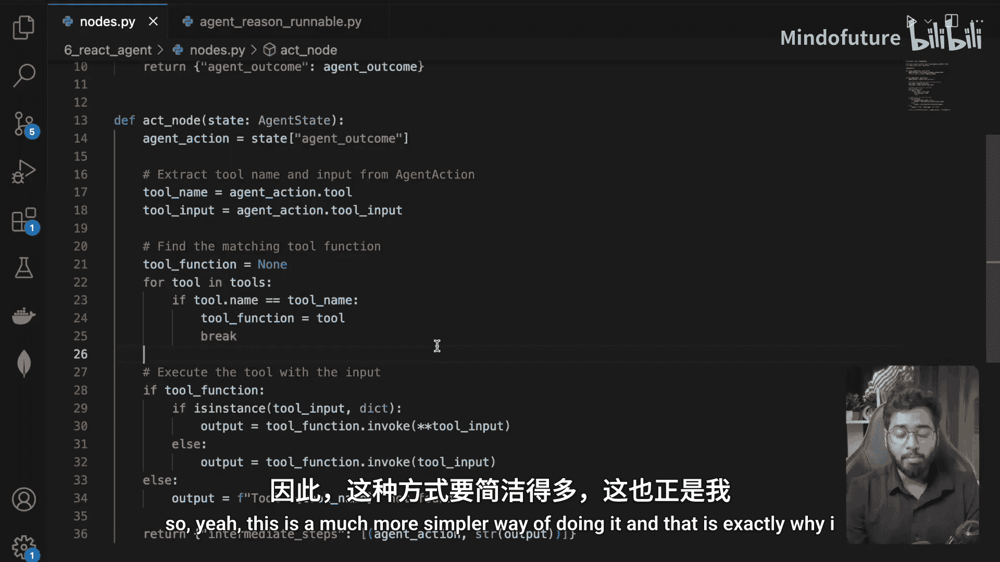

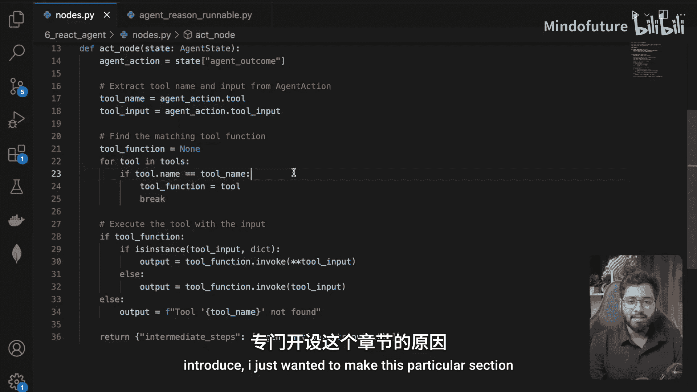

本节课中我们一起学习了如何在不使用已弃用的 `ToolExecutor` 类的情况下执行工具。我们分三步走：首先从代理动作中提取工具名和输入；然后在可用工具列表中匹配并找到对应的工具函数；最后直接调用该函数并获取输出。这种方法使我们对工具执行流程有更清晰的控制，减少了对外部类库内部实现的依赖。