# 024：使用LangGraph构建ReAct最终图 🧩

在本节课中，我们将学习如何将之前编写的各个节点组合起来，构建一个完整的ReAct（推理-行动）图。我们将整合推理节点、行动节点以及状态管理，最终形成一个能够执行多步推理和工具调用的智能体工作流。

---

## 概述

我们将创建一个名为 `react_graph` 的最终图。这个图会整合我们之前定义的 `AgentState` 蓝图、`reason_node`（推理节点）和 `act_node`（行动节点）。通过设置节点间的条件边和控制流，我们将实现一个循环：智能体先进行推理，然后根据推理结果决定是执行工具调用还是结束任务。

## 构建最终图

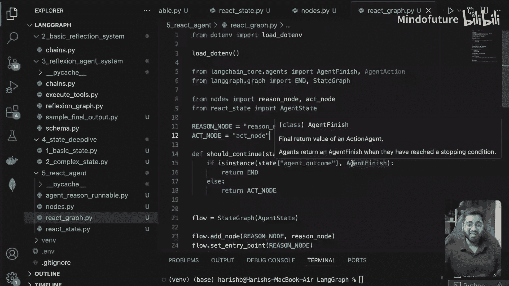

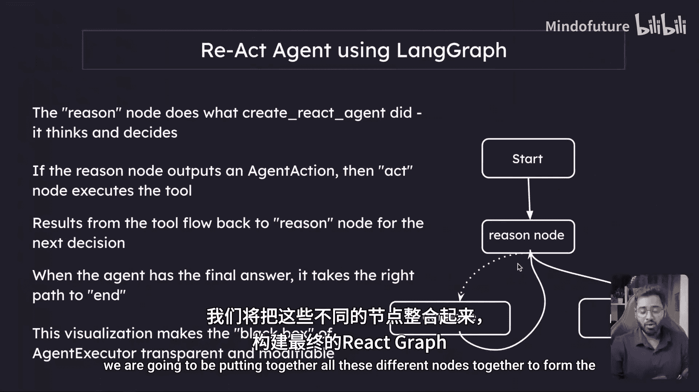

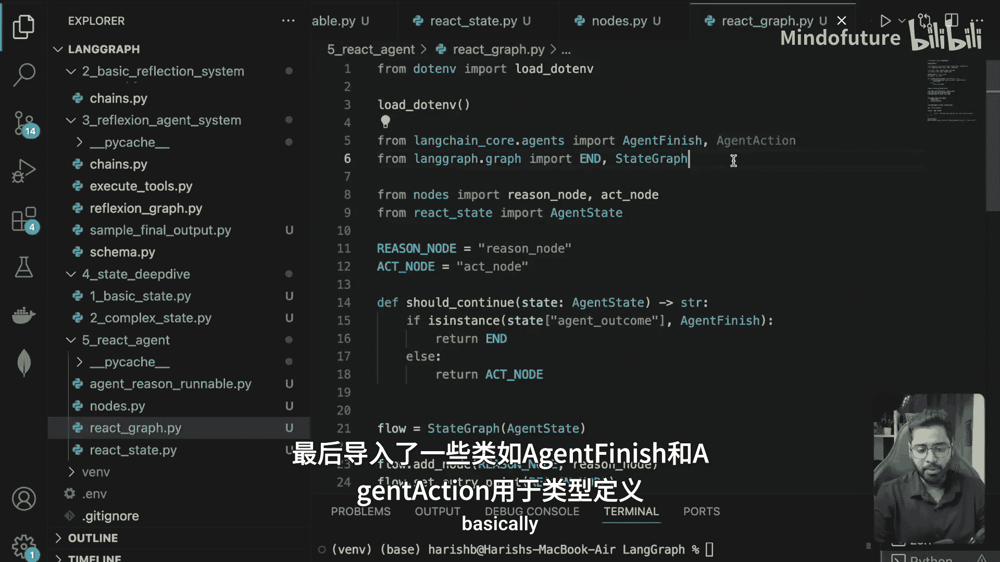

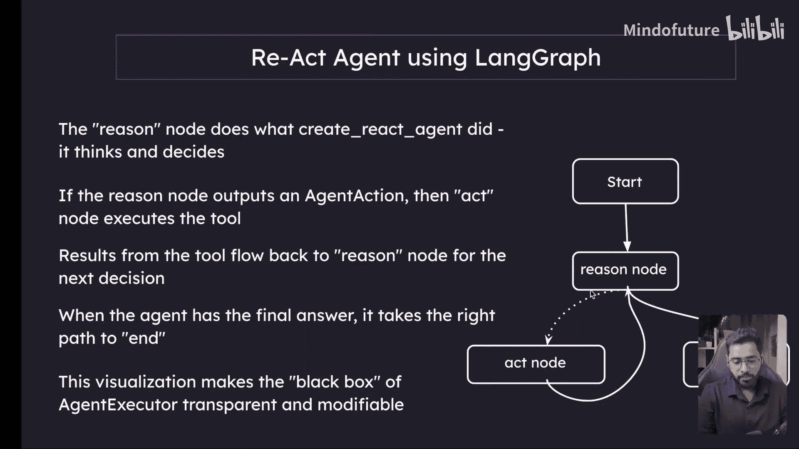

首先，我们需要导入所有必要的模块和之前定义的节点与状态。

```python
# 导入必要的模块和类
from langgraph.graph import StateGraph, END
from .state import AgentState  # 假设AgentState在state.py中定义
from .nodes import reason_node, act_node  # 假设节点在nodes.py中定义
from langchain.schema import AgentAction, AgentFinish  # 用于类型检查
```

### 定义节点名称常量

为了方便引用，我们为节点定义常量名称。

```python
REASON_NODE = "reason"
ACT_NODE = "act"
```

### 创建图并添加节点

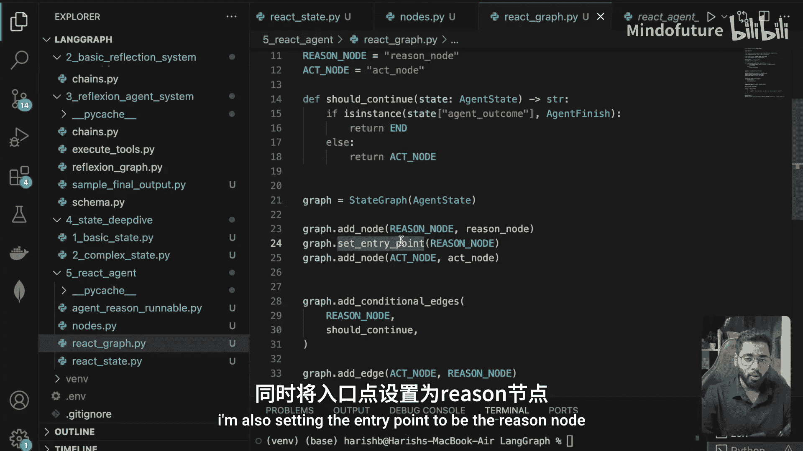

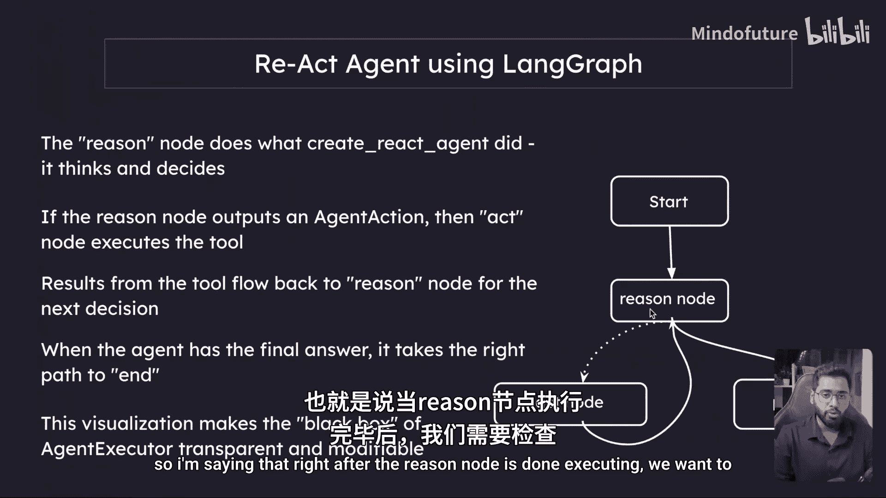

接下来，我们使用 `StateGraph` 创建图，并添加我们的节点。我们将 `AgentState` 作为图的状态蓝图。

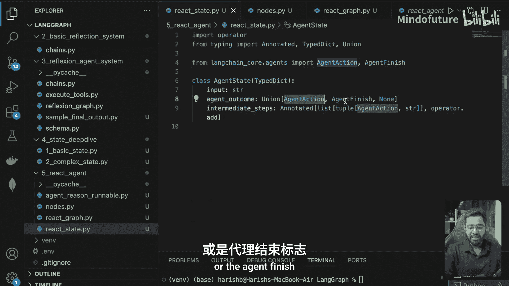

```python
# 使用StateGraph创建图，并指定状态结构
workflow = StateGraph(AgentState)

# 添加推理节点和行动节点
workflow.add_node(REASON_NODE, reason_node)
workflow.add_node(ACT_NODE, act_node)
```

### 设置入口点和条件边

我们将推理节点设置为图的入口点。推理节点执行后，我们需要根据其输出决定下一步是执行行动还是结束。

为此，我们需要一个 `should_continue` 函数来判断控制流的方向。

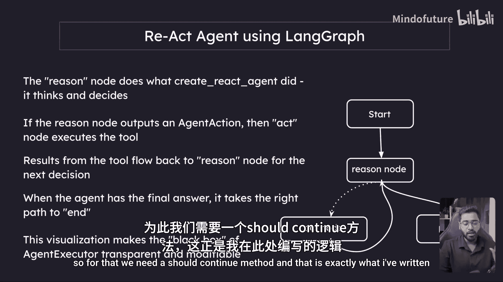

```python
def should_continue(state: AgentState) -> str:
    """
    根据agent_outcome决定下一步是执行行动还是结束。
    state: 当前的AgentState状态。
    返回: 下一个节点的名称。
    """
    # 检查agent_outcome的类型
    if isinstance(state.agent_outcome, AgentFinish):
        # 如果是AgentFinish，则结束流程
        return END
    else:
        # 否则，前往行动节点
        return ACT_NODE
```

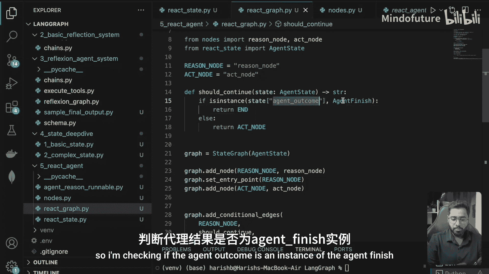

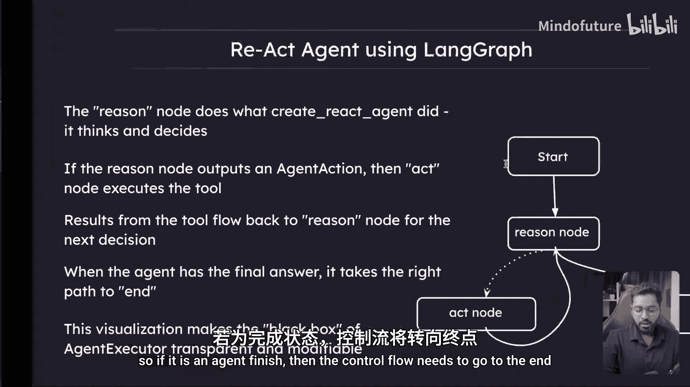

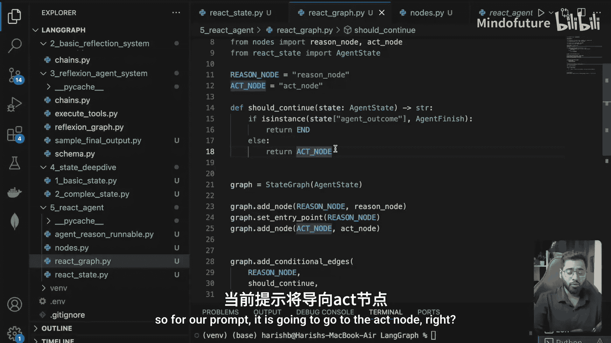

现在，我们将这个条件逻辑添加到图中。

```python
# 设置推理节点为入口点
workflow.set_entry_point(REASON_NODE)

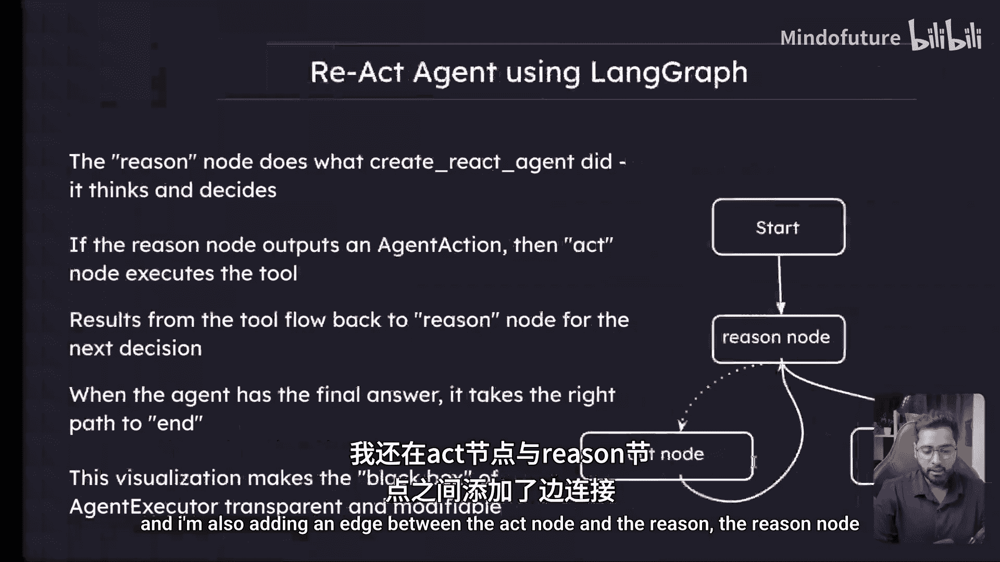

# 在推理节点后添加条件边
workflow.add_conditional_edges(
    REASON_NODE,
    should_continue,
    {
        END: END,        # 如果should_continue返回END，则图结束
        ACT_NODE: ACT_NODE # 如果返回ACT_NODE，则前往行动节点
    }
)

# 添加从行动节点回到推理节点的边，形成循环
workflow.add_edge(ACT_NODE, REASON_NODE)
```

### 编译并运行图

图结构定义完成后，我们将其编译成可执行的应用，并使用初始状态来调用它。

以下是初始状态的设置和调用过程：

```python
# 编译图
app = workflow.compile()

# 定义初始状态
initial_state = AgentState(
    input="How many days ago was the latest SpaceX launch?",  # 用户输入的问题
    agent_outcome=None,  # 初始时，LLM尚未给出任何建议
    intermediate_steps=[]  # 中间步骤初始为空列表
)

# 调用图应用
final_state = app.invoke(initial_state)

# 打印最终状态和结果
print("Final State:", final_state)
if isinstance(final_state.agent_outcome, AgentFinish):
    print("Final Answer:", final_state.agent_outcome.return_values['output'])
```

## 运行结果分析

运行上述代码后，我们得到了最终状态。从输出中可以看到：

*   **`input`**：保持为我们提供的初始问题。
*   **`agent_outcome`**：是一个 `AgentFinish` 对象，这触发了图的结束。其 `return_values` 中包含最终答案：`"The latest SpaceX launch was two days ago."`。
*   **`intermediate_steps`**：列表详细记录了智能体执行的所有步骤。例如，第一步是一个 `AgentAction`，LLM 建议使用 `T_search_results` 工具，并附上了其推理过程。后续步骤记录了多次类似的工具调用和结果收集。

通过检查 `intermediate_steps`，我们无需查看 LangSmith 日志也能清晰地理解智能体是如何通过“推理 -> 行动 -> 观察”的循环，最终得出答案的。

## 总结

本节课中，我们一起学习了如何集成 LangGraph 的各个组件来构建一个功能完整的 ReAct 图。我们回顾了关键步骤：

1.  **导入与定义**：导入状态、节点和必要的类。
2.  **构建图结构**：使用 `StateGraph` 创建图，添加节点，并设置 `reason_node` 为入口点。
3.  **实现控制流**：通过 `add_conditional_edges` 和 `should_continue` 函数，实现了根据 LLM 输出（`AgentAction` 或 `AgentFinish`）动态决定下一步走向的逻辑。
4.  **形成循环**：通过 `add_edge` 将 `act_node` 连接回 `reason_node`，使智能体能够进行多轮推理和行动。
5.  **编译与执行**：编译图并传入初始状态进行调用，最终成功获取了问题的答案。

这个 ReAct 图是构建复杂、可解释智能体工作流的基础框架。在下一节中，我们将通过 LangSmith 追踪来更深入地可视化和分析这个工作流的执行过程。

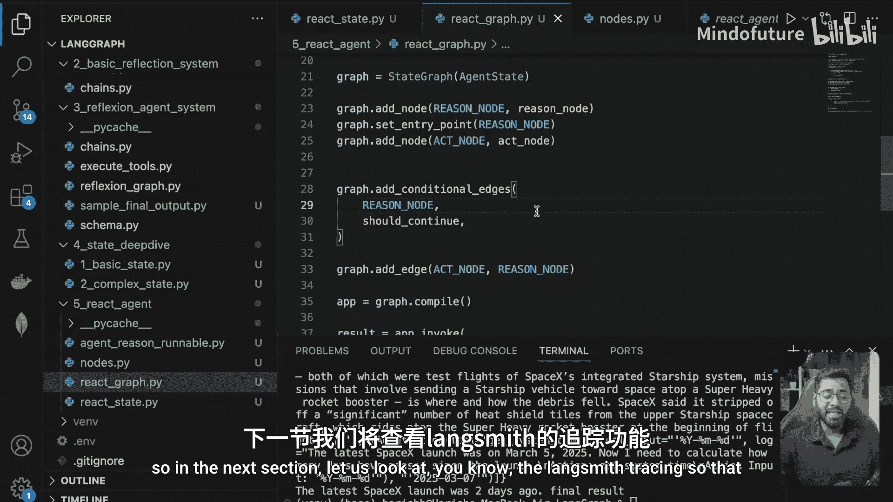

> 本节的完整代码已推送至 Git 仓库，如有任何疑问，可以拉取代码进行测试。