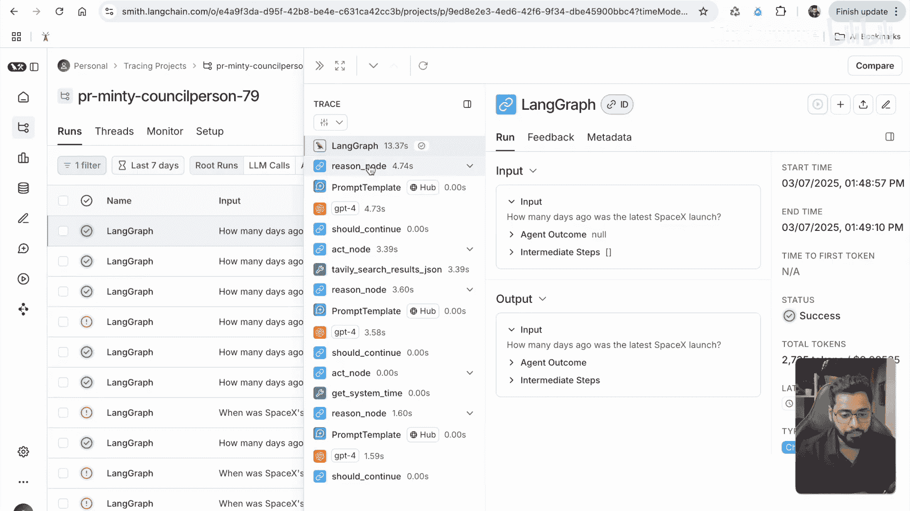
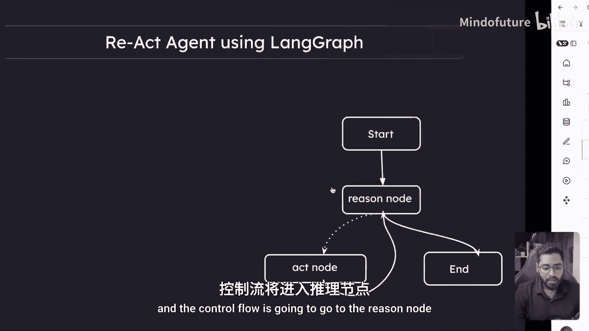
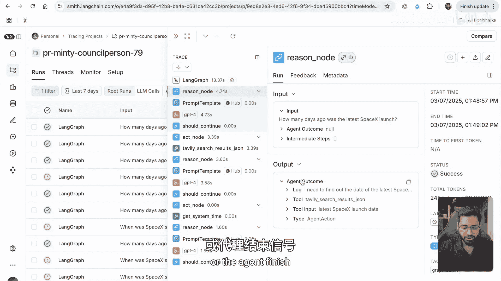
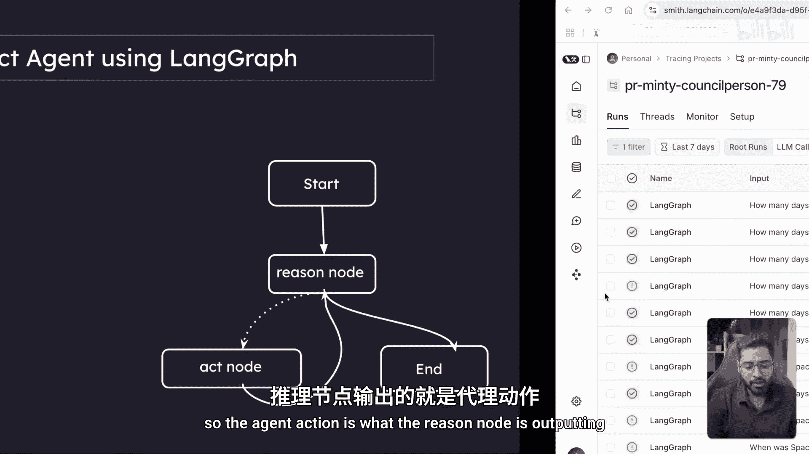
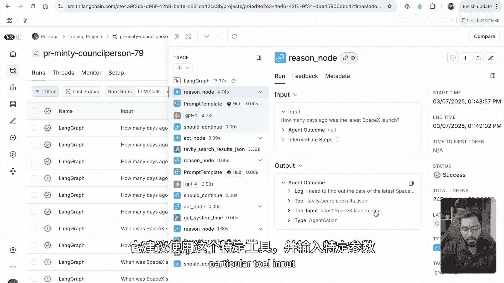
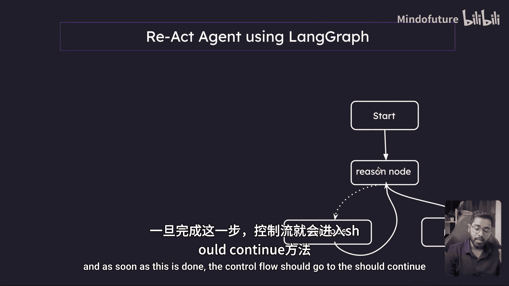
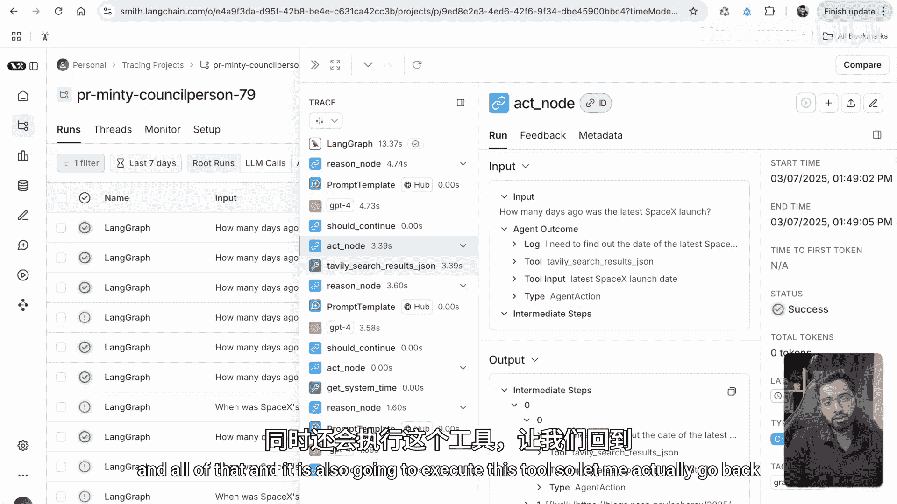
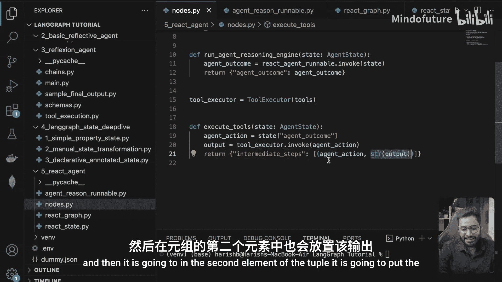
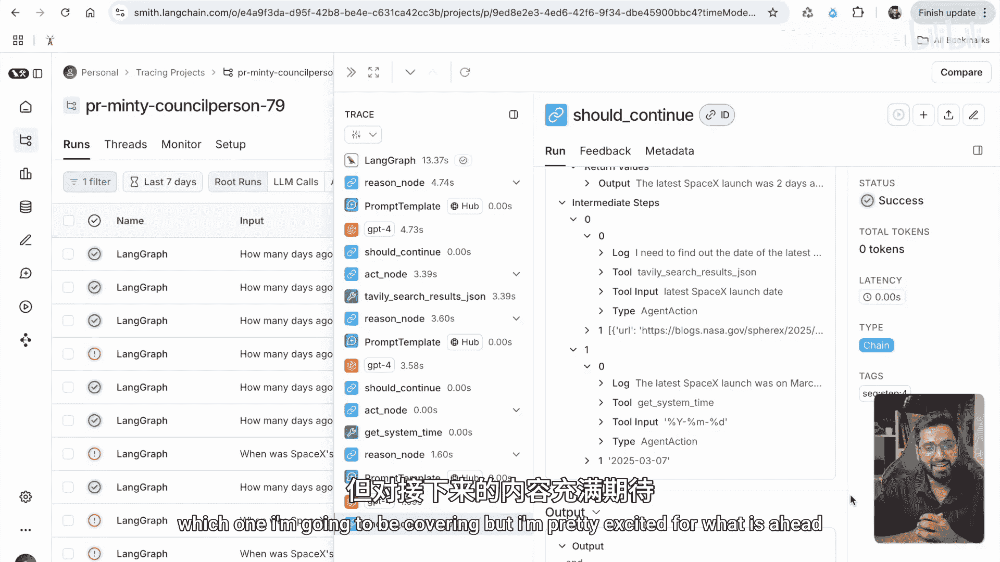

# 025：使用LangGraph的ReAct与LangSmith追踪 🔍

在本节课中，我们将学习如何利用LangSmith的追踪功能，深入理解基于LangGraph构建的ReAct智能体在执行过程中的各个步骤。通过追踪，我们可以清晰地看到状态流转、节点调用和工具执行的完整过程。

---

上一节我们介绍了ReAct智能体的基本结构，本节中我们来看看如何通过LangSmith的追踪界面来观察其内部执行细节。

我运行了几次程序，现在让我们查看最近的一次追踪记录。可以看到，整个执行过程总共耗时13秒。追踪界面显示了初始状态和我们之前在终端看到的最终状态。接下来，我们将逐步分析系统是如何得出最终输出的。

首先，系统从我们提供的初始状态开始，控制流会进入 `reason` 节点。点击该节点可以看到，这一步耗时4秒。该节点获取完整的状态，并输出一个 `AgentAction` 或 `AgentFinish` 对象。

以下是 `reason` 节点的关键输出：
*   **AgentAction**：这是 `reason` 节点的主要输出，它建议使用特定的工具，并附上相应的工具输入参数。

一旦 `reason` 节点完成，控制流会进入 `should_continue` 方法。该方法会判断下一步是继续执行还是结束。从追踪中可以看到，`should_continue` 判断结果为继续，并将控制流再次导向 `act` 节点。

`act` 节点接收来自 `reason` 节点的 `AgentAction` 结果。它的核心任务是调用 `AgentAction` 中指定的工具。

以下是 `act` 节点的执行过程：
1.  调用指定的工具。
2.  获取工具执行后的输出。
3.  将一个元组（Tuple）追加到状态中的 `intermediate_steps` 列表里。

具体来说，这个元组包含两个元素：
*   **第一个元素**：是 `AgentAction` 对象及其工具输入。
*   **第二个元素**：是工具执行后的输出结果。

在我们的例子中，可以看到一次 `tavily_search` 工具调用被成功执行并记录了结果。

当 `act` 节点执行完毕后，控制流会再次回到 `reason` 节点，开始新一轮的“思考-行动”循环。这个过程会持续重复，直到 `reason` 节点输出一个 `AgentFinish` 对象。

在追踪记录的最后部分，我们可以看到 `should_continue` 方法收到了 `AgentFinish`，随后控制流导向终点（`END`），整个图执行完毕。

---

本节课中我们一起学习了如何使用LangSmith追踪来可视化LangGraph ReAct智能体的执行流程。我们看到了状态如何在 `reason`、`act`、`should_continue` 等节点间流转，以及工具调用和结果是如何被记录到状态中的。这种模式具有很强的扩展性，可以应用于多种不同的用例。

如果你在实践过程中遇到任何困难，可以参考我的代码。如果仍有问题，欢迎在评论区提问，我非常乐意提供帮助。也欢迎在LinkedIn上与我联系。

本节内容就到这里。在下一节中，我们将探索LangGraph的另一个重要方面——可能是持久化（Persistence）或是检索增强生成（RAG）应用，我对接下来的内容充满期待，我们下节再见。

