# 026：聊天机器人介绍 🚀

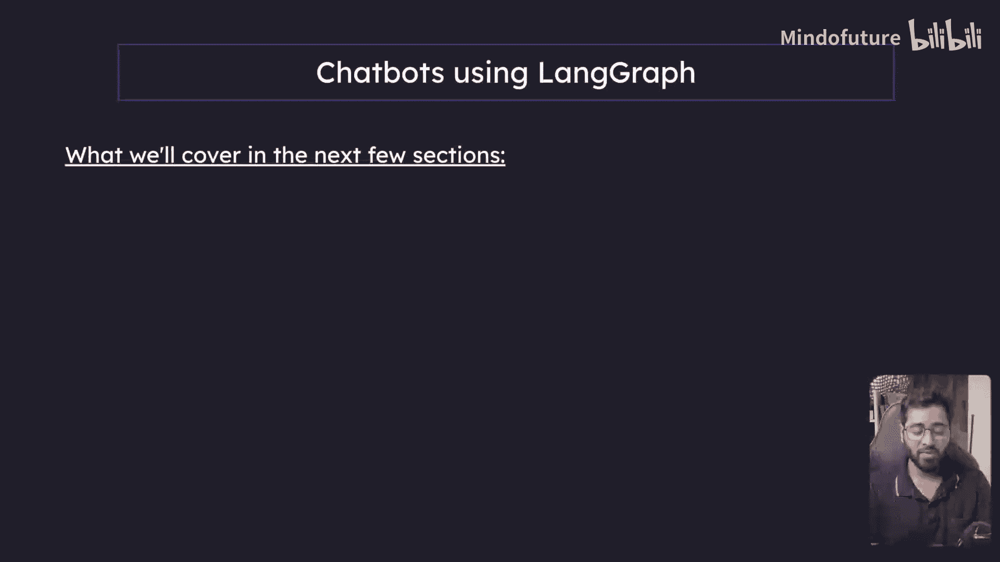

在本节课中，我们将开始学习如何构建聊天机器人。我们将从最基础的版本开始，逐步增加功能，引入更复杂的概念，帮助你全面理解聊天机器人的工作原理。

## 课程内容概述 📋

在接下来的几个章节中，我们将循序渐进地构建不同类型的聊天机器人。以下是本系列课程将要涵盖的核心内容：

以下是本系列课程将要涵盖的核心内容：

1.  **基础聊天机器人**：构建一个没有记忆、无法进行网络搜索或使用其他工具的简单机器人。你输入信息，它直接输出响应。
2.  **带工具的聊天机器人**：为机器人添加各种工具，使其能够获取准确的外部数据。
3.  **带记忆的聊天机器人**：引入持久化和记忆的概念，让机器人能够记住对话历史。
4.  **人在回路的聊天机器人**：在记忆功能的基础上，加入人工干预的概念。
5.  **具有复杂状态的聊天机器人**：探索更多用例，理解所有可能出现的边界情况。
6.  **时间旅行功能**：实现更高级的状态管理功能。

上一节我们介绍了课程的整体规划，本节中我们来看看如何构建第一个也是最简单的聊天机器人。

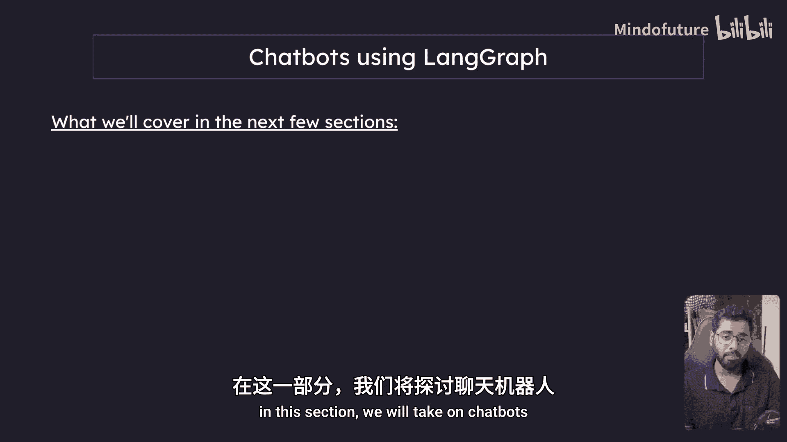

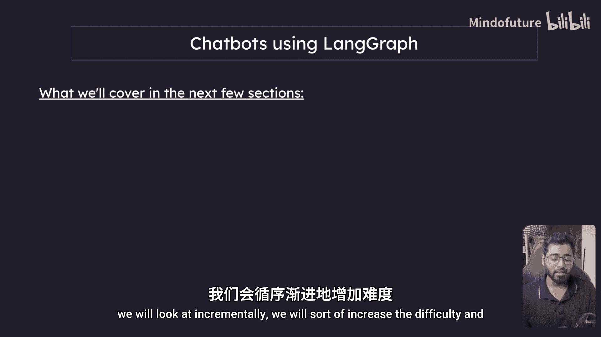

## 构建基础聊天机器人 🤖

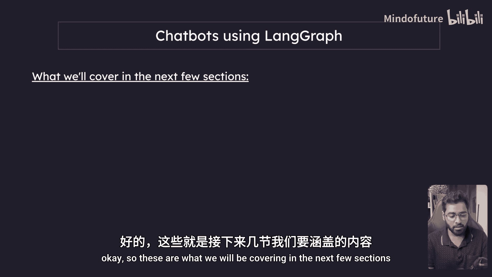

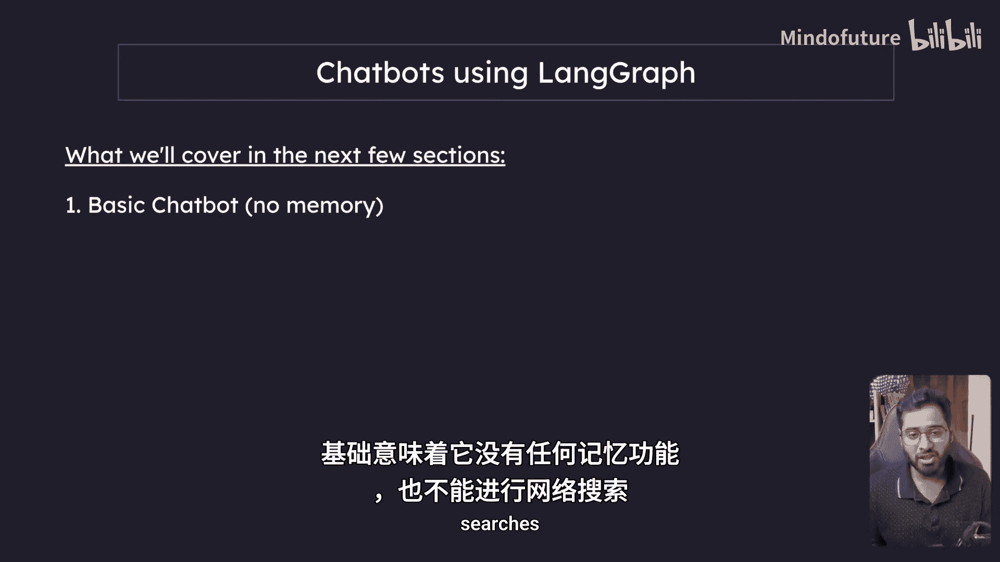

现在，让我们开始构建一个非常基础的聊天机器人。这个机器人的核心功能是接收用户输入并生成回复，不包含任何额外功能。

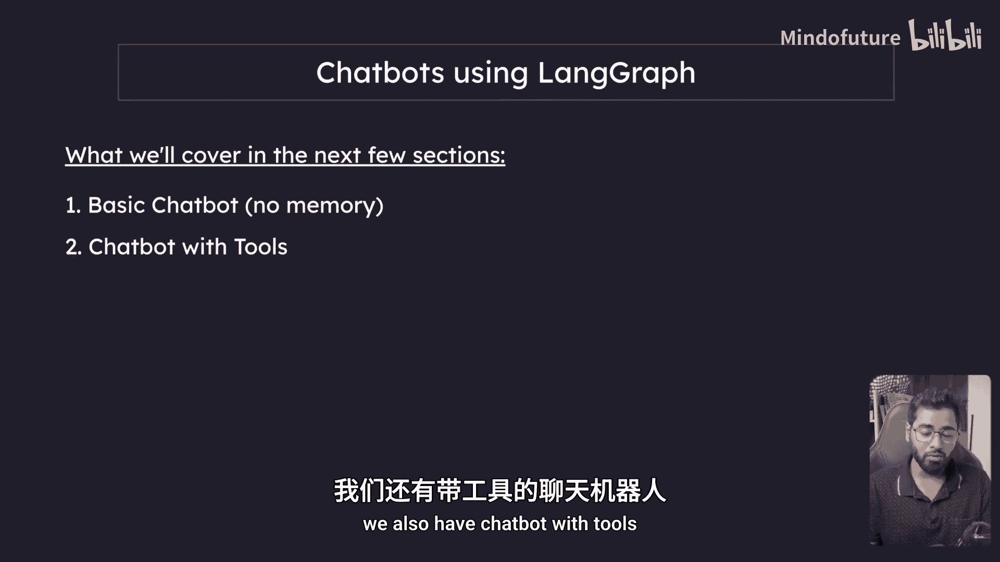

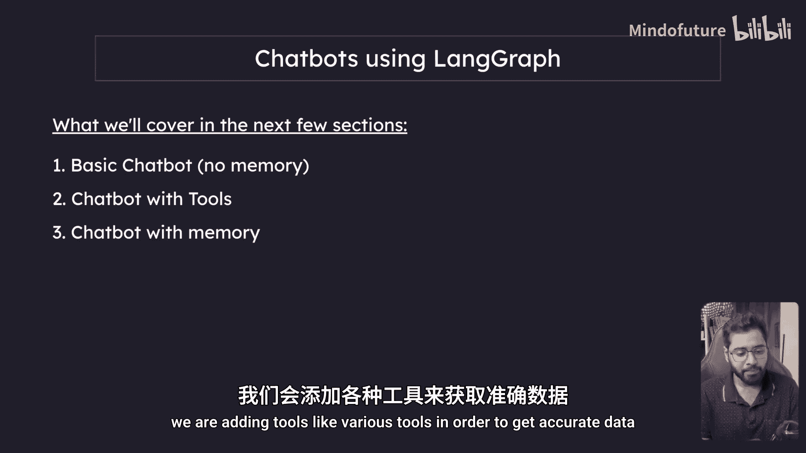

其工作流程可以用一个简单的公式表示：

**用户输入 -> 语言模型处理 -> 生成回复**

在代码层面，这通常意味着初始化一个语言模型（LLM），然后调用它。例如，使用 LangChain 框架可能类似于以下结构：

```python
from langchain.llms import OpenAI

# 1. 初始化模型
llm = OpenAI(model_name="gpt-3.5-turbo")

# 2. 接收输入并生成回复
user_input = "你好，今天天气怎么样？"
response = llm(user_input)
print(response)
```

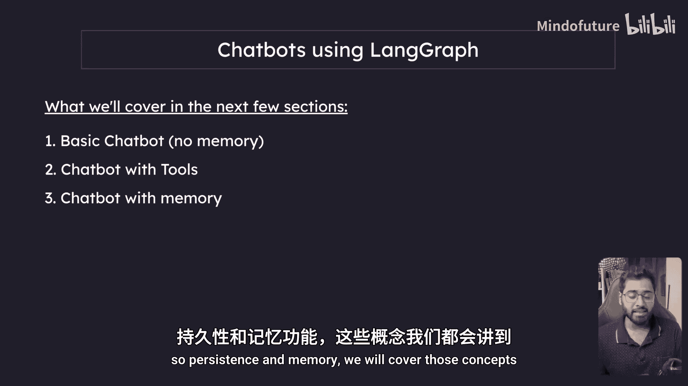

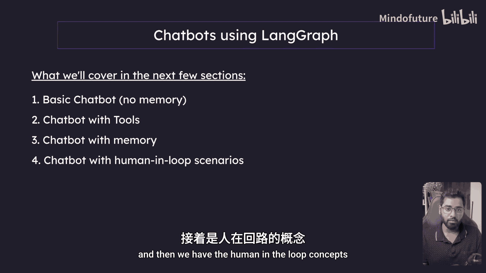

这个流程是所有复杂聊天机器人的基础。在后续章节中，我们将以此为基础，逐步添加工具、记忆等模块，使其功能越来越强大。

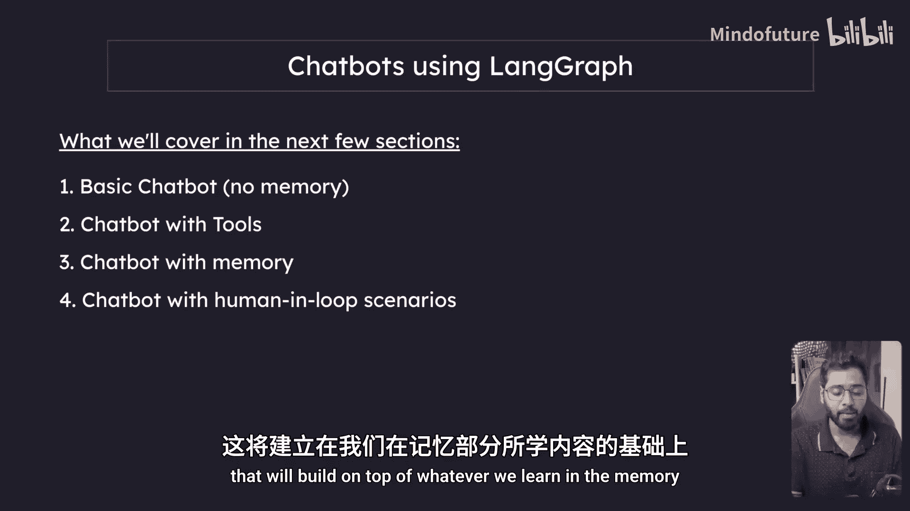

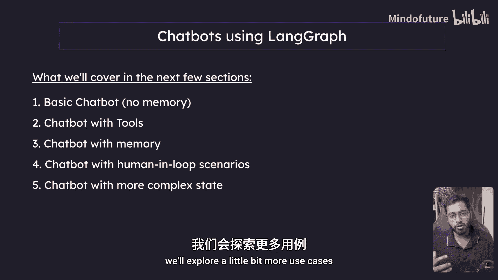

---

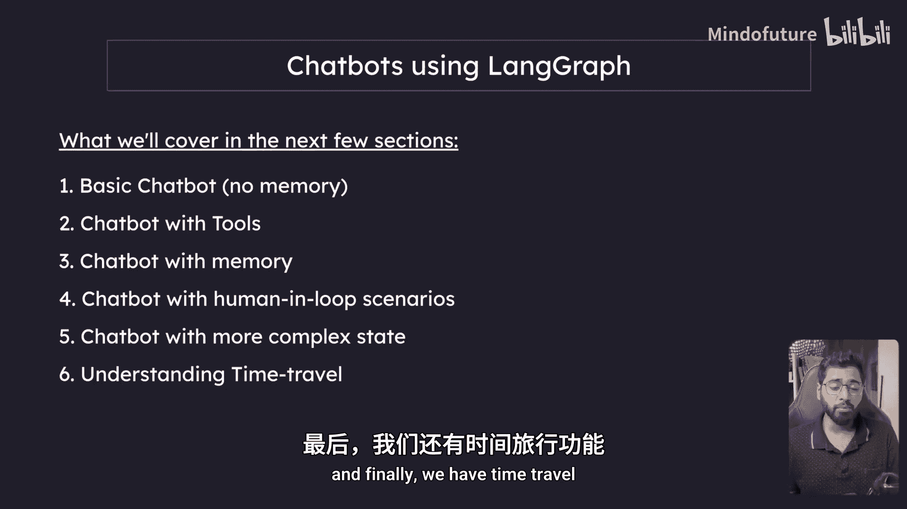

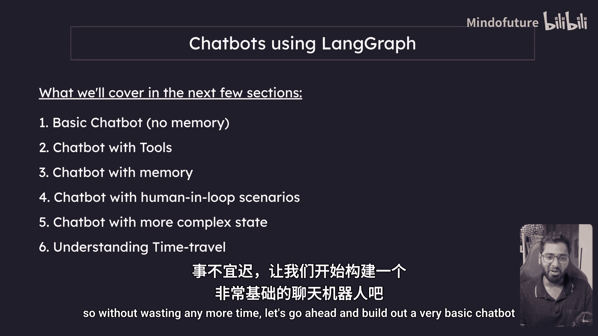

本节课中我们一起学习了聊天机器人课程的总体安排，并成功构建了一个基础聊天机器人。我们了解到，一个最简单的机器人核心是连接语言模型与用户输入。在接下来的课程中，我们将以此为起点，逐步为其增添记忆、工具等能力。