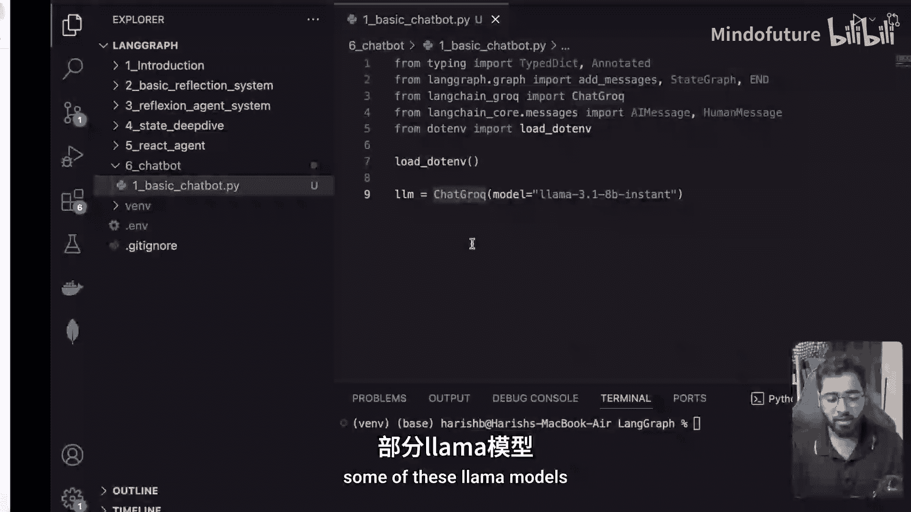
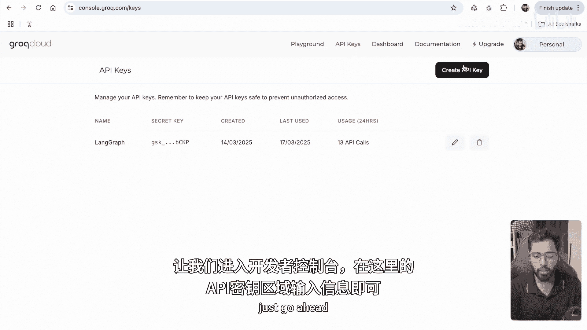
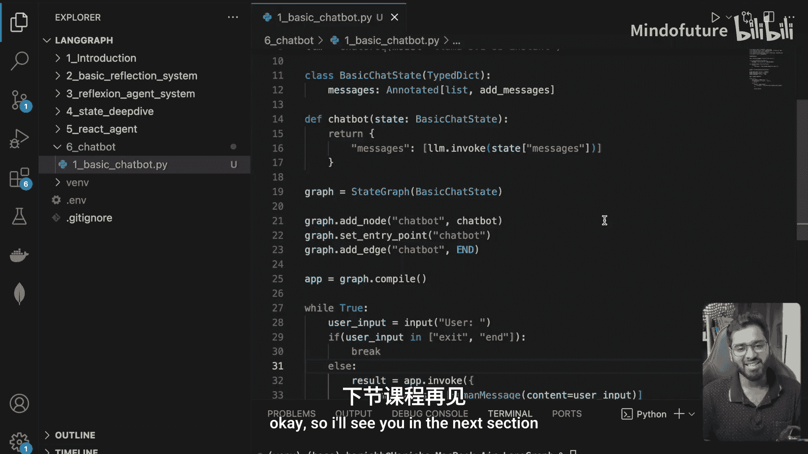

# 027：基础聊天机器人构建 🚀

在本节课中，我们将学习如何使用LangGraph构建一个基础的聊天机器人。这个机器人将能够接收用户输入并生成回复，但它不具备记忆功能，也无法使用外部工具。我们将使用免费的Llama模型（通过Groq接口）来实现它，并学习如何通过循环与机器人进行持续对话。

---

## 状态定义 📝

首先，我们需要定义聊天机器人的状态。状态的核心是一个消息列表，用于存储对话历史。

以下是定义状态的代码：

```python
from typing import Annotated
from typing_extensions import TypedDict
from langgraph.graph.message import add_messages

class BasicChatState(TypedDict):
    messages: Annotated[list, add_messages]
```



我们使用 `TypedDict` 来创建一个名为 `BasicChatState` 的状态类，它包含一个 `messages` 属性。`Annotated` 注解配合 `add_messages` 函数，可以方便地将新旧消息列表合并。

---

## 构建聊天节点 🤖

上一节我们定义了状态，本节中我们来看看如何构建处理对话的核心节点。这个节点将接收状态中的消息，调用大语言模型（LLM）生成回复。

以下是构建聊天节点的代码：



```python
from langchain_groq import ChatGroq

# 初始化模型
llm = ChatGroq(model="llama-3.1-70b-versatile")

def chatbot_node(state: BasicChatState):
    # 调用模型，传入当前所有消息
    response = llm.invoke(state["messages"])
    # 返回一个包含AI消息的列表，以便与原有消息合并
    return {"messages": [response]}
```

这个函数接收状态，提取其中的消息列表，并将其传递给LLM。LLM返回一个AI消息，我们将其包装在列表中返回。`add_messages` 函数会自动将这个新消息合并到原有的状态消息列表中。

---

## 创建并编译图 🗺️

现在我们已经有了状态和节点，接下来需要将它们组合成一个可执行的图。我们将创建图，添加节点，设置入口点，并连接边。

以下是创建和编译图的步骤：

1.  创建状态图。
2.  添加 `chatbot_node`。
3.  将 `chatbot_node` 设置为图的入口点。
4.  添加从 `chatbot_node` 到终点的边。
5.  编译图。

```python
from langgraph.graph import StateGraph, END

# 创建状态图
graph = StateGraph(BasicChatState)

# 添加节点
graph.add_node("chatbot", chatbot_node)

# 设置入口点
graph.set_entry_point("chatbot")

# 添加边：从chatbot节点指向结束
graph.add_edge("chatbot", END)

# 编译图
app = graph.compile()
```

---

## 实现交互循环 🔄

图已经构建完成，现在我们需要创建一个交互界面，让用户能够与机器人进行多轮对话。我们将使用一个 `while` 循环来持续接收用户输入并调用图。

以下是实现交互循环的逻辑：

1.  在循环中提示用户输入。
2.  检查用户输入是否为退出指令（如 “exit”, “end”, “bye”）。
3.  如果不是退出指令，则调用图，并将用户输入作为初始的人类消息传入。
4.  打印模型的回复。

```python
while True:
    # 获取用户输入
    user_input = input("\n用户: ")

    # 检查退出条件
    if user_input.lower() in ["exit", "end", "bye"]:
        print("对话结束。")
        break

    # 调用图，传入初始状态（包含用户的新消息）
    initial_state = {"messages": [{"role": "user", "content": user_input}]}
    result = app.invoke(initial_state)

    # 打印AI的回复（最后一条消息）
    ai_message = result["messages"][-1]
    print(f"AI: {ai_message.content}")
```

---

## 运行与测试 🧪

让我们运行程序并测试聊天机器人的基本功能。输入一些问候语，观察模型的反应。

**示例对话：**
```
用户: 你好，我是小明。
AI: 你好小明！很高兴认识你。有什么我可以帮助你的吗？

用户: 我的名字是什么？
AI: 抱歉，我无法获取您的个人信息，包括您的名字。我是一个AI助手，没有记忆功能，每次对话都是独立的。
```

如你所见，机器人能够对当前输入做出回应。但是，如果你问它之前对话中提到的信息（比如“我的名字是什么？”），它无法回答，因为它没有记忆。

---

## 当前局限性与展望 🔮

我们刚刚构建了一个非常基础的聊天机器人。它主要有两个局限性：

1.  **无记忆**：每次调用图都是全新的开始，模型无法记住之前的对话历史。
2.  **无工具**：模型无法访问外部信息（如天气、新闻）或执行特定操作。

在接下来的章节中，我们将逐步为这个机器人添加新能力：
*   **访问互联网**：通过集成工具，让机器人能够获取实时信息。
*   **添加记忆**：实现对话历史的持久化，让机器人拥有上下文理解能力。

---



本节课中我们一起学习了如何使用LangGraph构建一个基础的、无状态的聊天机器人。我们定义了状态，创建了处理节点，组装了执行图，并实现了终端交互循环。虽然它功能简单，但这是构建更复杂对话AI的基石。理解这个基础流程后，我们就可以在后续课程中为其添加记忆、工具等高级功能了。