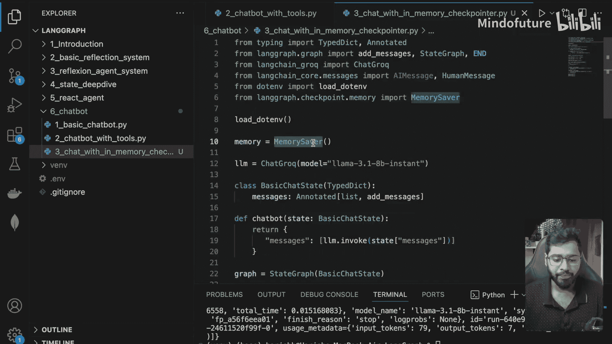
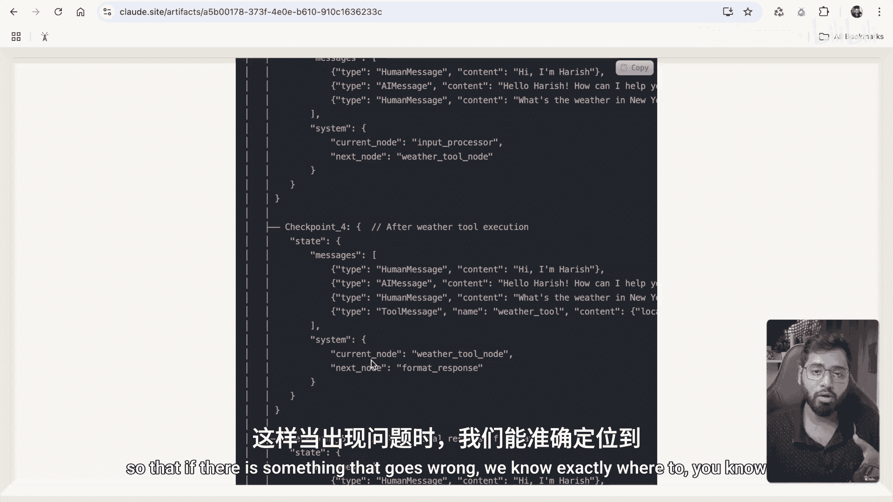
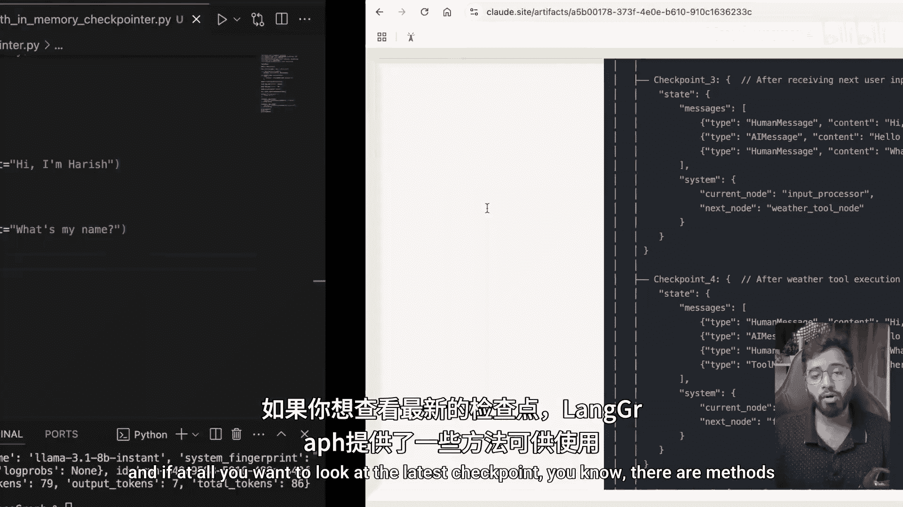
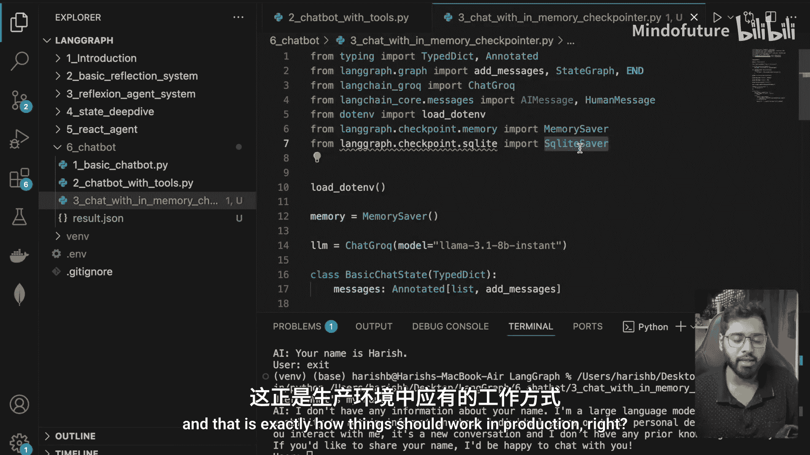

# 029：带记忆的聊天机器人（什么是 Checkpointer）🚀


在本节课中，我们将学习如何为 LangGraph 聊天机器人引入记忆功能。我们将重点理解 **Checkpointer（检查点）** 和 **Thread ID（线程ID）** 这两个核心概念，并动手实现一个能记住对话历史的简单聊天机器人。

## 概述：为什么需要记忆？

上一节我们创建了一个基础聊天机器人，并为其添加了工具调用功能。但我们注意到，这个机器人无法记住之前的对话内容，因为尚未引入持久化（Persistence）和记忆（Memory）机制。这正是我们本节要解决的问题。

默认情况下，LangGraph 构建的聊天机器人患有“健忘症”。每次用户开始新对话，机器人都无法回忆起之前的互动。这是因为在没有内存管理的情况下，图的每次调用都是完全独立的。

## 什么是 Checkpointer？💾

本节中，我们来看看 LangGraph 中的 **Checkpointer** 概念。

一个 Checkpointer 本质上是一种在执行过程中的特定点保存你的智能体（Agent）或工作流（Workflow）状态的方法。

*   **类比**：可以将其想象成电子游戏中的存档点。当你到达一个检查点时，当前的所有状态都会被保存。如果后续出现问题，你总是可以回到这个存档点，而不必从头开始。
*   **在 LangGraph 中的角色**：在 LangGraph 的工作流中，节点（Node）是独立的步骤或组件。检查点会在一个节点完成其工作后，保存完整的状态。如果后续节点发生错误，你可以从最后一个检查点恢复，而不是重新启动整个工作流。这对于处理耗时或资源消耗大的复杂工作流尤其有用。

为了在我们的图中引入持久化和记忆，理解 Checkpointer 只是拼图的一半。你还需要理解 **Thread ID**。

## 什么是 Thread ID？🧵

那么，什么是 Thread ID？它为什么是必要的？

一个 Thread ID 是每次特定对话或工作流执行的唯一标识符。

*   **类比**：可以将其视为用户的唯一会话 ID，或一个将相关消息分组在一起的对话 ID。
*   **示例**：如果你使用过 ChatGPT 的网页版，你创建的每一个新聊天或对话都有其自己的 Thread ID。这就是我们区分不同对话的方式。

Thread ID 是必要的，因为你可能同时运行多个对话或工作流。每个都需要自己独立的保存状态。Thread ID 帮助系统识别哪个保存的状态属于哪个对话。如果没有 Thread ID，你所有的对话将共享同一个状态，这会导致混乱和错误。

综上所述，我们知道要为 LangGraph 应用引入记忆和持久化，我们需要两样东西：一个 **Checkpointer** 和一个 **Thread ID**，以便将两者关联起来。

## 动手实践：实现带记忆的聊天机器人👨‍💻

现在，让我们回到代码中实际实现它。我已经创建了一个名为 `chat_with_inmemory_checkpointer.py` 的文件。

以下是实现带记忆聊天机器人的核心步骤：

1.  **导入内存检查点保存器**：首先，我们从 `langgraph.checkpoint.memory` 导入 `MemorySaver`。这是一个内存中的检查点保存器，适用于快速调试和测试，但在生产环境中，你可能需要使用 SQLite 或 PostgreSQL 检查点保存器。
    ```python
    from langgraph.checkpoint.memory import MemorySaver
    memory = MemorySaver()
    ```

2.  **编译图时提供 Checkpointer**：在编译图时，我们需要传入这个检查点保存器。
    ```python
    app = graph.compile(checkpointer=memory)
    ```

3.  **创建包含 Thread ID 的配置**：我们需要创建一个配置字典，其中包含一个 `configurable` 键，其值是一个包含 `thread_id` 的字典。这个 `thread_id` 应该是唯一的，这里我们简单使用 `"1"`。
    ```python
    config = {"configurable": {"thread_id": "1"}}
    ```

4.  **调用图时传入配置**：在调用图进行对话时，需要传入这个 `config` 对象。这样，所有使用相同 `thread_id` 的调用都会共享同一个对话状态。
    ```python
    result = app.invoke({"messages": [("human", "Hi, I'm Harish.")]}, config=config)
    ```

通过以上步骤，我们就为聊天机器人添加了记忆功能。当用户在同一 `thread_id` 下进行连续对话时，机器人能够记住之前的交流内容。



## 检查点内部结构窥探🔍

你可能仍然对检查点保存器如何存储数据有疑问。其结构大致如下：

*   可以将其想象成一个字典，键是 **Thread ID**（例如 `"thread_1"`）。
*   每个 Thread ID 下关联着多个 **检查点**（例如 `checkpoint_1`, `checkpoint_2`）。
*   每个检查点包含了到该点为止的所有 **消息**（Message）列表，以及当前节点、下一个节点等信息。

每次一个节点执行完毕后，其输出（无论是工具消息、人类消息还是AI消息）都会被追加到消息列表中，并创建一个新的检查点。这样，如果后续执行出错，系统就知道该从哪里恢复。



如果你想查看特定线程的最新状态，可以使用 `app.get_state(config)` 方法，它会返回该对话线的最新检查点快照。



## 创建交互式对话循环🔄

为了让演示更自然，我们可以将多次调用放入一个 `while` 循环中，创建一个在终端中运行的交互式对话。

```python
while True:
    user_input = input("You: ")
    if user_input.lower() in ["exit", "quit"]:
        break
    result = app.invoke({"messages": [("human", user_input)]}, config=config)
    # 打印最新的 AI 回复
    print(f"AI: {result['messages'][-1].content}")
```

这样，你就可以与机器人进行连续的多轮对话，并且它能记住整个对话历史。

## 内存检查点的局限性⚠️

需要注意的是，`MemorySaver` 是一个 **内存中的检查点保存器**。这意味着当程序停止时，所有记忆都会被清除。如果你重新运行程序并询问同样的问题（如“我叫什么名字？”），它将无法记起，因为内存已被清空。

这正是 LangGraph 还提供 **SQLiteSaver** 和 **PostgresSaver** 的原因。这些保存器可以将记忆持久化到外部数据库，即使程序重启，对话历史也能得以保留。这正是在生产环境中应该使用的方式。

## 总结📚

本节课中，我们一起学习了如何为 LangGraph 聊天机器人赋予记忆能力。

*   **核心问题**：默认的 LangGraph 机器人没有记忆。
*   **解决方案**：引入 **Checkpointer（检查点）** 来保存对话状态，并使用 **Thread ID（线程ID）** 来区分不同的对话会话。
*   **关键步骤**：导入 `MemorySaver`，在编译图时提供它，并在调用图时传入包含唯一 `thread_id` 的配置。
*   **工作原理**：检查点按顺序保存对话中的消息和状态，使得在同一 `thread_id` 下的连续调用能共享历史。
*   **当前局限**：`MemorySaver` 仅将数据保存在内存中，程序退出后数据丢失。
*   **后续方向**：在生产环境中，应使用如 `SqliteSaver` 或 `PostgresSaver` 等持久化检查点保存器。



在下一节中，我们将探索如何使用这些持久化保存器，让机器人的记忆在程序重启后依然存在。