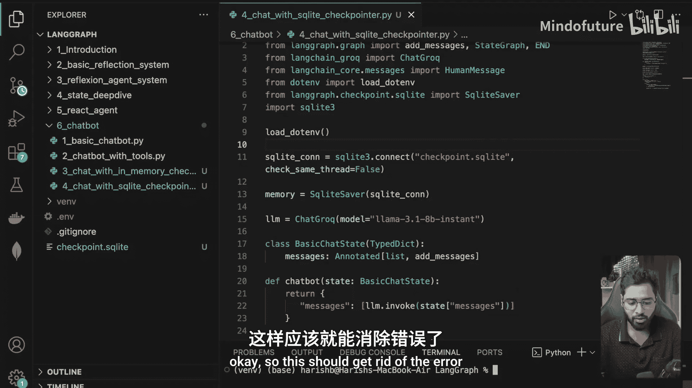
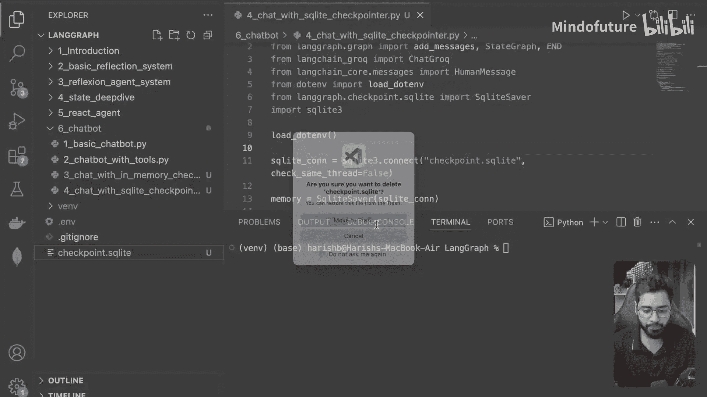
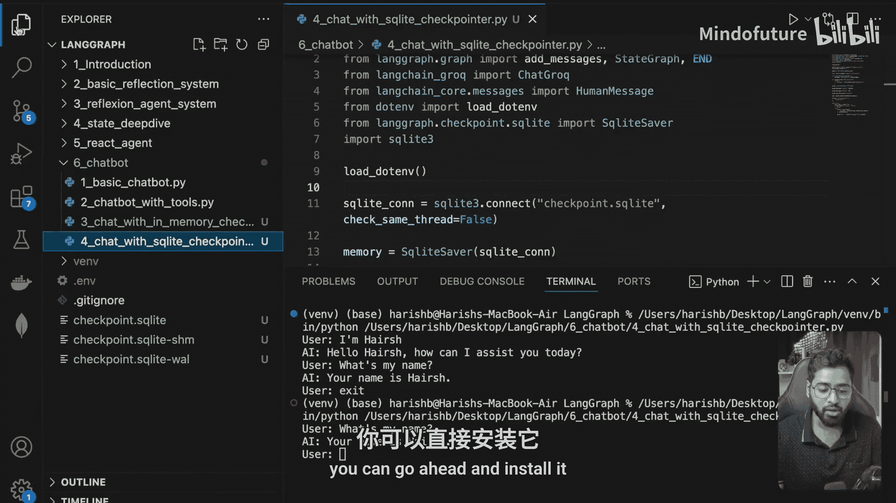
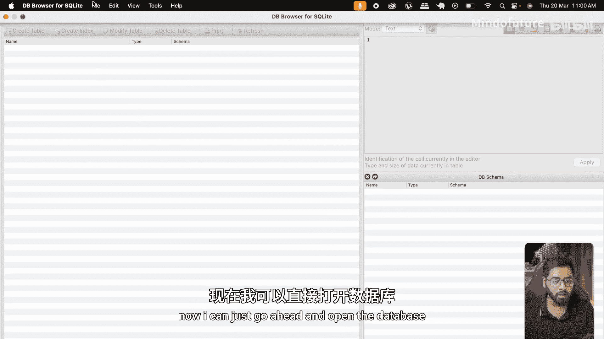
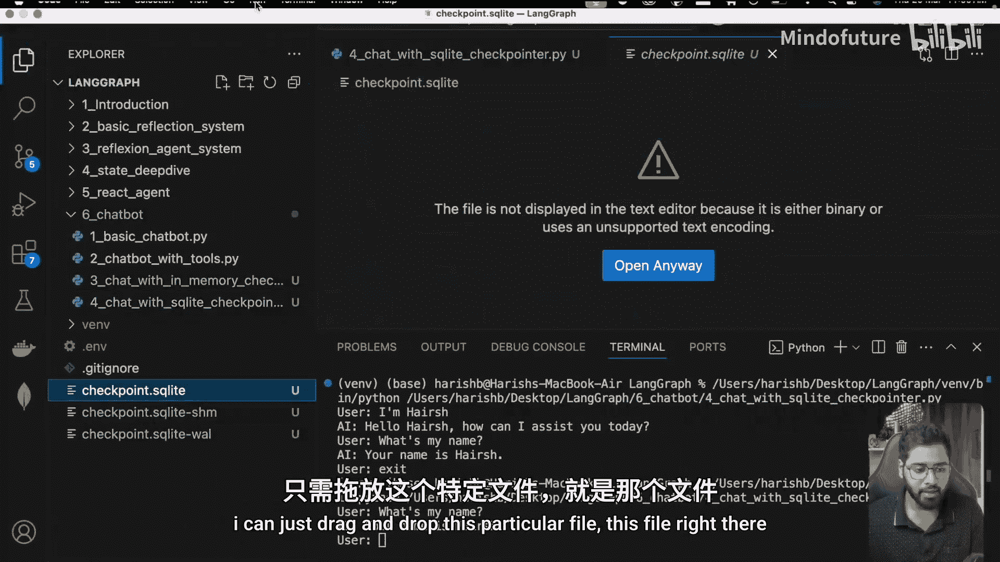
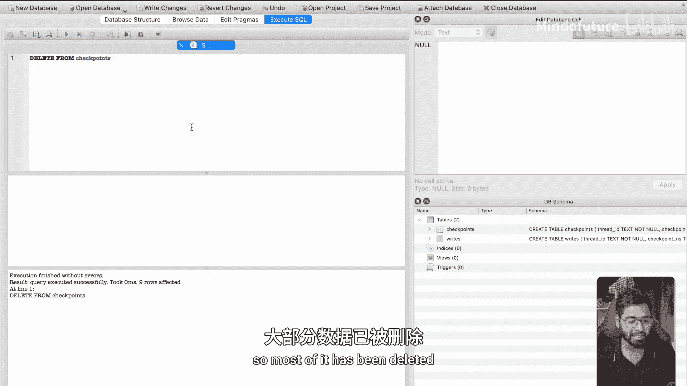
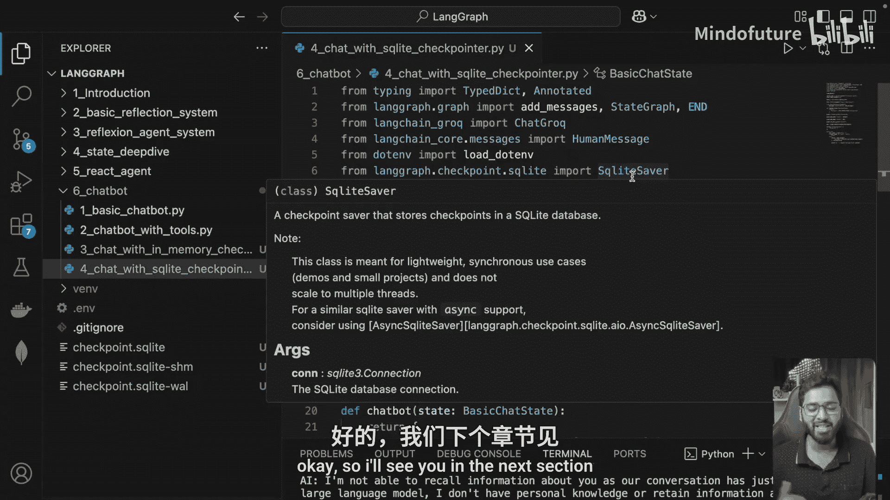

# 030：聊天机器人 - 使用 SQLiteSaver 实现持久化检查点

在本节课中，我们将学习如何将聊天机器人应用中的内存检查点替换为 SQLite 检查点，从而实现真正的对话持久化。这意味着即使服务器关闭或应用重启，我们也能恢复之前的对话状态。


上一节我们介绍了使用内存检查点来保存对话状态。本节中，我们来看看如何将其替换为基于 SQLite 数据库的持久化检查点，以获得更稳定的状态管理能力。

## 创建新文件并导入 SQLiteSaver

首先，我创建了一个名为 `chat_with_sqlite_checkpointer.py` 的新文件。这个文件复制了之前内存检查点版本的所有代码，但关键区别在于我们将不再使用 `MemorySaver`，而是改用 `SqliteSaver`。

以下是需要执行的步骤：

1.  **安装必要的包**：首先，我们需要安装 `langgraph-checkpoint-sqlite` 包。在终端中运行以下命令：
    ```bash
    pip install langgraph-checkpoint-sqlite
    ```
2.  **导入 SQLite 库**：Python 内置了 `sqlite3` 库，用于操作 SQLite 数据库。我们需要导入它。
3.  **导入 SqliteSaver**：从 `langgraph-checkpoint-sqlite` 包中导入 `SqliteSaver`。

## 配置 SQLite 连接与检查点

配置过程的核心是创建一个数据库连接字符串，并用 `SqliteSaver` 替换掉原来的 `MemorySaver`。

以下是具体操作：

1.  **创建数据库连接**：我们指定一个数据库文件名，例如 `checkpoint.db`。这会在当前目录下创建一个 SQLite 数据库文件。
    ```python
    import sqlite3
    sqlite_connection = sqlite3.connect("checkpoint.db")
    ```
2.  **替换检查点保存器**：在构建 LangGraph 应用时，将 `checkpointer` 参数的值从 `MemorySaver()` 改为 `SqliteSaver(sqlite_connection)`。
    ```python
    # 之前使用 MemorySaver
    # checkpointer = MemorySaver()

    # 现在使用 SqliteSaver
    from langgraph.checkpoint.sqlite import SqliteSaver
    checkpointer = SqliteSaver(sqlite_connection)
    ```
    完成这一步后，应用在每次执行节点后，检查点器就会接管控制权，将新的状态检查点保存到 SQLite 数据库中。

## 处理多线程问题





在首次运行修改后的代码时，你可能会遇到一个常见错误：`sqlite3.ProgrammingError: SQLite objects created in a thread can only be used in that same thread.`。

这是因为 LangGraph 在运行时可能会使用多个线程，而 SQLite 默认只允许在创建它的线程中进行操作。为了解决这个问题，我们需要在创建数据库连接时设置 `check_same_thread=False` 参数。

修改连接代码如下：
```python
sqlite_connection = sqlite3.connect("checkpoint.db", check_same_thread=False)
```
这个设置告诉 SQLite 不要检查线程是否相同，从而允许多线程安全地访问数据库。

## 验证持久化效果

完成上述修改后，再次运行应用。现在，当你与机器人开始对话后，会在当前目录下看到一个名为 `checkpoint.db` 的数据库文件生成。

你可以进行以下测试来验证持久化是否生效：







1.  与机器人进行几轮对话（例如，告诉它你的名字，然后问它你的名字是什么）。
2.  完全关闭 Python 应用。
3.  重新启动应用，并再次询问“我的名字是什么？”。如果配置正确，机器人应该能回忆起之前对话中你告诉它的名字，这证明了状态已从数据库成功恢复。

## 查看和管理数据库内容

为了更直观地理解数据是如何存储的，我们可以使用数据库浏览器工具来查看 `checkpoint.db` 文件。推荐使用 **DB Browser for SQLite**。

使用 DB Browser 打开数据库文件后，你会发现 LangGraph 的 SQLite 检查点器创建了两个主要表格。其中，`checkpoints` 表存储了所有的状态检查点数据。通过浏览该表的数据，你可以看到序列化的对话历史、消息内容等。

你甚至可以直接在 DB Browser 中执行 SQL 命令来管理数据。例如，执行 `DELETE FROM checkpoints;` 可以清空所有检查点。清空后，重启应用并询问历史信息，机器人将无法回答，因为它依赖的持久化状态已被删除。





本节课中我们一起学习了如何将 LangGraph 聊天机器人的内存检查点升级为基于 SQLite 的持久化检查点。我们完成了从安装包、修改代码、处理多线程问题到最终验证效果的完整流程。通过使用 `SqliteSaver`，我们确保了对话状态在应用重启后依然能够保留，为实现更复杂的、需要长期记忆的对话应用打下了基础。下一节，我们将利用这些检查点知识，引入“人在回路”的交互场景。