# 031：人工在环介绍 🧑💻

在本节课中，我们将学习如何将人工输入集成到自动化流程中，即“人工在环”的概念。我们将了解其用途、设计模式，并通过一个简单的示例来理解其基本工作原理。

---

## 概述

到目前为止，我们已经学习了许多关于检查点和内存的知识。现在，我们将运用这些概念，开始探索“人工在环”的工作流程。人工在环工作流将人工输入集成到自动化流程中，允许在关键阶段进行决策、验证或修正。这对于基于大语言模型的应用尤其有用，因为底层模型偶尔会产生不准确的结果。

---

## 人工在环的用途

以下是人工在环的一些常见用例：

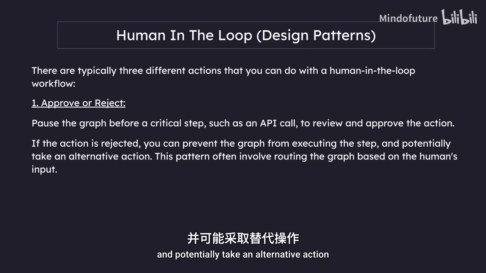

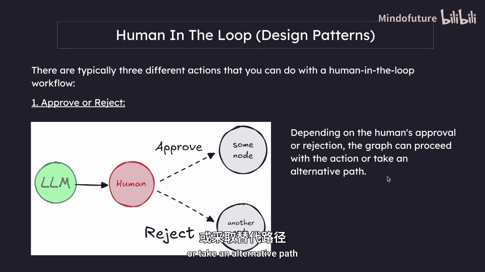

*   **审查工具调用**：在工具执行之前，人工可以审查、编辑或批准大语言模型请求的工具调用。
*   **验证大语言模型输出**：人工可以审查、编辑或批准大语言模型生成的内容。
*   **提供额外上下文**：例如，使大语言模型能够明确要求人工输入以进行澄清或获取更多细节，或支持多轮对话。

---

## 设计模式

接下来，我们看看通常与人工在环工作流一起使用的设计模式。主要有三种不同的操作：

### 批准或拒绝

我们可以在关键步骤（如API调用）之前暂停图执行，以审查和批准该操作。如果操作被拒绝，我们可以阻止图执行该步骤，并可能采取替代操作。这种模式通常涉及根据人工输入来路由图的执行流程。

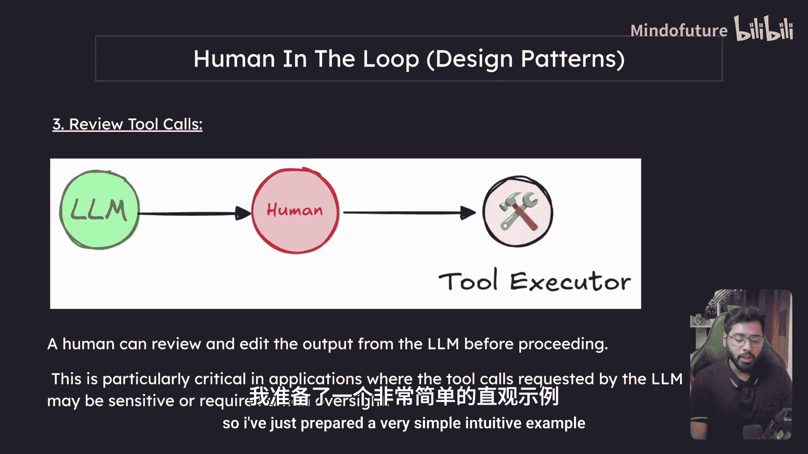

以下是一个简单的示意图：图中有一个节点，另一个节点，以及一些其他节点。在这里，人工可以决定流程是否需要进入特定节点。根据人工的批准或拒绝，图可以继续执行操作或采取替代路径。

### 审查和编辑状态

在这种情况下，人工可以审查和编辑图的状态。这对于纠正错误或用额外信息更新状态非常有用。

另一个用例是审查工具调用，我们之前已经见过。人工可以在处理之前审查和编辑大语言模型的输出。这在应用程序中尤其关键，因为大语言模型请求的工具调用可能很敏感或需要人工监督。你可以想象，有些工具可能很昂贵，在这种情况下，我们可以让图向人工请求许可，如果人工同意，则可以继续执行特定的工具节点，否则可以转到图中的另一个节点。

---

## 一个直观的示例

我们回顾的第一个设计模式是“批准或拒绝”，这可能是我们作为初学者最容易学习的。基本上，图的执行流按某个方向进行，根据人工的“是”或“否”回答，我们将流程导向左侧或右侧。

我准备了一个非常简单直观的示例。我们目前看到的图是一个非常简单的代理，用于创建LinkedIn帖子。

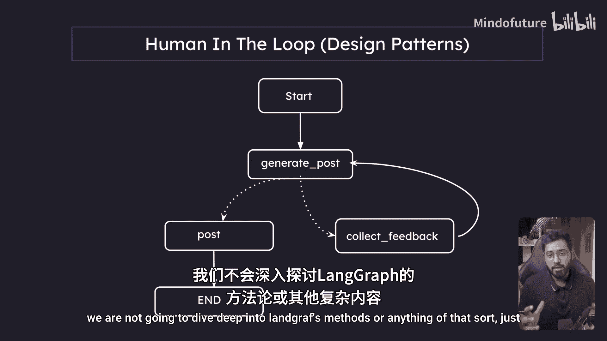

如果人工对生成的草稿满意，它就会继续与LinkedIn API通信并创建草稿。如果人工不满意，可以提供反馈，然后代理将根据反馈进行迭代改进，循环将继续。

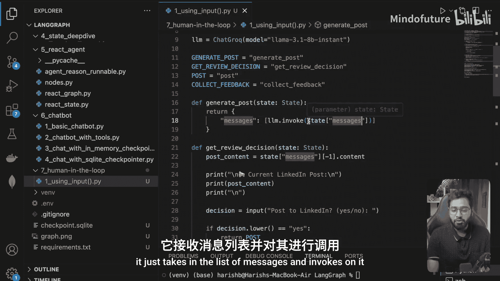

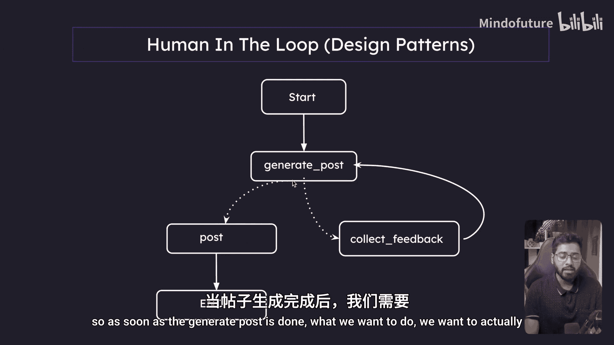

我们可以看到有起始节点，在这里我们将提供想要创建LinkedIn帖子的主题。当执行到达此节点时，会进行大语言模型调用并生成帖子。帖子生成后，我们将中断图的执行流，向用户显示创建的草稿，并询问用户是否满意。如果用户说“是”，我们将继续发布到LinkedIn或与LinkedIn API通信以创建草稿。如果用户说“不”，则进入另一个节点收集用户反馈。用户可以要求“让它更短”、“更长”或“更有趣”等，然后反馈会被送回生成帖子的节点进行迭代。

最初，我们会快速简单地实现，不深入LangGraph的方法，以便真正理解它实际上有多简单。我已经创建了一个文件夹和一个文件，并将其命名为`using_input`，因为在这个特定示例中，我们将使用Python的`input`方法，这是我们都已经习惯使用的东西。

首先，显然是一个具有非常简单`messages`属性的状态，我们也在这里提供了`add_messages`归约函数。然后我们首先定义`generate_post`节点。

这是我们以前见过的东西，它只是接收消息列表并调用大语言模型。生成帖子完成后，我们想要获取用户的反馈。往下看，你可以看到：

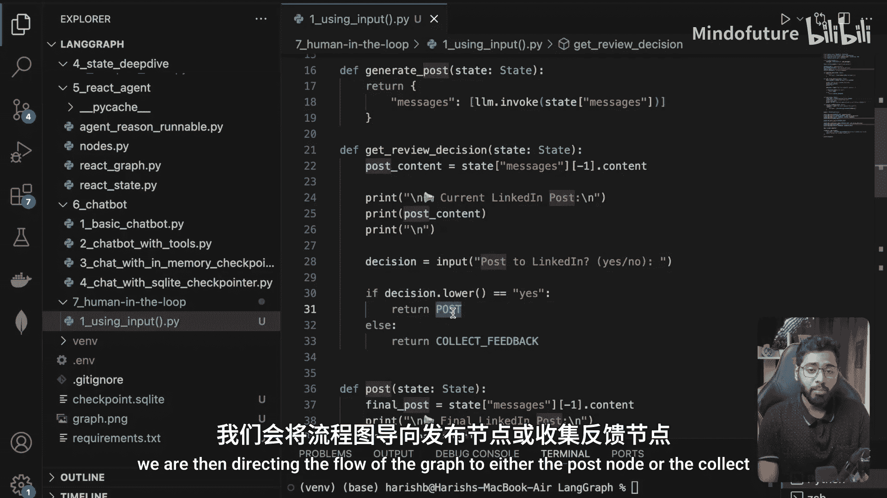

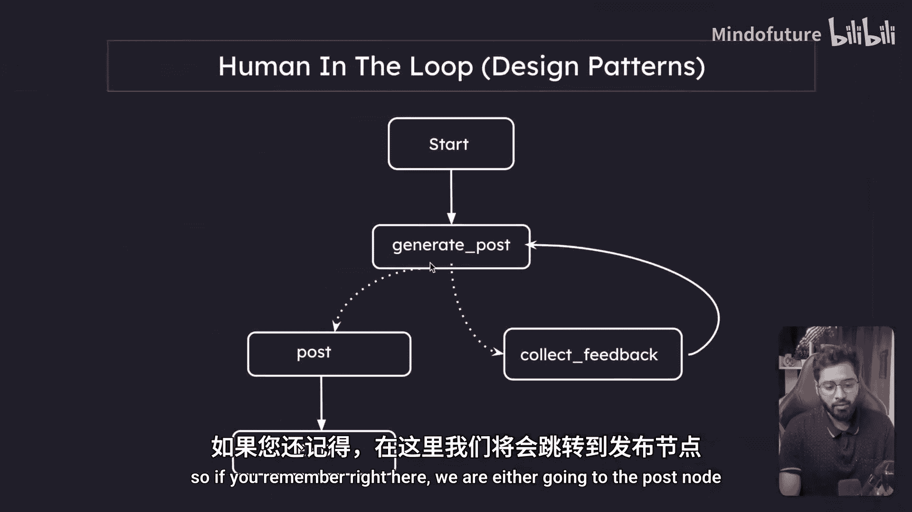

在`generate_post`完成后，我将进入一个名为`get_review_decision`的特定节点。回到`get_review_decision`节点，我所做的就是获取最后一条消息（这将是包含LinkedIn帖子的AI消息），然后在终端中打印它。显示当前LinkedIn帖子及其内容，然后询问用户是否希望我发布到LinkedIn（是或否）。

非常简单。根据答案，我们将图的执行流导向`post`节点或`collect_feedback`节点。如果你记得，在这里，我们要么去`post`节点，要么去`collect_feedback`节点。如果去`post`节点，我只是显示这将是最终的LinkedIn帖子，然后打印它。我们实际上不会进行API调用或任何操作。我们只是说帖子已获批准，现在已在LinkedIn上发布。我们保持非常简单，因为我们只是在学习人工在环的概念。

如果用户说“不”：

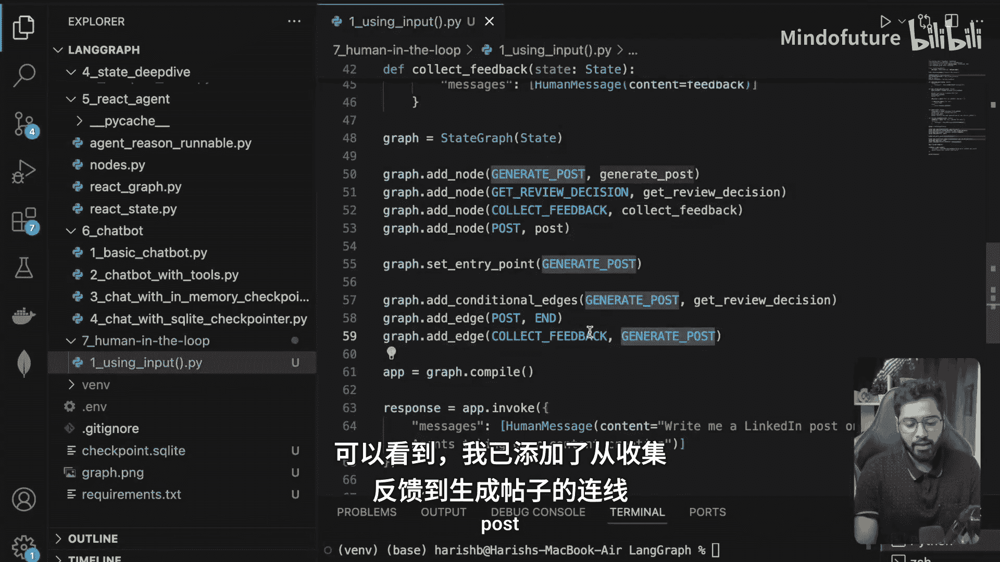

在这种情况下，我们将进入`collect_feedback`节点，在这里你可以看到有另一个输入，询问用户“我如何改进这个帖子？”。人工可以说“让它更短”或“让它更有趣”之类的话，然后我们将其附加到现有列表中。完成后，我们将循环回`generate_post`节点。如果你看到，我已经添加了一条从`collect_feedback`到`generate_post`的边，这将再次运行相同的循环。最终，如果用户最终满意，他们可以继续发布到LinkedIn。

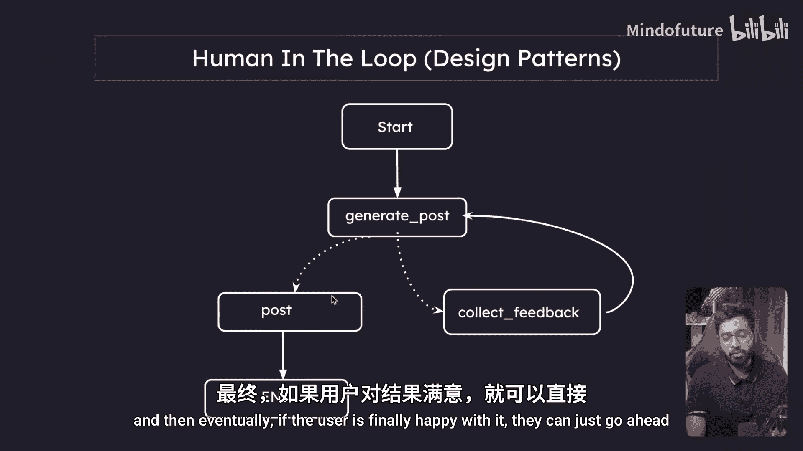

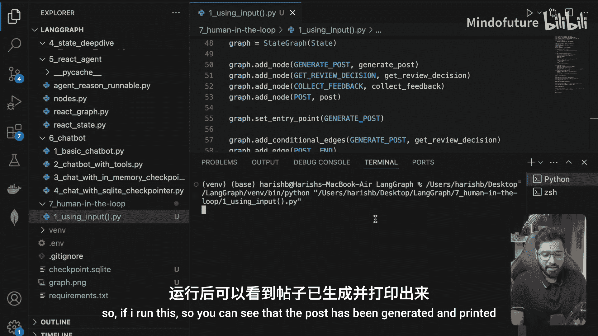

最后，你可以看到我们提供了初始状态，其中包含一条人类消息，内容为“为我写一篇关于AI代理接管内容创作的LinkedIn帖子”。如果我运行这个：

你可以看到帖子已生成并打印。这个特定节点进入其中，打印当前LinkedIn帖子，我们看到完整的帖子。它到达这一行，将询问“发布到LinkedIn？是或否”。如果我说“不”，它会问“我如何改进这个帖子？”，我可以说“最多四行”。现在它大约是四五行。假设我对这个特定帖子满意，我现在希望代理继续发布它。现在我可以说是，这将发布最终内容。最终的LinkedIn帖子，这已获批准，现在已在LinkedIn上发布。

最后，我们还在图结束后记录并打印最终状态。我们拥有一条人类消息、一条AI消息，并且我在某处提供了反馈（“最多两行”），然后某处有最终的AI消息。我们拥有一条AI消息。

在这个示例中，你可以看到我们使用了Python的`input`方法，但这不是正确的方法。我包含这个特定示例是因为我们将使用LangGraph的`interrupt`方法来实现，这将在后面看到，但它与这里所做的非常相似。我只是想在你习惯的内容和将要学习的内容之间架起一座桥梁。

---

## 使用 `input` 方法的缺点

让我们看看使用`input`的一些缺点，因为这不是我们应该做的方式，然后我们将过渡到学习LangGraph提供的另一个方法——`interrupt`类。

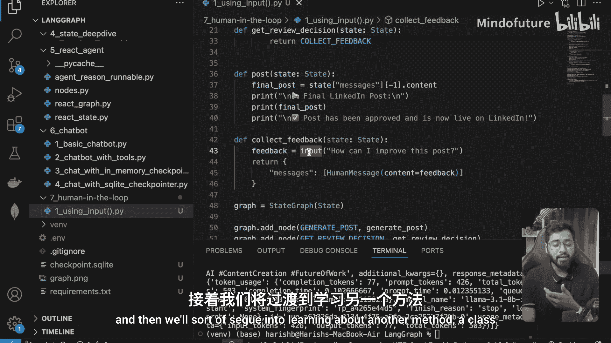

`input`方法的缺点包括：
*   它完全冻结你的程序，直到有人输入内容。
*   它只在终端中工作。
*   它对Web应用程序无用。
*   如果你的程序崩溃，所有进度都会丢失。
*   它一次只能处理一个用户。
*   它只存在于你的终端会话中。

这就是为什么我们使用LangGraph提供的一个特殊方法，称为`interrupt`。

---

## 什么是 `interrupt` 以及为何使用它？

`interrupt`是LangGraph的一个特殊函数，它可以很好地暂停你的工作流。
*   保存你的程序状态，以便以后可以继续。
*   适用于Web应用程序、API和其他接口。
*   一次处理多个用户和会话。
*   在程序崩溃和重启后仍然存在。
*   让人工有足够的时间响应。
*   是任何严肃的人工在环系统所必需的。

以下是两种使用中断的方式。在第一种情况下，你可以看到在编译步骤中，我们可以在`before`提供中断，并且可以指定在哪个节点之前我们希望中断此应用程序。这里我们看到，如果我们的图中将有一个工具节点，意味着就在工具节点即将执行之前，我们可以中断图。这就是它的含义。LangGraph还提供了可以与`Command`类一起使用的`interrupt`函数。

我们可以看到，使用它将与使用Python的`input`方法非常相似。我们可以用这个`interrupt`方法替换`input`方法。每当执行到达这一特定行时，程序将被中断或基本上暂停并从图中退出。在我们从人工获得响应后，我们可以使用这个`Command`类恢复它。

我们如何恢复它？内存存储在哪里？内存存储在检查点中。检查点将包含有关中断发生位置的信息，根据我们在这里传递的内容，它将恢复并从中断处继续。我们将看更多关于如何实际使用这个`interrupt`方法的示例。

---

## 总结

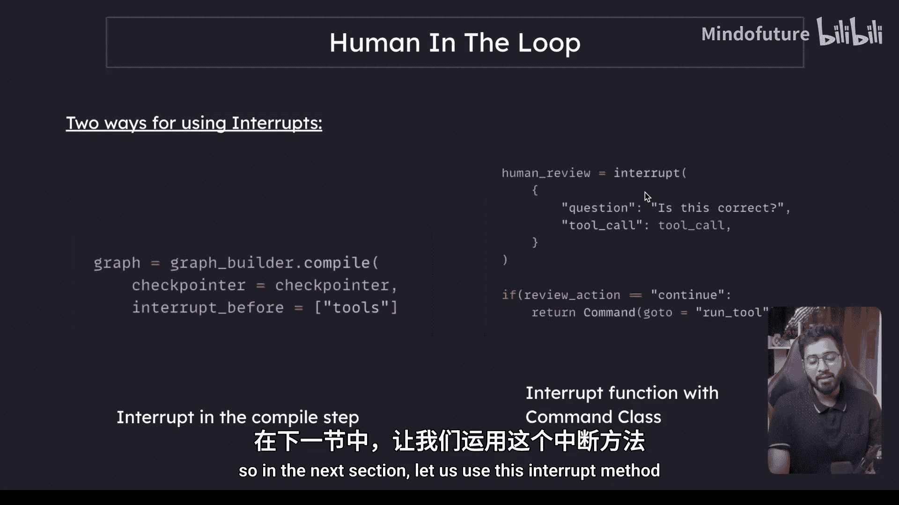

在本节课中，我们一起学习了“人工在环”的概念。我们了解了它的主要用途，包括审查工具调用、验证输出和提供额外上下文。我们探讨了“批准或拒绝”以及“审查和编辑状态”两种基本设计模式，并通过一个使用Python `input` 的简单LinkedIn帖子生成示例，直观地理解了工作流程。最后，我们指出了直接使用 `input` 的局限性，并引入了LangGraph的核心解决方案——`interrupt` 机制，它能够更好地保存状态、支持多用户和复杂部署环境。在下一节中，我们将使用 `interrupt` 方法来构建更健壮的人工在环工作流。