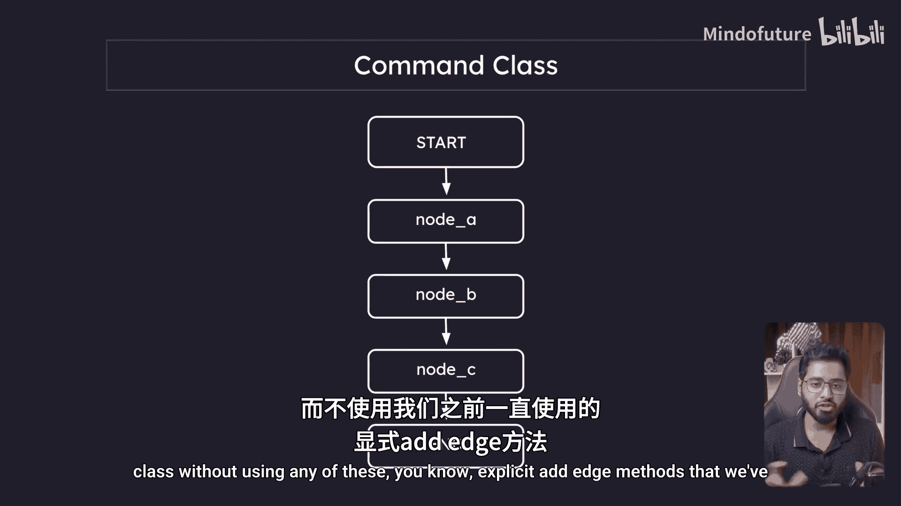
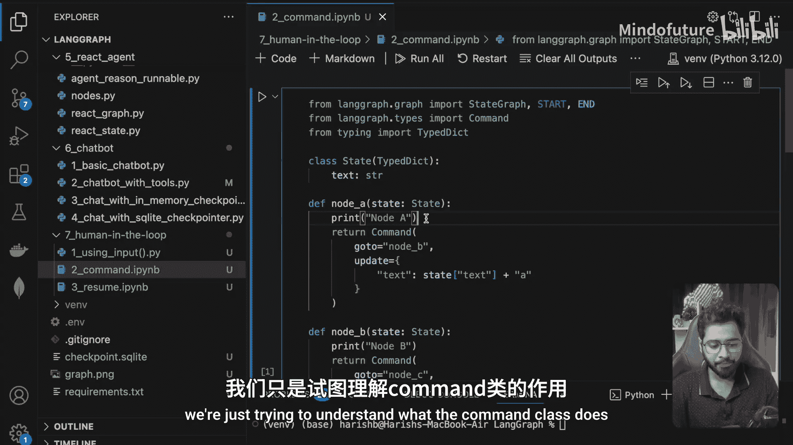
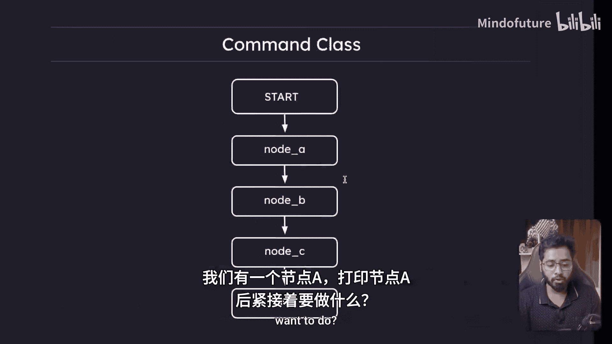
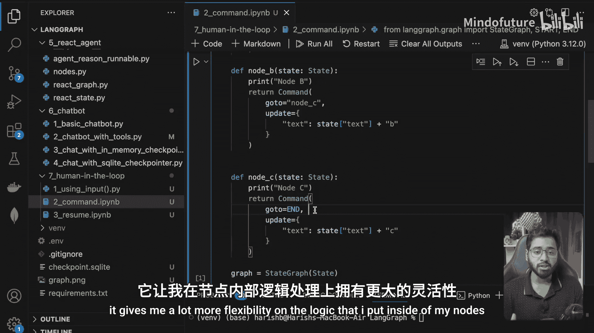
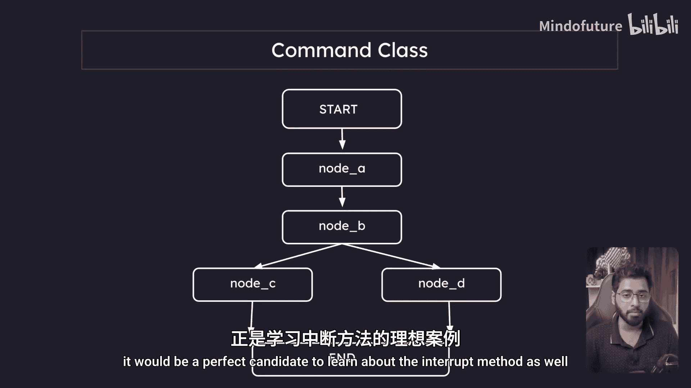

# 032：人工在环与命令类

在本节课中，我们将要学习LangGraph中的**命令类**及其应用，特别是如何利用它来创建无需显式定义边的流程。我们还将初步了解**中断方法**的概念，为后续构建支持人工干预的智能体打下基础。

## 什么是命令类？🚀

上一节我们介绍了基础的图构建。本节中，我们来看看**命令类**。命令类允许我们创建**无显式边的工作流**。它的核心作用是：在一个节点执行完毕后，直接指定下一个要转向的节点，而无需预先使用`add_edge`方法连接它们。

其工作原理非常简单。假设我们有一个节点，我们不再像之前那样仅仅更新状态后隐式流转，而是可以返回一个`Command`类的实例。这个类接收两个关键参数：
*   `goto`: 指定当前节点执行完毕后，下一个要转向的节点。
*   `update`: 用于更新状态，其功能与我们之前直接返回状态字典完全相同。

以下是其基本形式：
```python
# 在节点函数中
return Command(goto="next_node_name", update={"key": "updated_value"})
```

## 命令类示例详解🔧

为了更好地理解，我们来看一个具体的例子。我们将构建一个简单的三节点图（Node A -> Node B -> Node C），但全程不使用`add_edge`方法，而是依靠命令类来控制流程。

以下是该示例的完整代码和分步解析：

```python
from langgraph.graph import StateGraph, END
from langgraph.checkpoint import MemorySaver
from langgraph.types import Command



# 1. 定义状态结构
class State(dict):
    x: str

# 2. 定义各个节点函数
def node_a(state: State):
    print("执行 Node A")
    # 更新状态，并指定下一个节点为 node_b
    return Command(goto="node_b", update={"x": state.get("x", "") + "A"})

def node_b(state: State):
    print("执行 Node B")
    # 更新状态，并指定下一个节点为 node_c
    return Command(goto="node_c", update={"x": state["x"] + "B"})





def node_c(state: State):
    print("执行 Node C")
    # 更新状态，并指定流程结束
    return Command(update={"x": state["x"] + "C"})

# 3. 构建图
builder = StateGraph(State)
builder.add_node("node_a", node_a)
builder.add_node("node_b", node_b)
builder.add_node("node_c", node_c)

# 设置入口点
builder.set_entry_point("node_a")

# 4. 编译图
memory = MemorySaver()
graph = builder.compile(checkpointer=memory)

# 5. 执行图
initial_state = {"x": ""}
final_state = graph.invoke(initial_state)
print(f"最终状态: {final_state}")
```

执行上述代码，你将看到以下输出：
```
执行 Node A
执行 Node B
执行 Node C
最终状态: {'x': 'ABC'}
```

这个例子清晰地展示了命令类如何工作：
1.  **Node A** 执行，打印信息，将字母"A"附加到状态`x`中，然后命令转向**Node B**。
2.  **Node B** 执行，打印信息，将字母"B"附加到状态，然后命令转向**Node C**。
3.  **Node C** 执行，打印信息，将字母"C"附加到状态。由于没有指定`goto`参数，流程在此节点自然结束。

## 命令类的优势与后续展望💡

通过这个简单的例子，我希望你已经理解了命令类的效用。它让节点内的逻辑（决定下一步去哪里）变得更加清晰和灵活，代码也更具可读性。

正因为我们构建的这个图非常简单，它将成为学习下一个核心概念——**中断方法**——的完美示例。在下一节中，我们将在流程的某个点（例如Node B之后）中断执行，引入**人工审核**环节，然后根据人的决策，将图导向不同的节点（例如Node C或Node D）。这将是我们实现“人工在环”工作流的关键一步。

本节课中我们一起学习了：
1.  **命令类**的概念与作用：用于创建无显式边的工作流，通过`goto`参数控制节点流转。
2.  命令类的基本语法：`Command(goto=..., update=...)`。
3.  通过一个从Node A到B再到C的串联示例，实践了如何使用命令类构建流程。





我们将在下一节中，为这个流程加入中断和人工干预的能力。