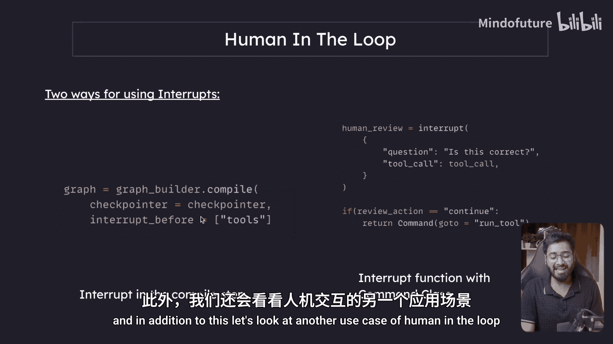
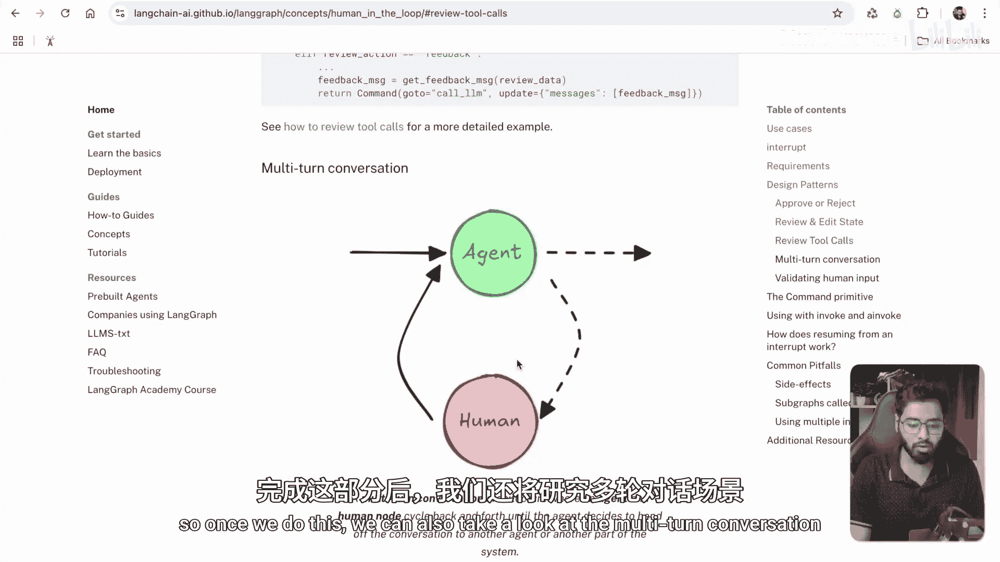
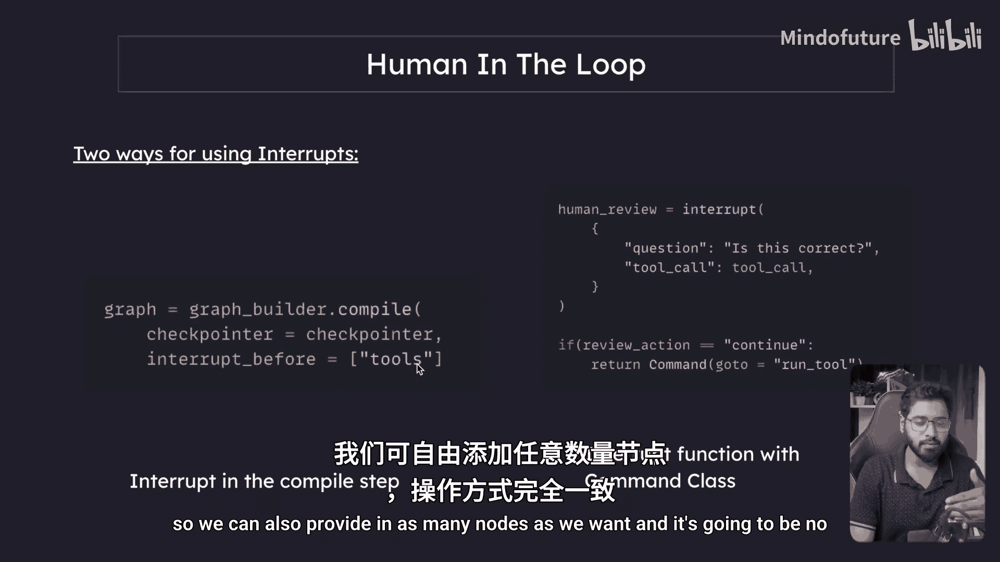
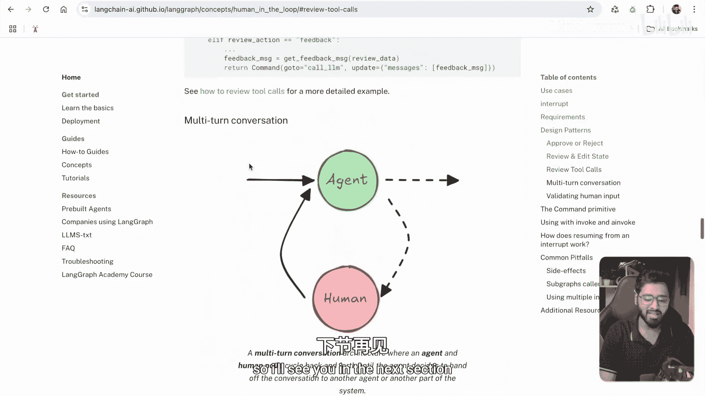

# 034：人工在环与审查工具调用

在本节课中，我们将学习LangGraph中“人工在环”的另一种实现方式，即通过编译步骤中的`interrupt_before`参数来中断流程。我们还将探索一个具体的应用场景：审查工具调用。这对于执行成本高昂或涉及敏感信息的工具操作非常有用。



---

## 中断的另一种用法

上一节我们介绍了在节点内部使用中断的方法。本节中，我们来看看另一种在代码库中常见的中断使用方式：在编译步骤中使用`interrupt_before`参数。


## 审查工具调用的用例



除了之前看到的“批准或拒绝”模式，人工在环还有另一个有用的设计模式：审查工具调用。

在什么场景下这会很有用呢？想象一下，某个工具的执行可能成本很高，或者涉及敏感操作（例如调用一个API、进行网络搜索或执行其他昂贵的工具）。在这种情况下，可能需要人工批准才能执行。这就是我们可以使用人工在环的地方。

流程如下：一个大语言模型建议使用某个工具，在进入工具执行步骤之前，可以由人工进行批准。这正是我们本节要探讨的内容。完成这个例子后，我们还将看一下多轮对话的应用。


## 构建基础工作流

我已经创建了一个名为`approval.py`的文件。这里的基础工作流与我们之前在“带工具的聊天机器人”章节中看到的完全一样。

以下是该工作流的构成：
*   **Start**： 起点。
*   **Model**： 绑定工具的大语言模型。
*   **Tools**： 工具执行节点。
*   **End**： 终点。

其工作原理是：
1.  如果用户询问模型已知的信息（例如“印度的首都是什么？”），模型会直接回答，流程不会进入工具节点，而是直接走向终点。
2.  如果用户询问需要实时信息的问题（例如“金奈当前的天气如何？”），绑定了工具的模型不会直接给出答案，而是会提供关于应该调用哪个工具的信息。
3.  流程随后会进入工具节点（例如网络搜索工具），执行工具并生成一个工具消息。
4.  这个工具消息被送回给模型，模型据此做出明智的决策，最终流程到达终点。

我们本节要构建的内容与上述流程的唯一区别是：**我们将在流程到达“工具”节点之前中断它**。在工具调用实际执行之前，我们会先获取人工批准。

## 代码逐步解析

让我们逐步分析代码。

首先，我们定义工具（例如`TavilySearchTool`）并将其放入工具列表。然后，我们创建绑定这些工具的LLM。模式中只需要一个`messages`属性，模型将在所有消息列表上调用。

在模型执行之后，我们需要进入一个“工具路由器”。这个路由器会查看最新的AI消息，检查模型是否希望我们进行任何工具调用。

以下是路由逻辑：
*   如果存在工具调用（例如`TavilySearchTool`调用），流程将被导向“工具”节点。
*   在工具节点，我们可以使用预构建的`ToolNode`类，只需提供所有工具即可。它会执行指定的工具，并自动创建一个工具消息附加到消息列表中。
*   执行完成后，流程再次回到模型。此时模型拥有了新的信息，可以据此做出决策并走向终点。

到目前为止，这些都是我们已经熟悉的内容。唯一的新知识在于`compile`步骤。

## 配置中断

在编译步骤中，我们首先需要提供内存（或检查点），因为使用中断时必须如此。

接下来是关键的新部分：我们通过`interrupt_before`关键字参数来指定在哪个节点之前退出图。代码如下：
```python
app = workflow.compile(
    checkpointer=memory,
    interrupt_before=[“tools”] # 在进入“tools”节点前中断
)
```
这意味着，在流程有机会进入“工具”节点之前，图就会退出。这样我们就可以审查LLM建议的工具调用，并决定是否批准。

此外，我们还可以看到`interrupt_after`参数。它与`interrupt_before`类似，但作用是在指定节点**执行之后**退出图。这适用于另一种用例：强制用户审查工具调用的输出结果，以确保一切正常。本节我们只使用`interrupt_before`。

## 执行与流式输出

在配置对象中，我们指定线程ID等。这次我们不会使用`app.invoke`方法，而是使用`app.stream`方法。两者的区别在于：
*   `app.invoke` 在图退出（无论是因中断还是到达终点）后返回一个值。
*   `app.stream` 是一个生成器函数，在**每个节点执行后**都会发出事件。

我们可以遍历这些事件，每次节点执行完成后，我们都会得到一个事件对象，其中包含该时间点的所有消息。我们只需提取最新的消息并进行美化打印即可。我们还可以设置流模式值，因为我们只对值感兴趣，而不是整个对象。

## 运行示例

当我们运行这段代码并向模型提问“What is the current weather in Chennai?”时，模型会建议使用Tavily搜索工具，并提供查询词“Chennai current weather”。

此时，模型已成功提供了AI消息，而`interrupt_before=[“tools”]`使得图在进入工具节点前退出。如果我们检查下一个应该执行的节点，会发现是“tools”节点。

要继续执行，我们可以简单地再次调用`app.invoke()`。这次，它将执行Tavily搜索工具，生成工具消息，然后将结果反馈给LLM。最终，LLM会给出一个基于工具执行结果的、信息充分的答案。




通过这种方式，我们成功地中断了工具调用。这种方法可以应用于许多场景，例如需要人工批准敏感操作，或者需要人工进行质量检查（使用`interrupt_after`）等。

## 总结


本节课中，我们一起学习了在LangGraph中使用“人工在环”模式的另一种方法：通过编译步骤的`interrupt_before`参数来中断流程。我们重点探讨了“审查工具调用”这一具体用例，它适用于需要人工批准的高成本或敏感操作。我们还了解了如何通过`app.stream`方法进行流式输出以观察执行过程。在编译步骤中配置中断非常简单，并且可以应用于任意多个节点。在下一节中，我们将探讨多轮对话的应用。