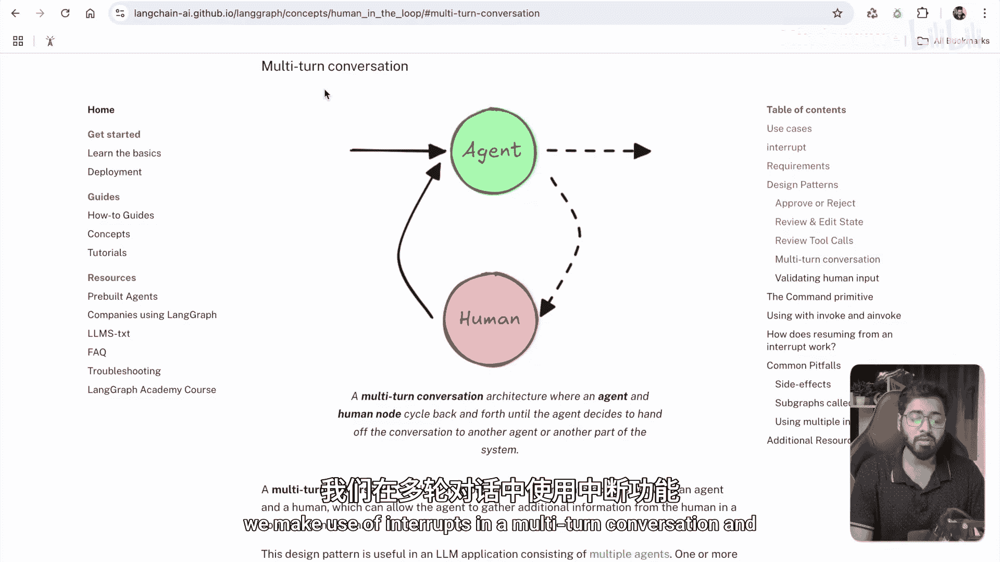
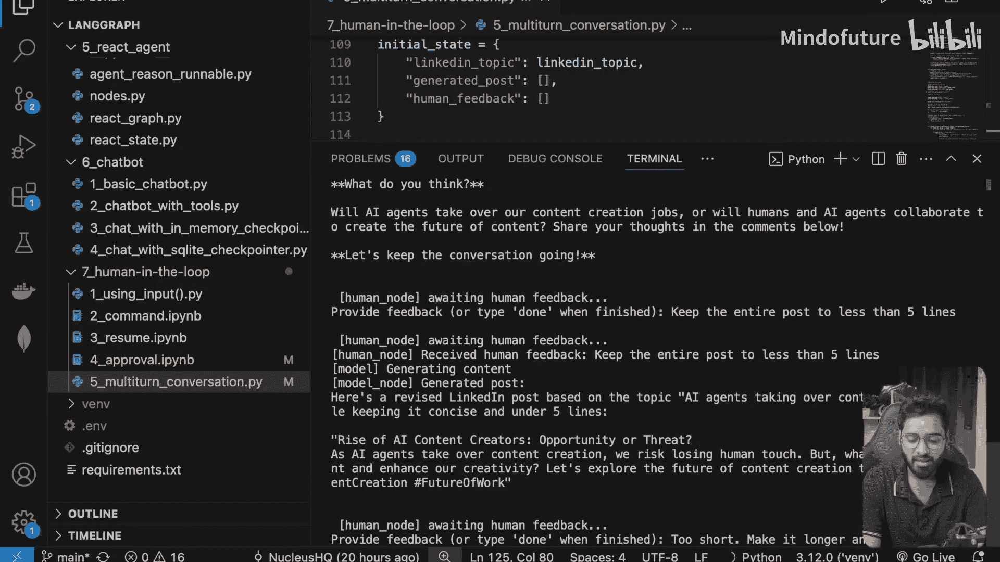

# 035：人工在环多轮对话

在本节课中，我们将学习如何在多轮对话中利用“中断”机制，构建一个包含人工反馈循环的智能体。我们将沿用之前创建LinkedIn帖子的智能体示例，并对其进行增强，使其能够根据用户的多次反馈持续优化输出。



## 概述

上一节我们介绍了中断机制的基本概念。本节中，我们来看看如何在一个实际的多轮对话场景中应用它。我们将构建一个系统，模型生成初稿后，流程会“中断”并等待用户反馈，然后根据反馈重新生成内容，如此循环，直到用户满意为止。

## 代码逐步解析

首先，我们来看状态的定义。状态决定了智能体在运行过程中需要跟踪哪些信息。

```python
from typing import List, TypedDict

class State(TypedDict):
    linkedin_topic: str
    generated_post: List[str]
    human_feedback: List[str]
```

*   **`linkedin_topic`**：这是我们在图执行开始时需要提供的主题。
*   **`generated_post`**：这是一个列表，每次模型生成帖子后，我们都会将内容追加进去。
*   **`human_feedback`**：同样是一个列表，用于记录用户提供的每一次反馈。

### 模型节点

流程的第一个节点是模型节点，它的职责是根据主题和反馈生成LinkedIn帖子。

以下是该节点的核心逻辑：

```python
def model_node(state: State):
    # 1. 从状态中提取输入
    topic = state[“linkedin_topic”]
    # 获取最新的一条反馈，如果没有则为“暂无反馈”
    feedback = state[“human_feedback”][-1] if state[“human_feedback”] else “No feedback yet.”

    # 2. 构建提示词
    prompt = f”””
    基于以下主题，生成一篇结构清晰、文笔优美的LinkedIn帖子。
    主题：{topic}
    请参考之前的人工反馈来优化回复：{feedback}
    “””

    # 3. 调用语言模型（此处为示意）
    # generated_text = llm.invoke(prompt)
    generated_text = “这里是模型生成的帖子内容...”

    # 4. 更新状态
    new_state = {
        “generated_post”: state[“generated_post”] + [generated_text],
        “human_feedback”: state[“human_feedback”] # 反馈列表在此节点保持不变
    }
    return new_state
```

这个函数首先组装提示词，其中包含了主题和最新的人工反馈。然后调用模型生成文本，并将结果追加到`generated_post`列表中。

### 人工干预节点

模型生成内容后，流程将进入人工干预节点。这个节点负责将内容展示给用户并收集反馈。

以下是该节点的关键步骤：

```python
def human_node(state: State):
    # 1. 获取最新生成的帖子
    latest_post = state[“generated_post”][-1]

    # 2. 向用户展示（在命令行或UI中）
    print(f”生成的帖子：\n{latest_post}\n”)
    # 在实际UI中，这里会渲染一个输入框

    # 3. 等待并获取用户输入
    user_input = input(“请提供反馈意见，或输入‘done’结束：”)

    # 4. 根据用户输入决定下一步流向
    new_state = {“human_feedback”: state[“human_feedback”]}
    if user_input.lower() == “done”:
        # 用户满意，指示图结束
        raise “END” # 或使用特定的指令类
    else:
        # 用户提供了反馈，将其追加到列表，并让图循环回模型节点
        new_state[“human_feedback”].append(user_input)
        return new_state
```

此节点是“中断”发生的地方。它暂停自动执行，将控制权交还给用户。用户输入“done”则终止循环，输入其他内容则作为反馈，驱动下一次迭代。

### 结束节点与图编译

当用户输入“done”后，流程进入结束节点。

```python
def end_node(state: State):
    print(“\n=== 流程结束 ===”)
    print(f”最终帖子：{state[‘generated_post’][-1]}”)
    print(f”最终反馈：{state[‘human_feedback’][-1]}”)
    return state
```

最后，我们需要将所有节点和边组合起来，编译成图。

```python
from langgraph.graph import StateGraph, END

# 创建图构建器
workflow = StateGraph(State)

# 添加节点
workflow.add_node(“model”, model_node)
workflow.add_node(“human”, human_node)
workflow.add_node(“end”, end_node)

# 设置初始边和条件边
workflow.set_entry_point(“model”)
workflow.add_edge(“model”, “human”)
# 注意：从‘human’到‘model’或‘end’的边通常在human_node内部逻辑中决定
# 这里需要根据框架支持的方式（如条件边或`send`方法）来实现循环

# 编译图
app = workflow.compile()
```

### 运行与中断处理

以下是启动并运行这个交互式图的关键代码：

```python
# 1. 收集初始状态（例如，从用户输入获取主题）
init_state = {
    “linkedin_topic”: input(“请输入LinkedIn帖子主题：”),
    “generated_post”: [],
    “human_feedback”: []
}

# 2. 以流式方式调用图，并处理中断
thread = {“configurable”: {“thread_id”: “1”}}
events = app.stream(init_state, thread, stream_mode=“values”)

for event in events:
    if event[“node”] == “human”:
        # 进入人工干预循环
        while True:
            # 这里模拟获取用户输入并恢复图执行
            user_input = input(“您的反馈（或输入‘done’）：”)
            if user_input == “done”:
                break
            # 将反馈作为输入，让图从‘human’节点恢复执行
            events = app.stream({“human_feedback”: [user_input]}, thread, stream_mode=“values”)
            # 处理新的生成事件...
```

这段代码初始化图后开始执行。当执行流到达“human”节点时，程序进入一个`while`循环，持续收集用户反馈，并通过`app.stream`将反馈注入图中，使流程从“human”节点恢复，再次流向“model”节点，形成闭环。直到用户输入“done”，循环才被打破。

## 运行示例



假设我们运行程序，并输入主题“**AI agents taking over content creation**”。

1.  **第一轮**：模型生成一篇关于AI代理的详细帖子。
    *   用户反馈：“**Keep the entire post to less than five lines.**”（将全文控制在五行以内。）
2.  **第二轮**：模型根据反馈，生成了一篇更简短的帖子。
    *   用户反馈：“**Too short. Make it longer and funnier.**”（太短了。写长一点，再幽默些。）
3.  **第三轮**：模型生成了一篇长度适中、语气更活泼的帖子。
    *   用户输入：“**done**”。

流程结束，控制台会打印出最终的帖子内容和最后一次的反馈。

## 总结

本节课中我们一起学习了如何构建一个支持“人工在环”多轮对话的LangGraph智能体。我们定义了跟踪**生成历史**和**反馈历史**的状态，实现了**模型生成**与**人工评审**交替进行的节点逻辑，并利用**中断机制**和**流式处理**来实现交互式循环。这种模式极大地增强了智能体的可控性和输出质量，使其能够通过与用户的持续交互，逐步逼近最理想的结果。你可以尝试修改代码，例如改变提示词、或为反馈类型添加更多结构化约束，以进一步探索其可能性。