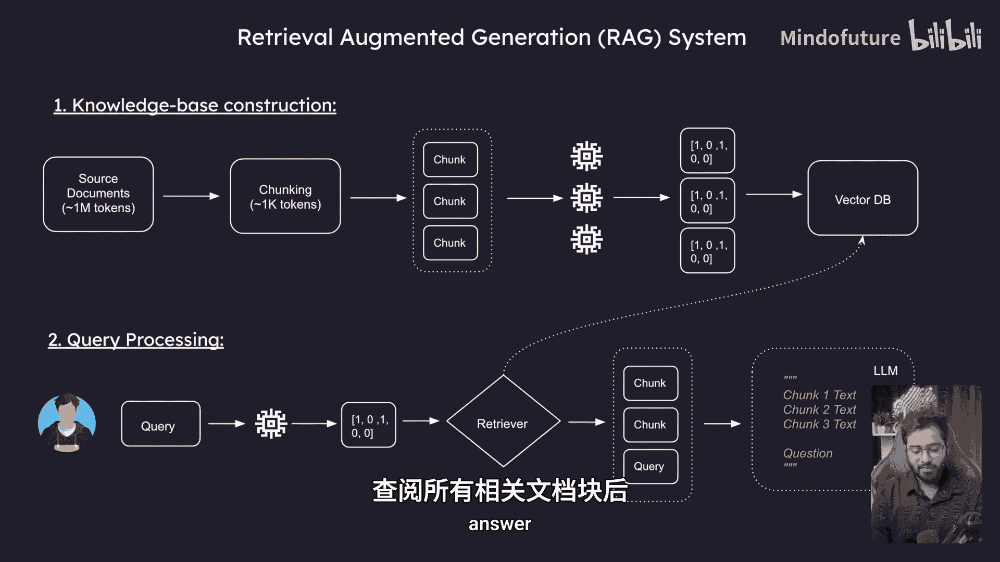
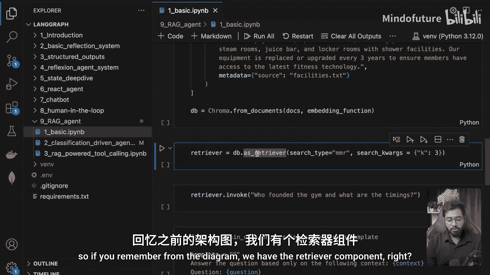
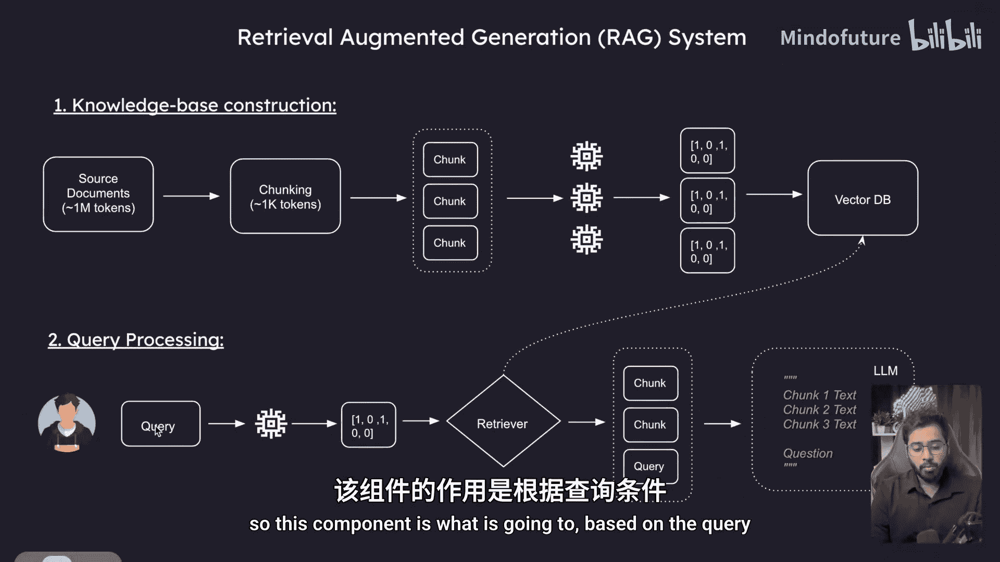
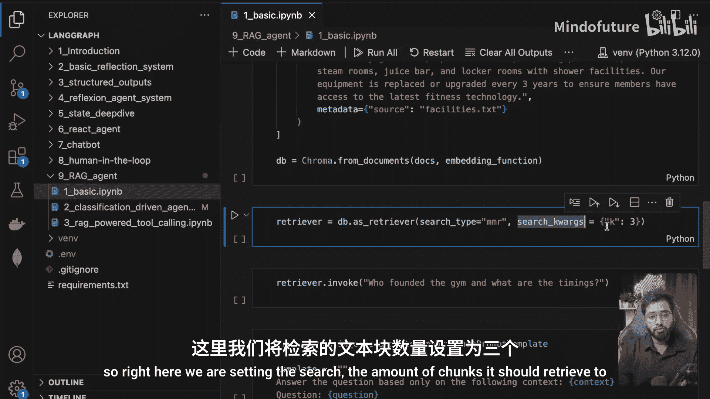
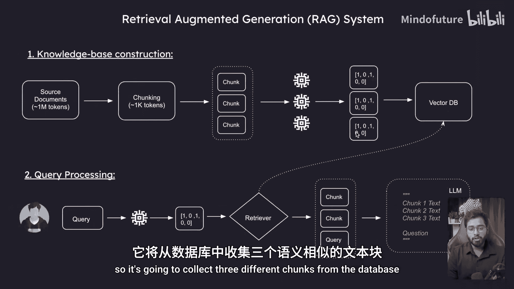
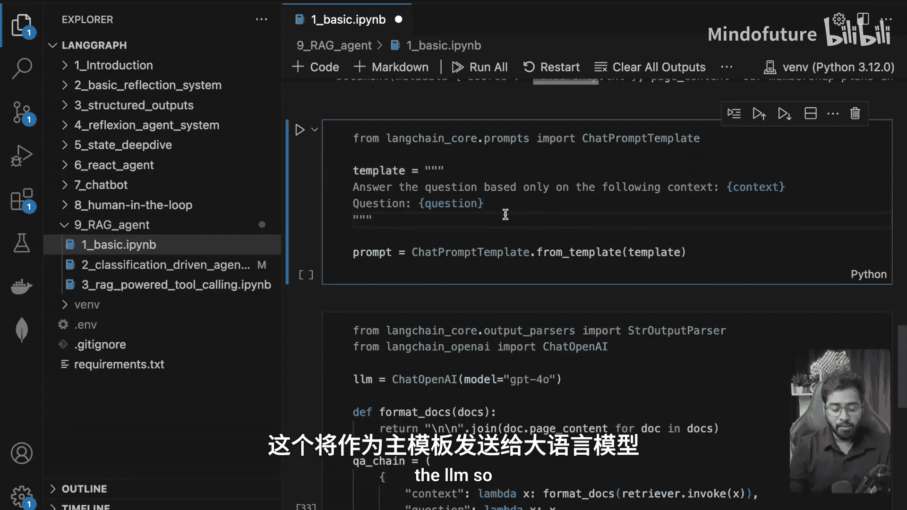
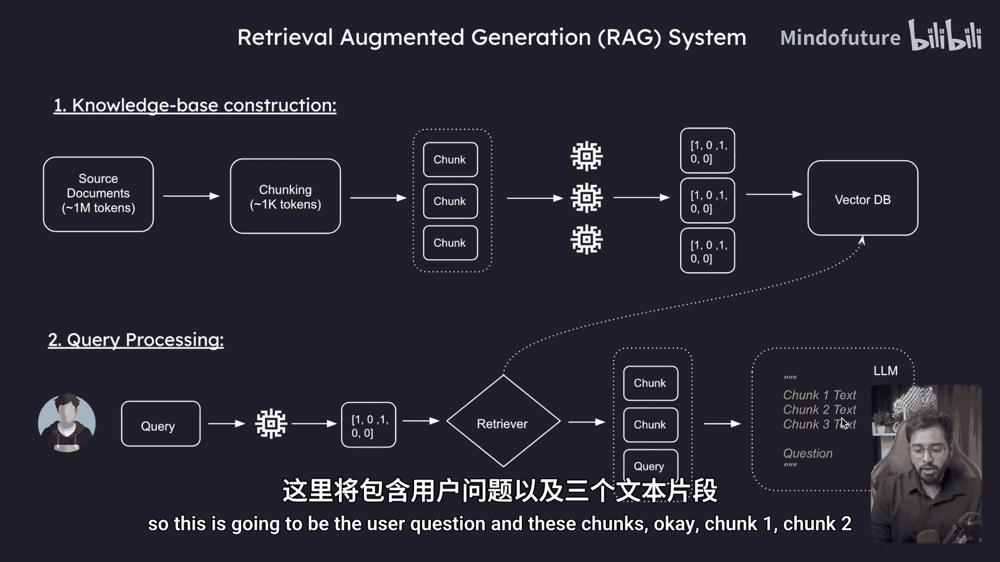
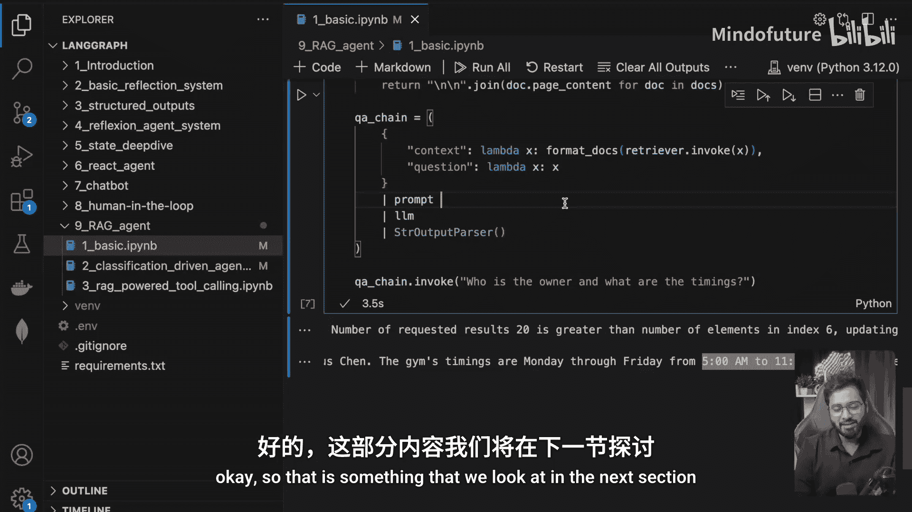

# 036：RAGs 介绍 🧠

在本节课中，我们将学习检索增强生成（RAG）的基本概念，并了解如何将其与 LangGraph 结合，以构建更强大的 AI 代理。本节是一个快速回顾，为后续构建集成 RAG 的智能代理打下基础。

## 为什么需要 RAG？🤔

我们使用 RAG 是为了向大型语言模型（LLM）提供额外的信息。假设我经营一家私人公司，拥有大量内部文档。LLM 本身并不知道这些文档的内容。通过 RAG，我可以让 LLM 能够查询这些文档，从而获得基于特定知识的回答。

## RAG 系统概览 🏗️

一个 RAG 系统主要包含两个部分：**知识库构建**和**查询处理**。

### 知识库构建

首先，我们来看知识库是如何构建的。假设我们有一系列私人文档，信息量可能非常大（例如包含一百万个词元）。处理的第一步是**分块**。

**分块**是指将庞大的文档分割成更小、更易管理的片段。例如，我们可以将文档分割成每个约 1000 个词元的块。这个过程可以表示为：
```python
# 伪代码：文档分块
chunks = split_document_into_chunks(original_document, chunk_size=1000)
```

接下来，我们需要将这些文本块通过一个**嵌入模型**进行处理。嵌入模型会将普通文本（如英文句子）转换为**向量表示**，即一种数学表征。每个文本块都会生成其对应的向量。

最后，我们将原始文本块及其对应的向量嵌入一起存储到一个专门的数据库中，即**向量数据库**。这样，我们就完成了知识库的构建。



### 查询处理

当用户提出一个问题时，查询处理流程开始工作。首先，用户的查询问题同样会被转换成向量表示。

然后，系统中的**检索器**组件开始工作。它会基于查询的向量表示，在向量数据库中查找语义上最相关的文本块。检索器会返回多个可能包含答案的相关文本块。

最后，我们将原始的用户问题（英文）和检索到的相关文本块（英文）一起组合成一个提示，发送给 LLM。LLM 会基于提供的上下文信息，生成一个更准确、更相关的答案。

## 代码实践演示 💻

上一节我们介绍了 RAG 的理论框架，本节我们来看看一个简单的代码示例，以加深理解。

以下是构建一个基础 RAG 系统的关键步骤代码：

首先，导入必要的库并准备文档数据。我们模拟一个健身房的文档，并将其分成了六个小块。
```python
from langchain_community.document_loaders import TextLoader
from langchain_openai import OpenAIEmbeddings
from langchain_community.vectorstores import Chroma









# 模拟已分块的文档数据
documents = [
    {"page_content": "Peak Performance Gym was founded in 2015 by Marcus Chen...", "metadata": {"source": "about.txt"}},
    {"page_content": "Gym hours are 5 AM to 11 PM daily.", "metadata": {"source": "hours.txt"}},
    # ... 其他文档块
]
```

接着，创建向量数据库并嵌入所有文档。
```python
# 初始化嵌入模型
embeddings = OpenAIEmbeddings()

# 创建向量数据库
vectorstore = Chroma.from_documents(documents=documents, embedding=embeddings)
```

然后，配置检索器。我们设置它每次检索 3 个最相关的块，并使用“最大边际相关性”算法来确保结果的多样性。
```python
# 从向量库获取检索器
retriever = vectorstore.as_retriever(search_kwargs={"k": 3, "search_type": "mmr"})
```

现在，我们可以使用检索器来获取与查询相关的上下文。
```python
# 用户查询
query = "Who founded the gym and what are the timings?"
# 检索相关文档块
relevant_docs = retriever.invoke(query)
```

最后，我们需要构建发送给 LLM 的提示模板。模板将整合检索到的上下文和用户问题。
```python
from langchain.prompts import PromptTemplate
from langchain_openai import ChatOpenAI

# 定义提示模板
template = """Answer the question based on the following context:
{context}





Question: {question}
"""
prompt = PromptTemplate.from_template(template)

# 一个辅助函数，用于格式化检索到的文档内容
def format_docs(docs):
    return "\n\n".join([doc.page_content for doc in docs])

# 创建处理链：检索 -> 格式化 -> 生成提示 -> 调用LLM
from langchain.schema.runnable import RunnablePassthrough
chain = (
    {"context": retriever | format_docs, "question": RunnablePassthrough()}
    | prompt
    | ChatOpenAI()
)

# 执行查询
response = chain.invoke(query)
print(response.content)
```

运行上述代码，我们将得到类似“The gym was founded by Marcus Chen. The operating hours are 5 AM to 11 PM daily.”的回答，这证明了 RAG 系统成功地从提供的文档中检索并利用了信息。

## 总结 📝

本节课中，我们一起学习了 RAG（检索增强生成）的核心概念。我们了解到 RAG 通过**知识库构建**（分块、嵌入、存储）和**查询处理**（检索、提示构建、生成）两个主要阶段，使 LLM 能够访问并利用外部知识源来回答问题。我们还通过一个简单的代码示例，实践了如何使用 LangChain 组件快速搭建一个基础的 RAG 系统。



本节内容是一个重要的铺垫。在接下来的章节中，我们将把 RAG 的能力整合到 LangGraph 智能代理中，构建能够自主利用知识库进行复杂推理和对话的 AI 代理。