# 037：分类驱动检索 🧠

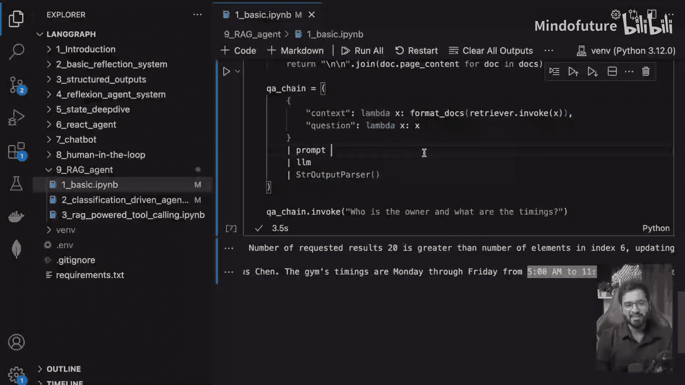

在本节课中，我们将学习如何构建一个“分类驱动检索”系统。该系统能够判断用户的问题是否与预设主题相关。只有当问题相关时，系统才会使用检索增强生成（RAG）来查找文档并生成答案；如果问题不相关，系统将直接拒绝回答。

## 概述与目标

上一节我们介绍了RAG的基本概念。本节中，我们将构建一个更智能的流程。其核心思想是：在检索文档之前，先对用户的问题进行分类。这可以确保我们的聊天机器人只回答与特定领域（例如，公司业务）相关的问题，避免对无关问题做出错误或无关的回应。

我们将构建的流程图如下：


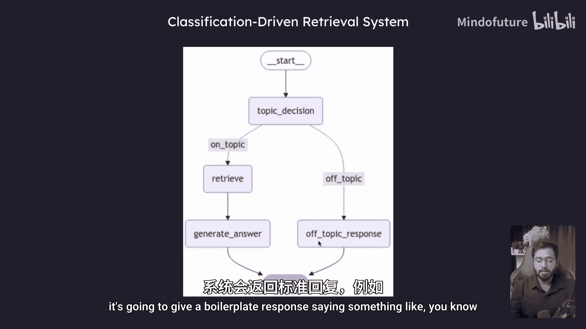

## 准备工作

首先，我们需要设置基础环境，包括文档、嵌入函数和向量数据库。这部分代码与之前课程类似。

```python
# 初始化文档、嵌入模型和向量数据库
docs = [...] # 您的文档
embedding_function = ... # 您的嵌入函数
vectorstore = ... # 初始化向量数据库
retriever = vectorstore.as_retriever(search_kwargs={"k": 3}) # 配置检索器
```

同时，我们准备一个提示模板和LLM链，用于在检索到相关文档后生成答案。

```python
from langchain.prompts import ChatPromptTemplate

template = """基于以下上下文回答问题。
上下文：{context}
问题：{question}
"""
prompt = ChatPromptTemplate.from_template(template)
chain = prompt | llm # llm 是您初始化的大语言模型
```

## 定义状态与分类模型

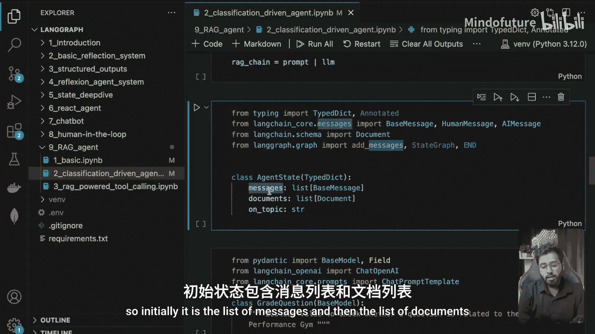


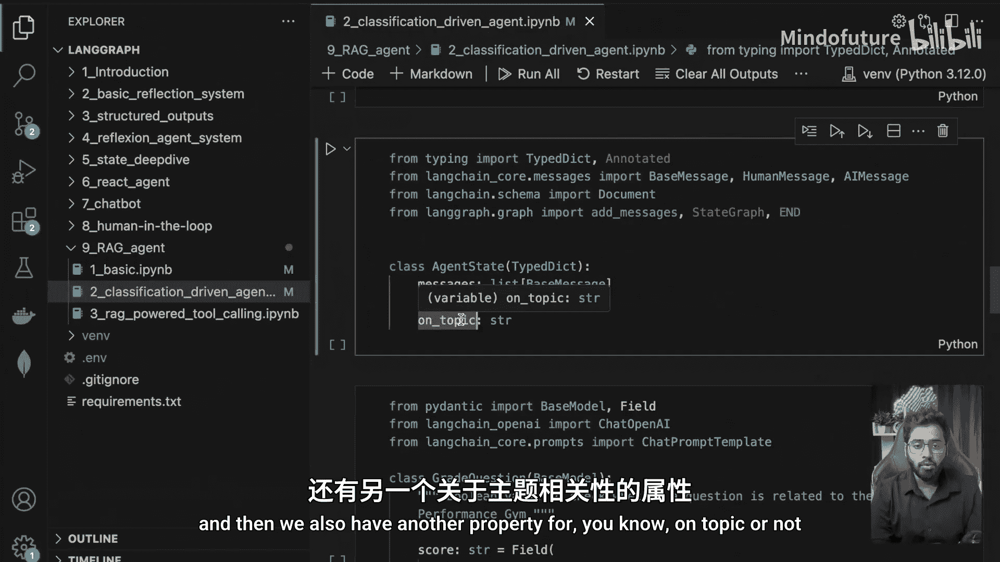

在构建图之前，我们需要定义图运行时将维护的状态。状态是一个字典，包含对话的中间信息。

以下是状态中需要包含的属性：
*   **`messages`**: 存储对话消息列表。
*   **`documents`**: 存储检索器查找到的文档列表。
*   **`on_topic`**: 存储一个布尔值，表示用户问题是否与主题相关。

接下来，我们定义一个Pydantic模型，用于从LLM获取结构化的分类输出。这能确保LLM严格按照我们要求的格式（是/否）回答问题。

```python
from pydantic import BaseModel, Field

class TopicClassification(BaseModel):
    """检查问题是否与‘巅峰表现健身房’相关的模型。"""
    score: str = Field(description="问题是关于健身房吗？如果是，回答‘是’，否则回答‘否’。")
```

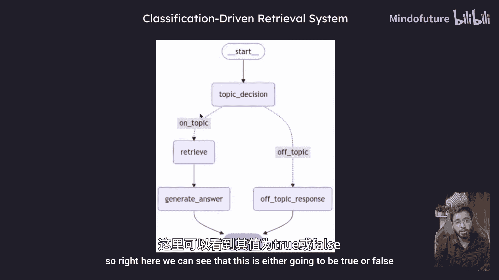

## 构建图节点

现在，我们开始构建LangGraph的各个节点。每个节点代表流程中的一个步骤。

### 1. 问题分类节点

这是第一个节点，负责判断用户问题是否在主题范围内。

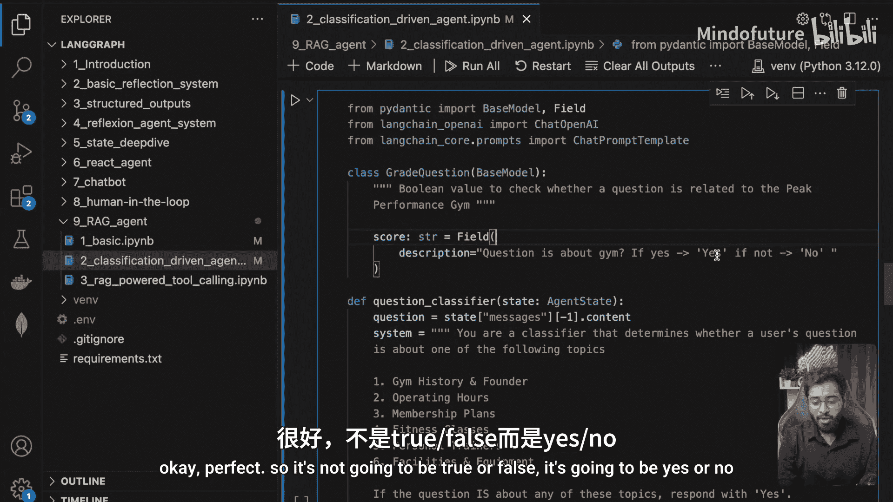


```python
def topic_decision_node(state):
    # 获取最新的用户消息
    human_message = state["messages"][-1].content

    # 构建分类提示词
    classifier_prompt = f"""
    你是一个分类器，用于判断用户的问题是否属于以下主题：
    - 健身房信息、会员、营业时间、所有者等与‘巅峰表现健身房’相关的内容。
    如果问题涉及以上任何主题，请回答‘是’，否则回答‘否’。
    用户问题：{human_message}
    """
    # 调用LLM并获取结构化输出
    structured_llm = llm.with_structured_output(TopicClassification)
    result = structured_llm.invoke(classifier_prompt)

    # 将结果存入状态
    return {"on_topic": result.score}
```
这个节点接收用户问题，使用LLM进行分类，并将结果（“是”或“否”）存入状态的`on_topic`字段。

### 2. 路由判断

根据`on_topic`的值，我们需要决定下一步的流程。这通过一个路由函数实现。

```python
def route_on_topic(state):
    if state["on_topic"] == "是":
        return "on_topic_chain"
    else:
        return "off_topic_route"
```
如果问题相关，则路由到`on_topic_chain`；如果不相关，则路由到`off_topic_route`。

### 3. 相关话题处理链

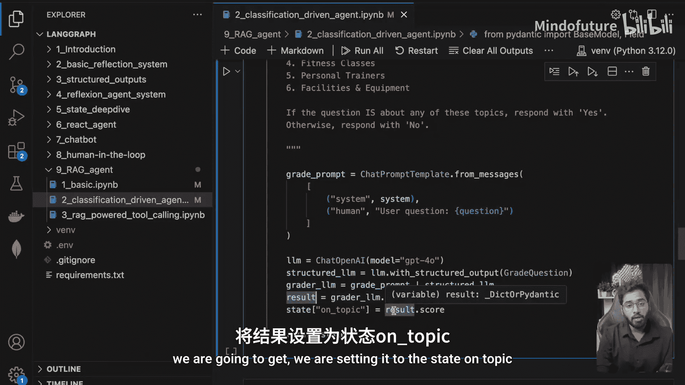

如果问题被判定为相关，则执行以下两个节点。

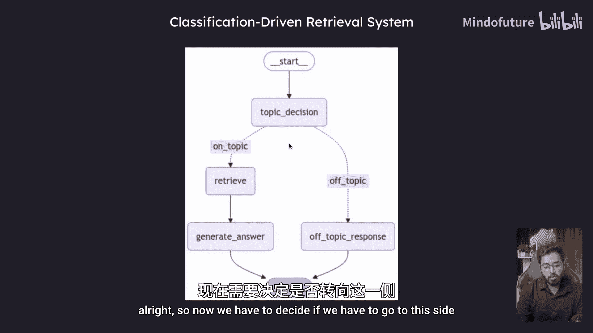

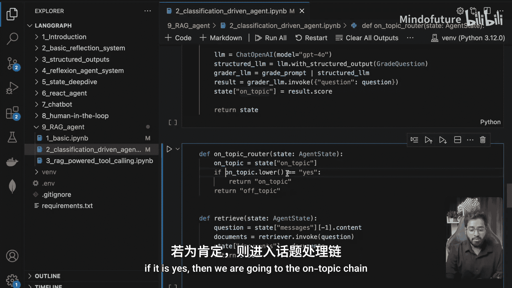


首先，**检索节点**从向量数据库中查找相关文档。

```python
def retrieve(state):
    question = state["messages"][-1].content
    # 使用检索器获取相关文档
    relevant_docs = retriever.invoke(question)
    # 将文档存入状态
    return {"documents": relevant_docs}
```

然后，**生成答案节点**利用检索到的文档和原始问题，调用LLM生成最终答案。

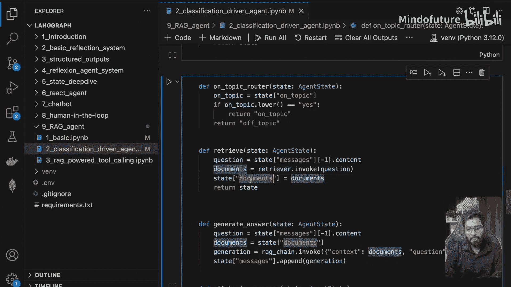

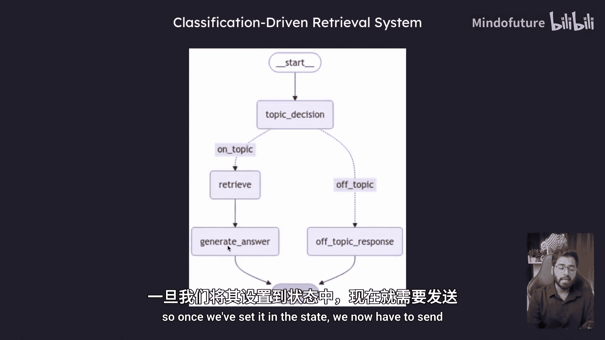

```python
def generate_answer(state):
    question = state["messages"][-1].content
    context = state["documents"]

    # 调用之前准备好的RAG链
    answer = chain.invoke({"context": context, "question": question})
    # 将AI的回答添加到消息历史中
    return {"messages": [AIMessage(content=answer)]}
```

### 4. 无关话题处理节点

如果问题被判定为不相关，则直接返回一个预设的拒绝回答消息。

```python
def off_topic_response(state):
    # 返回固定的拒绝回答消息
    return {"messages": [AIMessage(content="抱歉，我无法回答这个问题。")]}
```

## 组装与运行图

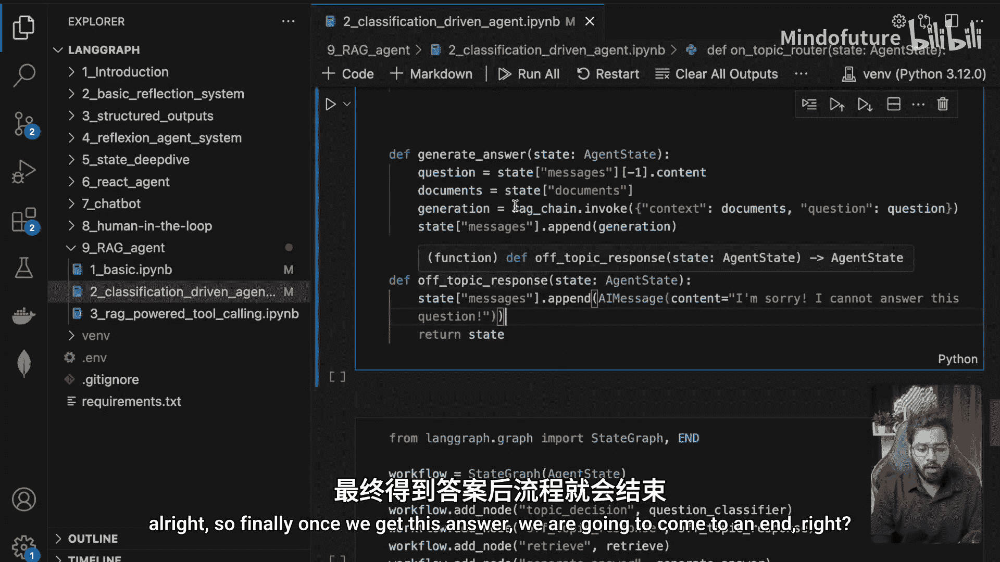

定义了所有节点和路由逻辑后，我们将它们组装成一个完整的图。


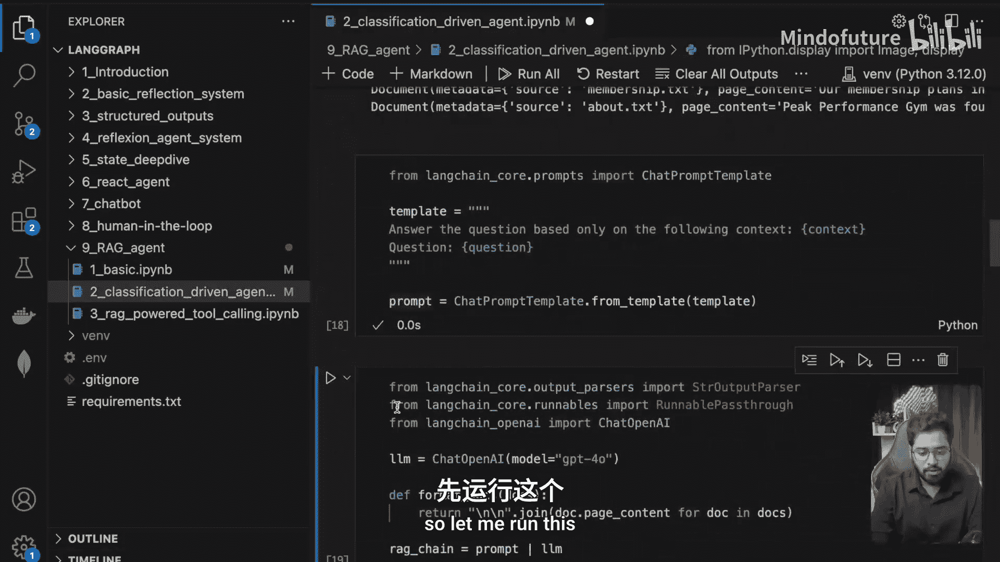

```python
from langgraph.graph import StateGraph, END

# 创建图构建器
workflow = StateGraph(YourStateSchema) # 使用您定义的状态模式

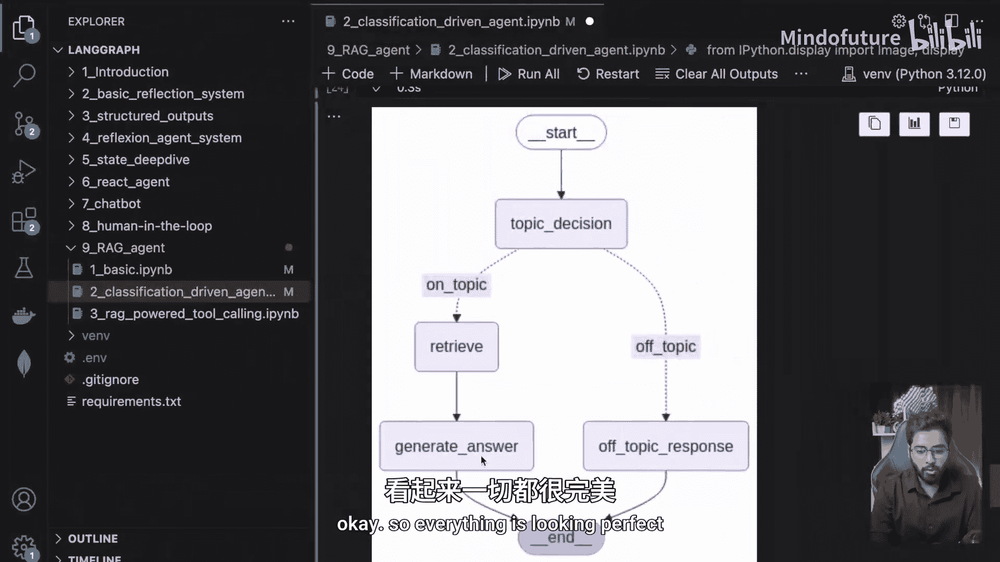

# 添加节点
workflow.add_node("topic_decision", topic_decision_node)
workflow.add_node("retrieve", retrieve)
workflow.add_node("generate_answer", generate_answer)
workflow.add_node("off_topic_response", off_topic_response)

# 设置入口点
workflow.set_entry_point("topic_decision")

# 添加边（连接节点）
workflow.add_conditional_edges(
    "topic_decision",
    route_on_topic, # 路由函数决定下一个节点
    {
        "on_topic_chain": "retrieve",
        "off_topic_route": "off_topic_response"
    }
)
workflow.add_edge("retrieve", "generate_answer")
workflow.add_edge("generate_answer", END) # 结束
workflow.add_edge("off_topic_response", END) # 结束

# 编译图
app = workflow.compile()
```

现在，我们可以运行这个图来处理用户查询。

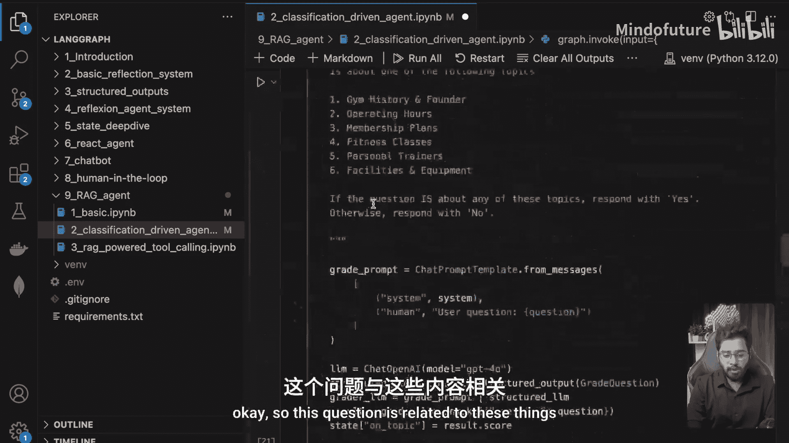

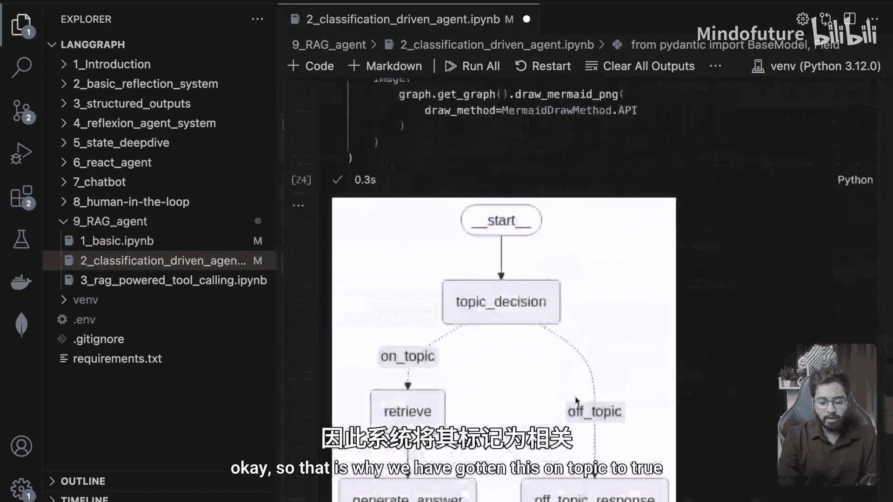

**测试1：相关话题**
```python
# 输入一个与健身房相关的问题
inputs = {"messages": [HumanMessage(content="谁是所有者？营业时间是什么？")]}
final_state = app.invoke(inputs)
print(final_state["messages"][-1].content)
# 输出应包含从文档中提取的所有者信息和营业时间。
print(final_state["on_topic"]) # 应输出 ‘是’
```

**测试2：无关话题**
```python
# 输入一个无关的问题
inputs = {"messages": [HumanMessage(content="苹果公司是做什么的？")]}
final_state = app.invoke(inputs)
print(final_state["messages"][-1].content)
# 输出应为：“抱歉，我无法回答这个问题。”
print(final_state["on_topic"]) # 应输出 ‘否’
```

## 总结

本节课中，我们一起学习了如何构建一个**分类驱动检索**系统。我们首先使用一个LLM节点对用户问题进行**主题分类**，然后通过**条件路由**决定后续流程：对于相关话题，执行标准的**检索**与**生成**步骤；对于无关话题，则直接返回拒绝回答。这种方法增强了RAG系统的可控性和安全性，确保其只在特定领域内提供答案。

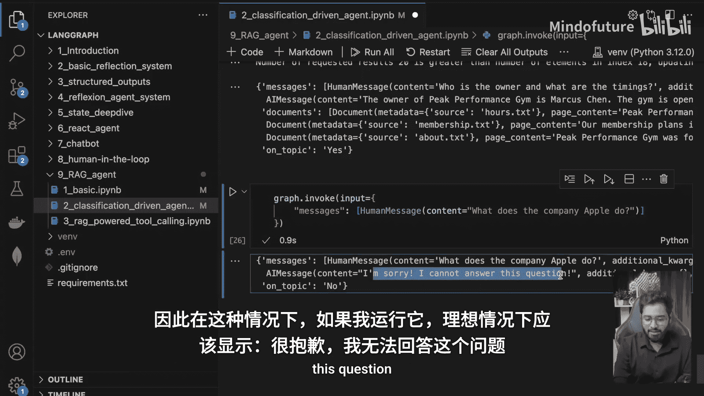


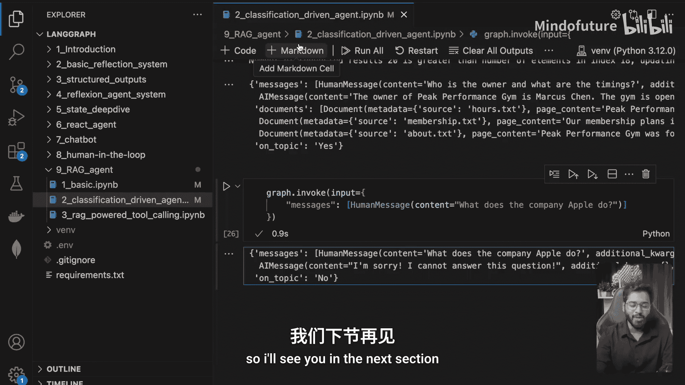

在下一节中，我们将探索另一种实现方式：将RAG功能封装成一个**工具**，供智能体（Agent）在需要时调用。