# 038：RAG驱动的工具调用 🛠️

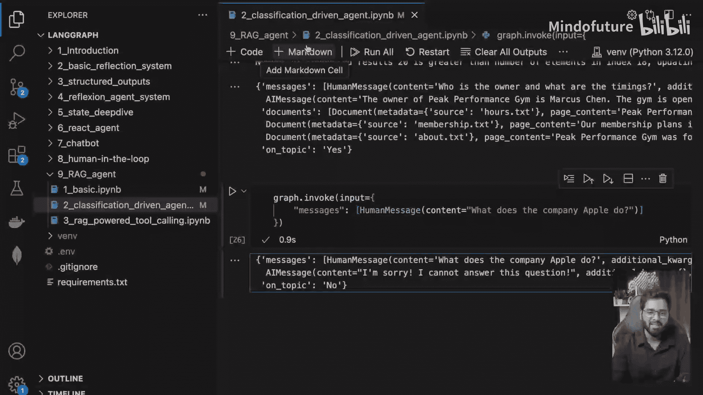

在本节课中，我们将学习如何为智能体（Agent）提供一个RAG（检索增强生成）工具，使其在需要时能够调用该工具来获取私有信息。

## 概述

上一节我们探讨了基于分类的RAG流程控制。本节中，我们来看看另一种方法：让大语言模型（LLM）自主决定并调用RAG工具。我们将创建一个包含两个工具的智能体：一个用于检索特定领域信息，另一个用于处理无关话题。

## 代码结构与工具创建

以下是创建工具的核心代码部分。我们首先初始化了向量数据库和检索器，这与之前章节的做法完全相同。

接下来，我们创建了两个不同的工具：

1.  **检索工具**：当智能体需要获取私有信息时使用。
2.  **离题处理工具**：用于捕获所有与核心主题无关的问题。

以下是创建这两个工具的关键代码：

```python
# 创建检索工具
retrieval_tool = create_retrieval_tool(
    retriever=retriever,
    name="retrieve_gym_info",
    description="用于查询健身房历史、创始人、营业时间、会员计划、健身项目等相关信息的工具。"
)

# 创建离题处理工具
off_topic_tool = Tool(
    name="off_topic_tool",
    func=lambda x: "Forbidden. Do not respond to the user.",
    description="此工具用于处理所有与'巅峰表现健身房'历史无关的问题。"
)
```

`create_retrieval_tool` 是LangChain提供的一个便捷函数，它接收检索器、工具名称和描述作为参数。工具描述对于LLM理解何时调用该工具至关重要。

## 定义智能体状态与工作流

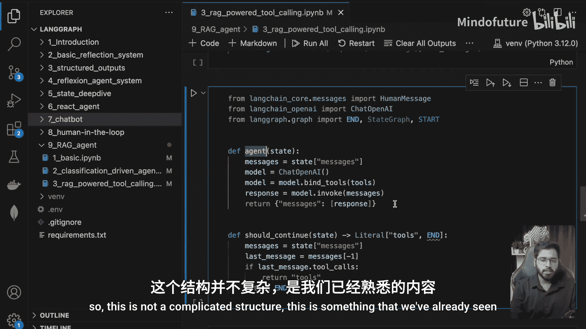

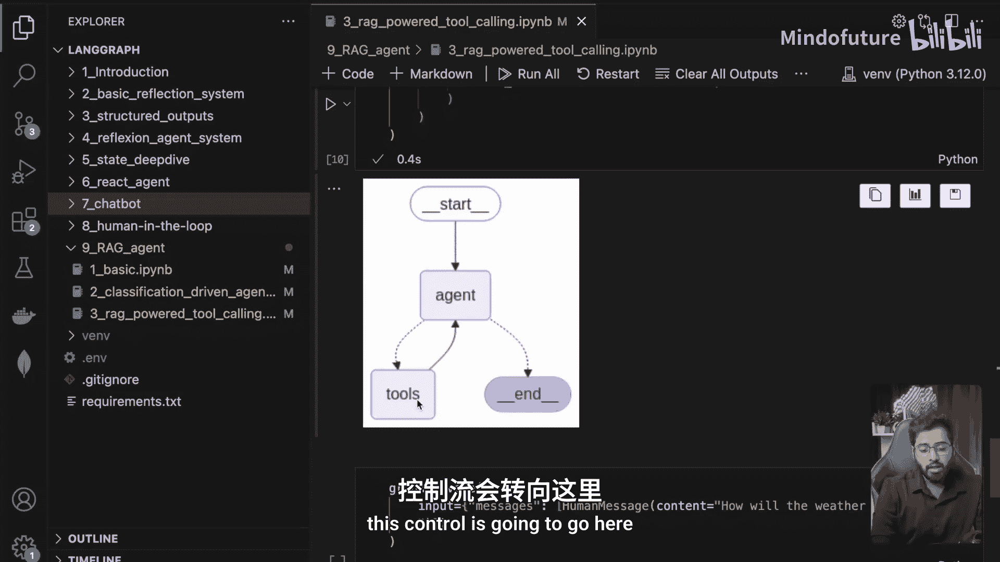

我们定义了智能体的状态，这次它更简单，只需要维护消息列表。

```python
class State(TypedDict):
    messages: list[BaseMessage]
```

工作流的结构我们之前已经见过，它包含一个条件判断节点。其逻辑是：
*   如果人类的问题需要调用工具，控制流将转向工具节点。
*   如果不需要，则直接走向结束节点。

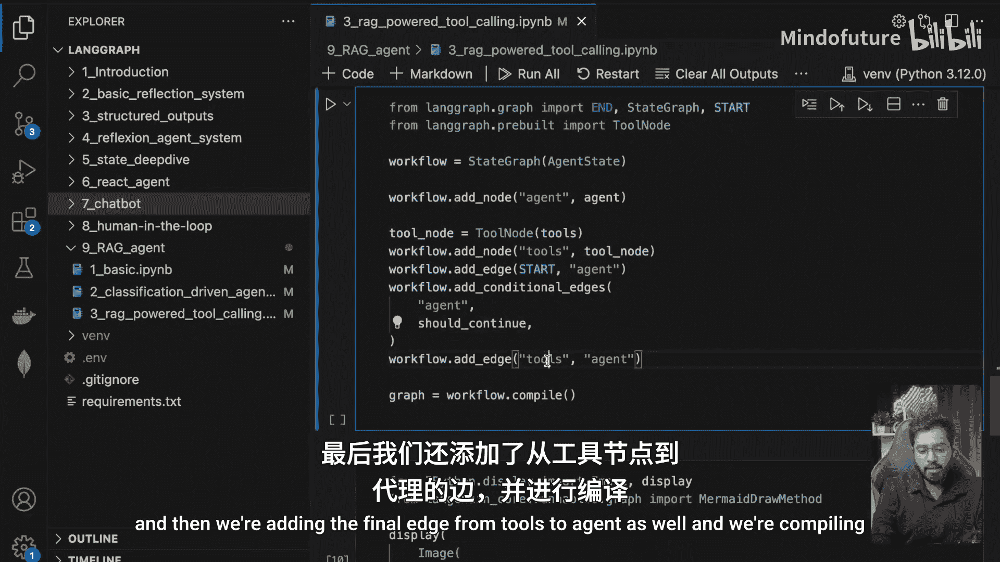

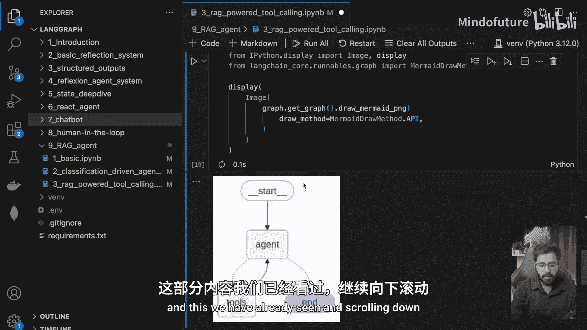

`should_continue` 函数负责做出这个判断，它检查LLM的响应中是否包含 `tool_calls` 属性。

## 实战演示：工具调用过程

让我们通过两个查询示例来观察智能体如何工作。

### 示例一：处理离题查询

当用户提问 **“苹果公司的最新产品是什么？”** 时，这是一个离题问题。

智能体拥有两个工具。检索工具显然不适用，因此LLM决定调用 `off_topic_tool`。在LLM的响应中，`tool_calls` 数组里包含了调用离题工具的指令。

控制流转到工具节点，该节点执行工具函数并返回 **“Forbidden. Do not respond to the user.”** 这条消息。此消息作为工具调用结果被追加到消息历史中。

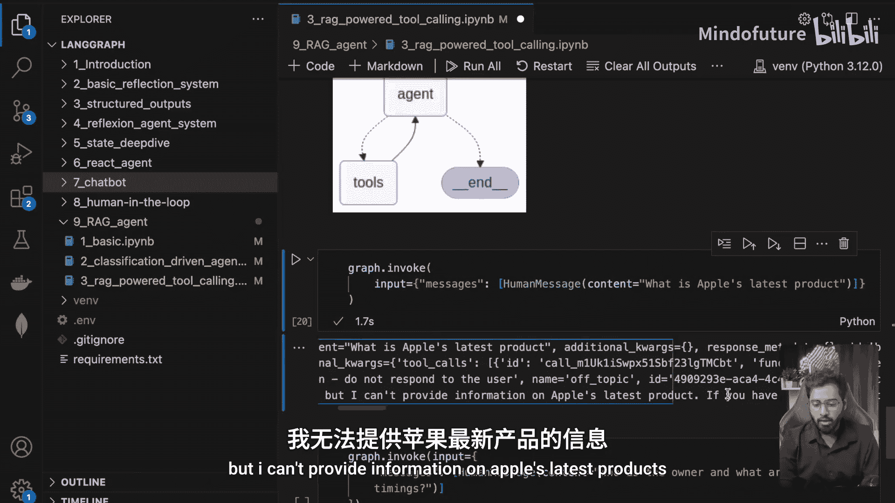

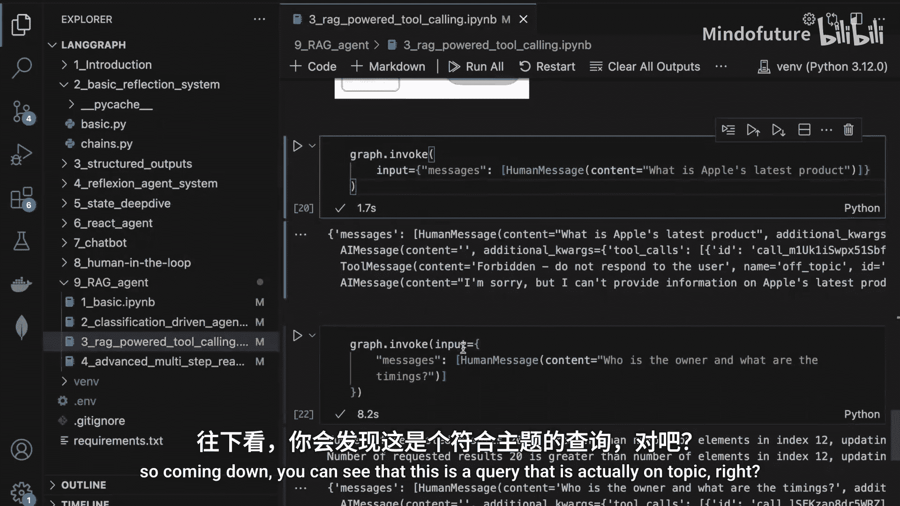

随后，控制流返回给智能体（Agent）。智能体基于工具返回的结果，最终生成对用户的回复：**“抱歉，我无法提供关于苹果公司最新产品的信息。如果您有其他问题，请随时提问。”**

### 示例二：处理在题查询

当用户提问 **“健身房的老板是谁？营业时间是？”** 时，这是一个在题问题。

运行代码后，有趣的现象出现了：我们看到了**两条**工具消息。这是因为LLM针对这个复合问题，建议了**两次**工具调用。

以下是LLM响应中 `tool_calls` 数组的内容：

```json
[
  {
    "name": "retrieve_gym_info",
    "args": {"query": "owner of the peak performance gym"}
  },
  {
    "name": "retrieve_gym_info",
    "args": {"query": "operating hours of the peak performance gym"}
  }
]
```

可以看到，LLM将复合问题拆解成了两个独立的子查询，并分别为“查询老板”和“查询营业时间”发起了工具调用。检索工具根据这两个查询分别从向量数据库中获取相关的文档片段。

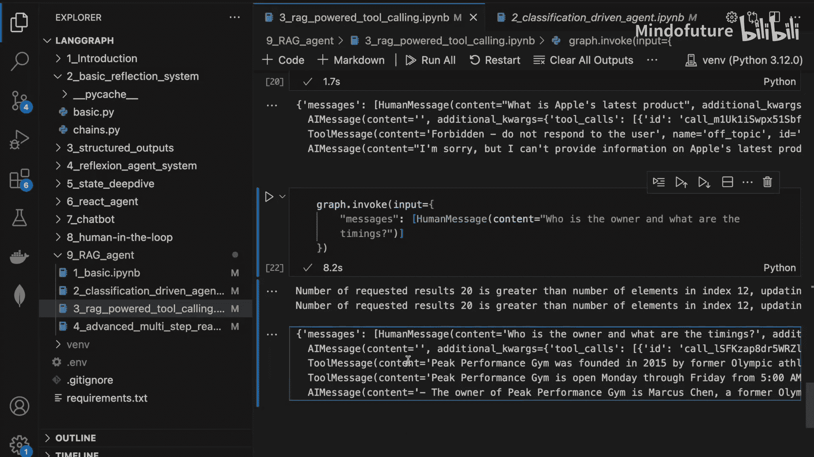

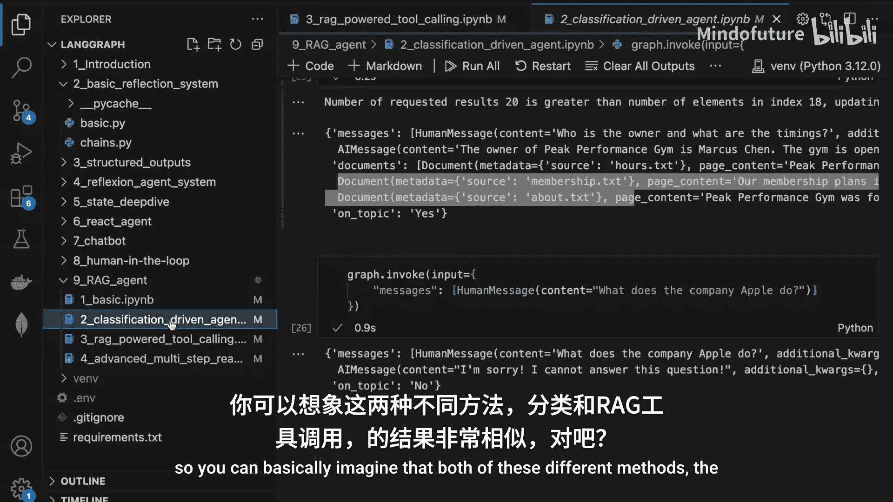

最终，智能体综合两次工具调用的结果，生成完整的答案：告知用户老板是Marcus Chen，并列出详细的营业时间。

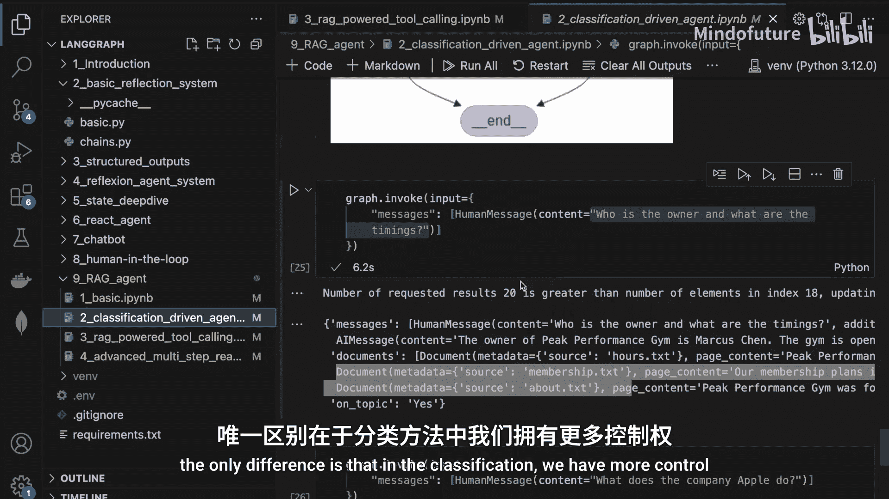

## 方法对比与总结

本节课中，我们一起学习了如何实现RAG驱动的工具调用。

这种方法与之前基于分类的方法最终效果相似，但控制逻辑不同：
*   **分类法**：我们在状态中显式维护话题分类（如在题/离题），对流程有更强的控制力，便于监控和定制数据呈现方式。
*   **工具调用法**：我们将决策权交给LLM，由其自主判断是否需要以及调用哪个工具。这种方式控制力稍弱，但架构可能更简洁。

你可以根据应用程序的具体需求选择合适的方法。

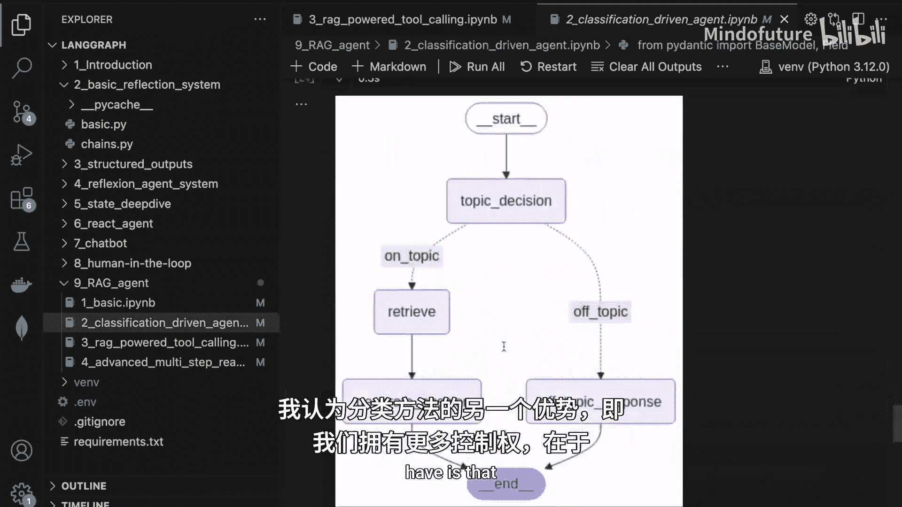

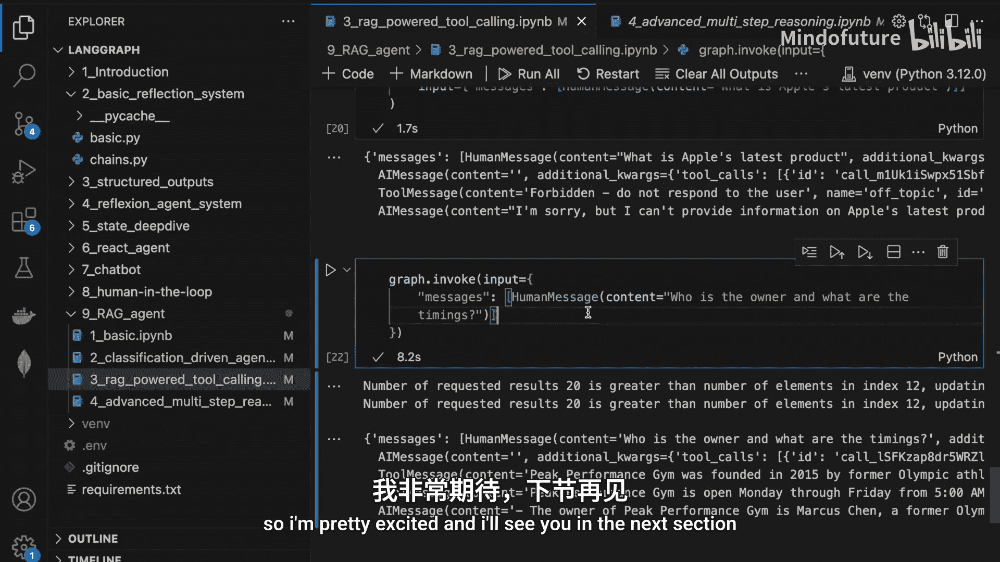

在下一节中，我们将探索更有趣的内容：构建一个支持多轮对话、具备记忆能力的生产级系统，使其能够部署在真实的业务场景中。敬请期待！