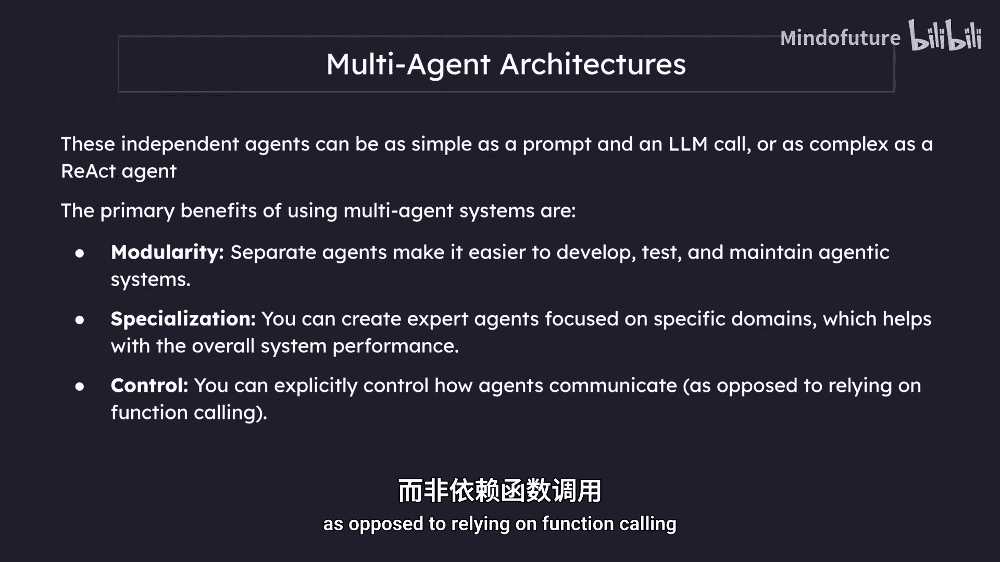
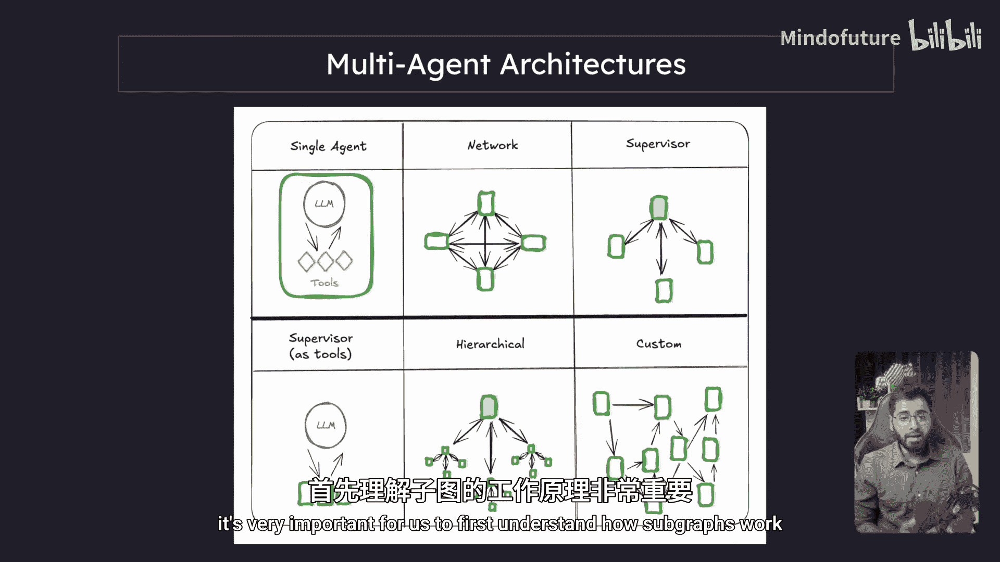
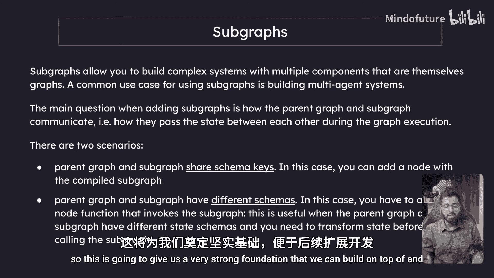
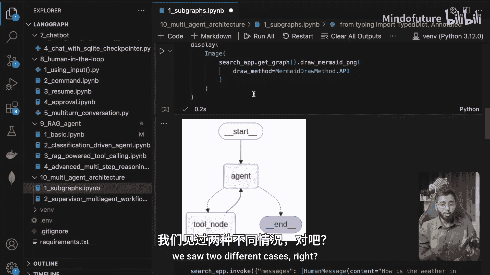
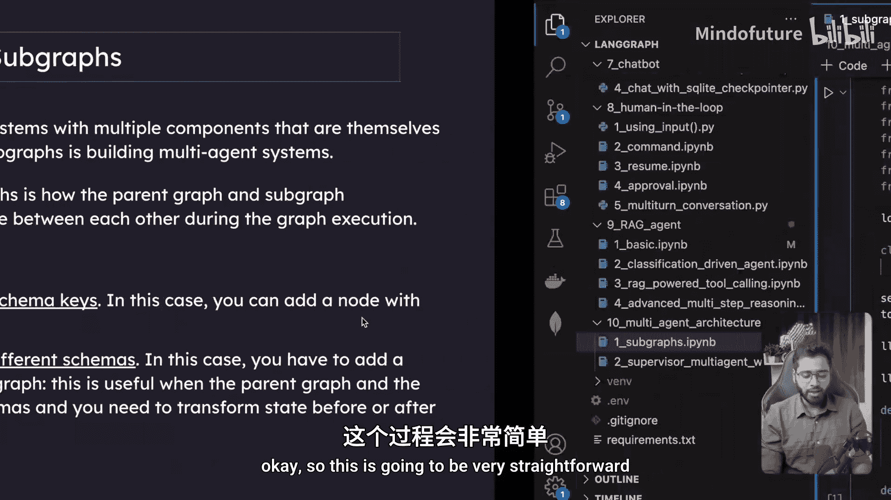
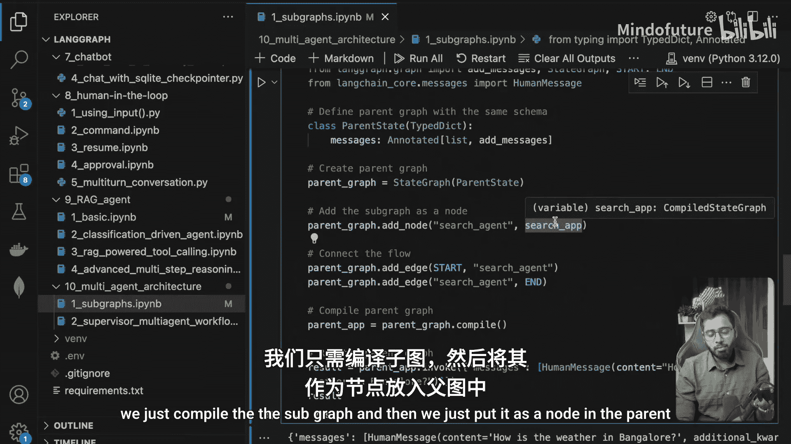
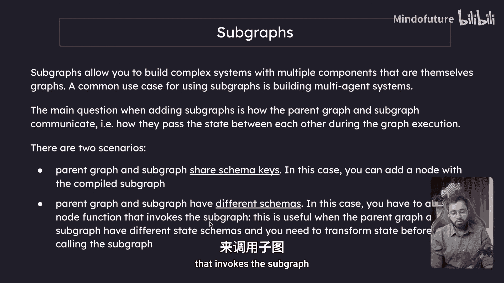
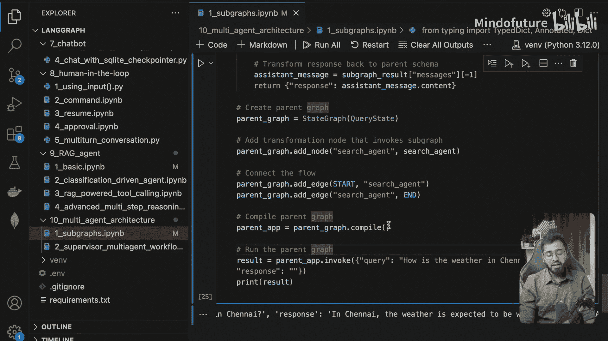

# 040：多代理架构与子图


在本节课中，我们将学习多代理架构的基本概念，并重点掌握如何通过“子图”来构建复杂的多代理系统。我们将从理解多代理架构的优势开始，然后通过代码示例，学习如何将子图嵌入到父图中。

## 什么是多代理架构？

上一节我们介绍了单个代理的基本概念。本节中我们来看看多代理架构。

代理是一个使用大语言模型来决定应用程序控制流的系统。随着系统发展，它们可能变得更加复杂，导致难以管理和扩展。例如，你可能会遇到以下问题：



*   代理拥有过多工具，难以决定下一步调用哪个工具。
*   上下文变得过于复杂，单个代理难以跟踪。
*   系统中可能需要多个专业领域，例如规划、研究和数学。

为了解决这些问题，你可以考虑将应用程序分解为更小、更独立的代理，并将它们组合成一个多代理系统。这些独立的代理可以简单到一个提示词和一个LLM调用，也可以复杂到一个ReAct代理。

使用多代理系统的主要好处如下：

*   **模块化**：独立的代理使开发、测试和维护代理系统变得更加容易。
*   **专业化**：我们可以创建专注于特定领域的专家代理，这有助于提升整体系统性能。
*   **控制**：你可以显式地控制代理之间的通信方式，而不是依赖于函数调用。

## 多代理架构的类型

以下是几种可能的多代理架构示意图：


*   **单个代理**：我们熟知的代理，即一个配备了工具的LLM。
*   **网络**：多个代理相互通信，每个代理解决任务的一部分，完成后根据问题将控制权交给下一个代理。
*   **监督者**：一个顶层的监督者负责协调团队。其下的每个代理（如编码代理、研究代理、评估代理）都是专业化的。代理之间不直接通信，它们都向监督者报告，由监督者决定下一步调用哪个代理。
*   **工具化监督者**：与监督者架构类似，但所有下属代理都作为工具提供给LLM。LLM根据问题进度决定调用哪个工具（即代理）。
*   **分层**：监督者架构的扩展，包含多个层级的监督者，类似于大公司的组织结构。
*   **自定义**：没有明确的定义，控制流根据代理的输出动态决定，更加灵活，适用于特定应用场景。

## 子图：构建模块的基础

在开始学习如何构建多代理架构之前，理解子图的工作原理至关重要。

子图允许你构建包含多个组件的复杂系统，而这些组件本身也是图。使用子图的一个常见用例就是构建多代理系统。




添加子图时，核心问题是父图和子图之间如何通信，即在图执行期间如何相互传递状态。主要有两种场景：

1.  **父图和子图共享相同的模式键**。在这种情况下，你可以直接使用编译后的子图作为一个节点。
2.  **父图和子图具有不同的模式**。在这种情况下，你需要添加一个调用子图的节点函数。这在父图和子图状态模式不同，需要在调用子图前后转换状态时非常有用。

接下来，我们将通过一个例子来构建一个非常基础的子图，并将其嵌入到父图中，同时观察上述两种不同的场景。

## 实践：构建并嵌入子图

让我们进入代码实践环节。首先，我们构建一个简单的子图。




以下是构建子图的代码步骤：

```python
# 导入所需模块
from langgraph.graph import StateGraph, END
from langchain_openai import ChatOpenAI
from langchain_community.tools.tavily_search import TavilySearchResults
from langgraph.prebuilt import ToolNode
from langchain_core.messages import HumanMessage
import os

# 加载环境变量（例如API密钥）
from dotenv import load_dotenv
load_dotenv()

# 定义子图的状态模式
from typing import TypedDict, Annotated, List
from langgraph.graph.message import add_messages

class ChildState(TypedDict):
    messages: Annotated[List, add_messages]

# 初始化工具和LLM
tavily_tool = TavilySearchResults(max_results=2)
llm = ChatOpenAI(model="gpt-4o-mini")
llm_with_tools = llm.bind_tools([tavily_tool])

# 定义代理函数（LLM节点）
def agent(state: ChildState):
    messages = state['messages']
    response = llm_with_tools.invoke(messages)
    return {"messages": [response]}

# 定义路由逻辑
def router(state: ChildState):
    messages = state['messages']
    last_message = messages[-1]
    if last_message.tool_calls:
        return "tools"
    return END

# 构建子图
child_graph = StateGraph(ChildState)
child_graph.add_node("agent", agent)
child_graph.add_node("tools", ToolNode([tavily_tool]))
child_graph.set_entry_point("agent")
child_graph.add_conditional_edges("agent", router)
child_graph.add_edge("tools", "agent")

# 编译子图
search_app = child_graph.compile(name="Subgraph")
```

这个子图是一个简单的代理，当用户问题需要网络搜索时，它会调用Tavily搜索工具。现在，我们来构建父图并将这个子图嵌入进去。

### 场景一：共享相同模式键

当父图和子图共享相同的状态模式（如都有 `messages` 键）时，嵌入非常简单。






以下是代码实现：

```python
# 定义父图状态（与子图相同）
class ParentStateSameSchema(TypedDict):
    messages: Annotated[List, add_messages]

# 构建父图
parent_graph_same = StateGraph(ParentStateSameSchema)
# 直接将编译好的子图作为一个节点加入
parent_graph_same.add_node("search_agent", search_app)
parent_graph_same.set_entry_point("search_agent")
parent_graph_same.add_edge("search_agent", END)

# 编译父图
parent_app_same = parent_graph_same.compile()

# 调用父图
result = parent_app_same.invoke({"messages": [HumanMessage(content="How is the weather in Bangalore?")]})
print(result["messages"][-1].content)
```
运行后，控制流会进入子图（搜索代理）并返回结果。这种方式非常直接。

### 场景二：处理不同的模式键

当父图和子图状态模式不同时，我们需要一个中间节点来进行状态转换。






以下是代码实现：

```python
# 定义父图状态（与子图不同）
class ParentStateDiffSchema(TypedDict):
    query: str
    response: str


# 定义调用子图的中间节点函数
def search_agent_node(state: ParentStateDiffSchema):
    # 1. 从父图状态中提取查询，并转换为子图期望的 messages 格式
    human_message = HumanMessage(content=state['query'])
    # 2. 调用子图
    subgraph_result = search_app.invoke({"messages": [human_message]})
    # 3. 从子图结果中提取最终响应内容
    final_ai_message = subgraph_result['messages'][-1]
    response_content = final_ai_message.content
    # 4. 将结果填充回父图状态
    return {"response": response_content}

# 构建父图
parent_graph_diff = StateGraph(ParentStateDiffSchema)
parent_graph_diff.add_node("search_agent", search_agent_node)
parent_graph_diff.set_entry_point("search_agent")
parent_graph_diff.add_edge("search_agent", END)

# 编译父图
parent_app_diff = parent_graph_diff.compile()

# 调用父图
result_diff = parent_app_diff.invoke({"query": "How is the weather in Chennai?"})
print(result_diff["response"])
```
在这个例子中，父图状态只有 `query` 和 `response`，而子图需要 `messages`。`search_agent_node` 函数负责进行格式转换：它将 `query` 包装成 `HumanMessage` 调用子图，再从子图返回的 `messages` 中提取内容，赋值给父图的 `response`。

## 总结

本节课中我们一起学习了多代理架构的基础知识和子图的核心用法。

*   我们首先了解了**多代理架构**的优势（模块化、专业化、控制）和常见类型（如监督者、分层架构）。
*   然后，我们深入探讨了**子图**的概念，它是构建复杂多代理系统的基石。
*   通过代码实践，我们掌握了**将子图嵌入父图的两种方法**：
    1.  当**状态模式相同时**，可以直接将编译后的子图作为节点加入父图。
    2.  当**状态模式不同时**，需要编写一个中间节点函数来处理状态转换，确保数据能在父图和子图之间正确传递。

理解并掌握子图是构建更复杂、更强大的多代理系统的关键第一步。在下一节中，我们将运用这些知识来实际构建一个多代理架构。



