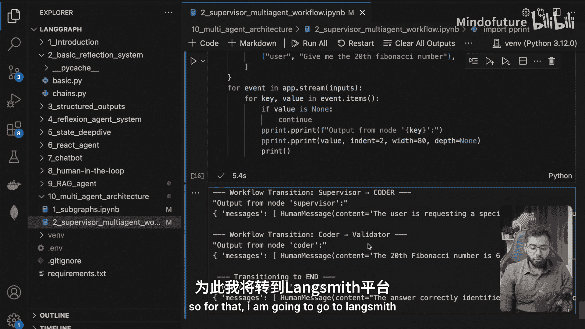
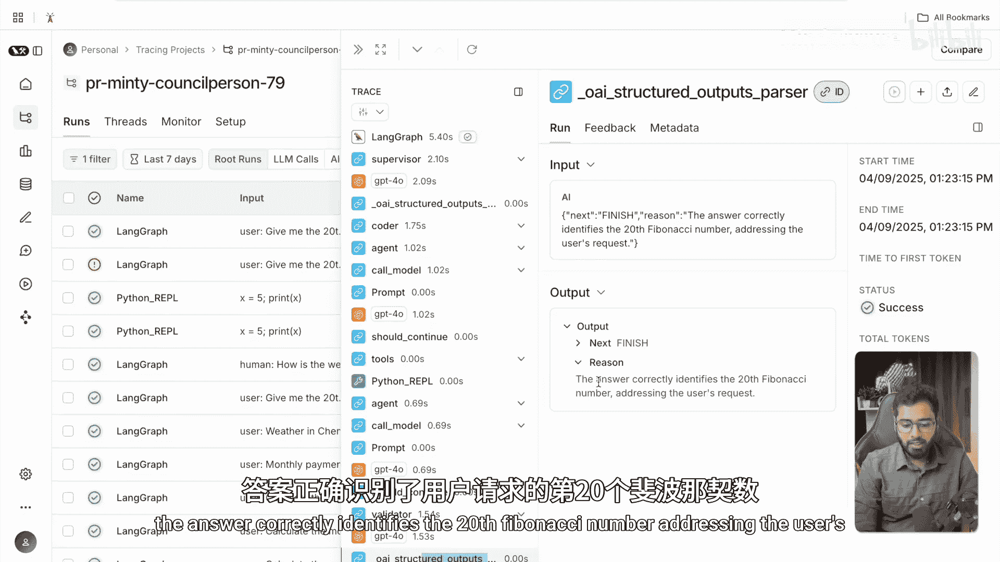
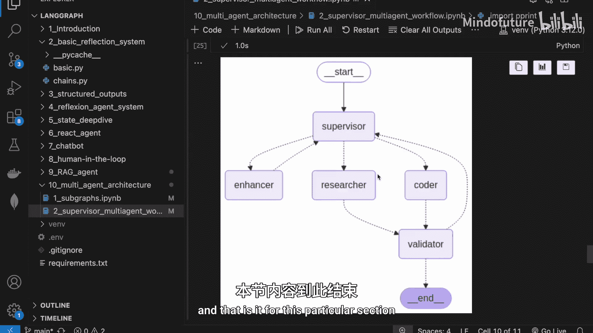

# 041：多代理主管代理系统

在本节课中，我们将学习如何使用 LangGraph 实现一个多代理的主管代理系统架构。我们将构建一个包含主管节点和多个专业代理节点的图，主管节点负责分析用户请求，并将任务路由到最合适的代理节点进行处理。

## 概述

我们将构建一个由主管节点协调的代理系统。该系统包含四个专业代理：**提示词增强代理**、**研究代理**、**代码代理**和**验证代理**。主管代理根据用户请求的性质，决定将控制权交给哪个专业代理。每个代理完成其任务后，控制流会返回主管或进入验证环节，最终确保用户问题得到完整、准确的解答。

## 代码实现

### 1. 导入必要的库

以下是构建此系统所需的标准导入。

```python
from typing import TypedDict, Annotated, List
from langgraph.graph import StateGraph, END
from langgraph.graph.message import add_messages
from langchain_core.messages import HumanMessage, AIMessage, ToolMessage
from langgraph.prebuilt import create_react_agent
from langchain_openai import ChatOpenAI
from langchain_community.tools.tavily_search import TavilySearchResults
from langchain_experimental.tools import PythonREPLTool
from langchain_core.prompts import ChatPromptTemplate
from pydantic import BaseModel, Field
import operator
```

### 2. 定义状态与工具

首先，我们定义图的状态结构并初始化将要用到的工具。

**状态定义**：状态是一个字典，主要包含消息列表。
```python
class State(TypedDict):
    messages: Annotated[List, add_messages]
```

**工具初始化**：我们使用 Tavily 进行网络搜索，并使用 Python REPL 工具来执行代码。
```python
import os
from dotenv import load_dotenv
load_dotenv()

# 初始化大语言模型
llm = ChatOpenAI(model="gpt-4o-mini")

# 初始化网络搜索工具
search = TavilySearchResults(max_results=2)

# 初始化 Python 代码执行工具
python_repl = PythonREPLTool()
```

### 3. 构建代理节点

接下来，我们逐一构建系统中的各个节点。每个节点都是一个函数，它接收当前状态，调用 LLM 或工具，并返回更新后的状态。

#### 主管节点

主管节点是系统的核心，负责分析请求并决定下一个执行的代理。

**功能**：主管节点接收用户请求和对话历史，判断任务类型，并决定将任务路由给增强代理、研究代理还是代码代理。

**实现要点**：
1.  使用 Pydantic 模型 `SupervisorOutput` 来结构化输出，确保返回 `next`（下一个代理）和 `reason`（决策理由）两个字段。
2.  系统提示词详细说明了主管的职责和可用的代理团队。
3.  使用 `Command` 类来精确控制图的流向。

```python
class SupervisorOutput(BaseModel):
    next: str = Field(description="The next agent to direct the flow to.")
    reason: str = Field(description="The reason for choosing this agent.")

def supervisor_node(state: State):
    prompt = ChatPromptTemplate.from_messages([
        ("system", """你是一个主管，管理着一个由三个代理组成的团队：提示词增强员、研究员和程序员。
你的职责是：
1. 分析每个用户请求和代理响应的完整性、准确性和相关性。
2. 在每个决策点将任务路由到最合适的代理。
3. 通过避免冗余的代理分配来保持工作流动力。
4. 持续该过程，直到用户请求得到完全和满意的解决。
你的目标是创建一个高效的工作流，利用每个代理的优势，同时最大限度地减少不必要的步骤，最终为用户请求提供完整和准确的解决方案。
团队成员：
- 提示词增强员：当用户输入需要澄清时使用。
- 研究员：当需要额外的事实时使用。
- 程序员：当需要解决问题（尤其是数学或计算问题）时使用。
请为每个决定提供清晰、简洁的理由。"""),
        ("placeholder", "{messages}")
    ])
    structured_llm = llm.with_structured_output(SupervisorOutput)
    response = structured_llm.invoke(prompt.format_messages(messages=state[‘messages‘]))
    
    # 将决策理由作为消息记录
    state[‘messages‘].append(HumanMessage(content=response.reason, name="supervisor"))
    
    # 使用 Command 控制流向
    from langgraph.graph import Command
    return Command(goto=response.next)
```

#### 增强代理节点



如果主管认为用户提示词模糊不清，则会调用增强代理来优化和澄清提示。

**功能**：重新表述用户查询，使其更精确、可操作，而无需向用户追问。

**实现要点**：
1.  系统提示词要求代理充当“查询优化专家”，基于合理假设进行扩展和澄清。
2.  处理完成后，控制流**必须**返回主管节点，以便重新评估优化后的提示。

```python
def enhancer_node(state: State):
    prompt = ChatPromptTemplate.from_messages([
        ("system", """你是一名查询优化专家。你的任务是分析和优化用户查询。
请执行以下操作：
1. 分析原始查询，识别核心意图。
2. 解决任何歧义或混淆，**无需**请求用户额外输入。
3. 基于合理假设，扩展查询中未充分发展的方面。
4. 为了清晰性和可操作性，重构查询。
永远不要向用户提问。相反，做出明智的假设，并创建其请求的最全面版本。"""),
        ("placeholder", "{messages}")
    ])
    response = llm.invoke(prompt.format_messages(messages=state[‘messages‘]))
    # 将优化后的提示作为“人类”消息添加，并标记来源
    state[‘messages‘].append(HumanMessage(content=response.content, name="enhancer"))
    # 优化后总是返回主管进行下一步决策
    return Command(goto="supervisor")
```

#### 研究代理节点

当主管判断需要从网络获取事实信息时，会调用研究代理。



**功能**：利用 Tavily 搜索工具，根据当前任务上下文搜集相关信息。

**实现要点**：
1.  使用 LangGraph 预建的 `create_react_agent` 函数快速创建一个 ReAct 代理。
2.  该代理会进行“思考-行动-观察”的循环，直到它认为已收集到足够信息。
3.  研究完成后，控制流将直接进入**验证代理**节点。

```python
def research_node(state: State):
    # 使用预建的 ReAct 代理图
    agent = create_react_agent(llm, tools=[search])
    # 配置提示词，专注于信息搜集
    config = {"configurable": {"thread_id": "1"}}
    response = agent.invoke({
        "messages": [
            SystemMessage(content="你是一个研究助手。根据查询和上下文，识别关键信息需求，使用工具收集所有相关信息。尽可能引用来源以建立可信度。专注于信息收集，避免分析或实现。提供彻底的事实性回答，不做推测。如果信息不可用，请说明。"),
            *state[‘messages‘]
        ]
    }, config)
    # 提取代理的最终回答并添加到消息历史
    final_answer = response[‘messages‘][-1].content
    state[‘messages‘].append(HumanMessage(content=final_answer, name="researcher"))
    # 研究完成后，进入验证环节
    return Command(goto="validator")
```

#### 代码代理节点

当用户请求涉及计算或问题求解（如数学计算）时，主管会调用代码代理。

**功能**：编写并执行 Python 代码来解决问题，例如计算斐波那契数列。

**实现要点**：
1.  同样使用 `create_react_agent` 创建代理，但为其提供 `PythonREPLTool` 工具。
2.  代理可以编写代码，并通过工具实际执行它，以获得准确结果。
3.  代码执行完成后，控制流也将进入**验证代理**节点。

```python
def coder_node(state: State):
    # 创建带有代码执行工具的 ReAct 代理
    agent = create_react_agent(llm, tools=[python_repl])
    config = {"configurable": {"thread_id": "1"}}
    response = agent.invoke({
        "messages": [
            SystemMessage(content="你是一名程序员和分析师，专注于数学计算和问题解决。请分析并解决用户提出的计算问题。"),
            *state[‘messages‘]
        ]
    }, config)
    final_answer = response[‘messages‘][-1].content
    state[‘messages‘].append(HumanMessage(content=final_answer, name="coder"))
    # 代码执行完成后，进入验证环节
    return Command(goto="validator")
```

#### 验证代理节点

验证代理是工作流的“守门员”，在最终输出前检查答案的质量。

**功能**：对比最初的用户问题与最后一个代理产生的答案，判断答案是否充分回应了用户的核心意图。

**实现要点**：
1.  使用 Pydantic 模型 `ValidatorOutput` 来约束输出，只能是 `supervisor`（继续）或 `finish`（结束）。
2.  它只关注对话中的第一条（用户问题）和最后一条消息（代理答案）。
3.  如果验证通过，则结束整个图的工作流；否则，将问题返回给主管，尝试其他解决路径。

```python
class ValidatorOutput(BaseModel):
    next: str = Field(description="The next worker in the pipeline. ‘supervisor‘ to continue or ‘finish‘ to terminate.", pattern="^(supervisor|finish)$")
    reason: str = Field(description="The reason for this decision.")

def validator_node(state: State):
    # 获取用户最初的问题
    first_human_msg = next(msg for msg in state[‘messages‘] if isinstance(msg, HumanMessage) and msg.name != "supervisor")
    user_question = first_human_msg.content
    # 获取最后一个答案（来自上一个代理）
    last_msg = state[‘messages‘][-1]
    agent_answer = last_msg.content if hasattr(last_msg, ‘content‘) else ""

    prompt = ChatPromptTemplate.from_messages([
        ("system", """你是一个验证代理。你的任务是根据用户最初的问题来评估最终答案的质量。
请遵循以下步骤：
1. 回顾用户最初的问题：{user_question}
2. 回顾提供的答案：{agent_answer}
3. 判断该答案是否解决了用户问题的核心意图。
如果答案充分解决了问题，则输出 ‘finish‘。
如果答案不完整、不相关或未解决问题，则输出 ‘supervisor‘，以便重新路由任务。"""),
    ])
    structured_llm = llm.with_structured_output(ValidatorOutput)
    response = structured_llm.invoke(prompt.format_messages(user_question=user_question, agent_answer=agent_answer))
    
    state[‘messages‘].append(HumanMessage(content=response.reason, name="validator"))
    
    # 根据验证结果决定流向
    if response.next == "finish":
        return END  # 结束工作流
    else:
        return Command(goto="supervisor")  # 返回主管
```

### 4. 组装成图

定义了所有节点后，我们需要将它们连接起来，形成一个完整的工作流图。

**步骤**：
1.  创建 `StateGraph` 实例。
2.  使用 `add_node` 方法添加所有已定义的节点。
3.  使用 `add_edge` 方法设置节点的默认出口（例如，增强代理完成后默认返回主管）。
4.  使用 `add_conditional_edges` 方法为**主管节点**和**验证节点**添加条件边。这两个节点的出口由它们的逻辑输出动态决定（`Command` 或 `END`）。
5.  最后，编译图。

```python
# 初始化图
workflow = StateGraph(State)

# 添加所有节点
workflow.add_node("supervisor", supervisor_node)
workflow.add_node("enhancer", enhancer_node)
workflow.add_node("researcher", research_node)
workflow.add_node("coder", coder_node)
workflow.add_node("validator", validator_node)

# 设置入口点
workflow.set_entry_point("supervisor")

# 添加条件边（动态路由）
workflow.add_conditional_edges(
    "supervisor",
    # supervisor_node 返回 Command，其 `goto` 属性决定了下一个节点
    lambda x: x[‘messages‘][-1].additional_kwargs.get(‘goto‘) if hasattr(x[‘messages‘][-1], ‘additional_kwargs‘) else "supervisor",
    {
        "enhancer": "enhancer",
        "researcher": "researcher",
        "coder": "coder",
        "supervisor": "supervisor" # 自循环，理论上可能发生
    }
)
workflow.add_conditional_edges(
    "validator",
    # validator_node 可能返回 END 或 Command(goto=“supervisor“)
    lambda x: END if x[‘messages‘][-1].additional_kwargs.get(‘command‘) == END else "supervisor",
    {
        "supervisor": "supervisor",
        END: END
    }
)

# 添加固定边（静态路由）
workflow.add_edge("enhancer", "supervisor") # 增强后必回主管
workflow.add_edge("researcher", "validator") # 研究后进入验证
workflow.add_edge("coder", "validator") # 编码后进入验证

# 编译图
app = workflow.compile()
```

### 5. 运行示例

现在，我们可以使用不同的用户提示来运行这个图，观察主管如何路由任务。

**示例 1：计算问题**
```python
# 用户请求计算第20个斐波那契数
inputs = {"messages": [HumanMessage(content="Give me the 20th Fibonacci number.")]}
for event in app.stream(inputs):
    for node, value in event.items():
        print(f"Node: {node}")
        if ‘messages‘ in value:
            last_msg = value[‘messages‘][-1]
            print(f"  Message from {getattr(last_msg, ‘name‘, ‘N/A‘)}: {last_msg.content[:200]}...")
```
**预期行为**：主管识别出这是一个明确的计算问题，直接路由到代码代理。代码代理编写并执行 Python 代码，计算出结果，然后验证代理确认答案正确，工作流结束。

**示例 2：事实查询**
```python
# 用户询问天气
inputs = {"messages": [HumanMessage(content="What‘s the weather in Chennai?")]}
for event in app.stream(inputs):
    for node, value in event.items():
        print(f"Node: {node}")
        if ‘messages‘ in value:
            last_msg = value[‘messages‘][-1]
            print(f"  Message from {getattr(last_msg, ‘name‘, ‘N/A‘)}: {last_msg.content[:200]}...")
```
**预期行为**：主管识别出需要实时信息，路由到研究代理。研究代理使用搜索工具获取天气信息，然后验证代理确认信息相关，工作流结束。

## 总结

本节课中，我们一起学习了如何使用 LangGraph 构建一个**多代理的主管代理系统**。我们实现了以下核心内容：

1.  **架构设计**：创建了一个由主管节点协调，包含增强、研究、代码、验证四个专业代理的协作系统。
2.  **节点实现**：详细编写了每个节点的函数，利用提示工程、结构化输出和工具调用来完成特定任务。
3.  **流程控制**：通过 `Command` 类、条件边和固定边，实现了灵活的任务路由逻辑，使主管能根据上下文动态决定工作流方向。
4.  **图组装**：将所有节点连接成一个完整的工作流图，并编译为可执行的应用。



这个系统展示了如何将复杂任务分解，由专门的代理处理，并通过主管进行智能调度和验证，从而高效、准确地响应用户请求。你可以尝试修改提示词、增加新的代理或工具，来解决不同领域的问题。