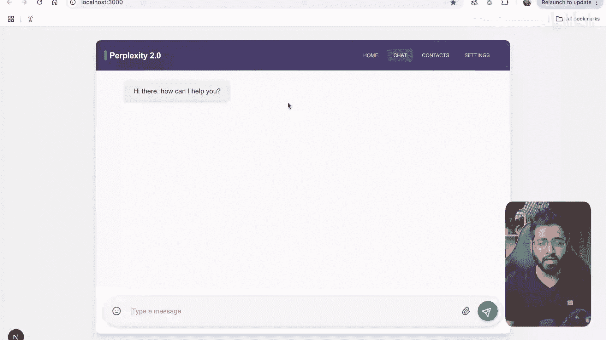
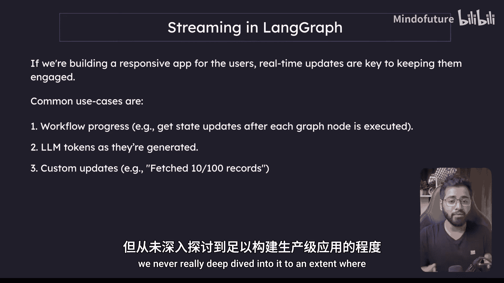
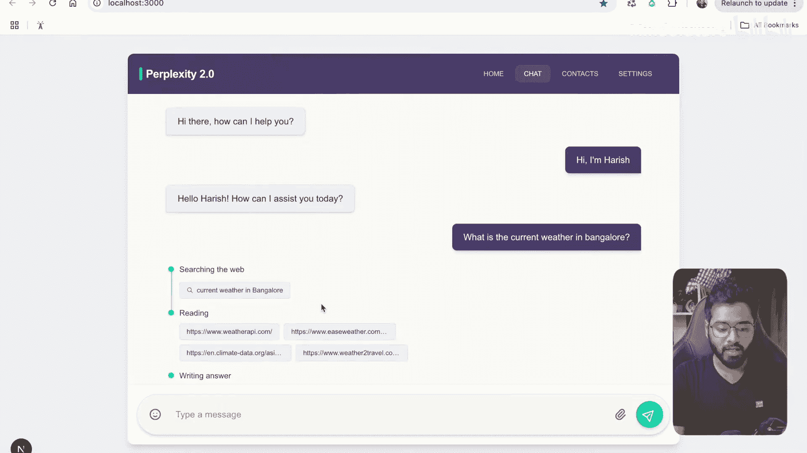
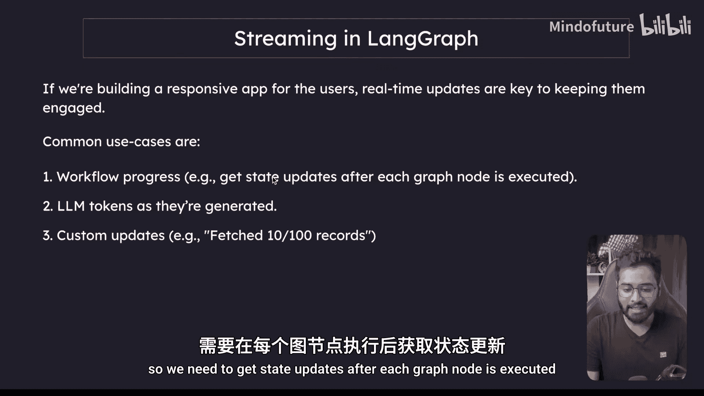
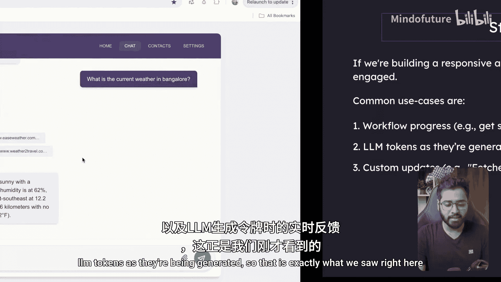
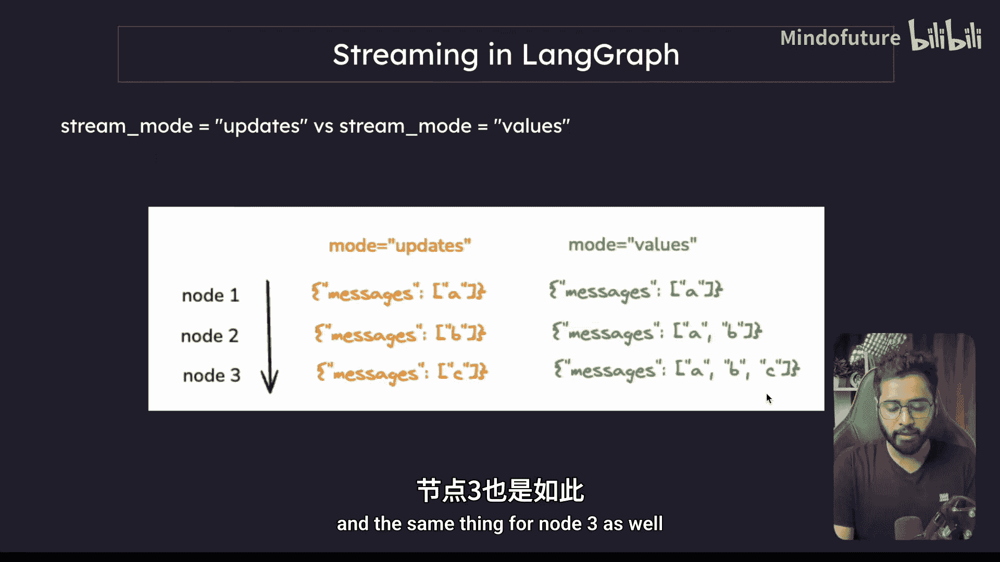
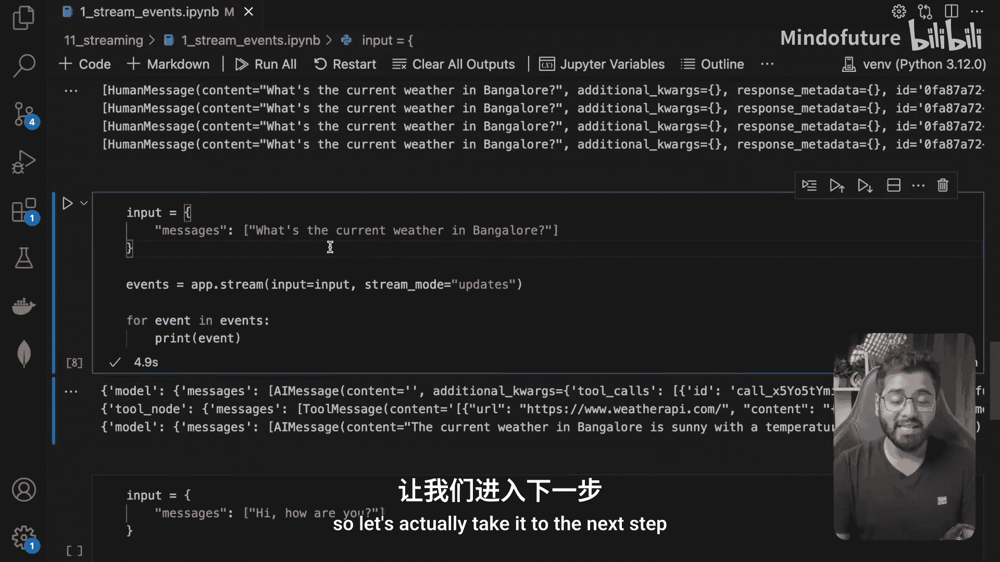
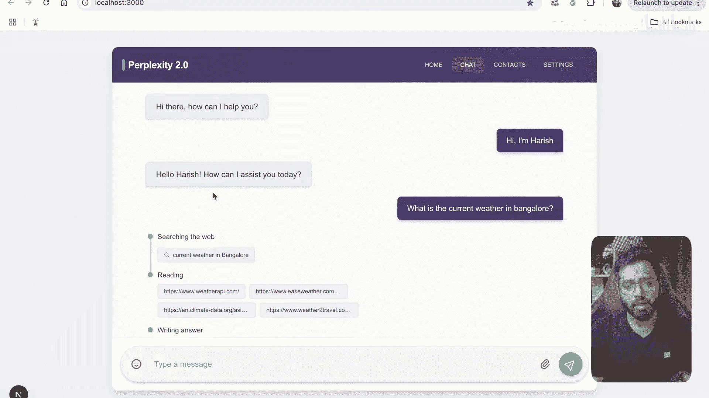
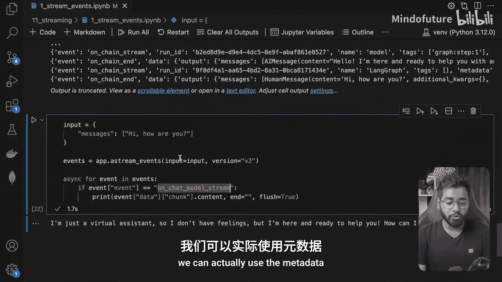
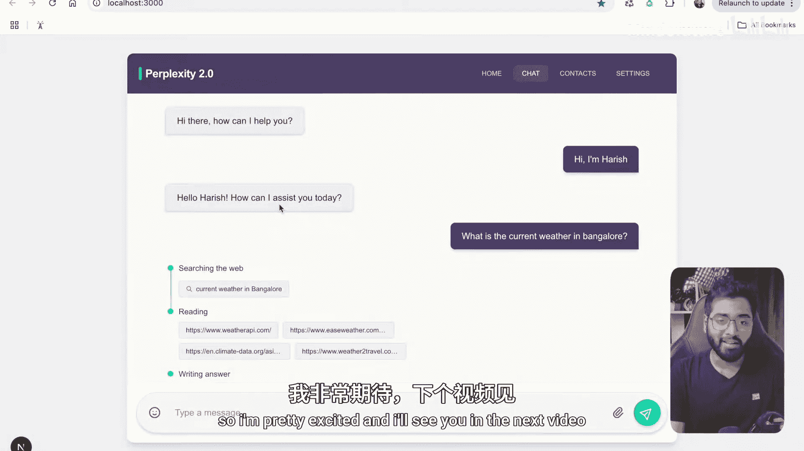

# 042：深入探讨流式传输

在本节课中，我们将深入学习LangGraph中的流式传输机制。我们将了解其工作原理、不同模式的区别，以及如何在实际应用中利用它来构建具有实时响应能力的用户界面。





## 概述

在前几节课程中，我们初步接触了流式传输。然而，要构建生产级的应用程序，我们需要更深入地理解它。流式传输对于创建响应式应用至关重要，它能向用户实时展示工作流进度、LLM生成的令牌以及自定义更新，从而提升用户体验。





## 流式传输的核心方法



LangGraph提供了`stream`和`astream`方法（分别对应同步和异步）来从图运行中流式输出结果。调用这些方法时可以指定几种模式。

调用方式与`graph.invoke`类似：
```python
graph.astream(input_state, config, stream_mode="values")
```

常见的模式有两种：
*   **`stream_mode="values"`**：在图执行的**每一步之后**，流式传输该时间点的**完整状态**。
*   **`stream_mode="updates"`**：在图执行的**每一步之后**，流式传输该步骤对状态所做的**更新部分**。

为了更直观地理解这两种模式的区别，让我们看一个图示化的例子。

假设我们有一个包含三个节点的图，它们依次向一个列表中添加元素。

当使用 **`updates`** 模式时，我们只会看到每次新增的内容：
*   节点1执行后：`[‘a’]`
*   节点2执行后：`[‘b’]`
*   节点3执行后：`[‘c’]`



当使用 **`values`** 模式时，我们会看到每一步执行后的完整状态快照：
*   节点1执行后：`[‘a’]`
*   节点2执行后：`[‘a’， ‘b’]`
*   节点3执行后：`[‘a’， ‘b’， ‘c’]`

## 实践：`values`与`updates`模式

现在，让我们通过代码来实践这两种模式。我们将使用一个之前构建过的简单Agent图，它包含开始节点、LLM模型节点和一个搜索工具节点。

以下是该图的核心结构定义：
```python
# 定义Agent状态，包含消息列表
class AgentState(TypedDict):
    messages: list

# 初始化工具和LLM
tools = [TavilySearchTool()]
llm = ChatOpenAI(model="gpt-4")
llm_with_tools = llm.bind_tools(tools)

# 定义图节点和边
graph = StateGraph(AgentState)
graph.add_node("model", model_node) # 调用LLM
graph.add_node("tools", tool_node) # 执行工具
graph.add_conditional_edges("model", tool_router) # 根据LLM输出路由
graph.add_edge("tools", "model")
graph.set_entry_point("model")
app = graph.compile()
```

### 使用`values`模式流式传输

当我们使用`values`模式运行图时，会在每个节点执行后获得完整的状态。

```python
async for event in app.astream(
    {"messages": [HumanMessage(content="What is the weather in Bangalore?")]},
    stream_mode="values"
):
    print(event)
    print("---")
```
运行上述代码，你会观察到类似以下的事件序列：
1.  **开始节点后**：状态中仅包含初始的人类消息。
2.  **LLM模型节点后**：状态中包含人类消息和一个来自AI的“工具调用”消息（内容为空，但包含了要执行的搜索查询）。
3.  **工具节点后**：状态中新增了一条来自工具的响应消息。
4.  **LLM模型节点（最终）后**：状态中包含了LLM根据工具结果生成的最終答案消息。

每个`event`都代表了图在该步骤执行完毕时的完整快照。

### 使用`updates`模式流式传输

接下来，我们看看`updates`模式。它只流式传输每次状态变更的部分。

```python
async for event in app.astream(
    {"messages": [HumanMessage(content="What is the weather in Bangalore?")]},
    stream_mode="updates"
):
    print(event)
    print("---")
```
运行代码后，输出将更加精简：
1.  第一个事件显示`model`节点添加了一条AI消息（工具调用）。
2.  第二个事件显示`tools`节点添加了一条工具消息。
3.  第三个事件显示`model`节点添加了包含最终答案的AI消息。





`updates`模式不仅展示了更新的内容，还通过元数据指明了是哪个节点执行了这次更新。

## 进阶：使用`astream_events`进行细粒度流式传输

在生产级应用中，我们通常需要比节点级状态更细粒度的流式传输。特别是对于LLM调用，我们希望能够实时流式传输**每个生成的令牌**。`astream_events`方法正是为此设计，它流式传输节点**内部发生的事件**。

每个事件都是一个字典，包含以下关键字段：
*   `event`: 事件类型（例如：`on_chain_start`， `on_chat_model_stream`）。
*   `name`: 事件名称。
*   `data`: 与事件相关的数据（例如，流式传输的令牌块）。
*   `metadata`: 包含事件发射者等信息的元数据。

让我们通过一个简单的例子来使用它，这次我们询问一个不需要工具调用的简单问题。

```python
async for event in app.astream_events(
    {"messages": [HumanMessage(content="Hi, how are you?")]},
    version="v2"
):
    print(event)
    print("---")
```
运行后，你会看到大量事件被打印出来。我们最关心的是来自LLM的令牌流事件，其`event`类型为`on_chat_model_stream`。

我们可以筛选出这些事件，并提取其中的令牌数据：

```python
async for event in app.astream_events(
    {"messages": [HumanMessage(content="Hi, how are you?")]},
    version="v2"
):
    if event["event"] == "on_chat_model_stream":
        chunk = event["data"]["chunk"]
        if hasattr(chunk, ‘content‘) and chunk.content:
            print(chunk.content, end="", flush=True) # 关键：end=""避免换行，flush=True立即输出
```
运行这段代码，你将看到LLM的回复像打字一样逐词（或逐令牌）地显示在屏幕上。这正是构建具有流畅流式响应UI的基础。

通过检查事件的`metadata`字段，我们还可以知道是哪个LangGraph节点（例如`model`节点）触发了这个事件，从而在UI上进行更精细的展示控制。

## 总结



本节课我们一起深入探讨了LangGraph中的流式传输。
*   我们学习了`stream`/`astream`方法的`values`和`updates`模式，理解了它们分别传输完整状态和状态更新的区别。
*   更重要的是，我们掌握了`astream_events`方法，它允许我们监听图节点内部发生的细粒度事件，特别是能够实时捕获LLM生成的每一个令牌。
*   通过组合使用这些方法，并利用事件中的`data`和`metadata`信息，我们可以完全控制向应用程序前端流式传输的内容和方式，从而构建出响应迅速、用户体验良好的交互式AI应用。



在接下来的课程中，我们将把这些概念付诸实践，共同构建一个完整的、具备流式响应能力的应用程序。