# 043：毕业设计项目介绍 🚀

在本节课中，我们将学习如何使用 LangGraph 构建一个全栈 AI 应用。这个应用的后端将使用 FastAPI 和 LangGraph，前端使用 React，目标是实现一个类似于 Perplexity AI 的用户界面。Perplexity 可以被视为一个更智能的搜索引擎，当用户提问需要联网搜索时，UI 会实时展示搜索过程，例如“正在搜索网络”、“正在读取网页”等状态，并将回答流式传输给用户。我们的应用也将具备记忆对话历史和实时流式响应的能力。

上一节我们介绍了课程目标，本节中我们来看看项目的具体演示和核心功能。

## 项目演示与核心功能

首先，让我们通过一个快速演示来了解最终应用的效果。

应用启动后，用户可以进行对话。例如，用户输入“Hi my name is Harish”，应用会以流式传输的方式，逐词实时回复“Hi Harish, how are you? How can I assist you today?”。

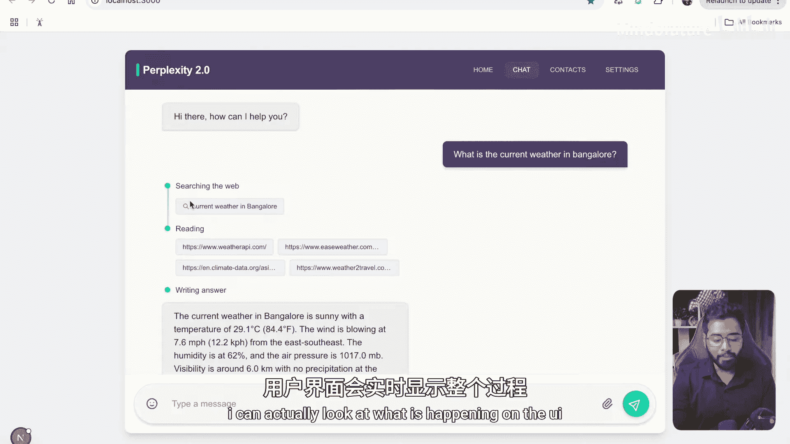

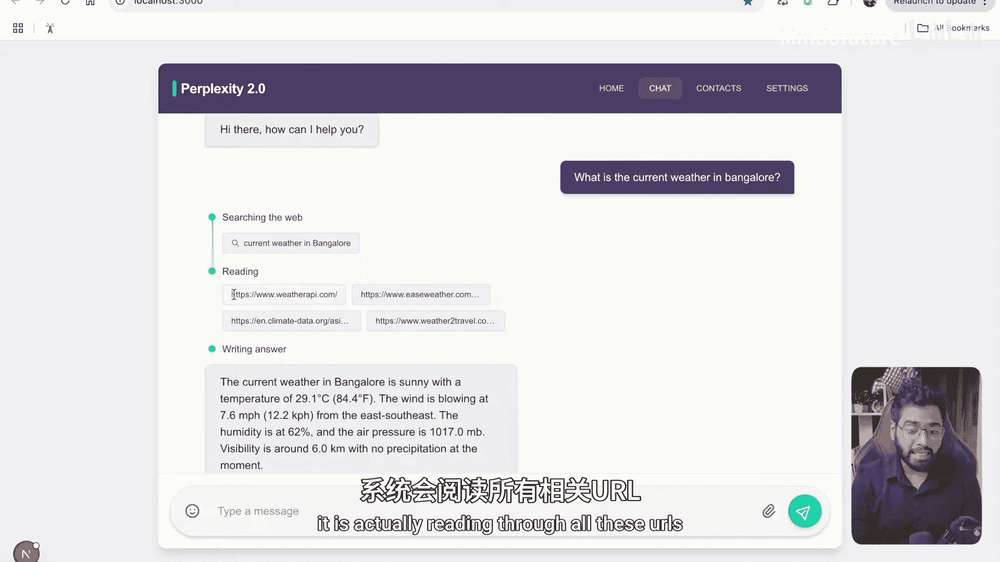

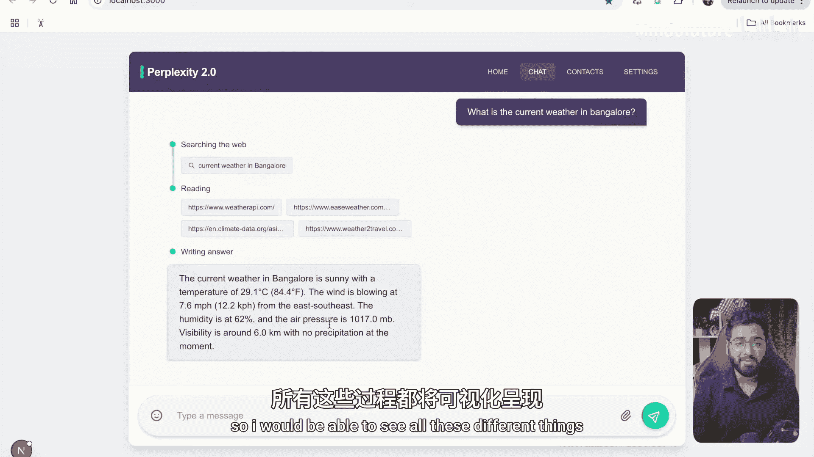

应用具备记忆功能。接着询问“What was my name again?”，它能正确回答“Your name is Harish”，因为它记住了之前的对话。

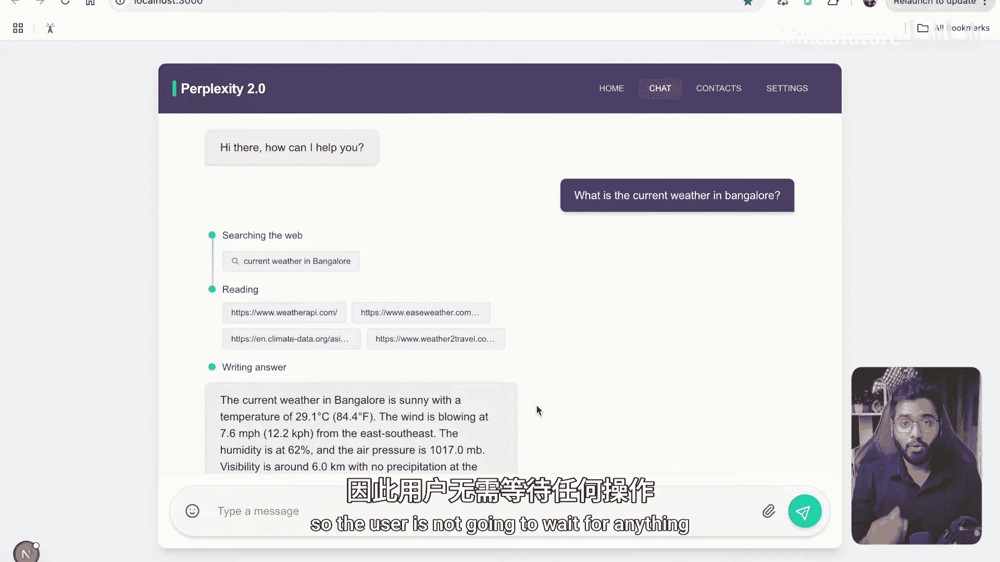

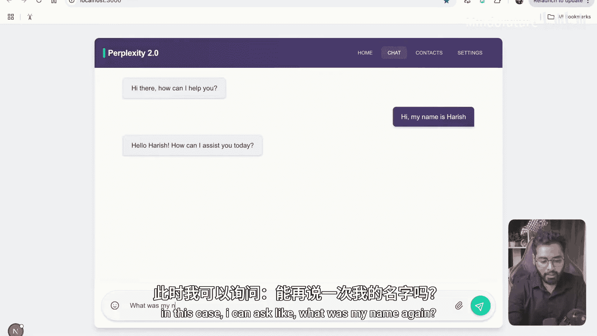

核心功能是联网搜索与状态流式展示。当用户提出一个需要联网查询的问题，例如“When is the next SpaceX launch?”，应用会触发以下流程：

1.  UI 显示“Searching the web...”状态。
2.  显示具体的搜索查询。
3.  显示它正在读取的网页 URL。
4.  最后，流式输出整合后的答案，例如“The next SpaceX launch is scheduled for Sunday, April 6”。

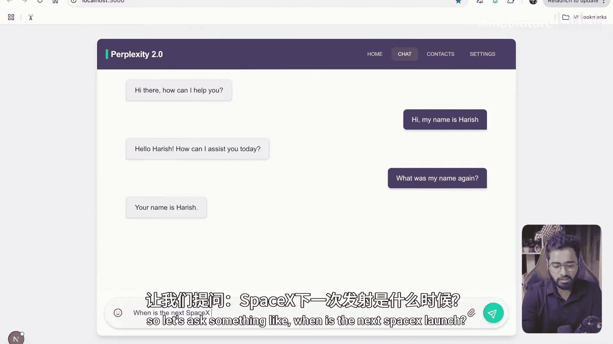

整个过程无需用户等待，所有 Token 都是实时生成并流式传输到前端的。

## 技术栈与学习要点

这是一个令人兴奋的全栈应用项目。我们将学习以下后端 LangGraph 的核心概念：

*   **构建智能体图**：我们将学习如何构建一个简单的但功能强大的智能体工作流图。
*   **检查点与持久化内存**：使用 `checkpointer` 来实现对话历史的记忆和持久化存储。
*   **设置流式响应**：学习如何配置 LangGraph 以支持将生成的 Token 实时流式传输到客户端。

对于前端部分，我们将使用 React 来构建动态UI。但请注意，如果你不是前端开发者，或者对学习 React 不感兴趣，这完全没有问题。你可以直接使用提供的完整前端代码，复制粘贴即可开箱即用。

## 课程路线图

现在，让我们开始动手构建。首先，我们将从创建后端的智能体图开始。

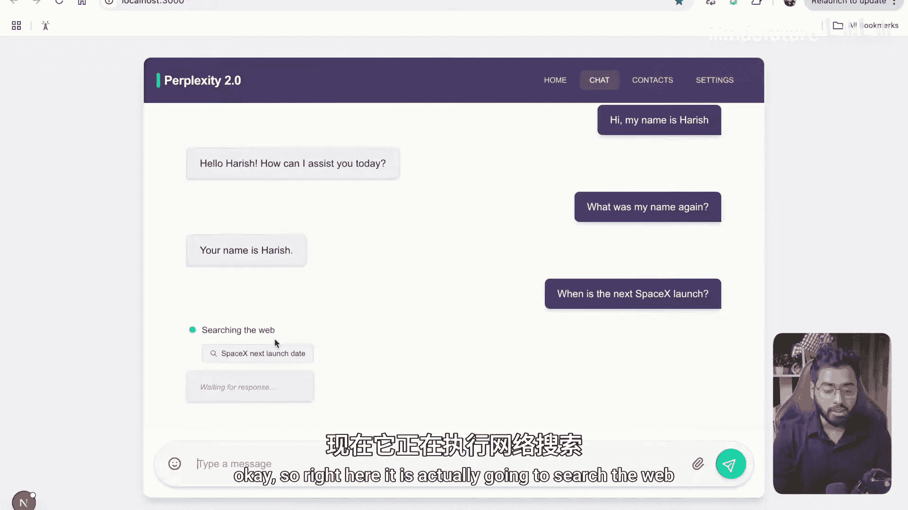

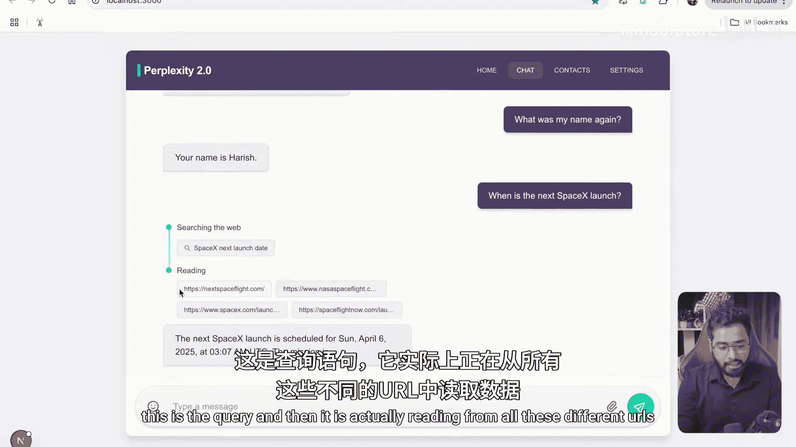

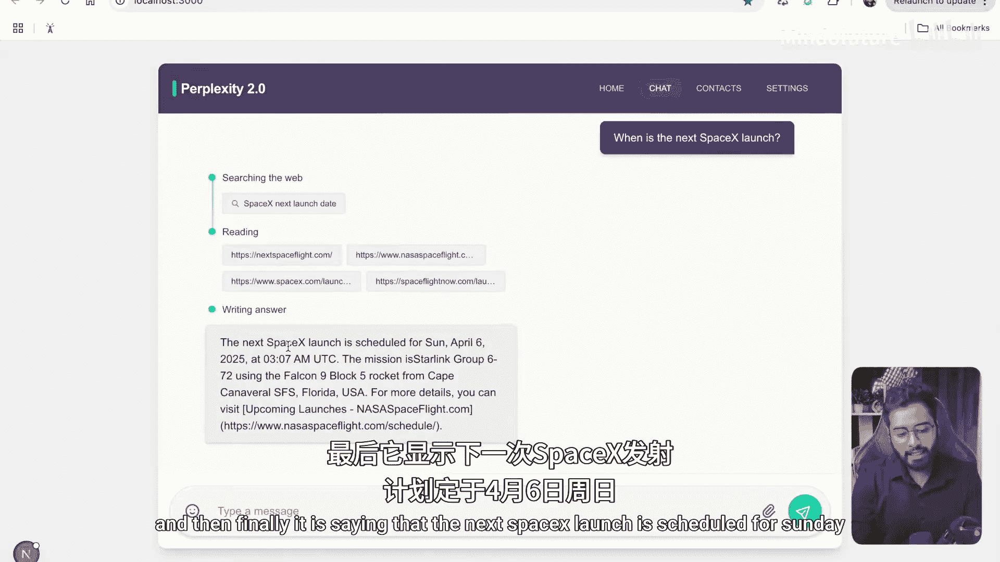

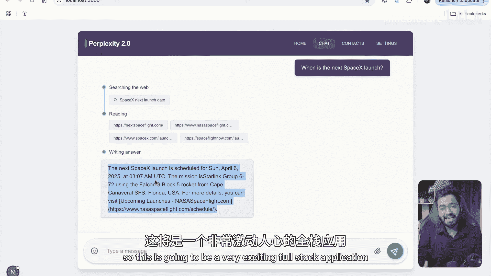

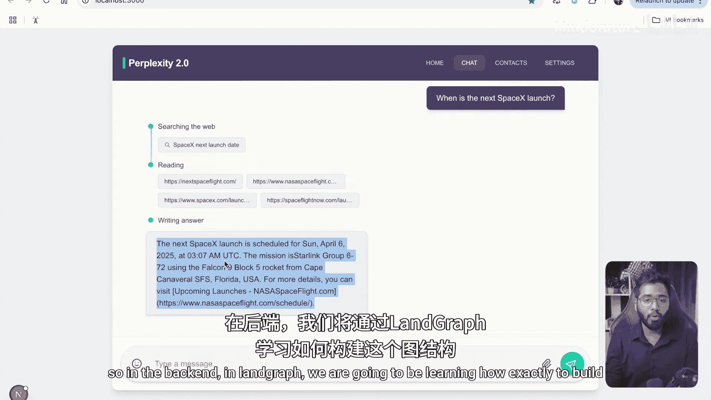

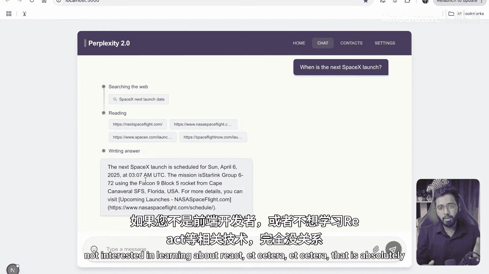

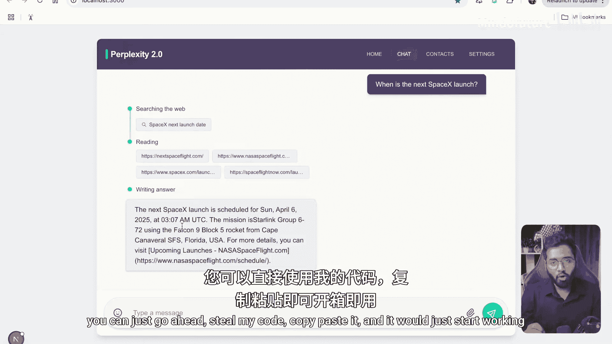

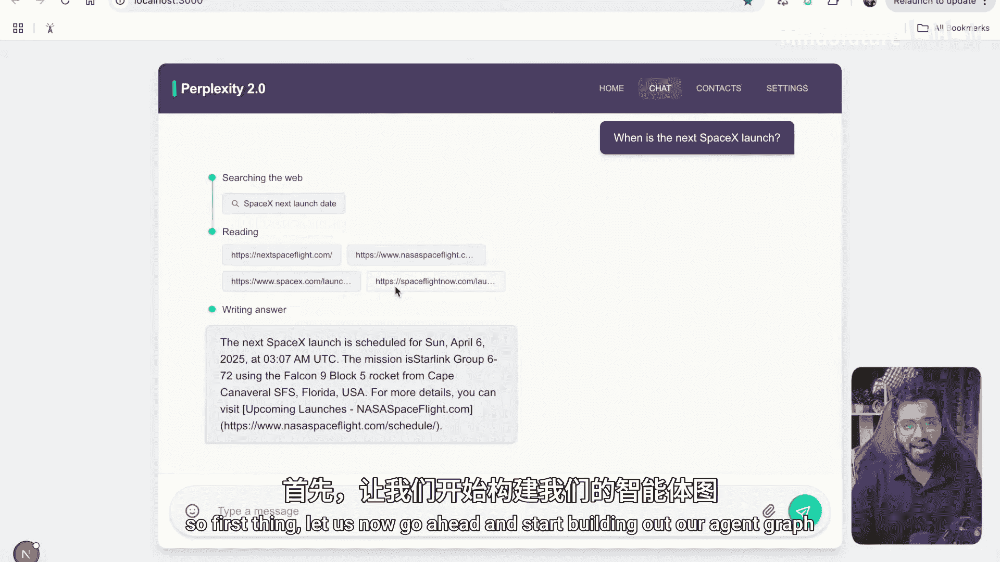

---

本节课中，我们一起学习了本次毕业设计项目的目标：构建一个具备记忆、联网搜索和实时流式响应能力的全栈 AI 应用。我们预览了最终效果，并明确了后端将重点学习 LangGraph 的**智能体图构建**、**检查点内存**和**流式传输**等核心概念。接下来，我们将进入实战环节，开始构建应用的后端核心。