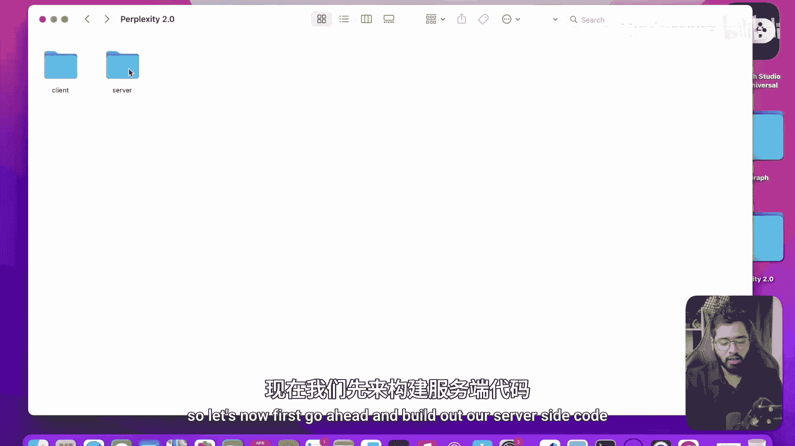
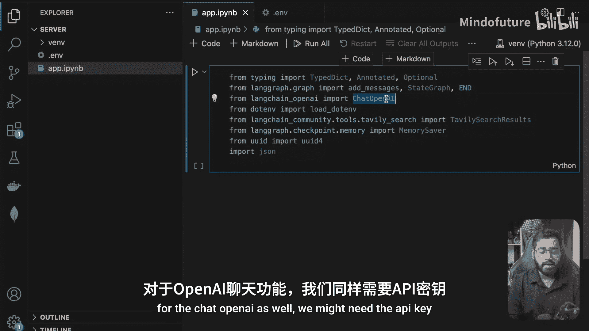
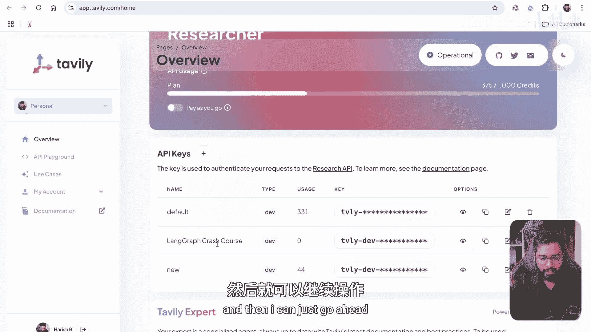
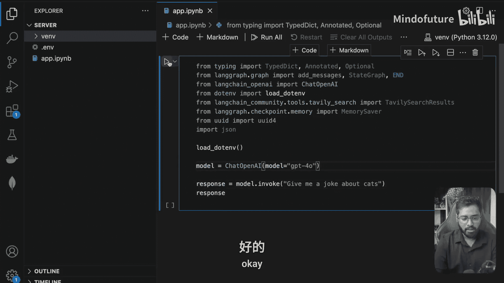
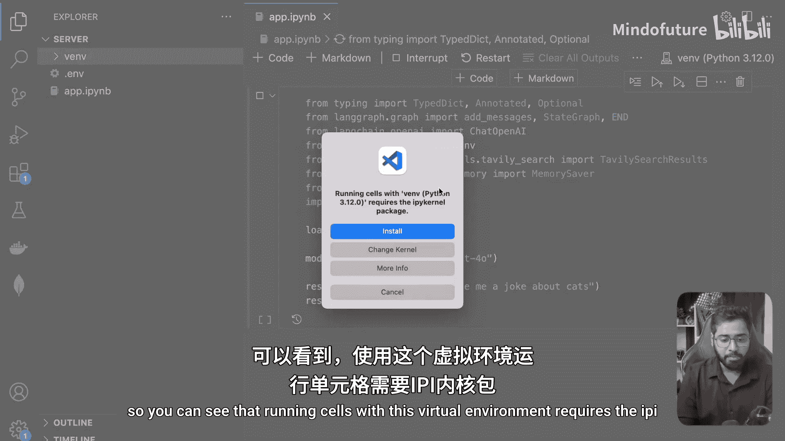
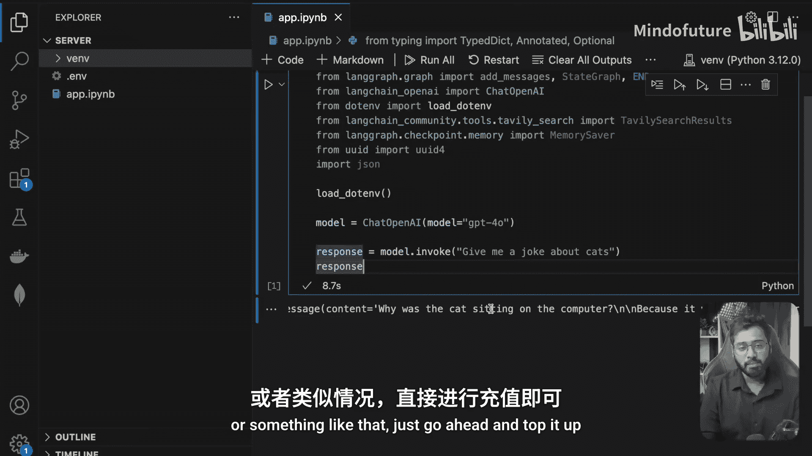
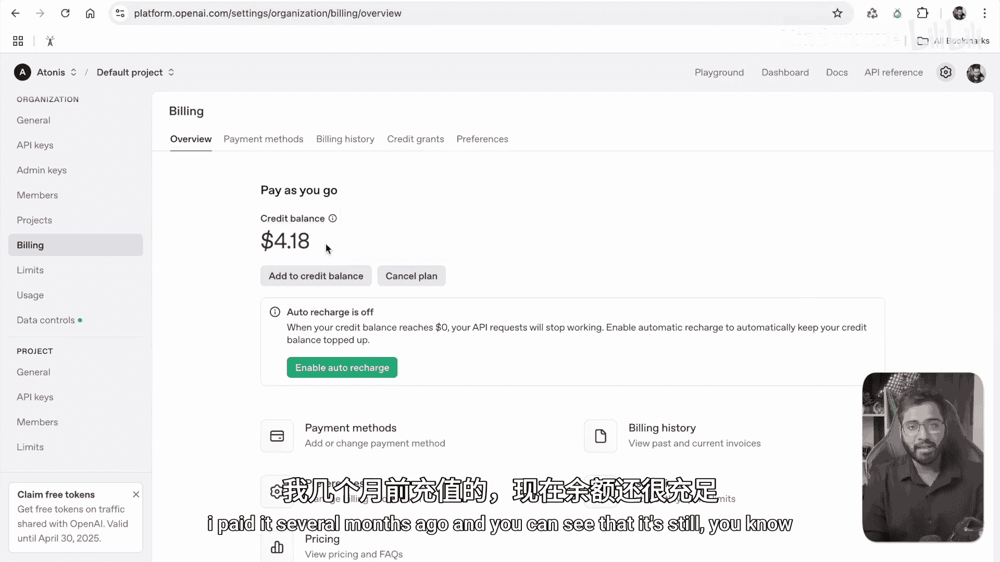
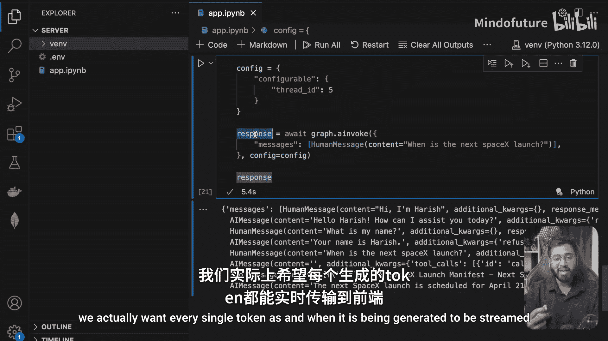
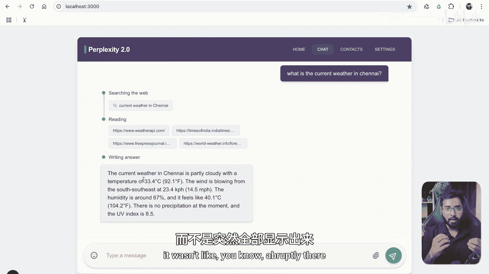
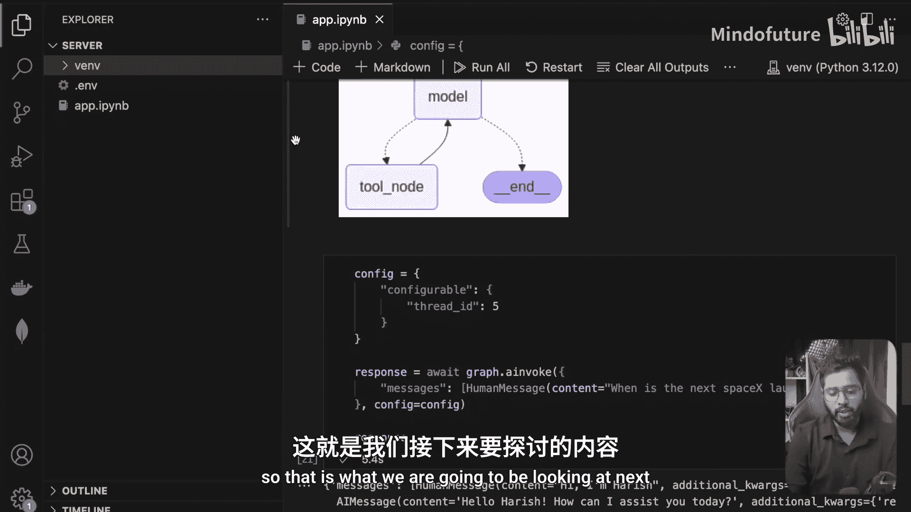

# 044：构建智能代理图

在本节课中，我们将学习如何构建一个基于LangGraph的智能代理图。我们将从设置开发环境开始，逐步创建代理的核心逻辑，并最终实现一个具备网络搜索、记忆持久化和流式响应功能的智能体。完成后的代理图将通过API端点提供服务，以便与前端应用连接。



## 环境搭建与初始化

首先，我们需要创建一个项目并设置Python虚拟环境，以确保项目依赖的隔离性。

我已经创建了一个名为`perplexity2.0`的文件夹，并在其中创建了`client`和`server`两个子文件夹。目前这两个文件夹是空的。现在，我们首先来构建服务器端代码。

我将使用Visual Studio Code打开项目文件夹。


第一件事是安装虚拟环境。使用虚拟环境可以将我们稍后安装的所有包隔离在这个特定的位置，而不是全局可用。

要初始化虚拟环境，我使用以下命令。因为我使用的是Mac，所以使用`python3`。如果你使用的是Windows，可以直接使用`python`命令。

```bash
python3 -m venv venv
```

这个命令使用`venv`模块，并创建名为`venv`的文件夹。稍等片刻，你可以看到`venv`文件夹已经创建好了。

接下来，我们需要激活这个虚拟环境。目前终端路径仍然指向基础环境。为了激活它，由于我使用的是Mac，我输入以下命令：

```bash
source venv/bin/activate
```

这个命令会激活我的虚拟环境。在Windows系统上，命令略有不同，你可以查阅相关资料，操作很简单。

现在，虚拟环境已经初始化并激活。接下来，我将创建一个名为`app.ipynb`的Jupyter笔记本文件。

## 安装依赖包

为了构建我们的图，我们需要安装一些必要的包。

以下是需要安装的包列表：
*   `langgraph`：构建代理图的核心框架。
*   `langchain-openai`：用于接入OpenAI的聊天模型。
*   `langchain-core`：LangChain的核心包。
*   `python-dotenv`：用于在Jupyter笔记本中加载环境变量。
*   `fastapi`：用于创建API端点。
*   `langchain-community`：提供社区贡献的工具，例如网络搜索工具。

我们可以使用以下命令一次性安装它们：

```bash
pip install langgraph langchain-openai langchain-core python-dotenv fastapi langchain-community
```

如果未来需要其他工具，我们可以随时回来安装。

## 导入模块与设置环境变量

现在依赖已经安装完毕，让我们开始导入一些必要的模块。

在开始编码之前，我假设你已经了解LangGraph和LangChain的基础知识，知道如何构建ReAct代理、流式处理、持久化的工作原理等。如果你不了解这些基础知识，我将在描述中附上一个课程的链接，该课程将从零开始带你学习所有内容。

现在，让我们开始导入模块。

首先，我们需要从`typing`模块导入一些类型定义，用于定义我们代理图的状态。

```python
from typing import TypedDict, Annotated, Optional
```

接下来，我们需要导入LangGraph的核心组件。

```python
from langgraph.graph import add_messages, StateGraph, END
```

`add_messages`是一个reducer方法，可以让我们轻松更新图的状态。`StateGraph`和`END`用于构建图结构。



然后，我们需要导入聊天模型。聊天模型是LangChain提供的工具，让我们能够与大型语言模型交互。这里我将使用OpenAI的聊天模型。

```python
from langchain_openai import ChatOpenAI
```

我们还需要`dotenv`来加载环境变量。

```python
from dotenv import load_dotenv
```

接着，我们需要导入网络搜索工具。`TavilySearchResults`工具可以让我们的代理访问互联网。



```python
from langchain_community.tools.tavily_search import TavilySearchResults
```

最后，我们需要导入持久化功能。我将使用检查点机制，这是在图中引入持久化的标准方法，这样我们的应用就能记住用户之前说过的话。





```python
from langgraph.checkpoint.memory import MemorySaver
```

我们可能还需要`uuid`来为每个用户会话创建唯一ID。

```python
import uuid
```

现在，大部分导入已经完成。接下来，我将创建一个`.env`文件来存储环境变量。





对于Tavily搜索和ChatOpenAI，我们都需要API密钥。

对于OpenAI API密钥，我可以访问`platform.openai.com`，进入个人资料中的API密钥部分，创建一个新的密钥。


我可以将其命名为`perplexity`，设置权限为全部，然后复制它。

对于Tavily搜索API密钥，我可以登录其官网，复制已有的API密钥。

在`.env`文件中，我需要设置相应的环境变量名。查看ChatOpenAI的文档，它需要`OPENAI_API_KEY`这个环境变量。将复制的API密钥用单引号或双引号括起来放在这里。

对Tavily搜索也进行同样的操作。查看其文档，它需要`TAVILY_API_KEY`这个环境变量。

我已经在我的`.env`文件中填充了所有环境变量。

## 测试环境配置

现在，让我们在代码中加载所有环境变量，并先进行一个简单的LLM调用来确保一切工作正常。

首先，加载环境变量。

```python
load_dotenv()
```

然后，初始化模型。我将使用`gpt-4o`模型。

```python
model = ChatOpenAI(model="gpt-4o")
```


现在，调用这个模型并让它讲一个关于猫的笑话。

```python
response = model.invoke("give me a joke about cats.")
print(response.content)
```

运行这个单元格。如果提示需要`ipykernel`包，我们也安装它。


运行成功。我们可以看到返回了一个AI消息，讲了一个关于猫坐在电脑上的笑话。一切正常。

如果你遇到“余额不足”之类的错误，请前往OpenAI平台充值。这通常可以使用3到6个月。

现在，让我们也测试一下Tavily搜索工具。

初始化搜索工具，并将最大结果数设置为4。

```python
search_tool = TavilySearchResults(max_results=4)
```


现在，调用搜索工具查询“班加罗尔的天气”。

```python
search_results = search_tool.invoke("what's the weather in Bangalore")
print(search_results)
```

运行后，我们得到了一个包含四个对象的数组。每个对象都有标题、URL和内容。Tavily搜索类似于谷歌搜索，它会根据查询从网上抓取内容。代理稍后可以利用这个工具获取实时数据。

测试通过。现在，我们定义一个工具列表，目前只包含这个搜索工具。

```python
tools = [search_tool]
```

## 初始化记忆存储与绑定工具的LLM

接下来，我们可以初始化记忆存储器，它将在我们的聊天应用中引入持久化。

```python
memory = MemorySaver()
```

现在，让我们创建一个能够访问这些工具的LLM实例。

```python
llm_with_tools = model.bind_tools(tools)
```

这段代码的作用是，现在如果我向`llm_with_tools`提出一个需要实时数据的问题，LLM不会立即给出答案，而是会调用搜索工具。

例如，询问“班加罗尔当前的天气”。

```python
response = llm_with_tools.invoke("what is the current weather in Bangalore")
print(response)
```

运行后，你会发现AI消息的`content`字段是空的，但在`tool_calls`数组中有一个工具调用。LLM建议调用`tavily_search_results_json`工具，并提供了查询参数。这样，我们就有了一个绑定工具的LLM实例。

## 构建代理图

现在，让我们开始构建我们的图。

在深入代码之前，我先展示一下我们构建的图的结构。如果你跟进了我的LangGraph课程，这应该是非常熟悉的结构。

我们有一个起始节点，接着是模型节点。任何时候，如果用户的问题需要模型调用工具，控制流就会转到工具节点。在工具节点中，它会利用Tavily搜索，使用LLM提供的查询进行网络搜索，然后将响应返回给LLM。如果网络搜索的结果足够，LLM就会结束这个图。




为了实现这个结构，我们首先需要定义状态。我们只需要一个消息列表，并使用`add_messages`这个reducer函数来更新状态。

初始节点是模型节点，也就是入口节点。这个节点会获取整个状态，使用`llm_with_tools`调用，传入整个消息列表，然后用结果更新状态。

这里需要注意，我们将使用`async/await`关键字。因为在生产应用中，当有大量并发用户时，我们不希望阻塞线程。我们希望多个线程能够并发工作。因此，我们将使用`async`，并且使用`ainvoke`方法而不是普通的`invoke`方法。功能非常相似，只是我们会在所有涉及异步操作（如LLM调用或API调用）的节点中使用`ainvoke`和`async`。

在这个模型执行之后，我们会查看返回的AI消息。这就是工具路由器的功能。它会获取最新的AI消息，检查是否有工具调用。如果有，就将图的流向路由到工具节点；否则，就流向`END`节点。

让我们看看工具节点的内部。这是一个自定义的工具节点，用于处理来自LLM的工具调用。同样，它会获取最新的AI消息，进入`tool_calls`，从中获取工具调用的名称（这里将是`tavily_search_results_json`，因为我们只提供了这一个工具）和参数（`args`，其中包含网络搜索查询）。然后，它使用提供的参数执行搜索工具，获取搜索结果，将其字符串化，并添加一个工具消息。最后，我们将这个最终的工具消息附加到消息列表中并更新状态。

实际上，LangGraph已经为我们提供了一个预构建的`ToolNode`类，因为在使用代理时，调用这个代码块是非常常见的操作。我们可以直接使用那个类，但这里我选择手动实现，以便更透明地展示内部过程。

接下来，我们使用`StateGraph`来构建图。第一个节点是模型节点，作为入口点。然后我们添加工具节点。我们还需要添加一个条件边：在模型执行后，我们需要决定是流向工具节点还是结束节点。这就是工具路由器的作用。

最后，在编译步骤中，我们将提供记忆检查点。

现在，让我们运行这段代码并对其进行测试。

```python
# 假设 graph 是编译好的图
response = graph.invoke(...)
```

我们需要提供一个配置对象，因为检查点需要一个会话ID来知道它为哪个会话存储状态。

```python
config = {"configurable": {"thread_id": "1"}}
response = graph.invoke(..., config=config)
```

我们还需要使用`ainvoke`并`await`它。

让我们测试一下持久化功能。首先发送一条消息介绍自己。


```python
response = await graph.ainvoke({"messages": [("human", "Hi I'm Harsh.")]}, config={"configurable": {"thread_id": "5"}})
```

然后询问“我的名字是什么？”。你应该能看到之前的对话被保留了下来，代理记得我的名字是Harsh。

现在，让我们尝试一个需要代理进行网络搜索的问题。

```python
response = await graph.ainvoke({"messages": [("human", "When is the next SpaceX launch?")]}, config={"configurable": {"thread_id": "5"}})
```

在这种情况下，代理会利用Tavily搜索工具获取网络结果。你可以看到，在AI消息中，`content`是空的，但在`tool_calls`中，它建议调用工具并传递查询。然后，会有一个`tool_message`，包含来自Tavily搜索的响应信息。最后，最后一个AI消息会给出下一次SpaceX发射的日期。

一切工作正常。

## 实现流式响应

最后，我想展示一下流式处理是如何工作的，因为我们不希望一次性获得所有响应，而是希望每个标记在生成时就能流式传输到前端。

我将创建另一个代码块。这次，我将使用`graph.astream_events`方法，而不是`ainvoke`或`invoke`，因为后者会突然给出最终响应。

```python
events = graph.astream_events(
    {"messages": [("human", "Hi I'm Harsh.")]},
    config={"configurable": {"thread_id": "6"}},
    version="v2"
)
```

`version="v2"`会发出更多信息，这正是我们感兴趣的。

这将返回一个生成器函数。我们可以遍历这个可迭代对象并打印事件。

```python
async for event in events:
    print(event)
```

运行这段代码，你应该能看到许多不同的事件被生成。每个事件对象都有事件类型、数据和元数据等属性。元数据会告诉我们这个事件是从哪个节点发出的。

我们可以隔离出我们感兴趣的事件类型，例如`on_chat_model_stream`，然后提取其中的内容数据流式输出。

```python
async for event in events:
    if event["event"] == "on_chat_model_stream":
        chunk = event["data"]["chunk"]
        if hasattr(chunk, 'content') and chunk.content:
            print(chunk.content, end="", flush=True)
```

运行这个，当你提出一个问题时，例如“写一篇关于气候变化的10词短文”，你应该能看到每个单词被逐个流式输出。这就是我们想要的效果。

## 总结与下一步

在本节课中，我们一起学习了如何从零开始构建一个功能完整的LangGraph智能代理。我们完成了环境搭建、依赖安装、核心代理图的构建，并实现了网络搜索、对话记忆持久化以及流式响应功能。

我们构建的代理图目前运行在Jupyter笔记本中。下一步，我们将把这些代码转移到生产环境中。这意味着我们将创建一个普通的Python文件，导入FastAPI，围绕这个代理创建一个API端点，以便前端应用能够访问它。这将是我们下一节课的重点。



