# 045：使用 FastAPI 实现流式传输 🚀

在本节课中，我们将学习如何将之前构建的 LangGraph 智能体封装成一个 FastAPI 服务，并实现服务器发送事件（Server-Sent Events, SSE）流式传输。我们将创建一个 `/chat/stream` 端点，使前端能够实时接收 AI 的响应、工具调用状态和搜索结果。

## 概述

上一节我们已经在 Jupyter Notebook 中构建并测试了智能体图。本节中，我们将把这些代码迁移到一个独立的 Python 文件中，并使用 FastAPI 框架创建一个支持流式响应的 Web API。核心在于理解如何使用 `StreamingResponse` 和 SSE 协议，将 LangGraph 的 `astream_events` 方法产生的事件实时推送给客户端。

## 项目结构初始化

首先，我们创建一个新的 Python 文件（如 `app.py`），并将 Notebook 中的智能体图代码完整地复制过来。这包括导入依赖、初始化内存、定义状态、创建模型节点、工具路由节点等。这部分代码与之前完全一致，是智能体运行的基础。

```python
# app.py 初始部分
from langgraph.graph import StateGraph, END
from langgraph.checkpoint import MemorySaver
# ... 其他导入
from typing import TypedDict, Annotated, List
import operator

# 定义状态
class State(TypedDict):
    messages: Annotated[List[dict], operator.add]

# 初始化内存和模型
memory = MemorySaver()
model = ChatOpenAI(model="gpt-4", streaming=True)
# ... 构建图的代码（与之前相同）
```

## 集成 FastAPI 框架

接下来，我们引入 FastAPI 来构建 Web 服务。首先需要安装 FastAPI 和 Uvicorn（一个 ASGI 服务器）。

```bash
pip install fastapi uvicorn
```

在代码中，我们初始化 FastAPI 应用，并添加必要的中间件以处理跨域请求（CORS），确保浏览器客户端能顺利与服务器通信。

```python
from fastapi import FastAPI
from fastapi.middleware.cors import CORSMiddleware

app = FastAPI()

# 添加 CORS 中间件
app.add_middleware(
    CORSMiddleware,
    allow_origins=["*"],  # 生产环境中应指定具体来源
    allow_credentials=True,
    allow_methods=["*"],
    allow_headers=["*"],
)
```

## 构建流式聊天端点

现在，我们来创建核心的流式传输端点 `/chat/stream`。这个端点将接收用户消息和一个可选的会话检查点 ID。

```python
from fastapi import Request
from fastapi.responses import StreamingResponse
import json

@app.post("/chat/stream")
async def chat_stream(request: Request, checkpoint_id: str = None):
    # 从请求体中获取用户消息
    data = await request.json()
    message = data.get("message")

    # 定义生成器函数，用于流式产生事件
    async def event_generator():
        # ... 生成器内部逻辑
        yield f"data: {json.dumps(event_data)}\n\n"

    # 返回 StreamingResponse，媒体类型设置为 text/event-stream
    return StreamingResponse(event_generator(), media_type="text/event-stream")
```

### 理解服务器发送事件（SSE）

在深入生成器逻辑前，有必要了解我们为何选择 SSE 而非 WebSocket。
*   **WebSocket**：提供全双工、持久的连接，适合需要频繁双向通信的场景（如聊天室、在线游戏）。
*   **服务器发送事件（SSE）**：是一种服务器到客户端的单向通信协议。服务器可以随时向客户端推送数据，但客户端只能通过普通的 HTTP 请求发起通信。对于像我们这样的聊天应用（主要是服务器推送 AI 响应），SSE 更加简单轻量。

FastAPI 的 `StreamingResponse` 结合 `text/event-stream` 媒体类型，完美支持了 SSE。

## 实现事件生成器逻辑

生成器函数 `event_generator` 是流式传输的核心。它负责运行智能体图，并对其产生的事件进行筛选、格式化，然后通过 `yield` 语句发送给客户端。

### 处理新会话与继续会话

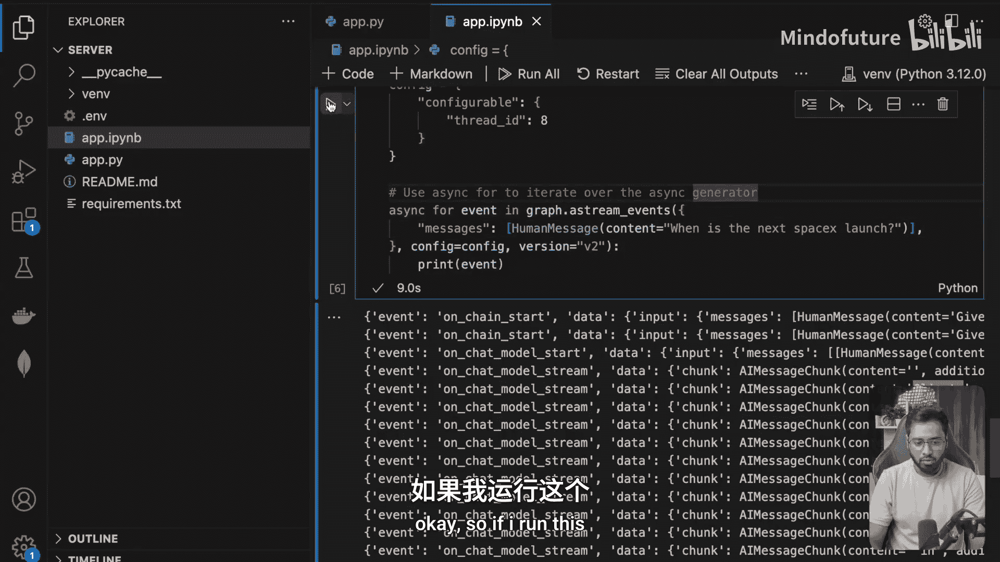

首先，我们需要根据是否提供了 `checkpoint_id` 来区分是新对话还是继续旧对话，并据此构建不同的运行配置。

```python
async def event_generator():
    config = {}
    if checkpoint_id is None:
        # 新会话：创建新的线程ID
        config["configurable"] = {"thread_id": "some_new_thread_id"}
        # 首次运行时，可以发送一个包含 checkpoint_id 的事件给客户端保存
        yield f'data: {{"type": "checkpoint", "id": "some_new_thread_id"}}\n\n'
    else:
        # 继续现有会话：使用提供的 checkpoint_id
        config["configurable"] = {"thread_id": checkpoint_id}
```

### 流式处理图事件

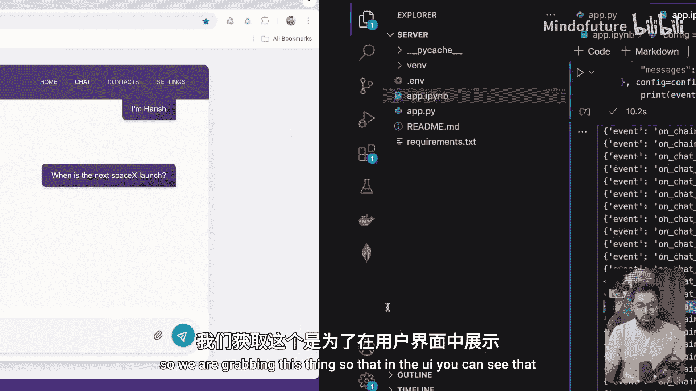

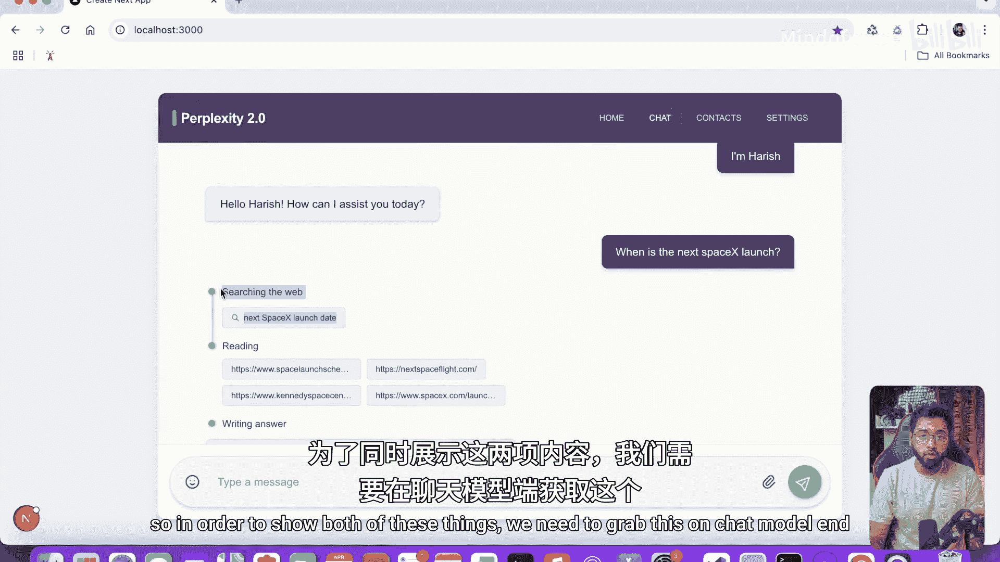

我们使用图的 `astream_events` 方法来异步获取运行过程中的各种事件。然后遍历这些事件，根据其类型进行不同的处理。

```python
    # 使用 astream_events 运行图并获取事件流
    async for event in graph.astream_events({"messages": [{"role": "user", "content": message}]}, version="v2", config=config):
        event_type = event.get("event")
        # 根据事件类型处理...
```

以下是需要处理的主要事件类型及其逻辑：

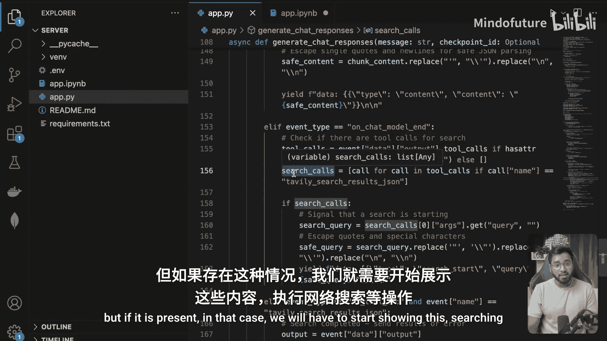

**1. 处理 LLM 内容流 (`on_chat_model_stream`)**
这是最常见的类型，对应 AI 模型正在生成文本。我们从事件数据中提取文本块（chunk）并发送。

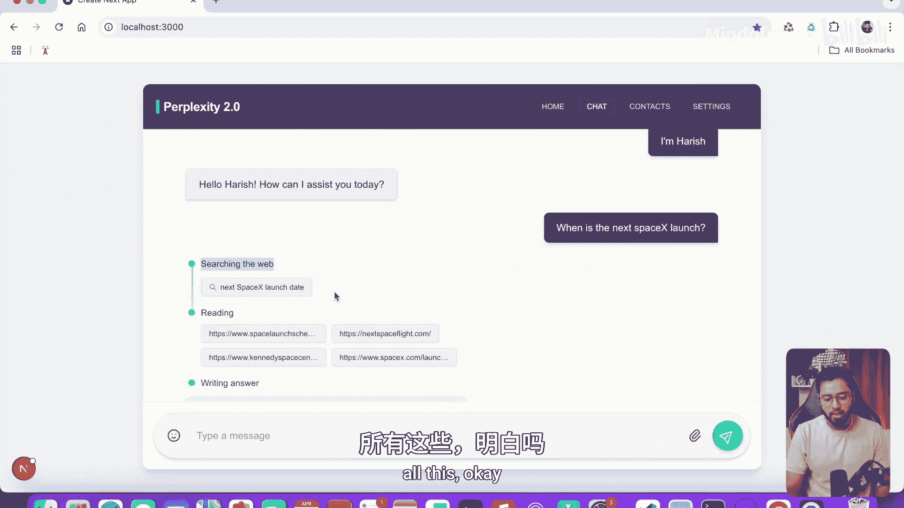

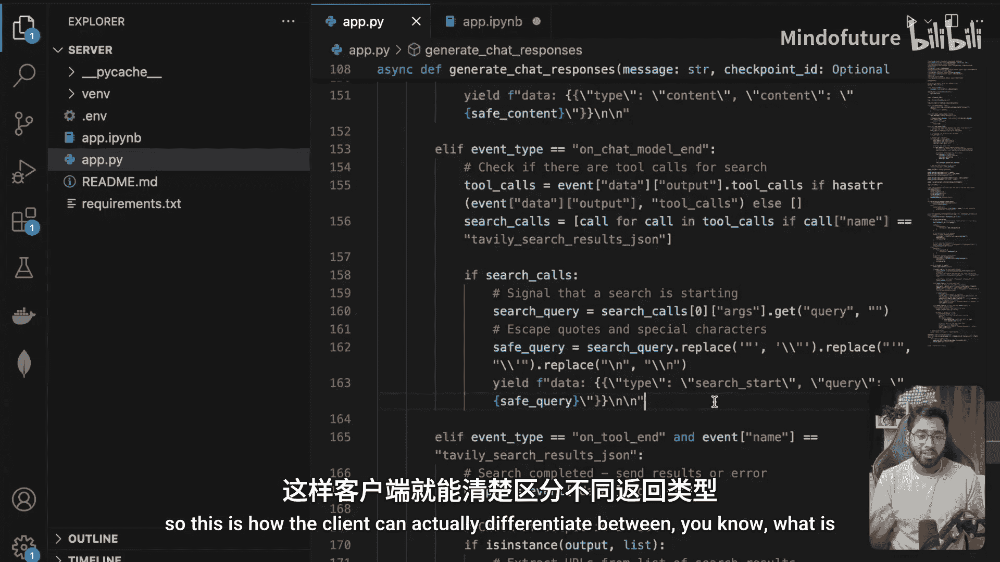

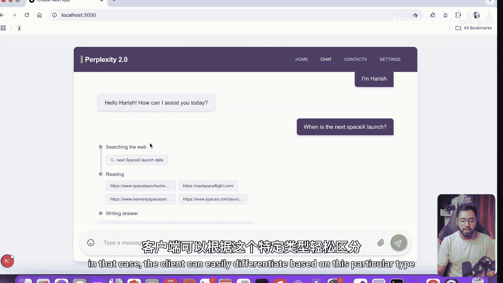

```python
        if event_type == "on_chat_model_stream":
            chunk = event.get("data", {}).get("chunk")
            # 一个辅助函数，安全地提取 AI 消息内容
            content = safe_extract_content(chunk)
            if content:
                # 转义 JSON 中的特殊字符
                safe_content = json.dumps(content)
                yield f'data: {{"type": "content", "content": {safe_content}}}\n\n'
```

**2. 处理工具调用开始 (`on_chat_model_end`)**
当 LLM 决定调用工具时，我们需要通知前端，以便显示“正在搜索”等状态。

```python
        elif event_type == "on_chat_model_end":
            output = event.get("data", {}).get("output")
            # 检查输出中是否包含工具调用
            tool_calls = getattr(output, 'tool_calls', [])
            for tc in tool_calls:
                if tc.get('name') == 'tavily_search': # 假设我们使用 Tavily 搜索工具
                    query = tc.get('args', {}).get('query')
                    if query:
                        safe_query = json.dumps(query)
                        # 发送搜索开始事件
                        yield f'data: {{"type": "search_start", "query": {safe_query}}}\n\n'
```

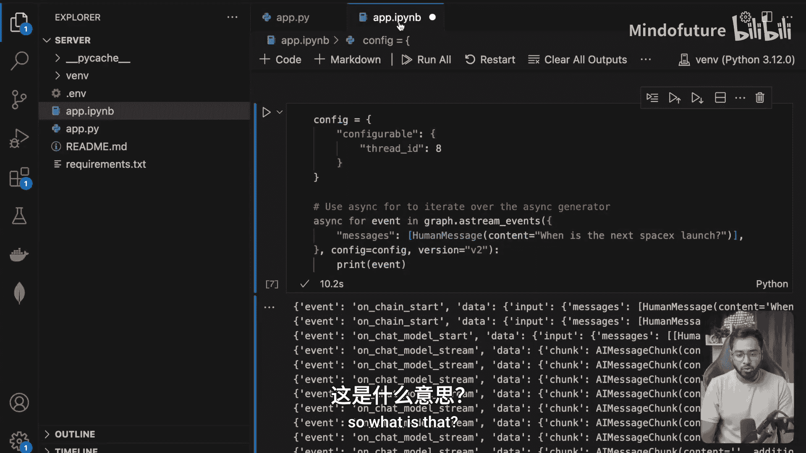

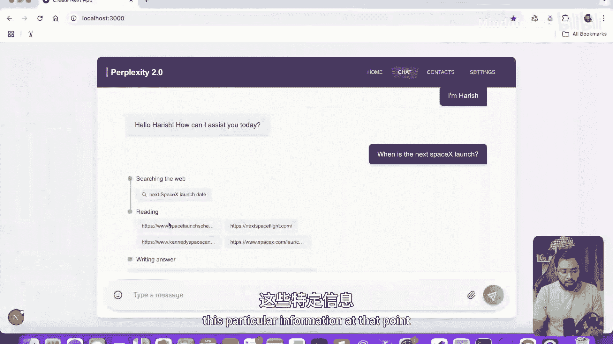

**3. 处理工具执行结果 (`on_tool_end`)**
当工具（如网络搜索）执行完毕时，我们获取结果（例如搜索到的URL列表）并发送给前端展示。

```python
        elif event_type == "on_tool_end":
            tool_name = event.get("name")
            if tool_name == "tavily_search":
                output = event.get("data", {}).get("output")
                # 假设 output 是一个包含搜索结果的字典列表
                urls = [result.get('url') for result in output if result.get('url')]
                safe_urls = json.dumps(urls)
                # 发送搜索结果事件
                yield f'data: {{"type": "search_results", "urls": {safe_urls}}}\n\n'
```

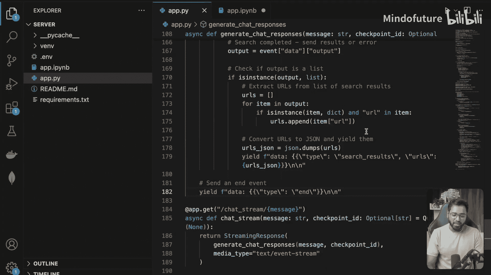

**4. 发送结束事件**
当整个图运行结束时，发送一个特定事件通知客户端流已结束。

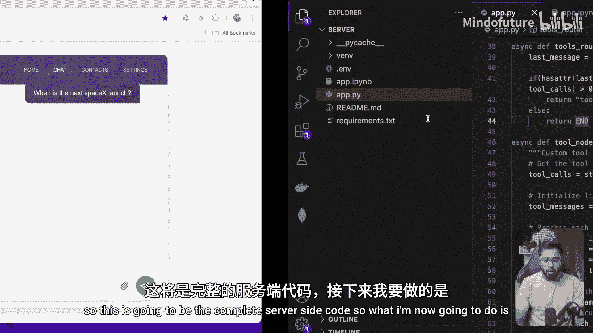

```python
    # 循环结束后，发送流结束信号
    yield f'data: {{"type": "end"}}\n\n'
```

## 运行与测试 API

完成代码后，我们可以使用 Uvicorn 运行 FastAPI 应用。

```bash
uvicorn app:app --reload
```
*   `app:app`：第一个 `app` 指文件名 `app.py`，第二个 `app` 指在文件中创建的 FastAPI 实例变量名。
*   `--reload`：启用热重载，开发时非常方便。

FastAPI 自动提供了交互式 API 文档（Swagger UI），可以通过访问 `http://127.0.0.1:8000/docs` 来测试我们的 `/chat/stream` 端点。

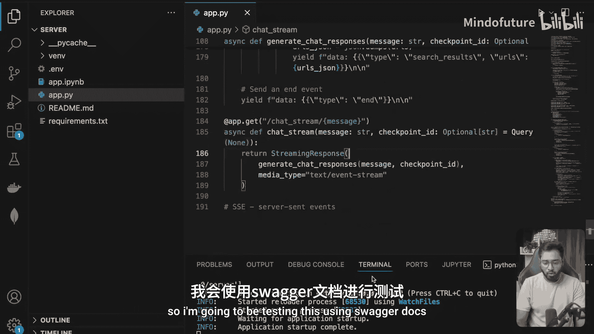

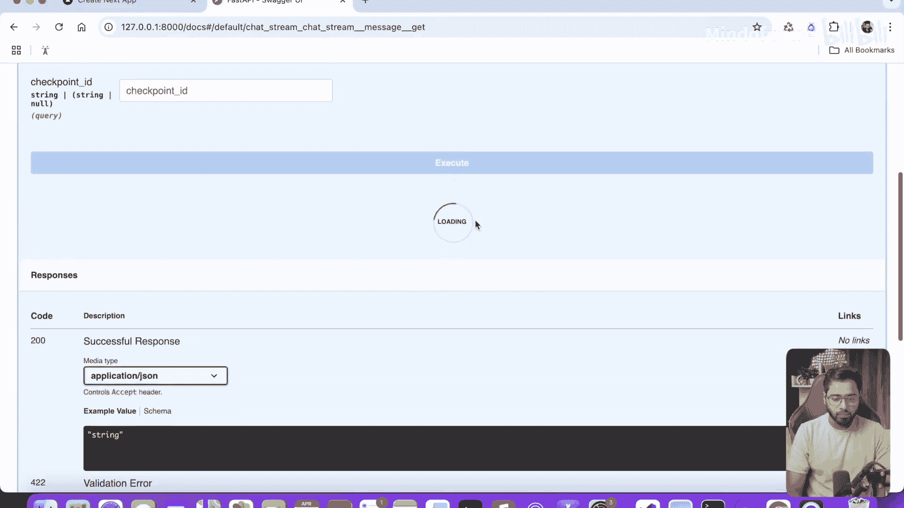

在测试界面中，你可以：
1.  点击 “Try it out”。
2.  在 `message` 字段输入问题（例如 “What is the weather in Delhi?”）。
3.  执行请求。
4.  在响应体部分，你将看到以 `data: ` 开头的、源源不断的 SSE 格式事件流，包含了 `checkpoint`、`content`、`search_start`、`search_results` 等各种类型的事件。

## 故障排除

在开发过程中，你可能会遇到工具调用（如网络搜索）时的 SSL 证书错误。一个常见的解决方法是使用 `certifi` 库并提供正确的证书路径。

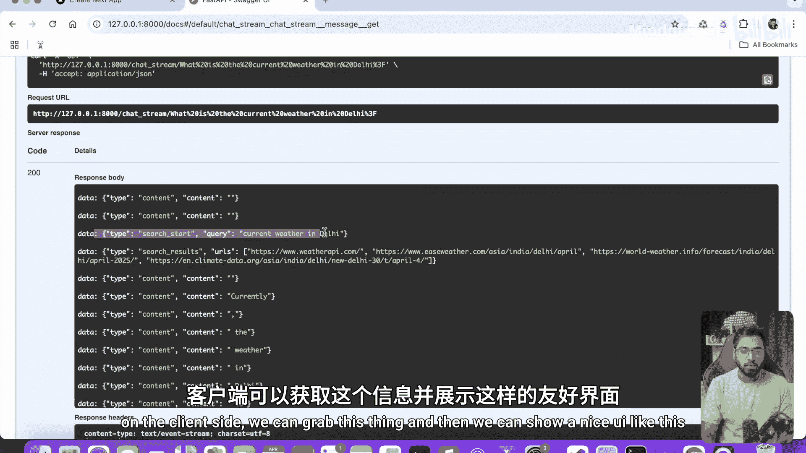

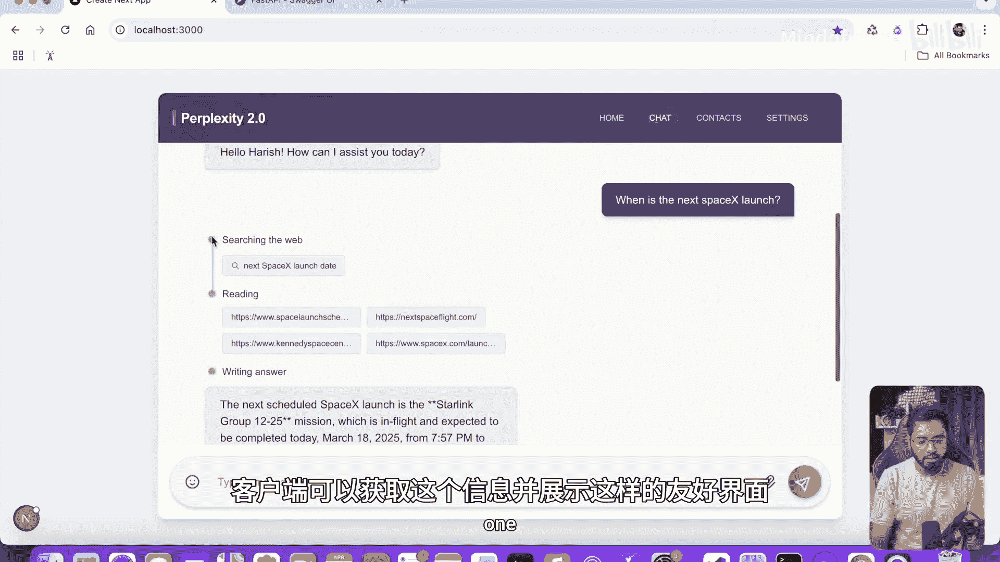

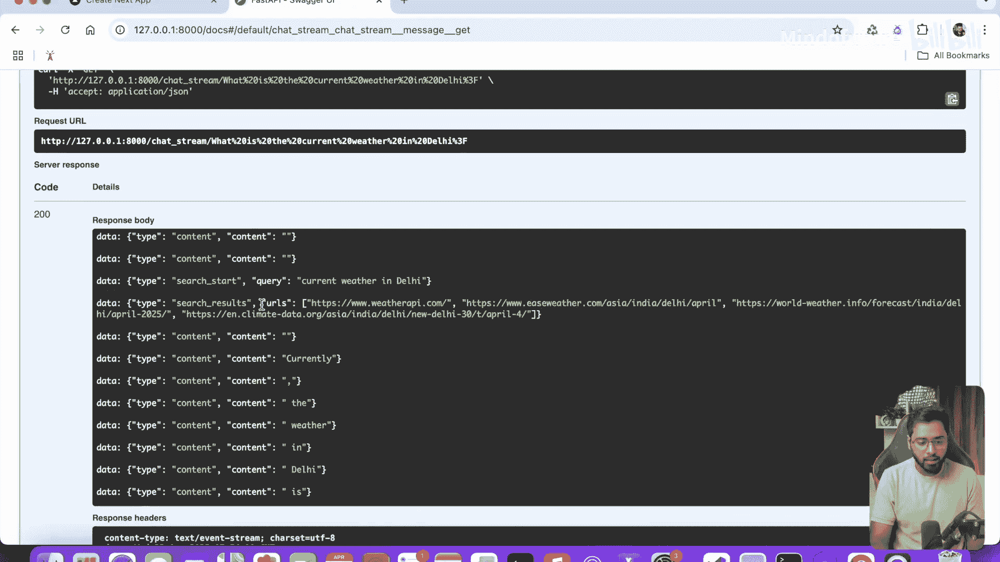

```bash
pip install certifi
```
在代码中或运行时指定证书路径：
```python
import os
os.environ['SSL_CERT_FILE'] = certifi.where()
```

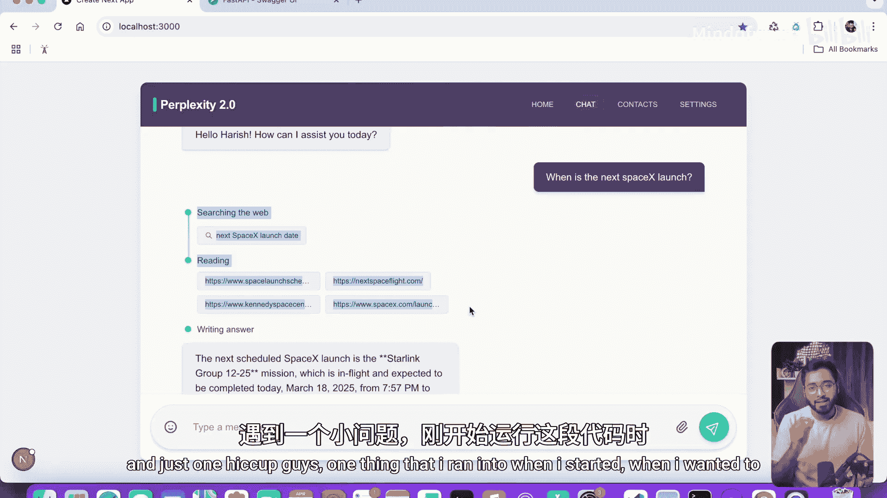

## 总结

本节课中，我们一起学习了如何将 LangGraph 智能体部署为 FastAPI 服务，并实现基于服务器发送事件（SSE）的流式传输。我们完成了以下关键步骤：

1.  **迁移代码**：将 Notebook 中的智能体图逻辑移至独立的 `app.py` 文件。
2.  **搭建 FastAPI 服务**：初始化应用并配置 CORS 中间件。
3.  **理解 SSE**：明确了 SSE 单向通信协议对于此类聊天应用的优势。
4.  **创建流式端点**：构建了 `/chat/stream` 端点，其核心是一个异步生成器函数。
5.  **处理多种事件**：在生成器内，我们筛选并格式化了来自 `astream_events` 的不同事件（LLM 输出、工具调用、工具结果），将其转换为前端可识别的结构化数据流。
6.  **测试与调试**：使用 Uvicorn 运行服务，并通过 Swagger UI 测试了流式响应的效果。

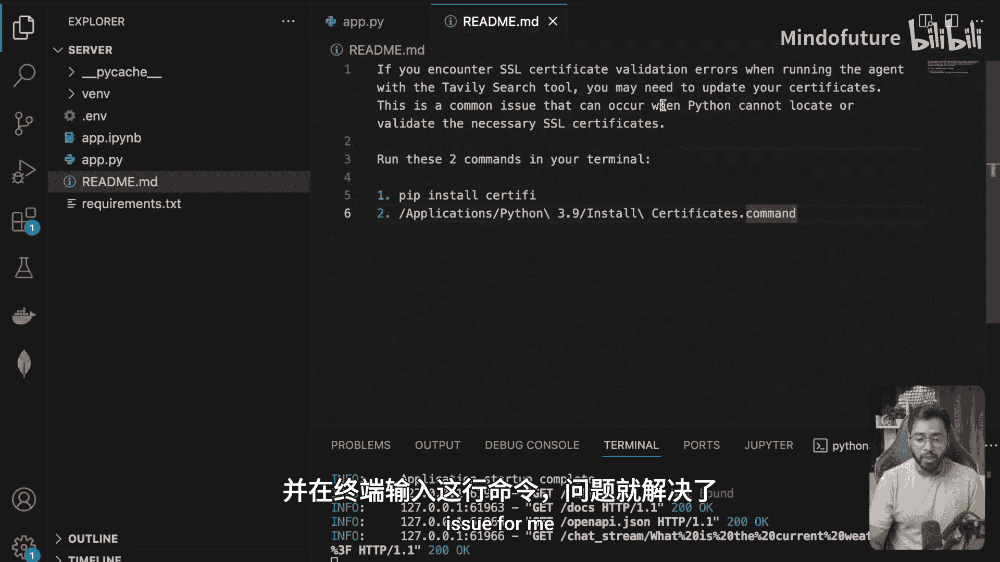

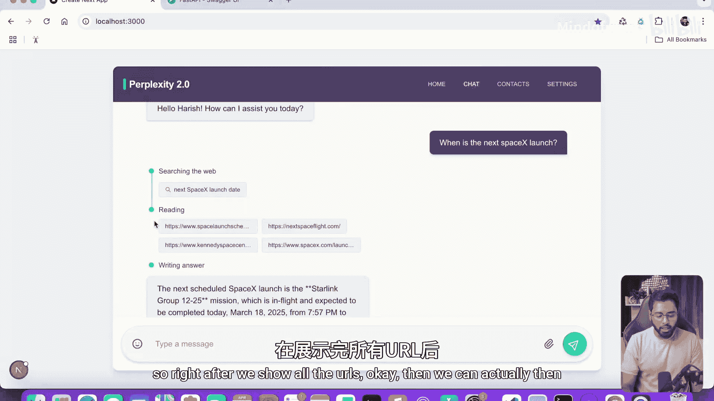

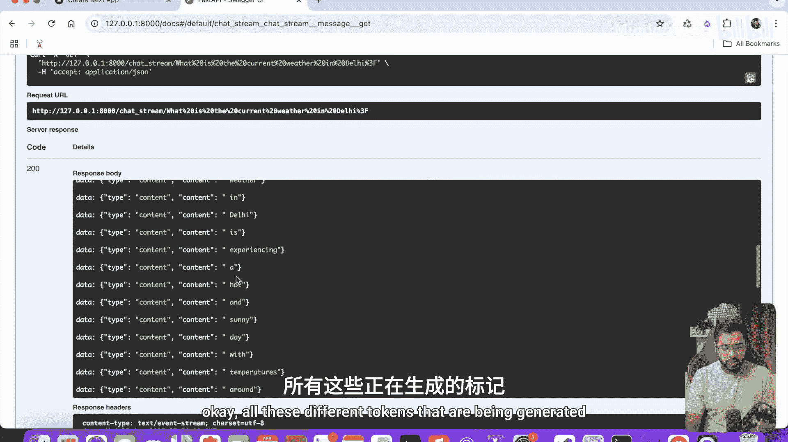

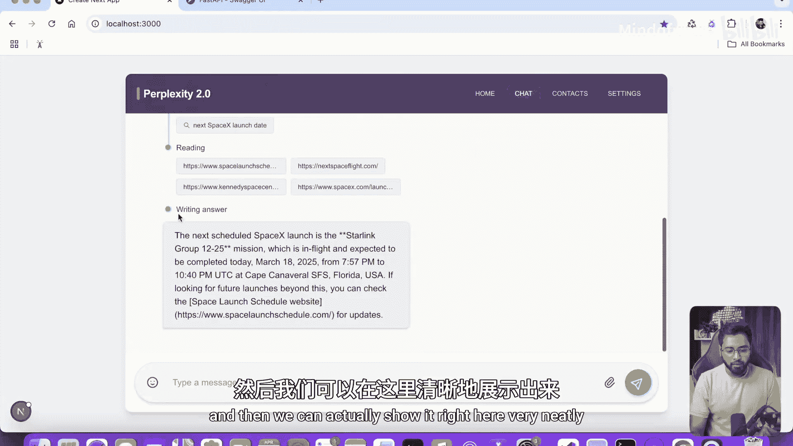

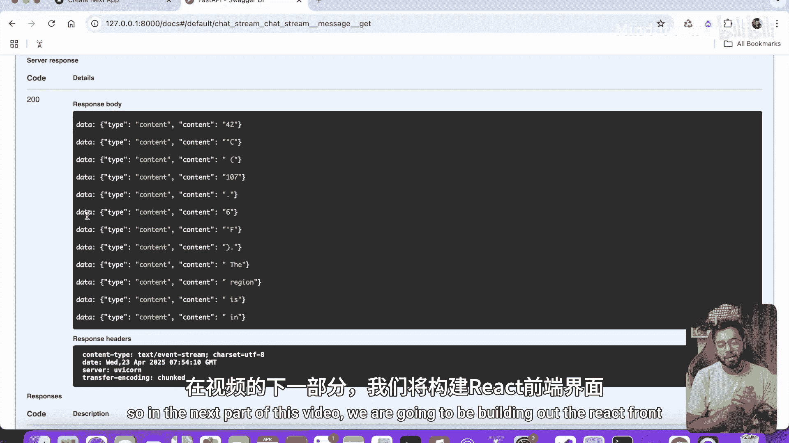

通过本节，你已经拥有了一个功能完整的、支持流式交互的 AI 智能体后端。在下一节中，我们将构建一个 React 前端应用来连接这个后端，并在浏览器中实现一个美观、实时的聊天界面。