# 047：最终部署 🚀

在本节课中，我们将学习如何将之前构建的 LangGraph 应用部署到生产环境。我们将使用 Docker 容器化应用，并将其部署到云服务提供商 Render 上，使其能够被全球访问。

## 概述

到目前为止，我们已经完成了服务器端代码的构建、LangGraph 图的创建以及本地测试。最终，我们需要将应用部署到生产环境。本节将介绍一种使用 Docker 和 Render 的部署方法。

## 准备 Docker 文件

上一节我们完成了本地测试，本节中我们来看看如何为应用创建容器镜像。为此，我们需要在项目根目录下添加两个文件：`Dockerfile` 和 `.dockerignore`。

`Dockerfile` 包含了构建 Docker 镜像所需的所有指令。以下是其内容：

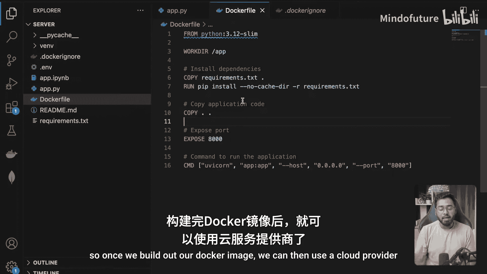

```dockerfile
# 使用官方 Python 镜像
FROM python:3.11-slim

# 设置工作目录
WORKDIR /app

# 复制依赖文件并安装
COPY requirements.txt .
RUN pip install --no-cache-dir -r requirements.txt

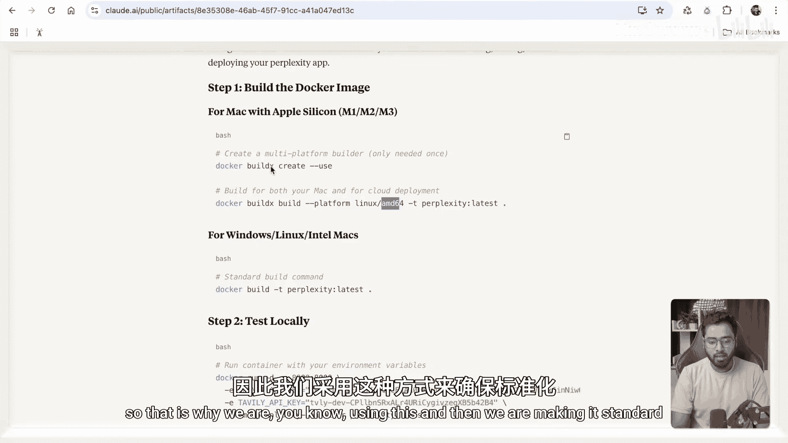

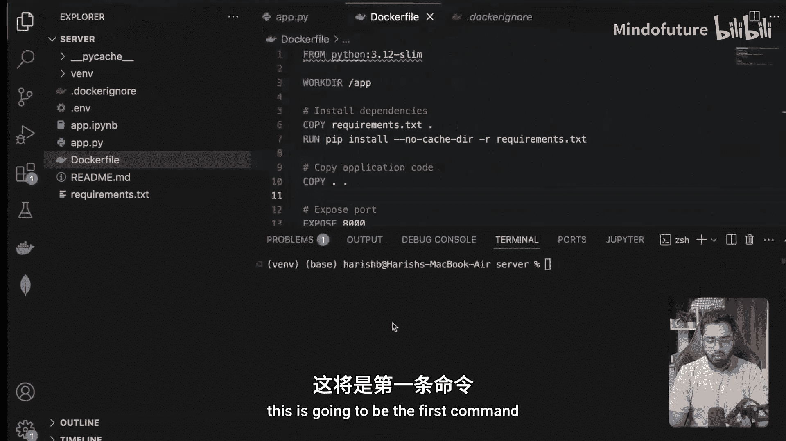

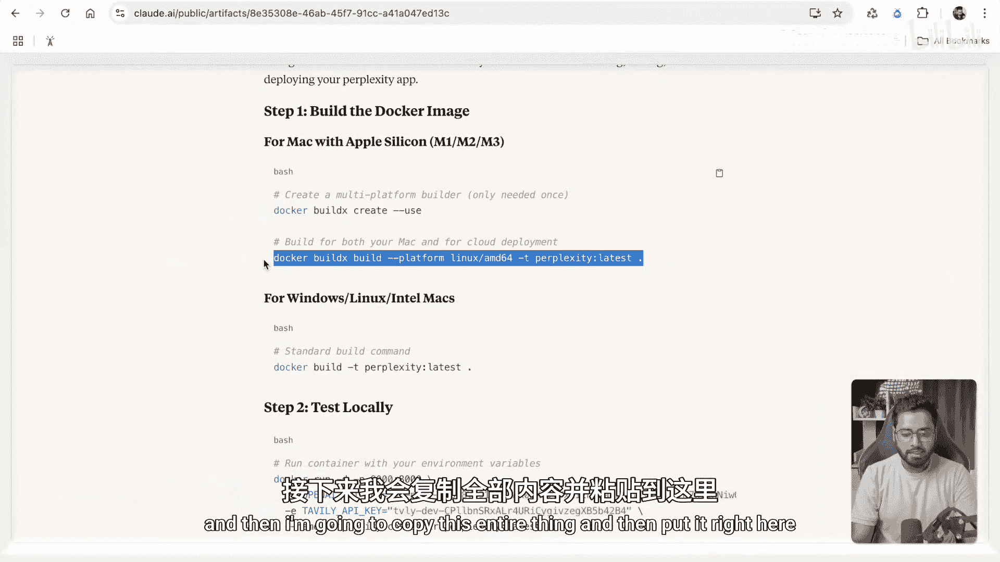

# 复制应用代码
COPY . .

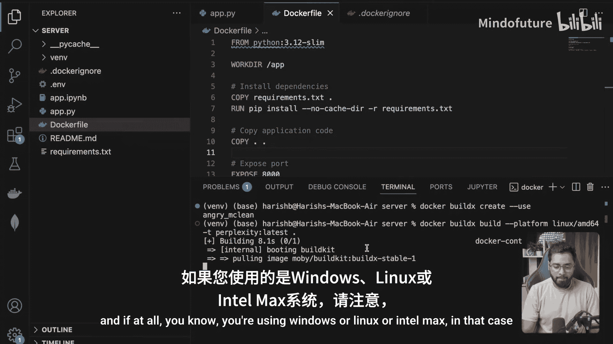

# 暴露端口
EXPOSE 8000

# 启动命令
CMD ["uvicorn", "app.main:app", "--host", "0.0.0.0", "--port", "8000"]
```

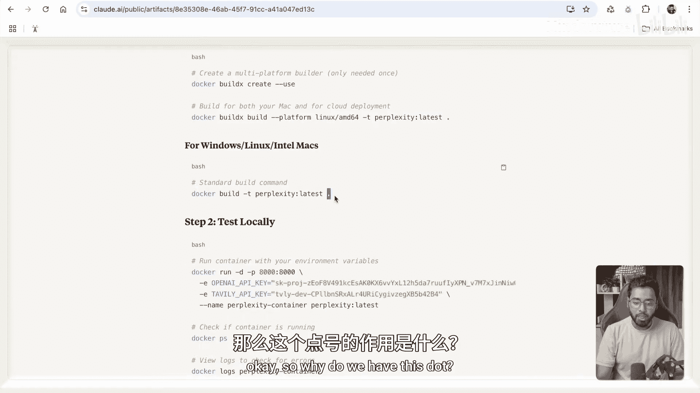

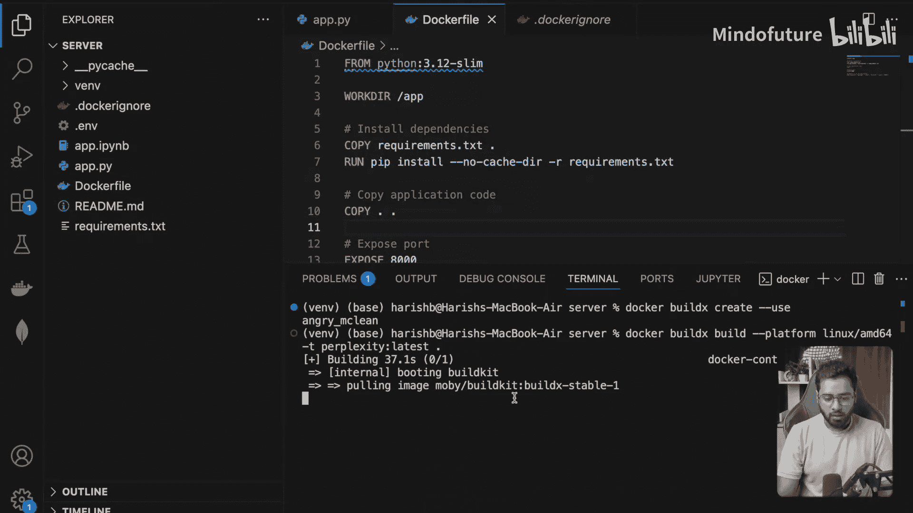

`.dockerignore` 文件用于指定哪些文件不应被复制到 Docker 镜像中，例如虚拟环境目录和 IDE 配置文件。

```
env/
.venv/
__pycache__/
*.pyc
.DS_Store
.git/
```

## 构建与测试 Docker 镜像

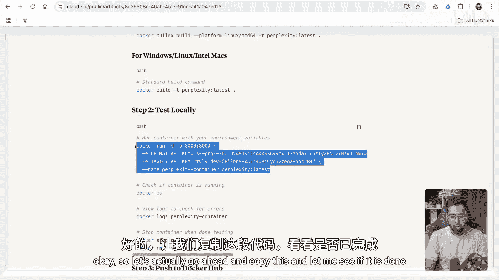

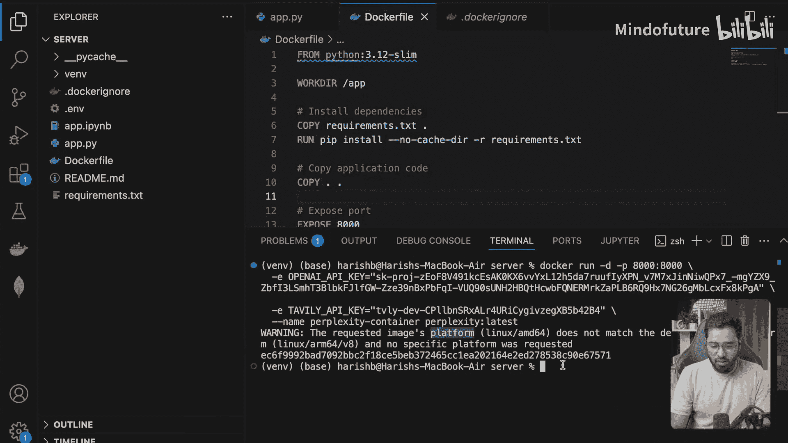

准备好配置文件后，下一步是构建 Docker 镜像并在本地运行测试。

以下是构建和测试镜像的步骤：

1.  **构建 Docker 镜像**：在终端中，导航到项目根目录（包含 `Dockerfile` 的目录），运行以下命令。注意，为了确保与云服务兼容，我们指定了平台。
    ```bash
    docker build --platform linux/amd64 -t perplexity:latest .
    ```
    对于 Windows、Linux 或 Intel Mac 用户，可以使用标准命令：
    ```bash
    docker build -t perplexity:latest .
    ```

2.  **在本地运行容器**：镜像构建成功后，我们可以运行一个容器来测试应用是否正常工作。
    ```bash
    docker run -d -p 8000:8000 -e OPENAI_API_KEY=your_key -e TAVILY_API_KEY=your_key --name perplexity-container perplexity:latest
    ```
    这个命令会：
    *   在后台 (`-d`) 启动一个容器。
    *   将容器的 8000 端口映射到宿主机的 8000 端口 (`-p 8000:8000`)。
    *   设置必要的环境变量 (`-e`)。
    *   为容器命名 (`--name`)。
    *   使用我们刚构建的 `perplexity:latest` 镜像。

3.  **验证本地部署**：打开浏览器，访问 `http://localhost:8000/docs`。如果能看到 Swagger API 文档页面，说明容器内的应用运行成功。测试完成后，可以使用 `docker stop perplexity-container` 停止容器。

## 推送镜像到 Docker Hub

本地测试通过后，我们需要将镜像推送到公共镜像仓库（如 Docker Hub），以便云服务器可以拉取它。

以下是推送镜像的步骤：

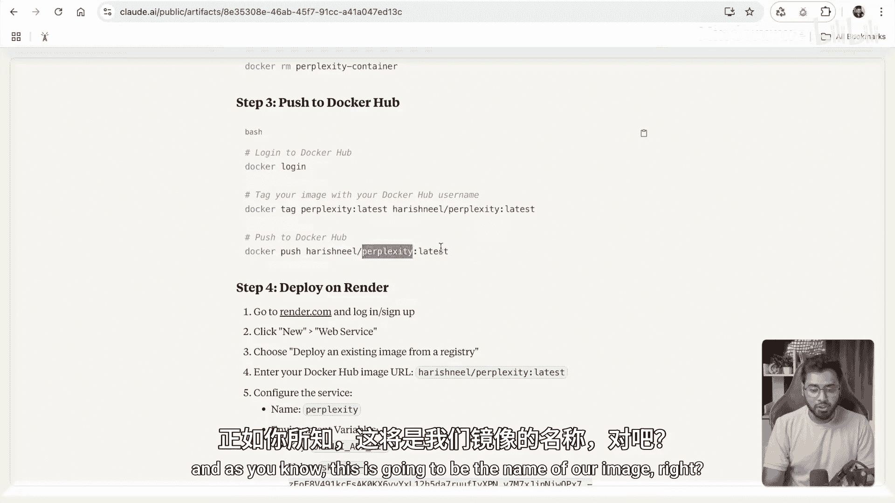

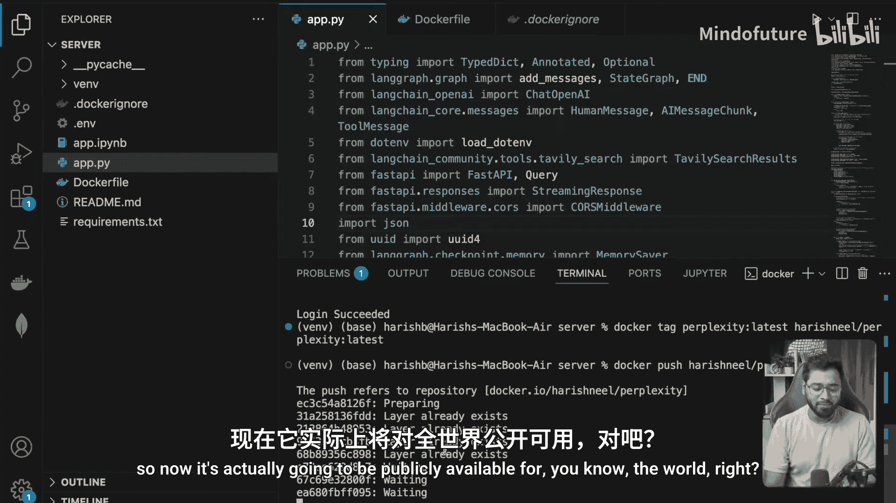

1.  **登录 Docker Hub**：在终端中运行 `docker login`，并输入你的 Docker Hub 用户名和密码。
2.  **为镜像打标签**：需要将本地镜像标签修改为包含你的 Docker Hub 用户名。
    ```bash
    docker tag perplexity:latest your_dockerhub_username/perplexity:latest
    ```
    请将 `your_dockerhub_username` 替换为你实际的用户名。
3.  **推送镜像**：将打好标签的镜像推送到 Docker Hub。
    ```bash
    docker push your_dockerhub_username/perplexity:latest
    ```
    推送完成后，你可以在 Docker Hub 网站的个人仓库中看到这个镜像。

## 部署到 Render

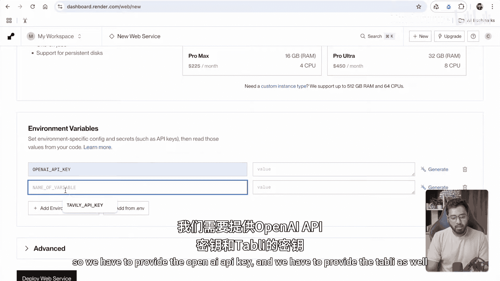

最后一步是将我们的容器化应用部署到云平台。这里我们使用 Render，因为它提供免费的入门套餐。

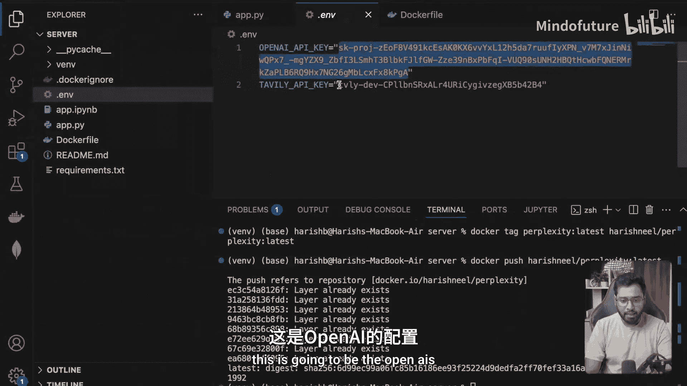

以下是部署步骤：

1.  访问 [Render 控制台](https://dashboard.render.com/)，点击 **New +**，然后选择 **Web Service**。
2.  在创建页面，选择 **Existing image** 选项。
3.  在 **Image URL** 字段中，填入你在 Docker Hub 上的镜像地址，格式为：`your_dockerhub_username/perplexity:latest`。Render 会自动检测并显示一个绿色的对勾。
4.  为服务命名，并选择免费的 **Free** 实例类型。
5.  在 **Environment Variables** 部分，添加应用运行所需的环境变量，例如 `OPENAI_API_KEY` 和 `TAVILY_API_KEY`。
6.  点击 **Create Web Service**。Render 将开始从 Docker Hub 拉取镜像，并在其服务器上构建和运行容器。
7.  部署完成后，Render 会提供一个公开的 URL（如 `https://your-service.onrender.com`）。访问这个 URL 的 `/docs` 路径（例如 `https://your-service.onrender.com/docs`），即可看到已部署的 API 文档。

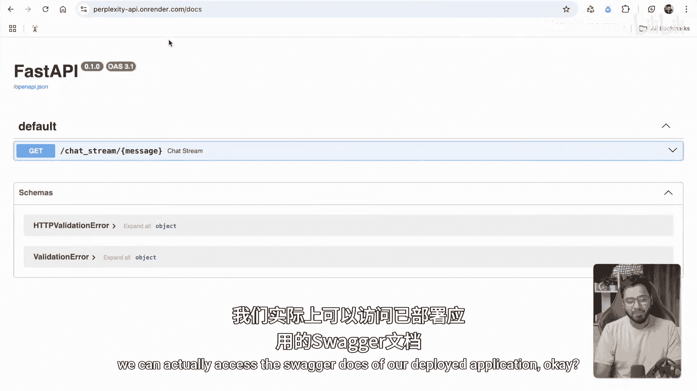

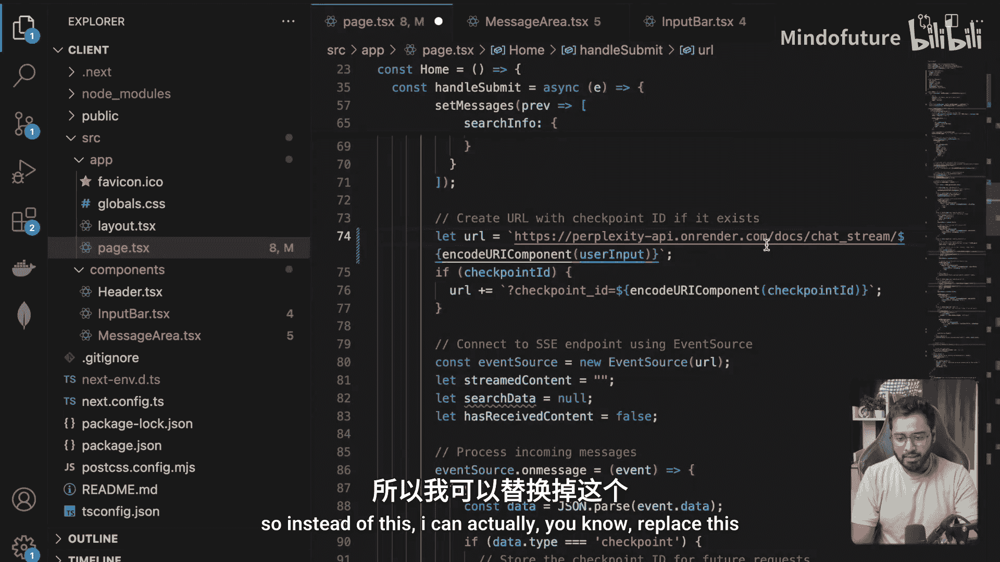

## 更新客户端配置

应用后端部署成功后，需要更新前端代码（或任何客户端）中的 API 基础 URL，将其从 `http://localhost:8000` 改为 Render 提供的公开 URL。这样，客户端就能与线上服务器进行通信了。

## 总结

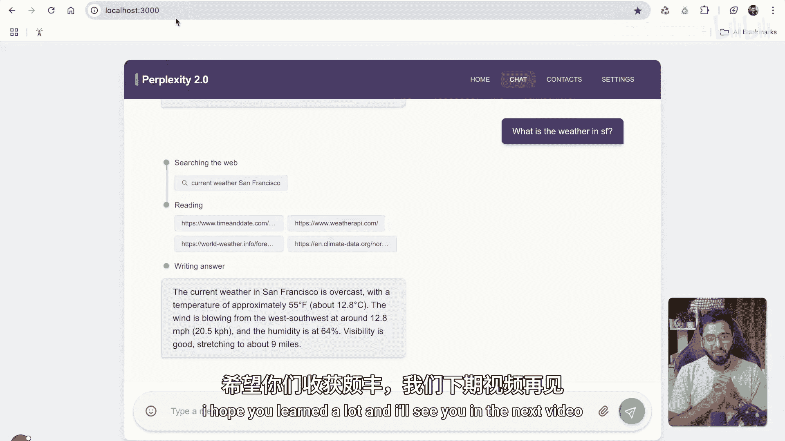

本节课中我们一起学习了如何将 LangGraph 应用部署到生产环境。我们首先使用 Docker 将应用容器化，然后在本地测试了容器镜像。接着，我们将镜像推送到了 Docker Hub 公共仓库。最后，我们利用云服务平台 Render，通过指定 Docker 镜像 URL 的方式，轻松地将应用部署到了公网，使其可以被全球访问。你现在拥有了一个完整的、可对外服务的 AI 应用。