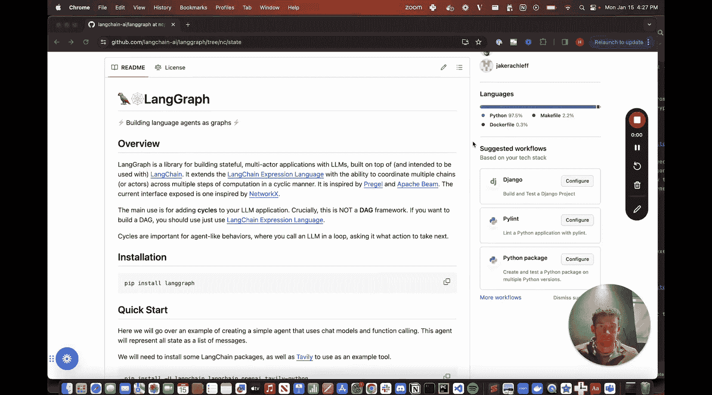
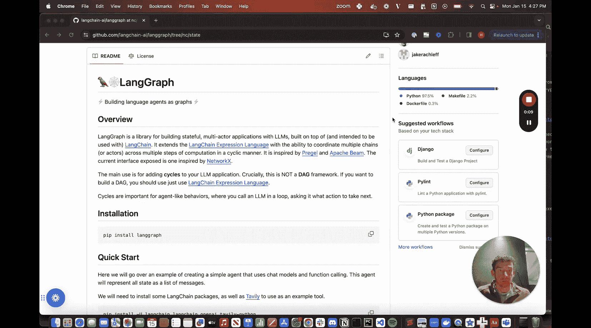
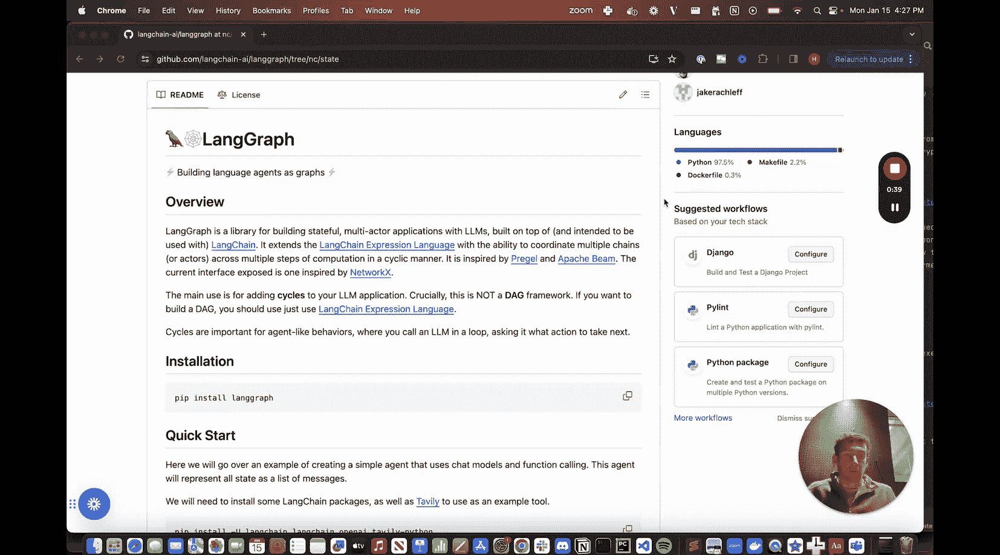
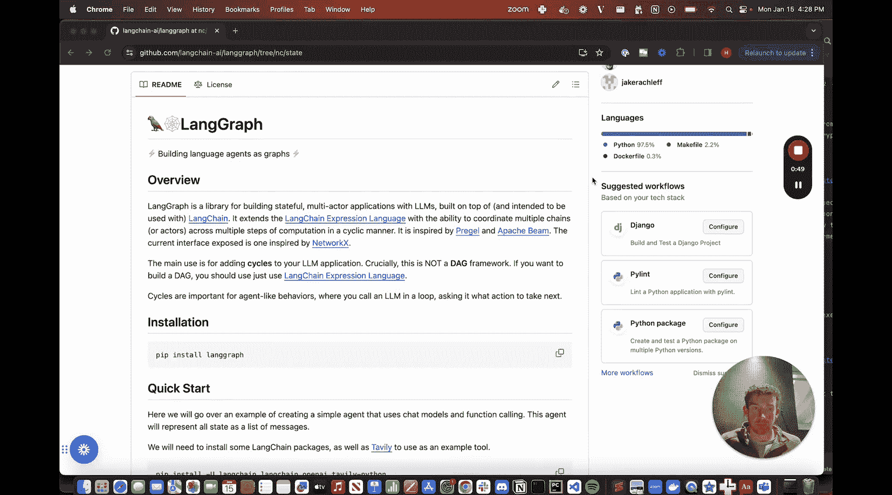
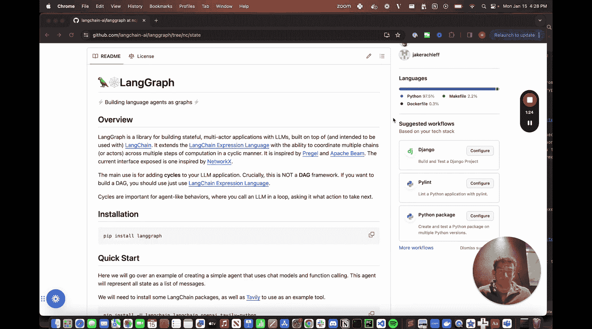
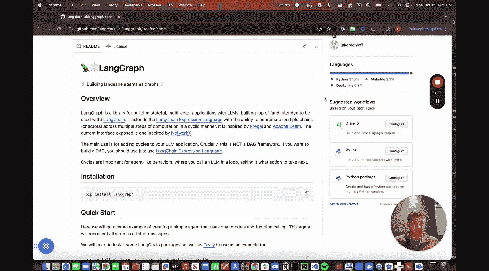
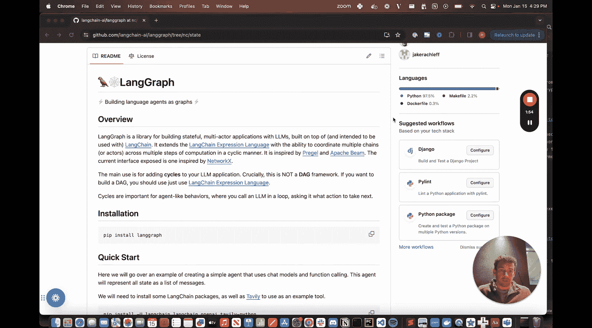
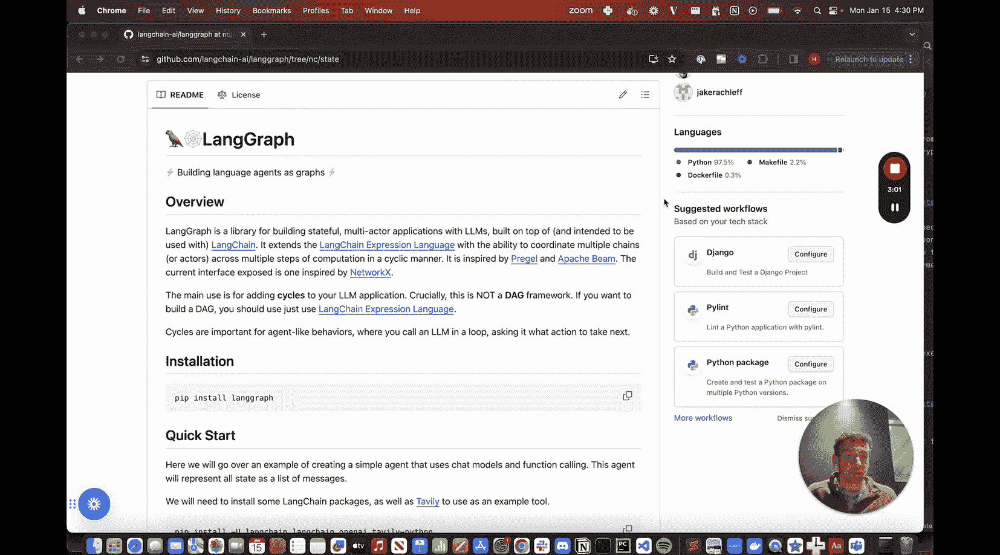

LangChain 使用指南：01：LangGraph 简介 🚀






在本节课中，我们将要学习 LangGraph 的基本概念，了解它是什么、为什么被创建，以及它能解决什么问题。LangGraph 是一个构建在 LangChain 之上的新库，旨在让创建智能体（Agent）和智能体运行时（Agent Runtime）变得更加简单和灵活。


---


### 什么是智能体与智能体运行时？


在 LangChain 中，我们将**智能体**定义为一个由语言模型驱动的系统，它负责决定采取什么行动。




智能体的核心逻辑可以表示为：
**智能体 = 语言模型 + 决策逻辑**




随后，**智能体运行时**负责在一个循环中运行这个智能体。其工作流程是：调用智能体，决定采取何种行动，执行该行动，记录观察结果，然后将结果反馈回去，并再次开始循环。这个过程会持续进行，直到智能体决定任务完成。

这个循环过程可以抽象为以下伪代码：
```python
while not agent.is_finished():
    action = agent.decide_next_action()
    observation = execute_action(action)
    agent.record_observation(observation)
```

---


### 为什么需要 LangGraph？


过去几个月，我们通过 LangChain 表达式语言让自定义智能体变得容易。然而，智能体运行时部分通常由固定的 `AgentExecutor` 类处理。它虽然有效，但只代表了一种特定的运行方式，例如以特定方式调用工具和处理错误。

我们希望通过 LangGraph 实现的目标是：**让自定义智能体运行时变得更加容易、灵活和动态**。




智能体运行时的关键特性是能够处理**循环（Cycles）**。因为智能体的本质就是在一个循环中运行这个由大语言模型驱动的决策系统。而像 LangChain 表达式语言这样的有向无环图（DAG）框架本身不支持循环结构。因此，我们引入了 LangGraph，专门用于创建这种支持循环的智能体运行时。




---

### LangGraph 的核心功能

以下是 LangGraph 初始版本提供的两个主要智能体运行时：




1.  **智能体执行器（Agent Executor）**：这与 LangChain 中原有的 `AgentExecutor` 非常相似，我们使用 LangGraph 重新构建了它。
2.  **聊天智能体执行器（Chat Agent Executor）**：这个执行器将对话历史作为消息列表输入，并将智能体的状态也表示为消息列表，最终同样返回一个消息列表。


我们专门为聊天模型创建独立的执行器，是因为许多新模型（如 GPT-4）本质上是基于聊天的。它们将函数调用内在地表示为消息的一部分参数，并将函数响应视为另一种独立类型的消息。因此，将智能体状态表示为消息列表，对于这类模型来说非常自然和高效。


---

### 后续内容预告


在本系列后续的视频中，我们将重点介绍如何修改基础的智能体执行器，以实现更高级的功能，例如：
*   添加**人在回路（Human-in-the-loop）** 的交互。
*   强制智能体**优先调用某个特定工具**。
*   以及其他令人兴奋的自定义功能。

---





本节课中，我们一起学习了 LangGraph 的定位和核心价值。它作为 LangChain 的扩展，专注于提供强大且灵活的方式来构建和自定义支持循环执行的智能体运行时，特别是为现代聊天模型提供了更自然的集成方式。